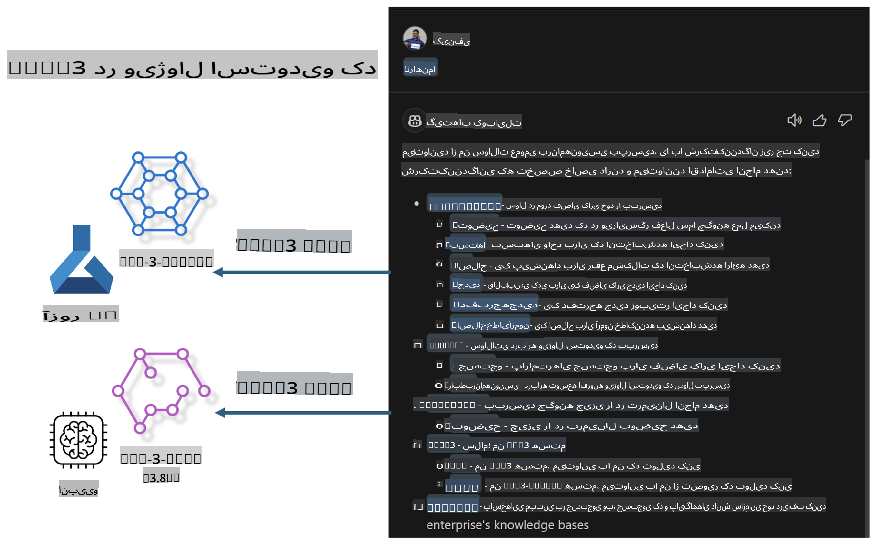

# **ساخت چت GitHub Copilot خود در Visual Studio Code با خانواده Microsoft Phi-3**

آیا تاکنون از عامل فضای کاری در GitHub Copilot Chat استفاده کرده‌اید؟ آیا می‌خواهید عامل کدنویسی تیم خود را بسازید؟ این کارگاه عملی امیدوار است با استفاده از مدل منبع باز، یک عامل کدنویسی سطح سازمانی ایجاد کند.

## **مبانی**

### **چرا انتخاب Microsoft Phi-3**

خانواده Phi-3 شامل سری‌هایی مانند phi-3-mini، phi-3-small و phi-3-medium است که بر اساس پارامترهای مختلف برای تولید متن، تکمیل مکالمه و تولید کد طراحی شده‌اند. همچنین phi-3-vision برای کاربردهای بصری وجود دارد. این خانواده برای سازمان‌ها یا تیم‌های مختلف مناسب است تا راه‌حل‌های هوش مصنوعی تولیدی آفلاین ایجاد کنند.

پیشنهاد می‌شود این لینک را مطالعه کنید: [https://github.com/microsoft/PhiCookBook/blob/main/md/01.Introduction/01/01.PhiFamily.md](https://github.com/microsoft/PhiCookBook/blob/main/md/01.Introduction/01/01.PhiFamily.md)

### **Microsoft GitHub Copilot Chat**

افزونه GitHub Copilot Chat یک رابط چت ارائه می‌دهد که به شما امکان می‌دهد مستقیماً در داخل VS Code با GitHub Copilot تعامل داشته باشید و پاسخ سوالات مرتبط با کدنویسی را دریافت کنید، بدون نیاز به جستجو در مستندات یا انجمن‌های آنلاین.

Copilot Chat ممکن است از ویژگی‌هایی مانند برجسته‌سازی نحوی، تورفتگی و دیگر قالب‌بندی‌ها برای شفافیت بیشتر در پاسخ‌های تولیدی استفاده کند. بسته به نوع سوال کاربر، نتیجه ممکن است شامل لینک‌هایی به منابعی باشد که Copilot برای تولید پاسخ استفاده کرده است، مانند فایل‌های کد منبع یا مستندات، یا دکمه‌هایی برای دسترسی به قابلیت‌های VS Code.

- Copilot Chat در جریان کاری توسعه‌دهنده شما ادغام شده و در جایی که نیاز دارید کمک ارائه می‌دهد:

- شروع مکالمه چت درون‌خطی مستقیماً از ویرایشگر یا ترمینال برای کمک در حین کدنویسی

- استفاده از نمای چت برای داشتن یک دستیار هوش مصنوعی در کنار خود در هر زمان

- اجرای Quick Chat برای پرسیدن یک سوال سریع و بازگشت به کاری که انجام می‌دهید

می‌توانید از GitHub Copilot Chat در سناریوهای مختلف استفاده کنید، مانند:

- پاسخ به سوالات کدنویسی درباره بهترین راه‌حل برای یک مشکل

- توضیح کد دیگران و پیشنهاد بهبودها

- پیشنهاد اصلاحات کد

- تولید موارد تست واحد

- تولید مستندات کد

پیشنهاد می‌شود این لینک را مطالعه کنید: [https://code.visualstudio.com/docs/copilot/copilot-chat](https://code.visualstudio.com/docs/copilot/copilot-chat?WT.mc_id=aiml-137032-kinfeylo)

### **Microsoft GitHub Copilot Chat @workspace**

ارجاع به **@workspace** در Copilot Chat به شما این امکان را می‌دهد که درباره کل پایگاه کد خود سوال بپرسید. بر اساس سوال، Copilot به طور هوشمند فایل‌ها و نمادهای مرتبط را بازیابی می‌کند و سپس آن‌ها را به صورت لینک و نمونه‌های کد در پاسخ خود ارجاع می‌دهد.

برای پاسخ به سوال شما، **@workspace** از همان منابعی که یک توسعه‌دهنده هنگام پیمایش در یک پایگاه کد در VS Code استفاده می‌کند، جستجو می‌کند:

- تمام فایل‌های موجود در فضای کاری، به جز فایل‌هایی که توسط فایل .gitignore نادیده گرفته شده‌اند

- ساختار دایرکتوری با پوشه‌ها و نام فایل‌های تو در تو

- شاخص جستجوی کد GitHub، اگر فضای کاری یک مخزن GitHub باشد و توسط جستجوی کد شاخص‌گذاری شده باشد

- نمادها و تعاریف در فضای کاری

- متن انتخاب‌شده فعلی یا متن قابل مشاهده در ویرایشگر فعال

توجه: فایل .gitignore نادیده گرفته می‌شود اگر یک فایل باز باشد یا متنی در داخل یک فایل نادیده گرفته‌شده انتخاب شده باشد.

پیشنهاد می‌شود این لینک را مطالعه کنید: [https://code.visualstudio.com/docs/copilot/copilot-chat](https://code.visualstudio.com/docs/copilot/workspace-context?WT.mc_id=aiml-137032-kinfeylo)

## **اطلاعات بیشتر درباره این کارگاه**

GitHub Copilot به طور قابل توجهی بهره‌وری برنامه‌نویسی سازمان‌ها را افزایش داده است، و هر سازمانی امیدوار است که عملکردهای مرتبط با GitHub Copilot را سفارشی‌سازی کند. بسیاری از سازمان‌ها افزونه‌هایی مشابه GitHub Copilot را بر اساس سناریوهای کسب‌وکار خود و مدل‌های منبع باز سفارشی‌سازی کرده‌اند. برای سازمان‌ها، افزونه‌های سفارشی‌شده کنترل بیشتری ارائه می‌دهند، اما این امر می‌تواند بر تجربه کاربری تأثیر بگذارد. به هر حال، GitHub Copilot در برخورد با سناریوهای عمومی و حرفه‌ای عملکرد قوی‌تری دارد. اگر بتوان تجربه‌ای سازگار را حفظ کرد، سفارشی‌سازی افزونه سازمان بهتر خواهد بود. GitHub Copilot Chat API‌های مرتبطی برای سازمان‌ها ارائه می‌دهد تا تجربه چت را گسترش دهند. حفظ یک تجربه سازگار و داشتن عملکردهای سفارشی تجربه کاربری بهتری ایجاد می‌کند.

این کارگاه عمدتاً از مدل Phi-3 همراه با NPU محلی و ترکیب Azure استفاده می‌کند تا یک عامل سفارشی در GitHub Copilot Chat ***@PHI3*** بسازد که به توسعه‌دهندگان سازمانی در تولید کد ***(@PHI3 /gen)*** و تولید کد بر اساس تصاویر ***(@PHI3 /img)*** کمک کند.

### ***توجه:*** 

این کارگاه در حال حاضر در AIPC پردازنده‌های Intel و Apple Silicon اجرا شده است. ما به‌روزرسانی نسخه NPU برای Qualcomm را ادامه خواهیم داد.

## **کارگاه**

| نام | توضیحات | AIPC | Apple |
| ------------ | ----------- | -------- |-------- |
| Lab0 - نصب‌ها (✅) | پیکربندی و نصب محیط‌ها و ابزارهای مرتبط | [برو](./HOL/AIPC/01.Installations.md) | [برو](./HOL/Apple/01.Installations.md) |
| Lab1 - اجرای جریان Prompt با Phi-3-mini (✅) | ترکیب‌شده با AIPC / Apple Silicon، استفاده از NPU محلی برای ایجاد کد از طریق Phi-3-mini | [برو](./HOL/AIPC/02.PromptflowWithNPU.md) |  [برو](./HOL/Apple/02.PromptflowWithMLX.md) |
| Lab2 - استقرار Phi-3-vision در Azure Machine Learning Service (✅) | تولید کد با استقرار Phi-3-vision تصویر در Model Catalog سرویس Azure Machine Learning | [برو](./HOL/AIPC/03.DeployPhi3VisionOnAzure.md) |[برو](./HOL/Apple/03.DeployPhi3VisionOnAzure.md) |
| Lab3 - ایجاد یک عامل @phi-3 در GitHub Copilot Chat (✅)  | ایجاد یک عامل سفارشی Phi-3 در GitHub Copilot Chat برای تکمیل تولید کد، تولید کد تصویری، RAG و غیره | [برو](./HOL/AIPC/04.CreatePhi3AgentInVSCode.md) | [برو](./HOL/Apple/04.CreatePhi3AgentInVSCode.md) |
| کد نمونه (✅)  | دانلود کد نمونه | [برو](../../../../../../../code/07.Lab/01/AIPC) | [برو](../../../../../../../code/07.Lab/01/Apple) |

## **منابع**

1. Phi-3 Cookbook [https://github.com/microsoft/Phi-3CookBook](https://github.com/microsoft/Phi-3CookBook)

2. اطلاعات بیشتر درباره GitHub Copilot [https://learn.microsoft.com/training/paths/copilot/](https://learn.microsoft.com/training/paths/copilot/?WT.mc_id=aiml-137032-kinfeylo)

3. اطلاعات بیشتر درباره GitHub Copilot Chat [https://learn.microsoft.com/training/paths/accelerate-app-development-using-github-copilot/](https://learn.microsoft.com/training/paths/accelerate-app-development-using-github-copilot/?WT.mc_id=aiml-137032-kinfeylo)

4. اطلاعات بیشتر درباره API چت GitHub Copilot [https://code.visualstudio.com/api/extension-guides/chat](https://code.visualstudio.com/api/extension-guides/chat?WT.mc_id=aiml-137032-kinfeylo)

5. اطلاعات بیشتر درباره Azure AI Foundry [https://learn.microsoft.com/training/paths/create-custom-copilots-ai-studio/](https://learn.microsoft.com/training/paths/create-custom-copilots-ai-studio/?WT.mc_id=aiml-137032-kinfeylo)

6. اطلاعات بیشتر درباره کاتالوگ مدل Azure AI Foundry [https://learn.microsoft.com/azure/ai-studio/how-to/model-catalog-overview](https://learn.microsoft.com/azure/ai-studio/how-to/model-catalog-overview)

**سلب مسئولیت**:  
این سند با استفاده از خدمات ترجمه ماشینی مبتنی بر هوش مصنوعی ترجمه شده است. در حالی که ما برای دقت تلاش می‌کنیم، لطفاً توجه داشته باشید که ترجمه‌های خودکار ممکن است حاوی خطاها یا نادقتی‌ها باشند. سند اصلی به زبان بومی خود باید به عنوان منبع معتبر در نظر گرفته شود. برای اطلاعات حیاتی، ترجمه انسانی حرفه‌ای توصیه می‌شود. ما هیچ مسئولیتی در قبال سوءتفاهم‌ها یا تفسیرهای نادرست ناشی از استفاده از این ترجمه نداریم.