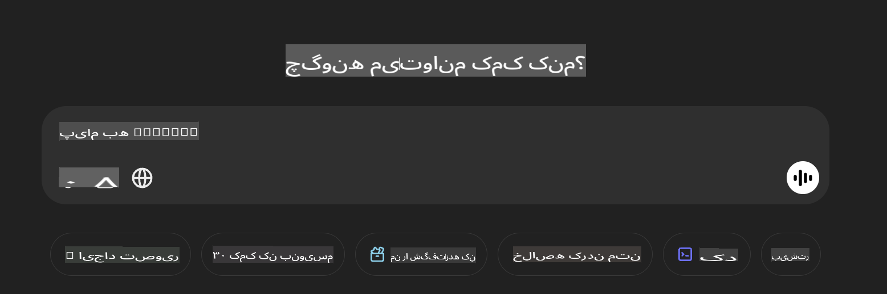

## **استفاده از Phi-4-multimodal برای خواندن تصاویر و تولید کد**

Phi-4-multimodal قابلیت‌های قدرتمندی در خواندن تصاویر دارد. بیایید با استفاده از پایتون، توابع زیر را پیاده‌سازی کنیم. تصویر، صفحه‌ای از ChatGPT است.



### **نمونه کد**

```python

import requests
import torch
from PIL import Image
import soundfile
from transformers import AutoModelForCausalLM, AutoProcessor, GenerationConfig,pipeline,AutoTokenizer

model_path = 'Your Phi-4-multimodal location'

kwargs = {}
kwargs['torch_dtype'] = torch.bfloat16

processor = AutoProcessor.from_pretrained(model_path, trust_remote_code=True)

model = AutoModelForCausalLM.from_pretrained(
    model_path,
    trust_remote_code=True,
    torch_dtype='auto',
    _attn_implementation='flash_attention_2',
).cuda()

generation_config = GenerationConfig.from_pretrained(model_path, 'generation_config.json')

user_prompt = '<|user|>'
assistant_prompt = '<|assistant|>'
prompt_suffix = '<|end|>'

prompt = f'{user_prompt}Can you generate HTML + JS code about this image <|image_1|> ? Please step by step {prompt_suffix}{assistant_prompt}'

image = Image.open("./demo.png")

inputs = processor(text=prompt, images=[image], return_tensors='pt').to('cuda:0')

generate_ids = model.generate(
    **inputs,
    max_new_tokens=4096,
    generation_config=generation_config,
)

generate_ids = generate_ids[:, inputs['input_ids'].shape[1] :]

response = processor.batch_decode(
    generate_ids, skip_special_tokens=True, clean_up_tokenization_spaces=False
)[0]

print(response)

```

**سلب مسئولیت**:  
این سند با استفاده از خدمات ترجمه مبتنی بر هوش مصنوعی ترجمه شده است. در حالی که ما تلاش می‌کنیم دقت را حفظ کنیم، لطفاً توجه داشته باشید که ترجمه‌های خودکار ممکن است حاوی خطاها یا نواقصی باشند. سند اصلی به زبان اصلی آن باید به عنوان منبع معتبر در نظر گرفته شود. برای اطلاعات حساس، توصیه می‌شود از ترجمه حرفه‌ای انسانی استفاده کنید. ما هیچ مسئولیتی در قبال سوءتفاهم‌ها یا تفسیرهای نادرست ناشی از استفاده از این ترجمه نداریم.