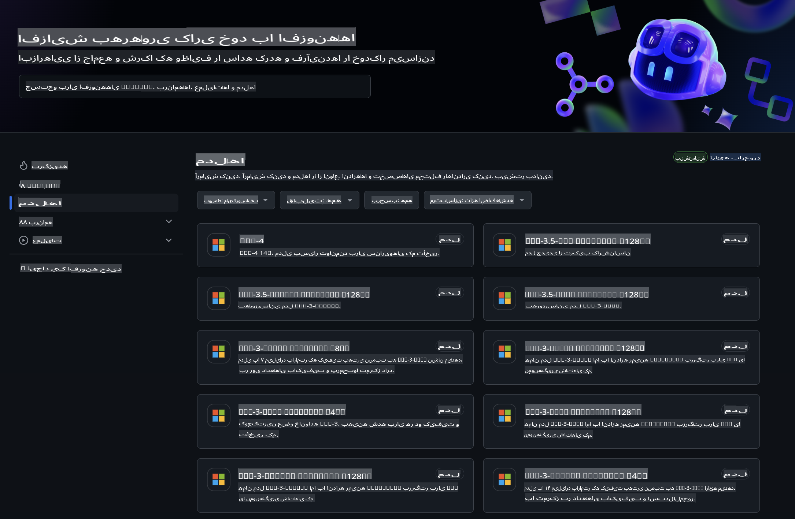
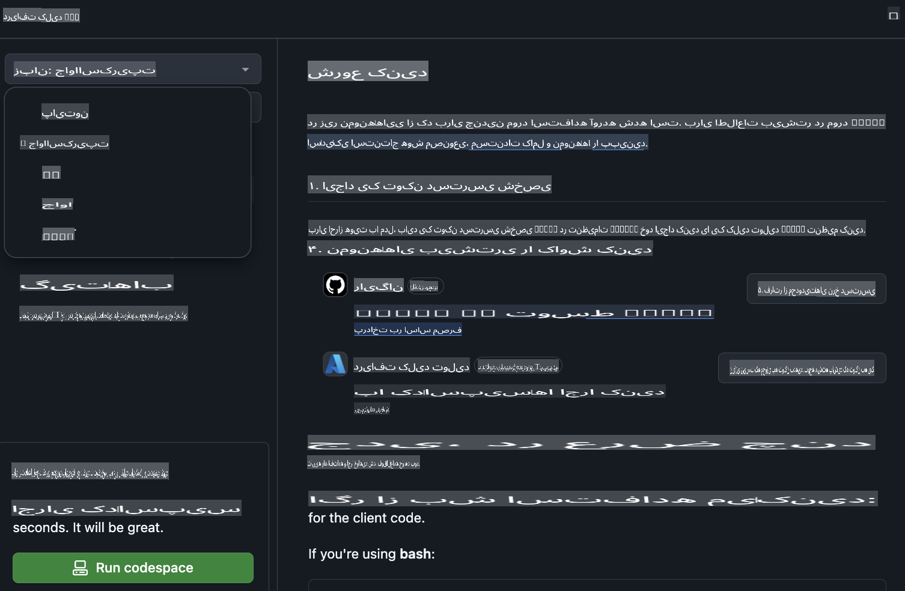

## مدل‌های GitHub - نسخه بتای عمومی محدود

به [مدل‌های GitHub](https://github.com/marketplace/models) خوش آمدید! همه چیز آماده است تا مدل‌های هوش مصنوعی میزبانی شده در Azure AI را کشف کنید.



برای اطلاعات بیشتر درباره مدل‌های موجود در GitHub Models، به [بازار مدل‌های GitHub](https://github.com/marketplace/models) مراجعه کنید.

## مدل‌های موجود

هر مدل دارای یک محیط آزمایشی اختصاصی و کد نمونه است.


### مدل‌های Phi-3 در کاتالوگ مدل‌های GitHub

[Phi-3-Medium-128k-Instruct](https://github.com/marketplace/models/azureml/Phi-3-medium-128k-instruct)

[Phi-3-medium-4k-instruct](https://github.com/marketplace/models/azureml/Phi-3-medium-4k-instruct)

[Phi-3-mini-128k-instruct](https://github.com/marketplace/models/azureml/Phi-3-mini-128k-instruct)

[Phi-3-mini-4k-instruct](https://github.com/marketplace/models/azureml/Phi-3-mini-4k-instruct)

[Phi-3-small-128k-instruct](https://github.com/marketplace/models/azureml/Phi-3-small-128k-instruct)

[Phi-3-small-8k-instruct](https://github.com/marketplace/models/azureml/Phi-3-small-8k-instruct)

## شروع به کار

چند نمونه ساده آماده برای اجرا وجود دارد. می‌توانید آن‌ها را در پوشه نمونه‌ها پیدا کنید. اگر می‌خواهید مستقیماً به زبان مورد علاقه خود بروید، می‌توانید نمونه‌ها را در زبان‌های زیر پیدا کنید:

- Python  
- JavaScript  
- cURL  

همچنین یک محیط اختصاصی Codespaces برای اجرای نمونه‌ها و مدل‌ها وجود دارد.



## کد نمونه

در زیر کدهای نمونه برای چند کاربرد ارائه شده است. برای اطلاعات بیشتر درباره Azure AI Inference SDK، مستندات کامل و نمونه‌ها را ببینید.

## تنظیمات

1. ایجاد یک توکن دسترسی شخصی  
نیازی به دادن هیچ مجوزی به توکن نیست. توجه داشته باشید که این توکن به یک سرویس مایکروسافت ارسال می‌شود.

برای استفاده از کدهای زیر، یک متغیر محیطی ایجاد کنید تا توکن خود را به عنوان کلید برای کد کلاینت تنظیم کنید.

اگر از bash استفاده می‌کنید:  
```
export GITHUB_TOKEN="<your-github-token-goes-here>"
```  
اگر از powershell استفاده می‌کنید:  

```
$Env:GITHUB_TOKEN="<your-github-token-goes-here>"
```  

اگر از خط فرمان ویندوز استفاده می‌کنید:  

```
set GITHUB_TOKEN=<your-github-token-goes-here>
```  

## نمونه پایتون

### نصب وابستگی‌ها  
Azure AI Inference SDK را با استفاده از pip نصب کنید (نیازمند: Python >=3.8):  

```
pip install azure-ai-inference
```  

### اجرای یک نمونه ساده کد  

این نمونه یک فراخوانی ساده به API تکمیل چت را نشان می‌دهد. این فراخوانی از نقطه پایانی استنتاج مدل هوش مصنوعی GitHub و توکن GitHub شما استفاده می‌کند. این فراخوانی همزمان است.  

```
import os
from azure.ai.inference import ChatCompletionsClient
from azure.ai.inference.models import SystemMessage, UserMessage
from azure.core.credentials import AzureKeyCredential

endpoint = "https://models.inference.ai.azure.com"
# Replace Model_Name 
model_name = "Phi-3-small-8k-instruct"
token = os.environ["GITHUB_TOKEN"]

client = ChatCompletionsClient(
    endpoint=endpoint,
    credential=AzureKeyCredential(token),
)

response = client.complete(
    messages=[
        SystemMessage(content="You are a helpful assistant."),
        UserMessage(content="What is the capital of France?"),
    ],
    model=model_name,
    temperature=1.,
    max_tokens=1000,
    top_p=1.
)

print(response.choices[0].message.content)
```  

### اجرای یک مکالمه چند مرحله‌ای  

این نمونه یک مکالمه چند مرحله‌ای با API تکمیل چت را نشان می‌دهد. هنگام استفاده از مدل برای یک برنامه چت، باید تاریخچه مکالمه را مدیریت کرده و آخرین پیام‌ها را به مدل ارسال کنید.  

```
import os
from azure.ai.inference import ChatCompletionsClient
from azure.ai.inference.models import AssistantMessage, SystemMessage, UserMessage
from azure.core.credentials import AzureKeyCredential

token = os.environ["GITHUB_TOKEN"]
endpoint = "https://models.inference.ai.azure.com"
# Replace Model_Name
model_name = "Phi-3-small-8k-instruct"

client = ChatCompletionsClient(
    endpoint=endpoint,
    credential=AzureKeyCredential(token),
)

messages = [
    SystemMessage(content="You are a helpful assistant."),
    UserMessage(content="What is the capital of France?"),
    AssistantMessage(content="The capital of France is Paris."),
    UserMessage(content="What about Spain?"),
]

response = client.complete(messages=messages, model=model_name)

print(response.choices[0].message.content)
```  

### پخش خروجی  

برای تجربه کاربری بهتر، می‌خواهید خروجی مدل را به صورت پخش نمایش دهید تا اولین توکن زودتر نمایش داده شود و از انتظار برای پاسخ‌های طولانی جلوگیری شود.  

```
import os
from azure.ai.inference import ChatCompletionsClient
from azure.ai.inference.models import SystemMessage, UserMessage
from azure.core.credentials import AzureKeyCredential

token = os.environ["GITHUB_TOKEN"]
endpoint = "https://models.inference.ai.azure.com"
# Replace Model_Name
model_name = "Phi-3-small-8k-instruct"

client = ChatCompletionsClient(
    endpoint=endpoint,
    credential=AzureKeyCredential(token),
)

response = client.complete(
    stream=True,
    messages=[
        SystemMessage(content="You are a helpful assistant."),
        UserMessage(content="Give me 5 good reasons why I should exercise every day."),
    ],
    model=model_name,
)

for update in response:
    if update.choices:
        print(update.choices[0].delta.content or "", end="")

client.close()
```  

## جاوا اسکریپت  

### نصب وابستگی‌ها  

Node.js را نصب کنید.  

خطوط زیر را کپی کرده و به عنوان یک فایل package.json در پوشه خود ذخیره کنید.  

```
{
  "type": "module",
  "dependencies": {
    "@azure-rest/ai-inference": "latest",
    "@azure/core-auth": "latest",
    "@azure/core-sse": "latest"
  }
}
```  

توجه: @azure/core-sse فقط زمانی مورد نیاز است که پاسخ تکمیل چت را پخش کنید.  

یک پنجره ترمینال در این پوشه باز کرده و npm install را اجرا کنید.  

برای هر یک از کدهای زیر، محتوا را در یک فایل sample.js کپی کرده و با node sample.js اجرا کنید.  

### اجرای یک نمونه ساده کد  

این نمونه یک فراخوانی ساده به API تکمیل چت را نشان می‌دهد. این فراخوانی از نقطه پایانی استنتاج مدل هوش مصنوعی GitHub و توکن GitHub شما استفاده می‌کند. این فراخوانی همزمان است.  

```
import ModelClient from "@azure-rest/ai-inference";
import { AzureKeyCredential } from "@azure/core-auth";

const token = process.env["GITHUB_TOKEN"];
const endpoint = "https://models.inference.ai.azure.com";
// Update your modelname
const modelName = "Phi-3-small-8k-instruct";

export async function main() {

  const client = new ModelClient(endpoint, new AzureKeyCredential(token));

  const response = await client.path("/chat/completions").post({
    body: {
      messages: [
        { role:"system", content: "You are a helpful assistant." },
        { role:"user", content: "What is the capital of France?" }
      ],
      model: modelName,
      temperature: 1.,
      max_tokens: 1000,
      top_p: 1.
    }
  });

  if (response.status !== "200") {
    throw response.body.error;
  }
  console.log(response.body.choices[0].message.content);
}

main().catch((err) => {
  console.error("The sample encountered an error:", err);
});
```  

### اجرای یک مکالمه چند مرحله‌ای  

این نمونه یک مکالمه چند مرحله‌ای با API تکمیل چت را نشان می‌دهد. هنگام استفاده از مدل برای یک برنامه چت، باید تاریخچه مکالمه را مدیریت کرده و آخرین پیام‌ها را به مدل ارسال کنید.  

```
import ModelClient from "@azure-rest/ai-inference";
import { AzureKeyCredential } from "@azure/core-auth";

const token = process.env["GITHUB_TOKEN"];
const endpoint = "https://models.inference.ai.azure.com";
// Update your modelname
const modelName = "Phi-3-small-8k-instruct";

export async function main() {

  const client = new ModelClient(endpoint, new AzureKeyCredential(token));

  const response = await client.path("/chat/completions").post({
    body: {
      messages: [
        { role: "system", content: "You are a helpful assistant." },
        { role: "user", content: "What is the capital of France?" },
        { role: "assistant", content: "The capital of France is Paris." },
        { role: "user", content: "What about Spain?" },
      ],
      model: modelName,
    }
  });

  if (response.status !== "200") {
    throw response.body.error;
  }

  for (const choice of response.body.choices) {
    console.log(choice.message.content);
  }
}

main().catch((err) => {
  console.error("The sample encountered an error:", err);
});
```  

### پخش خروجی  

برای تجربه کاربری بهتر، می‌خواهید خروجی مدل را به صورت پخش نمایش دهید تا اولین توکن زودتر نمایش داده شود و از انتظار برای پاسخ‌های طولانی جلوگیری شود.  

```
import ModelClient from "@azure-rest/ai-inference";
import { AzureKeyCredential } from "@azure/core-auth";
import { createSseStream } from "@azure/core-sse";

const token = process.env["GITHUB_TOKEN"];
const endpoint = "https://models.inference.ai.azure.com";
// Update your modelname
const modelName = "Phi-3-small-8k-instruct";

export async function main() {

  const client = new ModelClient(endpoint, new AzureKeyCredential(token));

  const response = await client.path("/chat/completions").post({
    body: {
      messages: [
        { role: "system", content: "You are a helpful assistant." },
        { role: "user", content: "Give me 5 good reasons why I should exercise every day." },
      ],
      model: modelName,
      stream: true
    }
  }).asNodeStream();

  const stream = response.body;
  if (!stream) {
    throw new Error("The response stream is undefined");
  }

  if (response.status !== "200") {
    stream.destroy();
    throw new Error(`Failed to get chat completions, http operation failed with ${response.status} code`);
  }

  const sseStream = createSseStream(stream);

  for await (const event of sseStream) {
    if (event.data === "[DONE]") {
      return;
    }
    for (const choice of (JSON.parse(event.data)).choices) {
        process.stdout.write(choice.delta?.content ?? ``);
    }
  }
}

main().catch((err) => {
  console.error("The sample encountered an error:", err);
});
```  

## REST  

### اجرای یک نمونه ساده کد  

دستورات زیر را در یک shell کپی کنید:  

```
curl -X POST "https://models.inference.ai.azure.com/chat/completions" \
    -H "Content-Type: application/json" \
    -H "Authorization: Bearer $GITHUB_TOKEN" \
    -d '{
        "messages": [
            {
                "role": "system",
                "content": "You are a helpful assistant."
            },
            {
                "role": "user",
                "content": "What is the capital of France?"
            }
        ],
        "model": "Phi-3-small-8k-instruct"
    }'
```  

### اجرای یک مکالمه چند مرحله‌ای  

API تکمیل چت را فراخوانی کرده و تاریخچه چت را ارسال کنید:  

```
curl -X POST "https://models.inference.ai.azure.com/chat/completions" \
    -H "Content-Type: application/json" \
    -H "Authorization: Bearer $GITHUB_TOKEN" \
    -d '{
        "messages": [
            {
                "role": "system",
                "content": "You are a helpful assistant."
            },
            {
                "role": "user",
                "content": "What is the capital of France?"
            },
            {
                "role": "assistant",
                "content": "The capital of France is Paris."
            },
            {
                "role": "user",
                "content": "What about Spain?"
            }
        ],
        "model": "Phi-3-small-8k-instruct"
    }'
```  

### پخش خروجی  

این نمونه فراخوانی به نقطه پایانی و پخش پاسخ را نشان می‌دهد.  

```
curl -X POST "https://models.inference.ai.azure.com/chat/completions" \
    -H "Content-Type: application/json" \
    -H "Authorization: Bearer $GITHUB_TOKEN" \
    -d '{
        "messages": [
            {
                "role": "system",
                "content": "You are a helpful assistant."
            },
            {
                "role": "user",
                "content": "Give me 5 good reasons why I should exercise every day."
            }
        ],
        "stream": true,
        "model": "Phi-3-small-8k-instruct"
    }'
```  

## استفاده رایگان و محدودیت‌های نرخ برای مدل‌های GitHub  

  

[محدودیت‌های نرخ برای محیط آزمایشی و استفاده رایگان از API](https://docs.github.com/en/github-models/prototyping-with-ai-models#rate-limits) برای کمک به شما در آزمایش مدل‌ها و نمونه‌سازی برنامه هوش مصنوعی شما طراحی شده است. برای استفاده فراتر از این محدودیت‌ها و مقیاس‌بندی برنامه خود، باید منابع را از یک حساب Azure تهیه کرده و از آنجا احراز هویت کنید، به جای استفاده از توکن دسترسی شخصی GitHub. نیازی به تغییر چیز دیگری در کد شما نیست. از این لینک استفاده کنید تا یاد بگیرید چگونه فراتر از محدودیت‌های سطح رایگان در Azure AI بروید.  

### افشاها  

به یاد داشته باشید هنگام تعامل با یک مدل، شما در حال آزمایش با هوش مصنوعی هستید، بنابراین احتمال خطا در محتوا وجود دارد.  

این ویژگی تحت محدودیت‌های مختلفی (شامل درخواست‌ها در دقیقه، درخواست‌ها در روز، توکن‌ها در هر درخواست و درخواست‌های همزمان) قرار دارد و برای موارد استفاده تولیدی طراحی نشده است.  

مدل‌های GitHub از Azure AI Content Safety استفاده می‌کنند. این فیلترها نمی‌توانند به عنوان بخشی از تجربه مدل‌های GitHub غیرفعال شوند. اگر تصمیم دارید مدل‌ها را از طریق یک سرویس پولی به کار ببرید، لطفاً فیلترهای محتوای خود را برای برآورده کردن نیازهایتان پیکربندی کنید.  

این سرویس تحت شرایط پیش‌انتشار GitHub قرار دارد.  

**سلب مسئولیت**:  
این سند با استفاده از خدمات ترجمه ماشینی مبتنی بر هوش مصنوعی ترجمه شده است. در حالی که ما برای دقت تلاش می‌کنیم، لطفاً توجه داشته باشید که ترجمه‌های خودکار ممکن است حاوی خطاها یا نواقصی باشند. سند اصلی به زبان اصلی آن باید به عنوان منبع معتبر در نظر گرفته شود. برای اطلاعات حیاتی، ترجمه انسانی حرفه‌ای توصیه می‌شود. ما هیچ گونه مسئولیتی در قبال سوءتفاهم‌ها یا تفسیرهای نادرست ناشی از استفاده از این ترجمه نداریم.