# تنظیم مدل Phi-3 با Azure AI Foundry

بیایید بررسی کنیم که چگونه می‌توان مدل زبانی Phi-3 Mini مایکروسافت را با استفاده از Azure AI Foundry تنظیم کرد. تنظیم مدل به شما این امکان را می‌دهد که Phi-3 Mini را برای وظایف خاصی تطبیق دهید و آن را قدرتمندتر و آگاه‌تر به زمینه کنید.

## ملاحظات

- **توانایی‌ها:** کدام مدل‌ها قابل تنظیم هستند؟ مدل پایه را می‌توان برای چه کاری تنظیم کرد؟
- **هزینه:** مدل قیمت‌گذاری برای تنظیم مدل چگونه است؟
- **سفارشی‌سازی:** تا چه حد می‌توانم مدل پایه را تغییر دهم – و به چه روش‌هایی؟
- **سهولت استفاده:** فرآیند تنظیم چگونه انجام می‌شود – آیا نیاز به نوشتن کد سفارشی دارم؟ آیا باید منابع محاسباتی خودم را بیاورم؟
- **ایمنی:** مدل‌های تنظیم‌شده به داشتن ریسک‌های ایمنی معروف هستند – آیا مکانیزم‌های محافظتی برای جلوگیری از آسیب ناخواسته وجود دارد؟

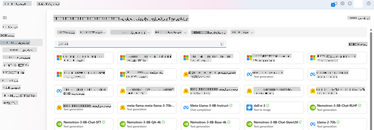

## آماده‌سازی برای تنظیم مدل

### پیش‌نیازها

> [!NOTE]
> برای مدل‌های خانواده Phi-3، پیشنهاد تنظیم مدل به‌صورت پرداخت بر اساس استفاده تنها در هاب‌های ایجادشده در مناطق **East US 2** در دسترس است.

- اشتراک Azure. اگر اشتراک Azure ندارید، یک [حساب Azure پولی](https://azure.microsoft.com/pricing/purchase-options/pay-as-you-go) ایجاد کنید تا شروع کنید.

- یک [پروژه AI Foundry](https://ai.azure.com?WT.mc_id=aiml-138114-kinfeylo).
- کنترل‌های دسترسی مبتنی بر نقش Azure (Azure RBAC) برای اعطای دسترسی به عملیات در Azure AI Foundry استفاده می‌شوند. برای انجام مراحل این مقاله، حساب کاربری شما باید به نقش __Azure AI Developer__ در گروه منابع اختصاص داده شود.

### ثبت ارائه‌دهنده اشتراک

اطمینان حاصل کنید که اشتراک به ارائه‌دهنده منابع `Microsoft.Network` ثبت شده است.

1. وارد [پورتال Azure](https://portal.azure.com) شوید.
1. از منوی سمت چپ **Subscriptions** را انتخاب کنید.
1. اشتراکی که می‌خواهید استفاده کنید را انتخاب کنید.
1. از منوی سمت چپ **AI project settings** > **Resource providers** را انتخاب کنید.
1. تأیید کنید که **Microsoft.Network** در لیست ارائه‌دهندگان منابع وجود دارد. در غیر این صورت آن را اضافه کنید.

### آماده‌سازی داده‌ها

داده‌های آموزشی و اعتبارسنجی خود را برای تنظیم مدل آماده کنید. مجموعه داده‌های آموزشی و اعتبارسنجی شما شامل مثال‌هایی از ورودی و خروجی است که نشان می‌دهد مدل باید چگونه عمل کند.

اطمینان حاصل کنید که تمام مثال‌های آموزشی شما از قالب مورد انتظار برای استنتاج پیروی می‌کنند. برای تنظیم مؤثر مدل‌ها، یک مجموعه داده متعادل و متنوع را تضمین کنید.

این شامل حفظ تعادل داده‌ها، در نظر گرفتن سناریوهای مختلف و پالایش دوره‌ای داده‌های آموزشی برای هماهنگی با انتظارات دنیای واقعی است که در نهایت منجر به پاسخ‌های دقیق‌تر و متعادل‌تر مدل می‌شود.

انواع مختلف مدل‌ها به قالب‌های متفاوتی از داده‌های آموزشی نیاز دارند.

### تکمیل چت

داده‌های آموزشی و اعتبارسنجی که استفاده می‌کنید **باید** به‌صورت یک سند JSON Lines (JSONL) قالب‌بندی شوند. برای `Phi-3-mini-128k-instruct`، مجموعه داده تنظیم باید در قالب مکالمه‌ای که توسط API تکمیل چت استفاده می‌شود، قالب‌بندی شده باشد.

### نمونه قالب فایل

```json
    {"messages": [{"role": "system", "content": "You are an Xbox customer support agent whose primary goal is to help users with issues they are experiencing with their Xbox devices. You are friendly and concise. You only provide factual answers to queries, and do not provide answers that are not related to Xbox."}, {"role": "user", "content": "Is Xbox better than PlayStation?"}, {"role": "assistant", "content": "I apologize, but I cannot provide personal opinions. My primary job is to assist you with any issues related to your Xbox device. Do you have any Xbox-related issues that need addressing?"}]}
    {"messages": [{"role": "system", "content": "You are an Xbox customer support agent whose primary goal is to help users with issues they are experiencing with their Xbox devices. You are friendly and concise. You only provide factual answers to queries, and do not provide answers that are not related to Xbox."}, {"role": "user", "content": "Can I play PC games on my Xbox?"}, {"role": "assistant", "content": "While Xbox consoles don't natively support PC games, they can play an array of Xbox games, many of which are also available on PC. Can I assist you with finding games compatible with your Xbox device?"}]}
    {"messages": [{"role": "system", "content": "You are an Xbox customer support agent whose primary goal is to help users with issues they are experiencing with their Xbox devices. You are friendly and concise. You only provide factual answers to queries, and do not provide answers that are not related to Xbox."}, {"role": "user", "content": "I'm having trouble connecting my Xbox to the Wi-Fi."}, {"role": "assistant", "content": "No worries, let's go through the network settings on your Xbox. Can you please tell me what happens when you try to connect it to the Wi-Fi?"}]}
```

نوع فایل پشتیبانی‌شده JSON Lines است. فایل‌ها به فروشگاه پیش‌فرض داده‌ها آپلود شده و در پروژه شما در دسترس قرار می‌گیرند.

## تنظیم مدل Phi-3 با Azure AI Foundry

Azure AI Foundry به شما این امکان را می‌دهد که مدل‌های زبانی بزرگ را با استفاده از فرآیندی به نام تنظیم مدل، برای مجموعه داده‌های شخصی خود سفارشی کنید. تنظیم مدل ارزش قابل‌توجهی را با امکان سفارشی‌سازی و بهینه‌سازی برای وظایف و برنامه‌های خاص فراهم می‌کند. این کار منجر به بهبود عملکرد، کارایی هزینه، کاهش تأخیر و خروجی‌های سفارشی می‌شود.

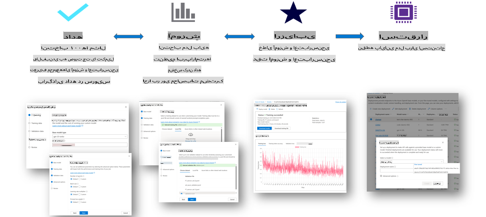

### ایجاد پروژه جدید

1. وارد [Azure AI Foundry](https://ai.azure.com) شوید.

1. برای ایجاد یک پروژه جدید در Azure AI Foundry، **+New project** را انتخاب کنید.

    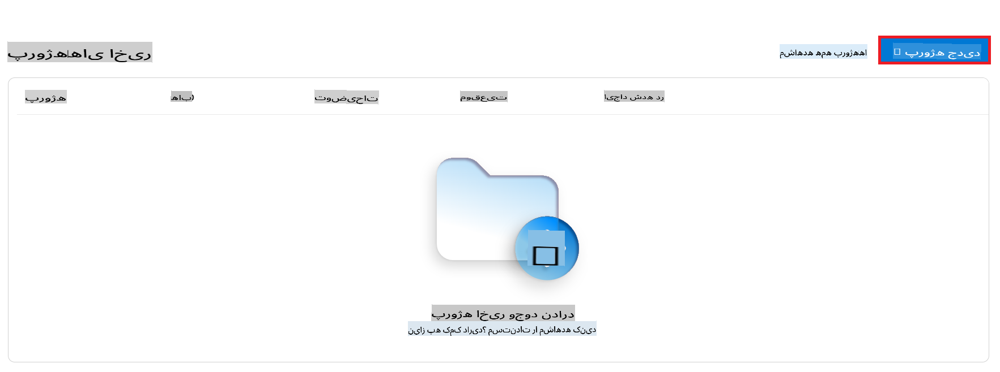

1. کارهای زیر را انجام دهید:

    - **نام هاب پروژه**. باید یک مقدار منحصربه‌فرد باشد.
    - **هاب**ی که می‌خواهید استفاده کنید را انتخاب کنید (در صورت نیاز یک هاب جدید ایجاد کنید).

    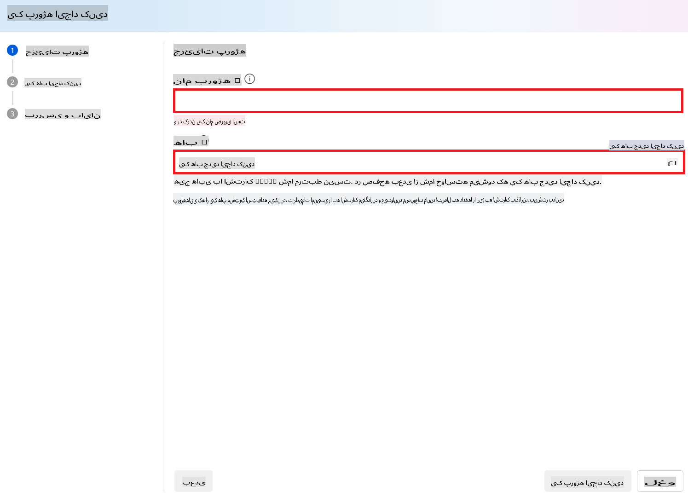

1. برای ایجاد یک هاب جدید کارهای زیر را انجام دهید:

    - **نام هاب** را وارد کنید. باید یک مقدار منحصربه‌فرد باشد.
    - اشتراک **Azure** خود را انتخاب کنید.
    - گروه **Resource** موردنظر را انتخاب کنید (در صورت نیاز یک گروه جدید ایجاد کنید).
    - **موقعیت مکانی** موردنظر را انتخاب کنید.
    - **اتصال خدمات Azure AI** موردنظر را انتخاب کنید (در صورت نیاز یک مورد جدید ایجاد کنید).
    - **اتصال جستجوی Azure AI** را به **رد اتصال** تنظیم کنید.

    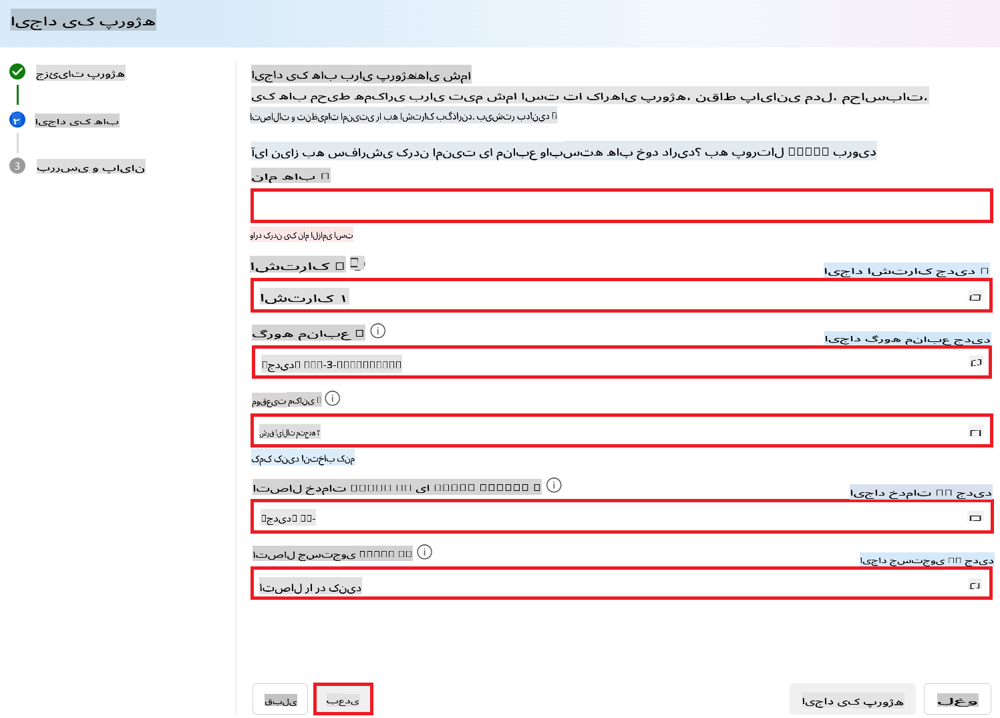

1. **Next** را انتخاب کنید.
1. **ایجاد پروژه** را انتخاب کنید.

### آماده‌سازی داده‌ها

قبل از تنظیم، مجموعه داده مرتبط با وظیفه خود را جمع‌آوری یا ایجاد کنید، مانند دستورالعمل‌های چت، جفت‌های سؤال-پاسخ یا هر متن مرتبط دیگر. این داده‌ها را با حذف نویز، مدیریت مقادیر گمشده و توکن‌سازی متن پاکسازی و پیش‌پردازش کنید.

### تنظیم مدل‌های Phi-3 در Azure AI Foundry

> [!NOTE]
> تنظیم مدل‌های Phi-3 در حال حاضر تنها در پروژه‌هایی که در East US 2 قرار دارند، پشتیبانی می‌شود.

1. از زبانه سمت چپ **Model catalog** را انتخاب کنید.

1. در **نوار جستجو** عبارت *phi-3* را تایپ کرده و مدل phi-3 موردنظر خود را انتخاب کنید.

    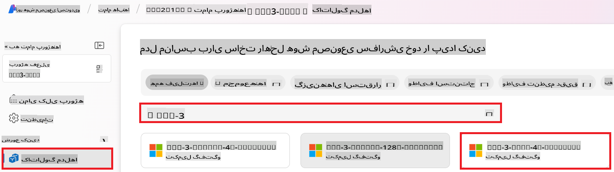

1. **Fine-tune** را انتخاب کنید.

    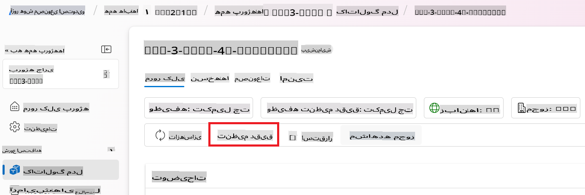

1. **نام مدل تنظیم‌شده** را وارد کنید.

    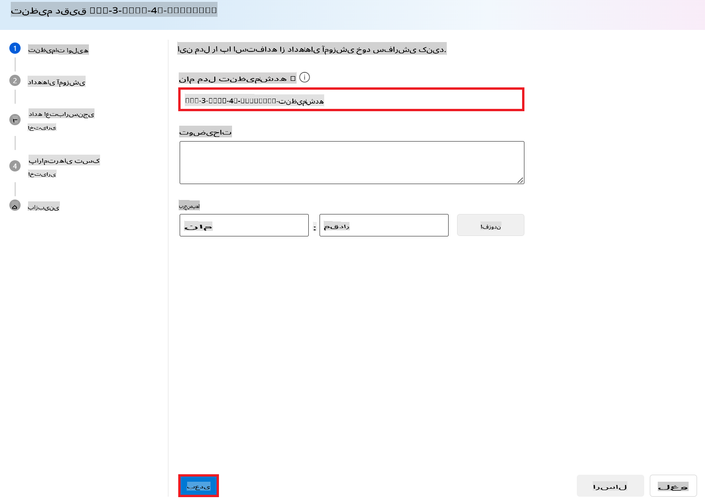

1. **Next** را انتخاب کنید.

1. کارهای زیر را انجام دهید:

    - نوع **Task** را به **Chat completion** تنظیم کنید.
    - داده‌های **Training** موردنظر خود را انتخاب کنید. می‌توانید آن را از طریق داده‌های Azure AI Foundry یا محیط محلی خود آپلود کنید.

    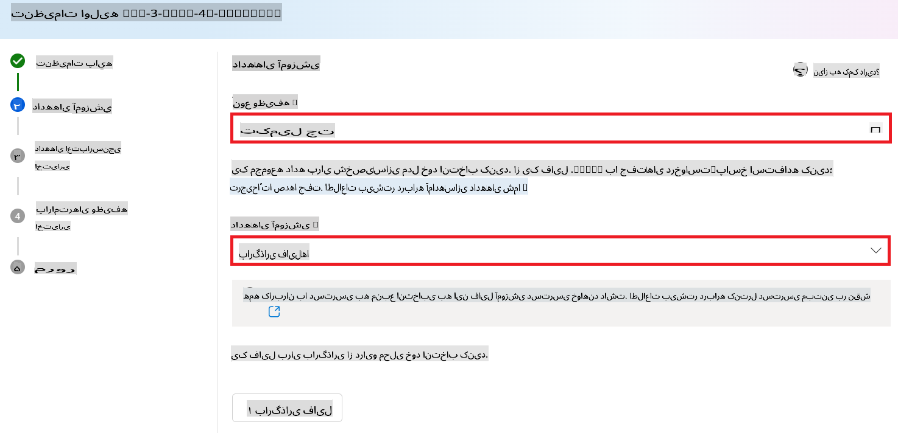

1. **Next** را انتخاب کنید.

1. داده‌های **Validation** موردنظر خود را آپلود کنید یا **تقسیم خودکار داده‌های آموزشی** را انتخاب کنید.

    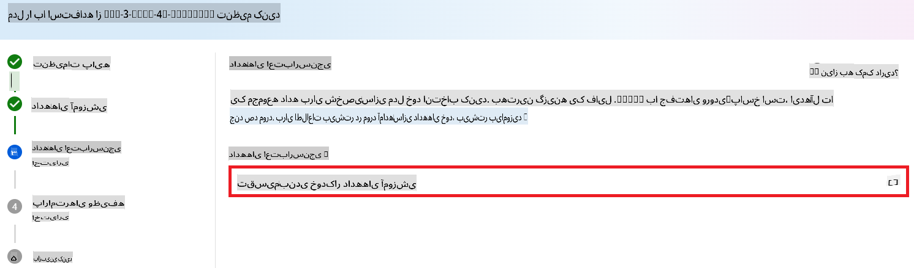

1. **Next** را انتخاب کنید.

1. کارهای زیر را انجام دهید:

    - **ضریب اندازه دسته** موردنظر خود را انتخاب کنید.
    - **نرخ یادگیری** موردنظر خود را انتخاب کنید.
    - **تعداد epochs** موردنظر خود را انتخاب کنید.

    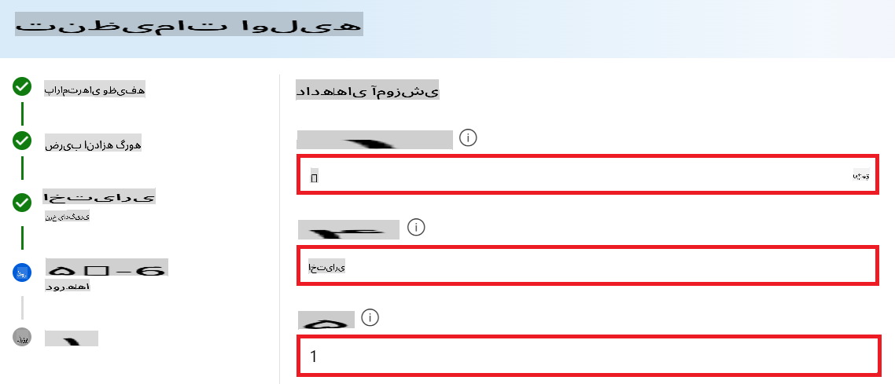

1. برای شروع فرآیند تنظیم، **Submit** را انتخاب کنید.

    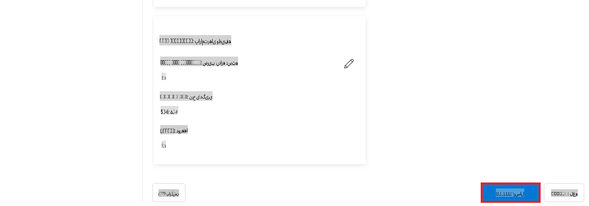

1. پس از تنظیم مدل، وضعیت به‌صورت **Completed** نمایش داده می‌شود، همان‌طور که در تصویر زیر نشان داده شده است. اکنون می‌توانید مدل را مستقر کرده و در برنامه خود، در playground یا در prompt flow استفاده کنید. برای اطلاعات بیشتر، به [نحوه استقرار خانواده مدل‌های Phi-3 با Azure AI Foundry](https://learn.microsoft.com/azure/ai-studio/how-to/deploy-models-phi-3?tabs=phi-3-5&pivots=programming-language-python) مراجعه کنید.

    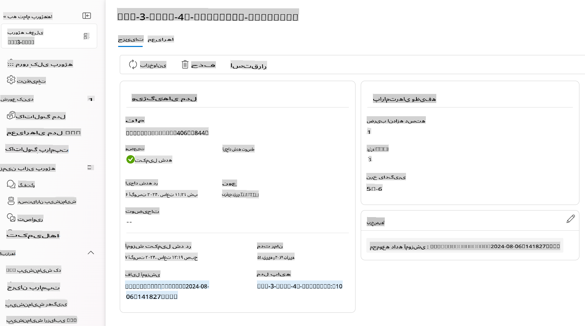

> [!NOTE]
> برای اطلاعات دقیق‌تر در مورد تنظیم Phi-3، لطفاً به [تنظیم مدل‌های Phi-3 در Azure AI Foundry](https://learn.microsoft.com/azure/ai-studio/how-to/fine-tune-phi-3?tabs=phi-3-mini) مراجعه کنید.

## پاک‌سازی مدل‌های تنظیم‌شده

می‌توانید یک مدل تنظیم‌شده را از لیست مدل‌های تنظیم‌شده در [Azure AI Foundry](https://ai.azure.com) یا از صفحه جزئیات مدل حذف کنید. مدل تنظیم‌شده‌ای که می‌خواهید حذف کنید را از صفحه تنظیم انتخاب کرده و سپس دکمه حذف را انتخاب کنید.

> [!NOTE]
> نمی‌توانید یک مدل سفارشی را حذف کنید اگر استقرار فعالی داشته باشد. ابتدا باید استقرار مدل خود را حذف کنید و سپس مدل سفارشی خود را حذف کنید.

## هزینه‌ها و سهمیه‌ها

### ملاحظات هزینه و سهمیه برای مدل‌های Phi-3 تنظیم‌شده به‌عنوان یک سرویس

مدل‌های Phi تنظیم‌شده به‌عنوان یک سرویس توسط مایکروسافت ارائه شده و با Azure AI Foundry یکپارچه شده‌اند. می‌توانید قیمت‌گذاری را هنگام [استقرار](https://learn.microsoft.com/azure/ai-studio/how-to/deploy-models-phi-3?tabs=phi-3-5&pivots=programming-language-python) یا تنظیم مدل‌ها در زبانه قیمت‌گذاری و شرایط در جادوگر استقرار مشاهده کنید.

## فیلتر محتوا

مدل‌هایی که به‌عنوان یک سرویس با پرداخت بر اساس استفاده مستقر شده‌اند، توسط Azure AI Content Safety محافظت می‌شوند. هنگام استقرار به نقاط انتهایی بلادرنگ، می‌توانید این قابلیت را غیرفعال کنید. با فعال بودن Azure AI Content Safety، هم ورودی و هم خروجی از طریق مجموعه‌ای از مدل‌های طبقه‌بندی برای تشخیص و جلوگیری از محتوای مضر عبور می‌کنند. سیستم فیلتر محتوا دسته‌های خاصی از محتوای بالقوه مضر را در ورودی و خروجی شناسایی کرده و اقداماتی انجام می‌دهد. اطلاعات بیشتر را در [Azure AI Content Safety](https://learn.microsoft.com/azure/ai-studio/concepts/content-filtering) بیاموزید.

**پیکربندی تنظیم مدل**

هایپرپارامترها: هایپرپارامترهایی مانند نرخ یادگیری، اندازه دسته و تعداد epochs آموزشی را تعریف کنید.

**تابع هزینه**

یک تابع هزینه مناسب برای وظیفه خود انتخاب کنید (مثلاً cross-entropy).

**بهینه‌ساز**

یک بهینه‌ساز (مثلاً Adam) برای به‌روزرسانی گرادیان‌ها در طول آموزش انتخاب کنید.

**فرآیند تنظیم مدل**

- بارگذاری مدل از پیش‌آموزش‌دیده: چک‌پوینت Phi-3 Mini را بارگذاری کنید.
- افزودن لایه‌های سفارشی: لایه‌های خاص وظیفه (مثلاً سر طبقه‌بندی برای دستورالعمل‌های چت) اضافه کنید.

**آموزش مدل**
مدل را با استفاده از مجموعه داده آماده‌شده خود تنظیم کنید. پیشرفت آموزش را نظارت کرده و هایپرپارامترها را در صورت نیاز تنظیم کنید.

**ارزیابی و اعتبارسنجی**

مجموعه اعتبارسنجی: داده‌های خود را به مجموعه‌های آموزشی و اعتبارسنجی تقسیم کنید.

**ارزیابی عملکرد**

از معیارهایی مانند دقت، F1-score یا perplexity برای ارزیابی عملکرد مدل استفاده کنید.

## ذخیره مدل تنظیم‌شده

**چک‌پوینت**
چک‌پوینت مدل تنظیم‌شده را برای استفاده‌های آینده ذخیره کنید.

## استقرار

- استقرار به‌عنوان یک سرویس وب: مدل تنظیم‌شده خود را به‌عنوان یک سرویس وب در Azure AI Foundry مستقر کنید.
- تست نقطه انتهایی: برای تأیید عملکرد آن، پرسش‌های آزمایشی به نقطه انتهایی مستقر ارسال کنید.

## تکرار و بهبود

تکرار: اگر عملکرد رضایت‌بخش نیست، با تنظیم هایپرپارامترها، افزودن داده بیشتر یا تنظیم برای تعداد بیشتری از epochs، تکرار کنید.

## نظارت و پالایش

به‌طور مداوم رفتار مدل را نظارت کرده و در صورت نیاز آن را پالایش کنید.

## سفارشی‌سازی و گسترش

وظایف سفارشی: Phi-3 Mini می‌تواند برای وظایف مختلفی فراتر از دستورالعمل‌های چت تنظیم شود. موارد استفاده دیگر را بررسی کنید!
آزمایش: معماری‌های مختلف، ترکیب لایه‌ها و تکنیک‌ها را برای بهبود عملکرد امتحان کنید.

> [!NOTE]
> تنظیم مدل یک فرآیند تکراری است. آزمایش کنید، یاد بگیرید و مدل خود را برای دستیابی به بهترین نتایج برای وظیفه خاص خود تطبیق دهید!

**سلب مسئولیت**:  
این سند با استفاده از خدمات ترجمه ماشینی مبتنی بر هوش مصنوعی ترجمه شده است. در حالی که ما تلاش می‌کنیم دقت را رعایت کنیم، لطفاً توجه داشته باشید که ترجمه‌های خودکار ممکن است حاوی اشتباهات یا نادرستی‌هایی باشند. سند اصلی به زبان بومی آن باید به عنوان منبع معتبر در نظر گرفته شود. برای اطلاعات حیاتی، ترجمه حرفه‌ای انسانی توصیه می‌شود. ما مسئولیتی در قبال سوءتفاهم‌ها یا تفسیرهای نادرست ناشی از استفاده از این ترجمه نداریم.