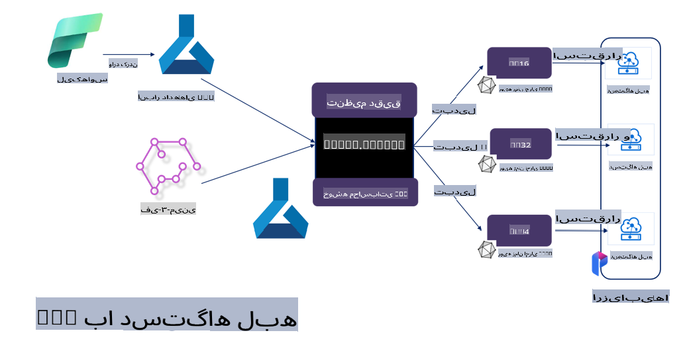

# **تنظیم دقیق Phi-3 با استفاده از Microsoft Olive**

[Olive](https://github.com/microsoft/OLive?WT.mc_id=aiml-138114-kinfeylo) ابزاری ساده و کاربرپسند برای بهینه‌سازی مدل‌های مبتنی بر سخت‌افزار است که تکنیک‌های پیشرفته در زمینه فشرده‌سازی، بهینه‌سازی و کامپایل مدل‌ها را گرد هم می‌آورد.

این ابزار به‌منظور ساده‌سازی فرآیند بهینه‌سازی مدل‌های یادگیری ماشین طراحی شده است و اطمینان حاصل می‌کند که این مدل‌ها از معماری‌های سخت‌افزاری خاص به‌صورت کارآمد استفاده می‌کنند.

فرقی نمی‌کند که روی برنامه‌های مبتنی بر فضای ابری کار می‌کنید یا دستگاه‌های لبه‌ای؛ Olive به شما این امکان را می‌دهد که مدل‌های خود را به‌سادگی و با اثربخشی بهینه کنید.

## ویژگی‌های کلیدی:
- Olive تکنیک‌های بهینه‌سازی را برای اهداف سخت‌افزاری موردنظر گردآوری و خودکارسازی می‌کند.
- هیچ تکنیک بهینه‌سازی واحدی برای همه سناریوها مناسب نیست؛ بنابراین Olive امکان توسعه‌پذیری را فراهم کرده و به کارشناسان صنعت اجازه می‌دهد نوآوری‌های خود در بهینه‌سازی را به آن اضافه کنند.

## کاهش تلاش‌های مهندسی:
- توسعه‌دهندگان اغلب نیاز دارند چندین زنجیره ابزار خاص برای سخت‌افزارهای مختلف را یاد بگیرند و از آن‌ها برای آماده‌سازی و بهینه‌سازی مدل‌های آموزش‌دیده جهت استقرار استفاده کنند.
- Olive این تجربه را ساده‌تر می‌کند و تکنیک‌های بهینه‌سازی را برای سخت‌افزار دلخواه خودکارسازی می‌کند.

## راهکار آماده به‌کار برای بهینه‌سازی انتها به انتها:

با ترکیب و تنظیم تکنیک‌های یکپارچه، Olive یک راهکار واحد برای بهینه‌سازی انتها به انتها ارائه می‌دهد.
این ابزار محدودیت‌هایی مانند دقت و تأخیر را در حین بهینه‌سازی مدل‌ها در نظر می‌گیرد.

## استفاده از Microsoft Olive برای تنظیم دقیق

Microsoft Olive ابزاری متن‌باز و بسیار ساده برای بهینه‌سازی مدل است که می‌تواند هم برای تنظیم دقیق و هم برای ارجاع در حوزه هوش مصنوعی مولد استفاده شود. تنها با پیکربندی ساده و استفاده از مدل‌های زبان کوچک متن‌باز و محیط‌های اجرایی مرتبط (AzureML / GPU محلی، CPU، DirectML)، می‌توانید تنظیم دقیق یا ارجاع مدل را از طریق بهینه‌سازی خودکار انجام دهید و بهترین مدل را برای استقرار در فضای ابری یا دستگاه‌های لبه‌ای پیدا کنید. این امکان را به شرکت‌ها می‌دهد که مدل‌های عمودی صنعتی خود را به‌صورت محلی و در فضای ابری ایجاد کنند.


## تنظیم دقیق Phi-3 با Microsoft Olive 



## کد نمونه و مثال تنظیم دقیق Phi-3 با Olive
در این مثال از Olive برای موارد زیر استفاده خواهید کرد:

- تنظیم دقیق یک آداپتور LoRA برای دسته‌بندی عبارات به احساسات غم، شادی، ترس و شگفتی.
- ادغام وزن‌های آداپتور با مدل پایه.
- بهینه‌سازی و کمینه‌سازی مدل به int4.

[کد نمونه](../../code/03.Finetuning/olive-ort-example/README.md)

### نصب Microsoft Olive

نصب Microsoft Olive بسیار ساده است و می‌توان آن را برای CPU، GPU، DirectML و Azure ML نیز نصب کرد.

```bash
pip install olive-ai
```

اگر می‌خواهید یک مدل ONNX را با CPU اجرا کنید، می‌توانید از این استفاده کنید:

```bash
pip install olive-ai[cpu]
```

اگر می‌خواهید یک مدل ONNX را با GPU اجرا کنید، می‌توانید از این استفاده کنید:

```python
pip install olive-ai[gpu]
```

اگر می‌خواهید از Azure ML استفاده کنید، از این استفاده کنید:

```python
pip install git+https://github.com/microsoft/Olive#egg=olive-ai[azureml]
```

**توجه**
نیازمندی سیستم عامل: Ubuntu 20.04 / 22.04 

### **Config.json در Microsoft Olive**

پس از نصب، می‌توانید تنظیمات مختلف مدل را از طریق فایل Config پیکربندی کنید، از جمله داده‌ها، محاسبات، آموزش، استقرار و تولید مدل.

**1. داده‌ها**

در Microsoft Olive، آموزش بر روی داده‌های محلی و داده‌های ابری پشتیبانی می‌شود و می‌توان آن را در تنظیمات پیکربندی کرد.

*تنظیمات داده محلی*

می‌توانید به‌سادگی مجموعه داده‌ای که باید برای تنظیم دقیق آموزش داده شود را تنظیم کنید. معمولاً این داده‌ها در قالب json هستند و با الگوی داده سازگار می‌شوند. این باید بر اساس نیازهای مدل تنظیم شود (به‌عنوان مثال، سازگاری با قالب موردنیاز Microsoft Phi-3-mini. اگر مدل‌های دیگری دارید، لطفاً به قالب‌های تنظیم دقیق موردنیاز مدل‌های دیگر مراجعه کنید).

```json

    "data_configs": [
        {
            "name": "dataset_default_train",
            "type": "HuggingfaceContainer",
            "load_dataset_config": {
                "params": {
                    "data_name": "json", 
                    "data_files":"dataset/dataset-classification.json",
                    "split": "train"
                }
            },
            "pre_process_data_config": {
                "params": {
                    "dataset_type": "corpus",
                    "text_cols": [
                            "phrase",
                            "tone"
                    ],
                    "text_template": "### Text: {phrase}\n### The tone is:\n{tone}",
                    "corpus_strategy": "join",
                    "source_max_len": 2048,
                    "pad_to_max_len": false,
                    "use_attention_mask": false
                }
            }
        }
    ],
```

**تنظیمات منبع داده ابری**

با اتصال به ذخیره‌سازی داده Azure AI Studio/Azure Machine Learning Service، می‌توانید داده‌ها را در فضای ابری پیوند دهید و انتخاب کنید که از طریق Microsoft Fabric و Azure Data منابع داده مختلف را به Azure AI Studio/Azure Machine Learning Service وارد کنید تا از داده‌ها برای تنظیم دقیق پشتیبانی کنید.

```json

    "data_configs": [
        {
            "name": "dataset_default_train",
            "type": "HuggingfaceContainer",
            "load_dataset_config": {
                "params": {
                    "data_name": "json", 
                    "data_files": {
                        "type": "azureml_datastore",
                        "config": {
                            "azureml_client": {
                                "subscription_id": "Your Azure Subscrition ID",
                                "resource_group": "Your Azure Resource Group",
                                "workspace_name": "Your Azure ML Workspaces name"
                            },
                            "datastore_name": "workspaceblobstore",
                            "relative_path": "Your train_data.json Azure ML Location"
                        }
                    },
                    "split": "train"
                }
            },
            "pre_process_data_config": {
                "params": {
                    "dataset_type": "corpus",
                    "text_cols": [
                            "Question",
                            "Best Answer"
                    ],
                    "text_template": "<|user|>\n{Question}<|end|>\n<|assistant|>\n{Best Answer}\n<|end|>",
                    "corpus_strategy": "join",
                    "source_max_len": 2048,
                    "pad_to_max_len": false,
                    "use_attention_mask": false
                }
            }
        }
    ],
    
```

**2. تنظیمات محاسبات**

اگر نیاز دارید به‌صورت محلی کار کنید، می‌توانید مستقیماً از منابع داده محلی استفاده کنید. اگر نیاز دارید از منابع Azure AI Studio/Azure Machine Learning Service استفاده کنید، باید پارامترهای مربوط به Azure، نام قدرت محاسباتی و غیره را پیکربندی کنید.

```json

    "systems": {
        "aml": {
            "type": "AzureML",
            "config": {
                "accelerators": ["gpu"],
                "hf_token": true,
                "aml_compute": "Your Azure AI Studio / Azure Machine Learning Service Compute Name",
                "aml_docker_config": {
                    "base_image": "Your Azure AI Studio / Azure Machine Learning Service docker",
                    "conda_file_path": "conda.yaml"
                }
            }
        },
        "azure_arc": {
            "type": "AzureML",
            "config": {
                "accelerators": ["gpu"],
                "aml_compute": "Your Azure AI Studio / Azure Machine Learning Service Compute Name",
                "aml_docker_config": {
                    "base_image": "Your Azure AI Studio / Azure Machine Learning Service docker",
                    "conda_file_path": "conda.yaml"
                }
            }
        }
    },
```

***توجه***

از آنجا که این فرآیند از طریق یک کانتینر در Azure AI Studio/Azure Machine Learning Service اجرا می‌شود، نیاز است محیط موردنیاز را پیکربندی کنید. این تنظیمات در محیط conda.yaml انجام می‌شود.

```yaml

name: project_environment
channels:
  - defaults
dependencies:
  - python=3.8.13
  - pip=22.3.1
  - pip:
      - einops
      - accelerate
      - azure-keyvault-secrets
      - azure-identity
      - bitsandbytes
      - datasets
      - huggingface_hub
      - peft
      - scipy
      - sentencepiece
      - torch>=2.2.0
      - transformers
      - git+https://github.com/microsoft/Olive@jiapli/mlflow_loading_fix#egg=olive-ai[gpu]
      - --extra-index-url https://aiinfra.pkgs.visualstudio.com/PublicPackages/_packaging/ORT-Nightly/pypi/simple/ 
      - ort-nightly-gpu==1.18.0.dev20240307004
      - --extra-index-url https://aiinfra.pkgs.visualstudio.com/PublicPackages/_packaging/onnxruntime-genai/pypi/simple/
      - onnxruntime-genai-cuda

    

```

**3. انتخاب SLM**

می‌توانید مدل را مستقیماً از Hugging Face استفاده کنید یا آن را با Model Catalog در Azure AI Studio/Azure Machine Learning ترکیب کرده و مدل موردنظر را انتخاب کنید. در مثال کد زیر، از Microsoft Phi-3-mini به‌عنوان نمونه استفاده خواهیم کرد.

اگر مدل را به‌صورت محلی دارید، می‌توانید از این روش استفاده کنید:

```json

    "input_model":{
        "type": "PyTorchModel",
        "config": {
            "hf_config": {
                "model_name": "model-cache/microsoft/phi-3-mini",
                "task": "text-generation",
                "model_loading_args": {
                    "trust_remote_code": true
                }
            }
        }
    },
```

اگر می‌خواهید از مدلی در Azure AI Studio/Azure Machine Learning Service استفاده کنید، می‌توانید از این روش استفاده کنید:

```json

    "input_model":{
        "type": "PyTorchModel",
        "config": {
            "model_path": {
                "type": "azureml_registry_model",
                "config": {
                    "name": "microsoft/Phi-3-mini-4k-instruct",
                    "registry_name": "azureml-msr",
                    "version": "11"
                }
            },
             "model_file_format": "PyTorch.MLflow",
             "hf_config": {
                "model_name": "microsoft/Phi-3-mini-4k-instruct",
                "task": "text-generation",
                "from_pretrained_args": {
                    "trust_remote_code": true
                }
            }
        }
    },
```

**توجه:**
برای ادغام با Azure AI Studio/Azure Machine Learning Service، هنگام تنظیم مدل، لطفاً به شماره نسخه و نام‌گذاری مرتبط توجه کنید.

تمام مدل‌های موجود در Azure باید به PyTorch.MLflow تنظیم شوند.

شما نیاز دارید که یک حساب کاربری در Hugging Face داشته باشید و کلید آن را به مقدار Key در Azure AI Studio/Azure Machine Learning متصل کنید.

**4. الگوریتم**

Microsoft Olive الگوریتم‌های تنظیم دقیق Lora و QLora را به‌خوبی بسته‌بندی کرده است. تنها چیزی که نیاز است پیکربندی برخی پارامترهای مرتبط است. در اینجا QLora را به‌عنوان مثال آورده‌ایم:

```json
        "lora": {
            "type": "LoRA",
            "config": {
                "target_modules": [
                    "o_proj",
                    "qkv_proj"
                ],
                "double_quant": true,
                "lora_r": 64,
                "lora_alpha": 64,
                "lora_dropout": 0.1,
                "train_data_config": "dataset_default_train",
                "eval_dataset_size": 0.3,
                "training_args": {
                    "seed": 0,
                    "data_seed": 42,
                    "per_device_train_batch_size": 1,
                    "per_device_eval_batch_size": 1,
                    "gradient_accumulation_steps": 4,
                    "gradient_checkpointing": false,
                    "learning_rate": 0.0001,
                    "num_train_epochs": 3,
                    "max_steps": 10,
                    "logging_steps": 10,
                    "evaluation_strategy": "steps",
                    "eval_steps": 187,
                    "group_by_length": true,
                    "adam_beta2": 0.999,
                    "max_grad_norm": 0.3
                }
            }
        },
```

اگر می‌خواهید تبدیل کمینه‌سازی انجام دهید، شاخه اصلی Microsoft Olive در حال حاضر از روش onnxruntime-genai پشتیبانی می‌کند. می‌توانید آن را بر اساس نیاز خود تنظیم کنید:

1. ادغام وزن‌های آداپتور در مدل پایه.
2. تبدیل مدل به مدل ONNX با دقت موردنیاز توسط ModelBuilder.

به‌عنوان مثال، تبدیل به INT4 کمینه‌شده:

```json

        "merge_adapter_weights": {
            "type": "MergeAdapterWeights"
        },
        "builder": {
            "type": "ModelBuilder",
            "config": {
                "precision": "int4"
            }
        }
```

**توجه** 
- اگر از QLoRA استفاده می‌کنید، تبدیل کمینه‌سازی ONNXRuntime-genai در حال حاضر پشتیبانی نمی‌شود.

- لازم به ذکر است که می‌توانید مراحل فوق را بر اساس نیاز خود تنظیم کنید. نیازی به پیکربندی کامل همه این مراحل نیست. بسته به نیاز خود، می‌توانید مستقیماً از مراحل الگوریتم بدون تنظیم دقیق استفاده کنید. در نهایت باید موتورهای مرتبط را پیکربندی کنید.

```json

    "engine": {
        "log_severity_level": 0,
        "host": "aml",
        "target": "aml",
        "search_strategy": false,
        "execution_providers": ["CUDAExecutionProvider"],
        "cache_dir": "../model-cache/models/phi3-finetuned/cache",
        "output_dir" : "../model-cache/models/phi3-finetuned"
    }
```

**5. اتمام تنظیم دقیق**

در خط فرمان، در دایرکتوری olive-config.json اجرا کنید:

```bash
olive run --config olive-config.json  
```

**سلب مسئولیت**:  
این سند با استفاده از خدمات ترجمه ماشینی مبتنی بر هوش مصنوعی ترجمه شده است. در حالی که ما تلاش می‌کنیم دقت را حفظ کنیم، لطفاً توجه داشته باشید که ترجمه‌های خودکار ممکن است حاوی اشتباهات یا نادرستی‌هایی باشند. سند اصلی به زبان بومی آن باید به‌عنوان منبع معتبر در نظر گرفته شود. برای اطلاعات حساس، ترجمه حرفه‌ای انسانی توصیه می‌شود. ما هیچ مسئولیتی در قبال سوءتفاهم‌ها یا تفسیرهای نادرست ناشی از استفاده از این ترجمه نداریم.