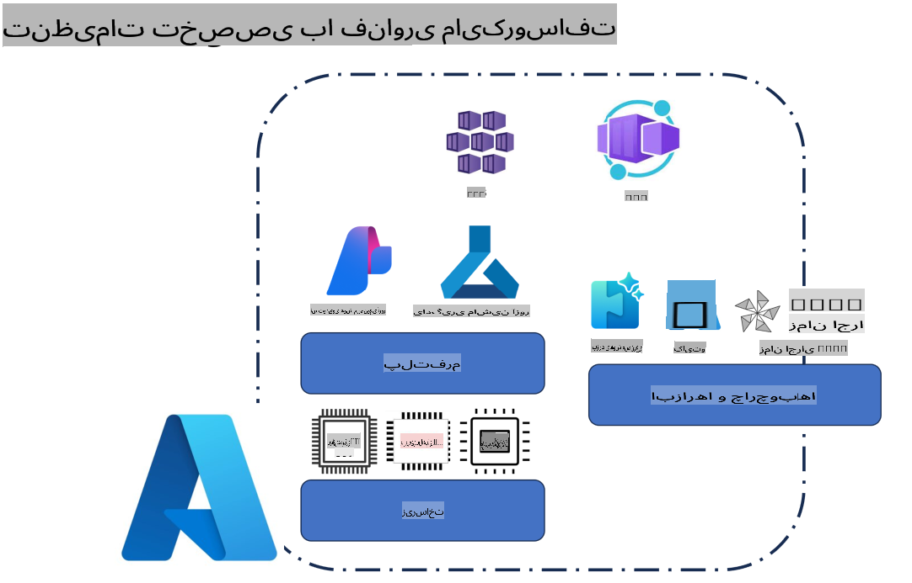
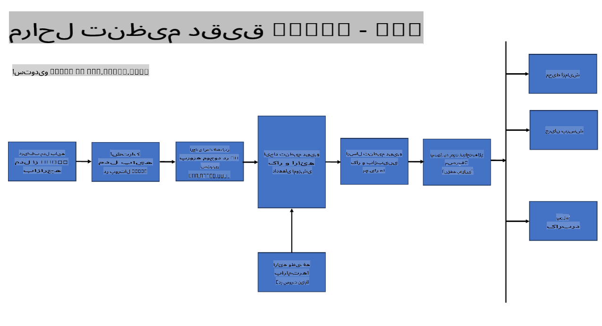
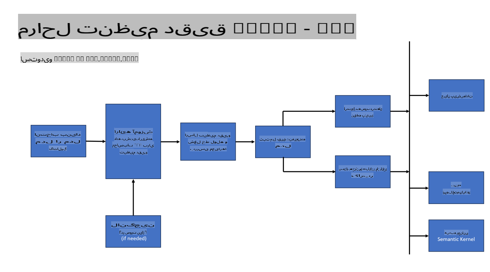
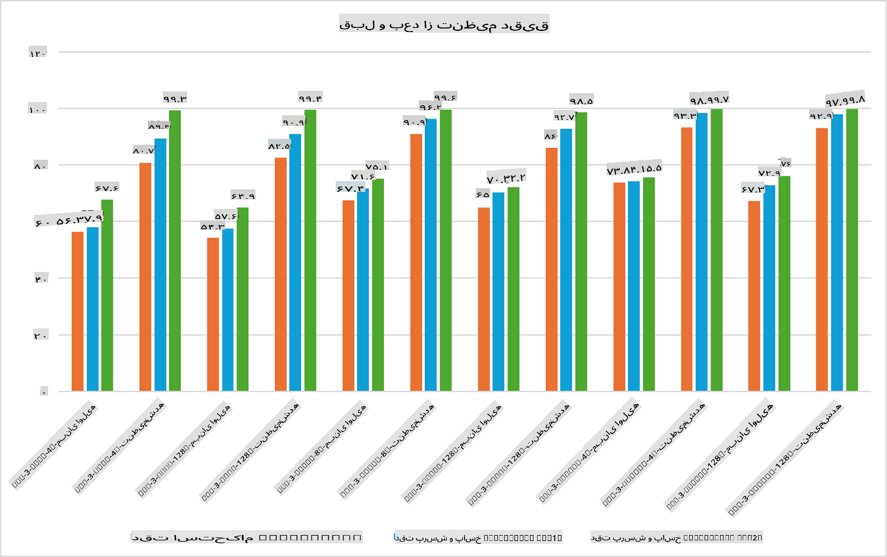

## سناریوهای تنظیم دقیق

**پلتفرم** این شامل فناوری‌های مختلفی مانند Azure AI Foundry، Azure Machine Learning، AI Tools، Kaito و ONNX Runtime است.

**زیرساخت** این شامل CPU و FPGA است که برای فرآیند تنظیم دقیق ضروری هستند. بیایید آیکون‌های مربوط به هر یک از این فناوری‌ها را نشان دهیم.

**ابزارها و چارچوب‌ها** این شامل ONNX Runtime و ONNX Runtime است. بیایید آیکون‌های مربوط به هر یک از این فناوری‌ها را نشان دهیم.  
[آیکون‌های ONNX Runtime و ONNX Runtime را وارد کنید]

فرآیند تنظیم دقیق با استفاده از فناوری‌های مایکروسافت شامل اجزا و ابزارهای مختلفی است. با درک و استفاده از این فناوری‌ها، می‌توانیم برنامه‌های خود را به طور مؤثری تنظیم کرده و راه‌حل‌های بهتری ایجاد کنیم.

## مدل به عنوان سرویس

مدل را با استفاده از تنظیم دقیق میزبانی شده، بدون نیاز به ایجاد و مدیریت محاسبات، تنظیم کنید.

تنظیم دقیق بدون سرور برای مدل‌های Phi-3-mini و Phi-3-medium در دسترس است، که به توسعه‌دهندگان امکان می‌دهد به سرعت و به راحتی مدل‌ها را برای سناریوهای ابری و لبه سفارشی کنند بدون اینکه نیاز به تنظیم محاسبات داشته باشند. همچنین اعلام کرده‌ایم که مدل Phi-3-small اکنون از طریق پیشنهاد «مدل به عنوان سرویس» ما در دسترس است، بنابراین توسعه‌دهندگان می‌توانند به سرعت و به راحتی توسعه هوش مصنوعی را بدون مدیریت زیرساخت‌های پایه آغاز کنند.

## مدل به عنوان پلتفرم

کاربران محاسبات خود را مدیریت می‌کنند تا مدل‌های خود را تنظیم دقیق کنند.

[نمونه تنظیم دقیق](https://github.com/Azure/azureml-examples/blob/main/sdk/python/foundation-models/system/finetune/chat-completion/chat-completion.ipynb)

## سناریوهای تنظیم دقیق

| | | | | | | |
|-|-|-|-|-|-|-|
|سناریو|LoRA|QLoRA|PEFT|DeepSpeed|ZeRO|DORA|
|سازگار کردن مدل‌های زبانی بزرگ (LLM) از پیش آموزش‌دیده با وظایف یا حوزه‌های خاص|بله|بله|بله|بله|بله|بله|
|تنظیم دقیق برای وظایف NLP مانند طبقه‌بندی متن، شناسایی موجودیت‌های نام‌گذاری شده و ترجمه ماشینی|بله|بله|بله|بله|بله|بله|
|تنظیم دقیق برای وظایف پرسش و پاسخ|بله|بله|بله|بله|بله|بله|
|تنظیم دقیق برای تولید پاسخ‌های انسانی در چت‌بات‌ها|بله|بله|بله|بله|بله|بله|
|تنظیم دقیق برای تولید موسیقی، هنر یا سایر اشکال خلاقیت|بله|بله|بله|بله|بله|بله|
|کاهش هزینه‌های محاسباتی و مالی|بله|بله|خیر|بله|بله|خیر|
|کاهش استفاده از حافظه|خیر|بله|خیر|بله|بله|بله|
|استفاده از پارامترهای کمتر برای تنظیم دقیق کارآمد|خیر|بله|بله|خیر|خیر|بله|
|شکل حافظه‌کارآمد از پردازش موازی داده که به حافظه GPU تجمیعی همه دستگاه‌های GPU موجود دسترسی می‌دهد|خیر|خیر|خیر|بله|بله|بله|

## مثال‌هایی از عملکرد تنظیم دقیق

**سلب مسئولیت**:  
این سند با استفاده از خدمات ترجمه ماشینی مبتنی بر هوش مصنوعی ترجمه شده است. در حالی که ما برای دقت تلاش می‌کنیم، لطفاً توجه داشته باشید که ترجمه‌های خودکار ممکن است شامل خطاها یا نادرستی‌هایی باشند. سند اصلی به زبان اصلی آن باید به‌عنوان منبع معتبر در نظر گرفته شود. برای اطلاعات حیاتی، توصیه می‌شود از ترجمه حرفه‌ای انسانی استفاده کنید. ما هیچ‌گونه مسئولیتی در قبال سوءتفاهم‌ها یا تفسیرهای نادرست ناشی از استفاده از این ترجمه نداریم.