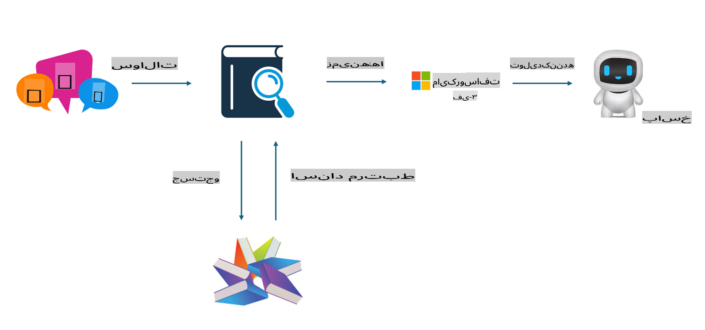

## تنظیم مدل در مقابل RAG

## تولید تقویت‌شده با بازیابی

RAG ترکیبی از بازیابی داده و تولید متن است. داده‌های ساختاریافته و غیرساختاریافته سازمان در پایگاه داده وکتوری ذخیره می‌شوند. هنگام جستجوی محتوای مرتبط، خلاصه و محتوای مرتبط پیدا می‌شوند تا یک زمینه ایجاد شود و قابلیت تکمیل متن LLM/SLM ترکیب می‌شود تا محتوا تولید شود.

## فرآیند RAG

## تنظیم مدل
تنظیم مدل بر اساس بهبود یک مدل خاص انجام می‌شود. نیازی نیست از الگوریتم مدل شروع کنید، اما داده‌ها باید به طور مداوم جمع‌آوری شوند. اگر در کاربردهای صنعتی به اصطلاحات دقیق‌تر و بیان زبانی نیاز دارید، تنظیم مدل گزینه بهتری است. اما اگر داده‌های شما به طور مکرر تغییر می‌کنند، تنظیم مدل می‌تواند پیچیده شود.

## چگونه انتخاب کنیم
اگر پاسخ ما نیاز به معرفی داده‌های خارجی داشته باشد، RAG بهترین انتخاب است.

اگر نیاز دارید دانش صنعتی پایدار و دقیقی ارائه دهید، تنظیم مدل انتخاب خوبی خواهد بود. RAG بر کشیدن محتوای مرتبط تمرکز دارد، اما ممکن است همیشه به جزئیات تخصصی مسلط نباشد.

تنظیم مدل نیازمند یک مجموعه داده با کیفیت بالا است و اگر فقط یک محدوده کوچک از داده‌ها باشد، تفاوت چندانی ایجاد نمی‌کند. RAG انعطاف‌پذیرتر است.  
تنظیم مدل مانند یک جعبه سیاه است، یک متافیزیک، و درک مکانیزم داخلی آن دشوار است. اما RAG می‌تواند یافتن منبع داده را آسان‌تر کند و در نتیجه به طور مؤثری توهمات یا خطاهای محتوایی را تنظیم کند و شفافیت بهتری ارائه دهد.

**سلب مسئولیت**:  
این سند با استفاده از خدمات ترجمه ماشینی مبتنی بر هوش مصنوعی ترجمه شده است. در حالی که ما برای دقت تلاش می‌کنیم، لطفاً توجه داشته باشید که ترجمه‌های خودکار ممکن است شامل خطاها یا نادرستی‌هایی باشند. سند اصلی به زبان اصلی خود باید به عنوان منبع معتبر در نظر گرفته شود. برای اطلاعات حساس، توصیه می‌شود از ترجمه حرفه‌ای انسانی استفاده شود. ما هیچ گونه مسئولیتی در قبال سوء تفاهم‌ها یا برداشت‌های نادرست ناشی از استفاده از این ترجمه نداریم. 