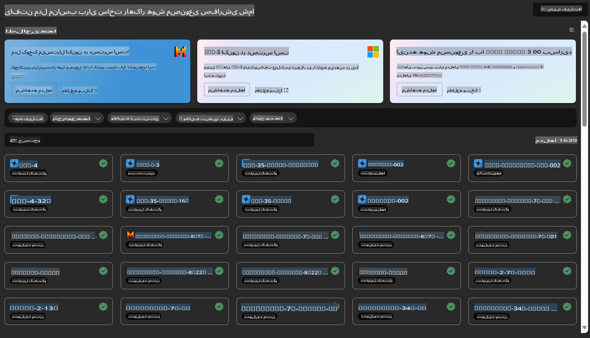
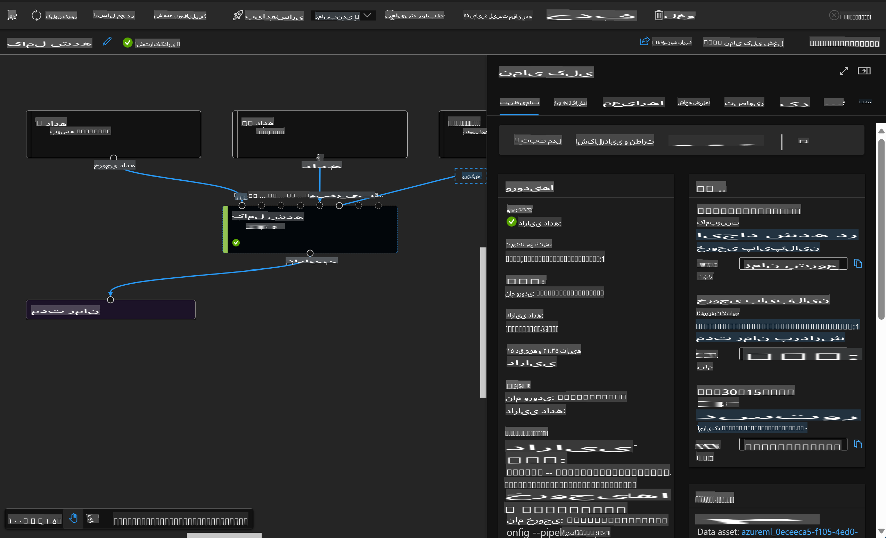

# **معرفی سرویس Azure Machine Learning**

[Azure Machine Learning](https://ml.azure.com?WT.mc_id=aiml-138114-kinfeylo) یک سرویس ابری است که برای تسریع و مدیریت چرخه عمر پروژه‌های یادگیری ماشین (ML) طراحی شده است.

متخصصان ML، دانشمندان داده و مهندسان می‌توانند از آن در فرآیندهای روزمره خود استفاده کنند تا:

- مدل‌ها را آموزش داده و مستقر کنند.
- عملیات یادگیری ماشین (MLOps) را مدیریت کنند.
- می‌توانید یک مدل را در Azure Machine Learning ایجاد کنید یا از مدلی که بر روی یک پلتفرم متن‌باز مانند PyTorch، TensorFlow یا scikit-learn ساخته شده است، استفاده کنید.
- ابزارهای MLOps به شما کمک می‌کنند تا مدل‌ها را نظارت، بازآموزی و مجدداً مستقر کنید.

## Azure Machine Learning برای چه کسانی مناسب است؟

**دانشمندان داده و مهندسان ML**

آن‌ها می‌توانند از ابزارهایی برای تسریع و خودکارسازی فرآیندهای روزمره خود استفاده کنند.  
Azure ML قابلیت‌هایی برای عدالت، شفافیت، ردیابی و قابلیت حسابرسی ارائه می‌دهد.

**توسعه‌دهندگان اپلیکیشن**

آن‌ها می‌توانند مدل‌ها را به‌صورت یکپارچه در برنامه‌ها یا سرویس‌ها ادغام کنند.

**توسعه‌دهندگان پلتفرم**

به مجموعه‌ای قدرتمند از ابزارها که با APIهای پایدار Azure Resource Manager پشتیبانی می‌شوند، دسترسی دارند.  
این ابزارها امکان ساخت ابزارهای پیشرفته ML را فراهم می‌کنند.

**سازمان‌ها**

با کار در فضای ابری Microsoft Azure، سازمان‌ها از امنیت آشنا و کنترل دسترسی مبتنی بر نقش بهره‌مند می‌شوند.  
پروژه‌هایی را تنظیم کنید تا دسترسی به داده‌های محافظت‌شده و عملیات خاص را کنترل کنید.

## بهره‌وری برای همه اعضای تیم

پروژه‌های ML معمولاً نیازمند تیمی با مجموعه مهارت‌های متنوع برای ساخت و نگهداری هستند.

Azure ML ابزارهایی را فراهم می‌کند که به شما این امکان را می‌دهد تا:

- با تیم خود از طریق نوت‌بوک‌های مشترک، منابع محاسباتی، محاسبات بدون سرور، داده‌ها و محیط‌ها همکاری کنید.
- مدل‌هایی با عدالت، شفافیت، ردیابی و قابلیت حسابرسی توسعه دهید تا الزامات تبارشناسی و تطابق حسابرسی را برآورده کنید.
- مدل‌های ML را به‌سرعت و به‌سادگی در مقیاس مستقر کنید و آن‌ها را به‌طور کارآمد با MLOps مدیریت و نظارت کنید.
- بارهای کاری یادگیری ماشین را در هر مکانی با حاکمیت، امنیت و تطابق داخلی اجرا کنید.

## ابزارهای پلتفرمی سازگار

هر کسی در تیم ML می‌تواند از ابزارهای موردعلاقه خود برای انجام کارها استفاده کند.  
چه در حال اجرای آزمایش‌های سریع، تنظیم هایپرپارامترها، ساخت خطوط لوله، یا مدیریت استنتاج‌ها باشید، می‌توانید از رابط‌های آشنایی مانند موارد زیر استفاده کنید:

- Azure Machine Learning Studio  
- Python SDK (v2)  
- Azure CLI (v2)  
- Azure Resource Manager REST APIs  

در حین بهینه‌سازی مدل‌ها و همکاری در طول چرخه توسعه، می‌توانید دارایی‌ها، منابع و معیارها را در رابط کاربری Azure Machine Learning studio به اشتراک بگذارید و پیدا کنید.

## **LLM/SLM در Azure ML**

Azure ML بسیاری از قابلیت‌های مرتبط با LLM/SLM را اضافه کرده است که LLMOps و SLMOps را ترکیب کرده و یک پلتفرم فناوری هوش مصنوعی مولد در سطح سازمانی ایجاد می‌کند.

### **کاتالوگ مدل**

کاربران سازمانی می‌توانند مدل‌های مختلفی را متناسب با سناریوهای مختلف کسب‌وکار از طریق کاتالوگ مدل مستقر کنند و به‌عنوان Model as Service خدماتی برای دسترسی توسعه‌دهندگان یا کاربران سازمانی ارائه دهند.

کاتالوگ مدل در Azure Machine Learning studio مرکزی برای کشف و استفاده از طیف گسترده‌ای از مدل‌ها است که به شما امکان می‌دهد برنامه‌های هوش مصنوعی مولد بسازید.  
کاتالوگ مدل شامل صدها مدل از ارائه‌دهندگانی مانند Azure OpenAI service، Mistral، Meta، Cohere، Nvidia، Hugging Face، و همچنین مدل‌هایی است که توسط مایکروسافت آموزش داده شده‌اند.  
مدل‌های ارائه‌شده توسط ارائه‌دهندگان غیر از مایکروسافت، محصولات غیرمایکروسافتی هستند، همان‌طور که در شرایط محصول مایکروسافت تعریف شده است و تحت شرایط ارائه‌شده با مدل مشمول می‌باشند.

### **خط لوله شغلی**

هسته اصلی یک خط لوله یادگیری ماشین تقسیم یک وظیفه کامل یادگیری ماشین به یک جریان کاری چندمرحله‌ای است.  
هر مرحله یک مؤلفه قابل مدیریت است که می‌تواند به‌صورت جداگانه توسعه، بهینه‌سازی، پیکربندی و خودکار شود.  
مراحل از طریق رابط‌های تعریف‌شده به‌خوبی به یکدیگر متصل می‌شوند.  
سرویس خط لوله Azure Machine Learning به‌صورت خودکار تمام وابستگی‌های بین مراحل خط لوله را هماهنگ می‌کند.

در تنظیم دقیق SLM / LLM، می‌توانیم فرآیندهای داده، آموزش و تولید خود را از طریق خط لوله مدیریت کنیم.

### **Prompt flow**

**مزایای استفاده از Azure Machine Learning prompt flow**  
Azure Machine Learning prompt flow مزایای متعددی ارائه می‌دهد که به کاربران کمک می‌کند از ایده‌پردازی به آزمایش و در نهایت به برنامه‌های کاربردی مبتنی بر LLM آماده تولید برسند:

**چابکی در مهندسی پرامپت**

- تجربه نویسندگی تعاملی: Azure Machine Learning prompt flow نمای بصری از ساختار جریان ارائه می‌دهد که به کاربران امکان می‌دهد پروژه‌های خود را به‌راحتی درک و پیمایش کنند. همچنین یک تجربه کدنویسی شبیه به نوت‌بوک برای توسعه و اشکال‌زدایی کارآمد جریان فراهم می‌کند.  
- انواع مختلف برای تنظیم پرامپت: کاربران می‌توانند چندین نسخه مختلف از پرامپت ایجاد و مقایسه کنند و فرآیند اصلاح تکراری را تسهیل کنند.  
- ارزیابی: جریان‌های ارزیابی داخلی به کاربران امکان می‌دهند کیفیت و اثربخشی پرامپت‌ها و جریان‌های خود را ارزیابی کنند.  
- منابع جامع: Azure Machine Learning prompt flow شامل کتابخانه‌ای از ابزارهای داخلی، نمونه‌ها و قالب‌ها است که به‌عنوان نقطه شروع برای توسعه عمل کرده و خلاقیت را الهام می‌بخشد و فرآیند را تسریع می‌کند.

**آمادگی سازمانی برای برنامه‌های مبتنی بر LLM**

- همکاری: Azure Machine Learning prompt flow از همکاری تیمی پشتیبانی می‌کند و به چندین کاربر اجازه می‌دهد در پروژه‌های مهندسی پرامپت با یکدیگر کار کنند، دانش خود را به اشتراک بگذارند و کنترل نسخه را حفظ کنند.  
- پلتفرم همه‌جانبه: Azure Machine Learning prompt flow کل فرآیند مهندسی پرامپت را از توسعه و ارزیابی تا استقرار و نظارت ساده می‌کند.  
کاربران می‌توانند جریان‌های خود را به‌عنوان نقاط انتهایی Azure Machine Learning مستقر کرده و عملکرد آن‌ها را در زمان واقعی نظارت کنند و از عملیات بهینه و بهبود مداوم اطمینان حاصل کنند.  
- راه‌حل‌های آمادگی سازمانی Azure Machine Learning: Prompt flow از راه‌حل‌های آمادگی سازمانی قدرتمند Azure Machine Learning بهره می‌برد و یک پایه امن، مقیاس‌پذیر و قابل‌اعتماد برای توسعه، آزمایش و استقرار جریان‌ها فراهم می‌کند.

با Azure Machine Learning prompt flow، کاربران می‌توانند چابکی در مهندسی پرامپت را آزاد کنند، به‌طور مؤثر همکاری کنند و از راه‌حل‌های سازمانی برای توسعه و استقرار موفق برنامه‌های مبتنی بر LLM بهره ببرند.

با ترکیب قدرت محاسباتی، داده‌ها و اجزای مختلف Azure ML، توسعه‌دهندگان سازمانی می‌توانند به‌راحتی برنامه‌های هوش مصنوعی خود را بسازند.

**سلب مسئولیت**:  
این سند با استفاده از خدمات ترجمه ماشینی مبتنی بر هوش مصنوعی ترجمه شده است. در حالی که ما برای دقت تلاش می‌کنیم، لطفاً توجه داشته باشید که ترجمه‌های خودکار ممکن است شامل اشتباهات یا نادقتی‌هایی باشد. سند اصلی به زبان اصلی آن باید به‌عنوان منبع معتبر در نظر گرفته شود. برای اطلاعات حساس، ترجمه انسانی حرفه‌ای توصیه می‌شود. ما هیچ مسئولیتی در قبال سوءتفاهم‌ها یا تفسیرهای نادرست ناشی از استفاده از این ترجمه نداریم.