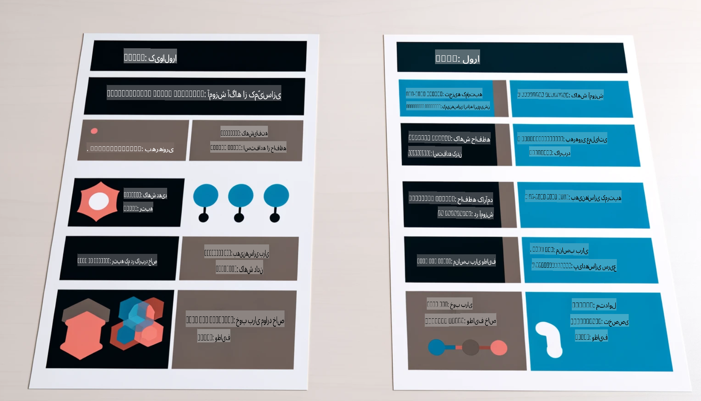

# **بگذارید Phi-3 یک متخصص صنعت شود**

برای اینکه مدل Phi-3 را در یک صنعت به کار ببرید، باید داده‌های تجاری مرتبط با آن صنعت را به مدل Phi-3 اضافه کنید. ما دو گزینه متفاوت داریم: اولین گزینه RAG (تولید تقویت‌شده با بازیابی) و دومین گزینه تنظیم دقیق (Fine Tuning).

## **RAG در مقابل تنظیم دقیق**

### **تولید تقویت‌شده با بازیابی (RAG)**

RAG ترکیبی از بازیابی داده و تولید متن است. داده‌های ساختاریافته و غیرساختاریافته سازمان در پایگاه داده برداری ذخیره می‌شوند. هنگام جستجوی محتوای مرتبط، خلاصه و محتوای مرتبط پیدا شده و یک زمینه تشکیل می‌شود و سپس با قابلیت تکمیل متن LLM/SLM ترکیب می‌شود تا محتوا تولید شود.

### **تنظیم دقیق**

تنظیم دقیق بر اساس بهبود یک مدل خاص است. نیازی به شروع از الگوریتم مدل ندارد، اما باید داده‌ها به طور مداوم انباشته شوند. اگر به اصطلاحات دقیق‌تر و بیان زبانی خاص در کاربردهای صنعتی نیاز دارید، تنظیم دقیق انتخاب بهتری است. اما اگر داده‌های شما به طور مکرر تغییر می‌کنند، تنظیم دقیق می‌تواند پیچیده شود.

### **چگونه انتخاب کنیم**

1. اگر پاسخ ما نیاز به معرفی داده‌های خارجی دارد، RAG بهترین انتخاب است.

2. اگر نیاز به خروجی دانش صنعتی پایدار و دقیق دارید، تنظیم دقیق انتخاب خوبی خواهد بود. RAG اولویت را به کشیدن محتوای مرتبط می‌دهد، اما ممکن است همیشه جزئیات تخصصی را به درستی منتقل نکند.

3. تنظیم دقیق به یک مجموعه داده با کیفیت بالا نیاز دارد، و اگر فقط یک محدوده کوچک از داده باشد، تفاوت چندانی ایجاد نمی‌کند. RAG انعطاف‌پذیرتر است.

4. تنظیم دقیق یک جعبه سیاه است، یک متافیزیک، و درک مکانیسم داخلی آن دشوار است. اما RAG می‌تواند پیدا کردن منبع داده را آسان‌تر کند، بنابراین خطاهای توهم یا محتوایی را به طور مؤثرتری تنظیم کرده و شفافیت بهتری ارائه دهد.

### **سناریوها**

1. صنایع تخصصی که به واژگان حرفه‌ای و بیان خاص نیاز دارند، ***تنظیم دقیق*** بهترین انتخاب خواهد بود.

2. سیستم پرسش و پاسخ که شامل ترکیب نقاط دانش مختلف است، ***RAG*** بهترین انتخاب خواهد بود.

3. ترکیب جریان خودکار کسب‌وکار ***RAG + تنظیم دقیق*** بهترین انتخاب است.

## **چگونه از RAG استفاده کنیم**

یک پایگاه داده برداری مجموعه‌ای از داده‌ها است که به صورت ریاضی ذخیره شده‌اند. پایگاه‌های داده برداری باعث می‌شوند مدل‌های یادگیری ماشین بتوانند ورودی‌های قبلی را بهتر به خاطر بسپارند و به این ترتیب از یادگیری ماشین برای پشتیبانی از موارد استفاده‌ای مانند جستجو، پیشنهادات و تولید متن استفاده شود. داده‌ها می‌توانند بر اساس معیارهای شباهت شناسایی شوند، نه تطابق دقیق، که این امکان را به مدل‌های کامپیوتری می‌دهد تا زمینه داده‌ها را بهتر درک کنند.

پایگاه داده برداری کلید پیاده‌سازی RAG است. ما می‌توانیم داده‌ها را از طریق مدل‌های برداری مانند text-embedding-3، jina-ai-embedding و غیره به ذخیره‌سازی برداری تبدیل کنیم.

برای یادگیری بیشتر درباره ایجاد برنامه RAG [https://github.com/microsoft/Phi-3CookBook](https://github.com/microsoft/Phi-3CookBook?WT.mc_id=aiml-138114-kinfeylo)

## **چگونه از تنظیم دقیق استفاده کنیم**

الگوریتم‌های متداول در تنظیم دقیق Lora و QLora هستند. چگونه انتخاب کنیم؟
- [یادگیری بیشتر با این دفترچه نمونه](../../../../code/04.Finetuning/Phi_3_Inference_Finetuning.ipynb)
- [مثال از نمونه تنظیم دقیق در پایتون](../../../../code/04.Finetuning/FineTrainingScript.py)

### **Lora و QLora**

LoRA (اقتباس رتبه پایین) و QLoRA (اقتباس رتبه پایین کمیت‌بندی‌شده) هر دو تکنیک‌هایی هستند که برای تنظیم دقیق مدل‌های زبان بزرگ (LLMs) با استفاده از تنظیم دقیق کارآمد پارامتری (PEFT) استفاده می‌شوند. تکنیک‌های PEFT به گونه‌ای طراحی شده‌اند که مدل‌ها را کارآمدتر از روش‌های سنتی آموزش دهند.  
LoRA یک تکنیک تنظیم دقیق مستقل است که با اعمال تقریب رتبه پایین به ماتریس به‌روزرسانی وزن، میزان حافظه مورد نیاز را کاهش می‌دهد. این روش زمان آموزش سریعی دارد و عملکردی نزدیک به روش‌های تنظیم دقیق سنتی را حفظ می‌کند.

QLoRA نسخه گسترش‌یافته‌ای از LoRA است که تکنیک‌های کمیت‌بندی را برای کاهش بیشتر استفاده از حافظه به کار می‌گیرد. QLoRA دقت پارامترهای وزن در مدل از پیش آموزش‌دیده را به دقت ۴ بیت کاهش می‌دهد، که از نظر حافظه کارآمدتر از LoRA است. با این حال، آموزش QLoRA حدود ۳۰٪ کندتر از LoRA است به دلیل مراحل اضافی کمیت‌بندی و بازکمیت‌بندی.

QLoRA از LoRA به عنوان یک ابزار کمکی برای رفع خطاهای ناشی از کمیت‌بندی استفاده می‌کند. QLoRA امکان تنظیم دقیق مدل‌های عظیم با میلیاردها پارامتر را روی GPUهای نسبتاً کوچک و در دسترس فراهم می‌کند. به عنوان مثال، QLoRA می‌تواند یک مدل ۷۰ میلیارد پارامتری که به ۳۶ GPU نیاز دارد را فقط با ۲ GPU تنظیم دقیق کند.

**سلب مسئولیت**:  
این سند با استفاده از خدمات ترجمه ماشینی مبتنی بر هوش مصنوعی ترجمه شده است. در حالی که ما برای دقت تلاش می‌کنیم، لطفاً توجه داشته باشید که ترجمه‌های خودکار ممکن است شامل خطاها یا نارسایی‌هایی باشند. سند اصلی به زبان اصلی آن باید به عنوان منبع معتبر در نظر گرفته شود. برای اطلاعات حیاتی، ترجمه حرفه‌ای انسانی توصیه می‌شود. ما هیچ مسئولیتی در قبال سوءتفاهم‌ها یا تفسیرهای نادرست ناشی از استفاده از این ترجمه نداریم.