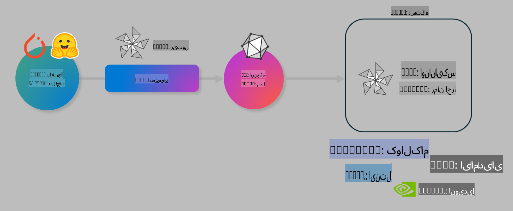

# آزمایشگاه: بهینه‌سازی مدل‌های هوش مصنوعی برای استنتاج روی دستگاه

## مقدمه

> [!IMPORTANT]
> این آزمایشگاه نیاز به یک **کارت گرافیک Nvidia A10 یا A100** همراه با درایورها و ابزار CUDA (نسخه ۱۲ یا بالاتر) دارد.

> [!NOTE]
> این آزمایشگاه **۳۵ دقیقه‌ای** به شما یک معرفی عملی از مفاهیم اصلی بهینه‌سازی مدل‌ها برای استنتاج روی دستگاه با استفاده از OLIVE ارائه می‌دهد.

## اهداف آموزشی

در پایان این آزمایشگاه، شما قادر خواهید بود با استفاده از OLIVE:

- یک مدل هوش مصنوعی را با استفاده از روش کوانتیزاسیون AWQ کوانتیزه کنید.
- یک مدل هوش مصنوعی را برای یک وظیفه خاص تنظیم دقیق کنید.
- آداپتورهای LoRA (مدل تنظیم‌شده) را برای استنتاج کارآمد روی دستگاه با استفاده از ONNX Runtime تولید کنید.

### OLIVE چیست؟

Olive (*O*NNX *live*) یک ابزار بهینه‌سازی مدل همراه با یک CLI است که به شما امکان می‌دهد مدل‌ها را برای ONNX Runtime +++https://onnxruntime.ai+++ با کیفیت و عملکرد بهینه عرضه کنید.



ورودی به Olive معمولاً یک مدل PyTorch یا Hugging Face است و خروجی آن یک مدل بهینه‌شده ONNX است که روی دستگاه (هدف استقرار) با اجرای ONNX Runtime اجرا می‌شود. Olive مدل را برای شتاب‌دهنده هوش مصنوعی هدف استقرار (NPU، GPU، CPU) که توسط یک فروشنده سخت‌افزار مانند Qualcomm، AMD، Nvidia یا Intel ارائه شده است، بهینه می‌کند.

Olive یک *روند کاری* را اجرا می‌کند، که یک توالی مرتب از وظایف بهینه‌سازی مدل فردی به نام *گذرها* است - نمونه‌هایی از گذرها شامل فشرده‌سازی مدل، ضبط گراف، کوانتیزاسیون و بهینه‌سازی گراف هستند. هر گذر مجموعه‌ای از پارامترها دارد که می‌توان آن‌ها را برای دستیابی به بهترین معیارها، مانند دقت و تأخیر، که توسط ارزیاب مربوطه ارزیابی می‌شوند، تنظیم کرد. Olive از یک استراتژی جستجو استفاده می‌کند که از یک الگوریتم جستجو برای تنظیم خودکار هر گذر به صورت جداگانه یا مجموعه‌ای از گذرها با هم استفاده می‌کند.

#### مزایای Olive

- **کاهش زمان و استرس** ناشی از آزمایش‌های دستی و خطا با تکنیک‌های مختلف برای بهینه‌سازی گراف، فشرده‌سازی و کوانتیزاسیون. محدودیت‌های کیفیت و عملکرد خود را تعریف کنید و بگذارید Olive بهترین مدل را برای شما پیدا کند.
- **بیش از ۴۰ مؤلفه بهینه‌سازی مدل داخلی** که تکنیک‌های پیشرفته در کوانتیزاسیون، فشرده‌سازی، بهینه‌سازی گراف و تنظیم دقیق را پوشش می‌دهد.
- **CLI آسان برای استفاده** برای وظایف رایج بهینه‌سازی مدل. برای مثال: olive quantize، olive auto-opt، olive finetune.
- بسته‌بندی و استقرار مدل داخلی.
- پشتیبانی از تولید مدل‌ها برای **Multi LoRA serving**.
- ساخت روندهای کاری با استفاده از YAML/JSON برای هماهنگی وظایف بهینه‌سازی و استقرار مدل.
- یکپارچگی با **Hugging Face** و **Azure AI**.
- مکانیزم **کش داخلی** برای **صرفه‌جویی در هزینه‌ها**.

## دستورالعمل‌های آزمایشگاه
> [!NOTE]
> لطفاً مطمئن شوید که Azure AI Hub و پروژه خود را پیکربندی کرده و محاسبات A100 خود را مطابق آزمایشگاه ۱ تنظیم کرده‌اید.

### گام ۰: اتصال به Azure AI Compute

شما با استفاده از ویژگی ریموت در **VS Code** به Azure AI Compute متصل خواهید شد.

1. برنامه دسکتاپ **VS Code** خود را باز کنید:
1. **پالت فرمان** را با استفاده از **Shift+Ctrl+P** باز کنید.
1. در پالت فرمان، جستجو کنید **AzureML - remote: Connect to compute instance in New Window**.
1. دستورالعمل‌های روی صفحه را برای اتصال به Compute دنبال کنید. این شامل انتخاب اشتراک Azure، گروه منابع، پروژه و نام Compute است که در آزمایشگاه ۱ تنظیم کرده‌اید.
1. پس از اتصال به نود Azure ML Compute، این اتصال در **پایین سمت چپ VS Code** نمایش داده خواهد شد `><Azure ML: Compute Name`

### گام ۱: کلون کردن این مخزن

در VS Code، می‌توانید با استفاده از **Ctrl+J** یک ترمینال جدید باز کنید و این مخزن را کلون کنید:

در ترمینال باید اعلان زیر را ببینید:

```
azureuser@computername:~/cloudfiles/code$ 
```
مخزن را کلون کنید

```bash
cd ~/localfiles
git clone https://github.com/microsoft/phi-3cookbook.git
```

### گام ۲: باز کردن پوشه در VS Code

برای باز کردن VS Code در پوشه مربوطه، دستور زیر را در ترمینال اجرا کنید، که یک پنجره جدید باز خواهد کرد:

```bash
code phi-3cookbook/code/04.Finetuning/Olive-lab
```

همچنین می‌توانید پوشه را با انتخاب **File** > **Open Folder** باز کنید.

### گام ۳: وابستگی‌ها

یک پنجره ترمینال در VS Code در نمونه Azure AI Compute خود باز کنید (نکته: **Ctrl+J**) و دستورات زیر را برای نصب وابستگی‌ها اجرا کنید:

```bash
conda create -n olive-ai python=3.11 -y
conda activate olive-ai
pip install -r requirements.txt
az extension remove -n azure-cli-ml
az extension add -n ml
```

> [!NOTE]
> نصب تمام وابستگی‌ها حدود ~۵ دقیقه طول می‌کشد.

در این آزمایشگاه شما مدل‌ها را از کاتالوگ مدل Azure AI دانلود و آپلود خواهید کرد. برای دسترسی به کاتالوگ مدل، باید با استفاده از دستور زیر وارد Azure شوید:

```bash
az login
```

> [!NOTE]
> در زمان ورود از شما خواسته می‌شود که اشتراک خود را انتخاب کنید. مطمئن شوید که اشتراک ارائه‌شده برای این آزمایشگاه را تنظیم کرده‌اید.

### گام ۴: اجرای دستورات Olive

یک پنجره ترمینال در VS Code در نمونه Azure AI Compute خود باز کنید (نکته: **Ctrl+J**) و مطمئن شوید که محیط `olive-ai` کاندا فعال است:

```bash
conda activate olive-ai
```

سپس دستورات زیر را در خط فرمان اجرا کنید.

1. **بازبینی داده‌ها:** در این مثال، شما مدل Phi-3.5-Mini را تنظیم دقیق می‌کنید تا در پاسخ به سؤالات مرتبط با سفر تخصصی شود. کد زیر چند رکورد اول مجموعه داده را نمایش می‌دهد که در قالب JSON lines هستند:

    ```bash
    head data/data_sample_travel.jsonl
    ```
1. **کوانتیزه کردن مدل:** قبل از آموزش مدل، ابتدا آن را با دستور زیر کوانتیزه کنید که از تکنیکی به نام کوانتیزاسیون فعال آگاه (AWQ) +++https://arxiv.org/abs/2306.00978+++ استفاده می‌کند. AWQ وزن‌های یک مدل را با در نظر گرفتن اکتیواسیون‌هایی که در حین استنتاج تولید می‌شوند کوانتیزه می‌کند. این بدان معناست که فرآیند کوانتیزاسیون توزیع واقعی داده‌ها در اکتیواسیون‌ها را در نظر می‌گیرد، که منجر به حفظ بهتر دقت مدل در مقایسه با روش‌های سنتی کوانتیزاسیون وزن می‌شود.

    ```bash
    olive quantize \
       --model_name_or_path microsoft/Phi-3.5-mini-instruct \
       --trust_remote_code \
       --algorithm awq \
       --output_path models/phi/awq \
       --log_level 1
    ```
    
    این فرآیند **حدود ۸ دقیقه** طول می‌کشد و **اندازه مدل را از حدود ۷.۵ گیگابایت به حدود ۲.۵ گیگابایت** کاهش می‌دهد.

    در این آزمایشگاه، ما به شما نشان می‌دهیم که چگونه مدل‌ها را از Hugging Face وارد کنید (برای مثال: `microsoft/Phi-3.5-mini-instruct`). However, Olive also allows you to input models from the Azure AI catalog by updating the `model_name_or_path` argument to an Azure AI asset ID (for example:  `azureml://registries/azureml/models/Phi-3.5-mini-instruct/versions/4`). 

1. **Train the model:** Next, the `olive finetune` دستور، مدل کوانتیزه‌شده را تنظیم دقیق می‌کند. کوانتیزه کردن مدل *قبل از* تنظیم دقیق به جای بعد از آن، دقت بهتری ارائه می‌دهد زیرا فرآیند تنظیم دقیق برخی از ضررهای ناشی از کوانتیزاسیون را بازیابی می‌کند.

    ```bash
    olive finetune \
        --method lora \
        --model_name_or_path models/phi/awq \
        --data_files "data/data_sample_travel.jsonl" \
        --data_name "json" \
        --text_template "<|user|>\n{prompt}<|end|>\n<|assistant|>\n{response}<|end|>" \
        --max_steps 100 \
        --output_path ./models/phi/ft \
        --log_level 1
    ```
    
    تنظیم دقیق (با ۱۰۰ گام) **حدود ۶ دقیقه** طول می‌کشد.

1. **بهینه‌سازی:** با مدل آموزش‌دیده، اکنون مدل را با استفاده از دستور `auto-opt` command, which will capture the ONNX graph and automatically perform a number of optimizations to improve the model performance for CPU by compressing the model and doing fusions. It should be noted, that you can also optimize for other devices such as NPU or GPU by just updating the `--device` and `--provider` Olive بهینه کنید - اما برای اهداف این آزمایشگاه از CPU استفاده خواهیم کرد.

    ```bash
    olive auto-opt \
       --model_name_or_path models/phi/ft/model \
       --adapter_path models/phi/ft/adapter \
       --device cpu \
       --provider CPUExecutionProvider \
       --use_ort_genai \
       --output_path models/phi/onnx-ao \
       --log_level 1
    ```
    
    بهینه‌سازی **حدود ۵ دقیقه** طول می‌کشد.

### گام ۵: تست سریع استنتاج مدل

برای تست استنتاج مدل، یک فایل Python در پوشه خود به نام **app.py** ایجاد کنید و کد زیر را کپی و جای‌گذاری کنید:

```python
import onnxruntime_genai as og
import numpy as np

print("loading model and adapters...", end="", flush=True)
model = og.Model("models/phi/onnx-ao/model")
adapters = og.Adapters(model)
adapters.load("models/phi/onnx-ao/model/adapter_weights.onnx_adapter", "travel")
print("DONE!")

tokenizer = og.Tokenizer(model)
tokenizer_stream = tokenizer.create_stream()

params = og.GeneratorParams(model)
params.set_search_options(max_length=100, past_present_share_buffer=False)
user_input = "what is the best thing to see in chicago"
params.input_ids = tokenizer.encode(f"<|user|>\n{user_input}<|end|>\n<|assistant|>\n")

generator = og.Generator(model, params)

generator.set_active_adapter(adapters, "travel")

print(f"{user_input}")

while not generator.is_done():
    generator.compute_logits()
    generator.generate_next_token()

    new_token = generator.get_next_tokens()[0]
    print(tokenizer_stream.decode(new_token), end='', flush=True)

print("\n")
```

کد را با استفاده از دستور زیر اجرا کنید:

```bash
python app.py
```

### گام ۶: آپلود مدل در Azure AI

آپلود مدل در یک مخزن مدل Azure AI، مدل را با سایر اعضای تیم توسعه شما به اشتراک می‌گذارد و همچنین کنترل نسخه مدل را مدیریت می‌کند. برای آپلود مدل، دستور زیر را اجرا کنید:

> [!NOTE]
> `{}` placeholders with the name of your resource group and Azure AI Project Name. 

To find your resource group `"resourceGroup"و نام پروژه Azure AI خود را به‌روزرسانی کنید و دستور زیر را اجرا کنید 

```
az ml workspace show
```

یا با رفتن به +++ai.azure.com+++ و انتخاب **management center** **project** **overview**

مقادیر `{}` را با نام گروه منابع و نام پروژه Azure AI خود به‌روزرسانی کنید.

```bash
az ml model create \
    --name ft-for-travel \
    --version 1 \
    --path ./models/phi/onnx-ao \
    --resource-group {RESOURCE_GROUP_NAME} \
    --workspace-name {PROJECT_NAME}
```
شما می‌توانید مدل آپلودشده خود را مشاهده کرده و مدل خود را در https://ml.azure.com/model/list مستقر کنید.

**سلب مسئولیت**:  
این سند با استفاده از خدمات ترجمه ماشینی مبتنی بر هوش مصنوعی ترجمه شده است. در حالی که ما برای دقت تلاش می‌کنیم، لطفاً توجه داشته باشید که ترجمه‌های خودکار ممکن است حاوی اشتباهات یا نادرستی‌هایی باشند. سند اصلی به زبان اصلی خود باید به عنوان منبع معتبر در نظر گرفته شود. برای اطلاعات حساس، ترجمه انسانی حرفه‌ای توصیه می‌شود. ما هیچ مسئولیتی در قبال سوءتفاهم‌ها یا تفسیرهای نادرست ناشی از استفاده از این ترجمه نداریم.