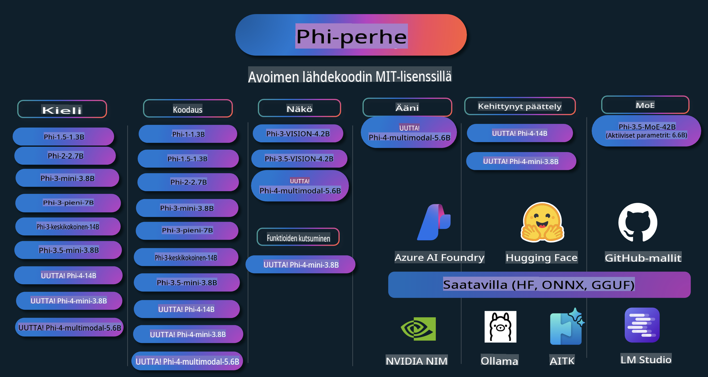

# Phi Cookbook: Käytännön esimerkkejä Microsoftin Phi-malleilla

Phi on Microsoftin kehittämä avoimen lähdekoodin tekoälymallisarja.

Phi on tällä hetkellä tehokkain ja kustannustehokkain pieni kielimalli (SLM), joka suoriutuu erinomaisesti monikielisyydessä, päättelyssä, tekstin/chatin generoinnissa, koodauksessa, kuvissa, äänissä ja muissa sovelluksissa.

Phi voidaan ottaa käyttöön pilvessä tai reunalaitteilla, ja sen avulla on helppo rakentaa generatiivisia tekoälysovelluksia vähäisellä laskentateholla.

Seuraa näitä vaiheita aloittaaksesi näiden resurssien käytön:
1. **Haarukoida Repositorio**: Klikkaa 
2. **Kloonaa Repositorio**:   `git clone https://github.com/microsoft/PhiCookBook.git`
3. [**Liity Microsoft AI Discord -yhteisöön ja tapaa asiantuntijoita ja muita kehittäjiä**](https://discord.com/invite/ByRwuEEgH4?WT.mc_id=aiml-137032-kinfeylo)

## Sisällysluettelo

- Johdanto
  - [Tervetuloa Phi-perheeseen](./md/01.Introduction/01/01.PhiFamily.md)
  - [Ympäristön asennus](./md/01.Introduction/01/01.EnvironmentSetup.md)
  - [Keskeisten teknologioiden ymmärtäminen](./md/01.Introduction/01/01.Understandingtech.md)
  - [Tekoälyn turvallisuus Phi-malleille](./md/01.Introduction/01/01.AISafety.md)
  - [Phi:n laitteistotuki](./md/01.Introduction/01/01.Hardwaresupport.md)
  - [Phi-mallit ja saatavuus eri alustoilla](./md/01.Introduction/01/01.Edgeandcloud.md)
  - [Guidance-ai:n ja Phi:n käyttö](./md/01.Introduction/01/01.Guidance.md)
  - [GitHub Marketplace -mallit](https://github.com/marketplace/models)
  - [Azure AI -mallikatalogi](https://ai.azure.com)

- Phi:n inferenssi eri ympäristöissä
    -  [Hugging Face](./md/01.Introduction/02/01.HF.md)
    -  [GitHub-mallit](./md/01.Introduction/02/02.GitHubModel.md)
    -  [Azure AI Foundry -mallikatalogi](./md/01.Introduction/02/03.AzureAIFoundry.md)
    -  [Ollama](./md/01.Introduction/02/04.Ollama.md)
    -  [AI Toolkit VSCode (AITK)](./md/01.Introduction/02/05.AITK.md)
    -  [NVIDIA NIM](./md/01.Introduction/02/06.NVIDIA.md)

- Phi-perheen inferenssi
    - [Phi:n inferenssi iOS:ssä](./md/01.Introduction/03/iOS_Inference.md)
    - [Phi:n inferenssi Androidissa](./md/01.Introduction/03/Android_Inference.md)
- [Inference Phi Jetsonilla](./md/01.Introduction/03/Jetson_Inference.md)
    - [Inference Phi AI PC:llä](./md/01.Introduction/03/AIPC_Inference.md)
    - [Inference Phi Apple MLX Frameworkilla](./md/01.Introduction/03/MLX_Inference.md)
    - [Inference Phi paikallisessa palvelimessa](./md/01.Introduction/03/Local_Server_Inference.md)
    - [Inference Phi etäpalvelimessa käyttäen AI Toolkitia](./md/01.Introduction/03/Remote_Interence.md)
    - [Inference Phi Rustilla](./md/01.Introduction/03/Rust_Inference.md)
    - [Inference Phi--Vision paikallisesti](./md/01.Introduction/03/Vision_Inference.md)
    - [Inference Phi Kaito AKS:llä, Azure Containersilla (virallinen tuki)](./md/01.Introduction/03/Kaito_Inference.md)
- [Phi-perheen kvantisointi](./md/01.Introduction/04/QuantifyingPhi.md)
    - [Phi-3.5 / 4:n kvantisointi käyttämällä llama.cpp:tä](./md/01.Introduction/04/UsingLlamacppQuantifyingPhi.md)
    - [Phi-3.5 / 4:n kvantisointi käyttämällä Generative AI -laajennuksia onnxruntimelle](./md/01.Introduction/04/UsingORTGenAIQuantifyingPhi.md)
    - [Phi-3.5 / 4:n kvantisointi käyttäen Intel OpenVINOa](./md/01.Introduction/04/UsingIntelOpenVINOQuantifyingPhi.md)
    - [Phi-3.5 / 4:n kvantisointi Apple MLX Frameworkilla](./md/01.Introduction/04/UsingAppleMLXQuantifyingPhi.md)

- Phi:n arviointi
    - [Vastuullinen tekoäly](./md/01.Introduction/05/ResponsibleAI.md)
    - [Azure AI Foundry arviointia varten](./md/01.Introduction/05/AIFoundry.md)
    - [Promptflown käyttäminen arviointiin](./md/01.Introduction/05/Promptflow.md)

- RAG Azure AI Searchilla
    - [Kuinka käyttää Phi-4-miniä ja Phi-4-multimodalia (RAG) Azure AI Searchin kanssa](https://github.com/microsoft/PhiCookBook/blob/main/code/06.E2E/E2E_Phi-4-RAG-Azure-AI-Search.ipynb)

- Phi-sovelluskehityksen esimerkit
  - Teksti- ja keskustelusovellukset
    - Phi-4-esimerkit 🆕
      - [📓] [Keskustelu Phi-4-mini ONNX -mallin kanssa](./md/02.Application/01.TextAndChat/Phi4/ChatWithPhi4ONNX/README.md)
      - [Keskustelu paikallisella Phi-4 ONNX -mallilla .NET:ssä](../../md/04.HOL/dotnet/src/LabsPhi4-Chat-01OnnxRuntime)
      - [Keskustelu .NET-konsolisovelluksessa Phi-4 ONNX:llä käyttäen Semantic Kernelia](../../md/04.HOL/dotnet/src/LabsPhi4-Chat-02SK)
    - Phi-3 / 3.5 -esimerkit
      - [Paikallinen chatbot selaimessa käyttäen Phi3:a, ONNX Runtime Webiä ja WebGPU:ta](https://github.com/microsoft/onnxruntime-inference-examples/tree/main/js/chat)
      - [OpenVino Chat](./md/02.Application/01.TextAndChat/Phi3/E2E_OpenVino_Chat.md)
      - [Monimalli - Interaktiivinen Phi-3-mini ja OpenAI Whisper](./md/02.Application/01.TextAndChat/Phi3/E2E_Phi-3-mini_with_whisper.md)
      - [MLFlow - Wrapperin rakentaminen ja Phi-3:n käyttäminen MLFlow:ssa](./md//02.Application/01.TextAndChat/Phi3/E2E_Phi-3-MLflow.md)
      - [Mallin optimointi - Kuinka optimoida Phi-3-mini-malli ONNX Runtime Webille käyttäen Olivea](https://github.com/microsoft/Olive/tree/main/examples/phi3)
      - [WinUI3-sovellus Phi-3 mini-4k-instruct-onnx:lla](https://github.com/microsoft/Phi3-Chat-WinUI3-Sample/)
      - [WinUI3 monimallia käyttävä tekoälyllä varustettu muistiinpanosovellus -esimerkki](https://github.com/microsoft/ai-powered-notes-winui3-sample)
      - [Phi-3-mallien hienosäätö ja integrointi Prompt Flow:n avulla](./md/02.Application/01.TextAndChat/Phi3/E2E_Phi-3-FineTuning_PromptFlow_Integration.md)
      - [Phi-3-mallien hienosäätö ja integrointi Prompt Flow:n avulla Azure AI Foundryssä](./md/02.Application/01.TextAndChat/Phi3/E2E_Phi-3-FineTuning_PromptFlow_Integration_AIFoundry.md)
      - [Hienosäädetyn Phi-3 / Phi-3.5-mallin arviointi Azure AI Foundryssä keskittyen Microsoftin vastuullisen tekoälyn periaatteisiin](./md/02.Application/01.TextAndChat/Phi3/E2E_Phi-3-Evaluation_AIFoundry.md)
- [📓] [Phi-3.5-mini-instruct kielimallin esimerkit (kiina/englanti)](../../md/02.Application/01.TextAndChat/Phi3/phi3-instruct-demo.ipynb)
      - [Phi-3.5-Instruct WebGPU RAG Chatbot](./md/02.Application/01.TextAndChat/Phi3/WebGPUWithPhi35Readme.md)
      - [Windows GPU:n käyttäminen Prompt flow -ratkaisun luomiseen Phi-3.5-Instruct ONNX:lla](./md/02.Application/01.TextAndChat/Phi3/UsingPromptFlowWithONNX.md)
      - [Microsoft Phi-3.5 tflite -mallin käyttäminen Android-sovelluksen luomiseen](./md/02.Application/01.TextAndChat/Phi3/UsingPhi35TFLiteCreateAndroidApp.md)
      - [Kysymys-vastaus .NET-esimerkki paikallista ONNX Phi-3 -mallia käyttäen Microsoft.ML.OnnxRuntime-kirjastolla](../../md/04.HOL/dotnet/src/LabsPhi301)
      - [Konsolichat .NET-sovellus Semantic Kernelillä ja Phi-3:lla](../../md/04.HOL/dotnet/src/LabsPhi302)

  - Azure AI Inference SDK:n koodipohjaiset esimerkit 
    - Phi-4 Esimerkit 🆕
      - [📓] [Projektikoodin generointi Phi-4-multimodal-mallilla](./md/02.Application/02.Code/Phi4/GenProjectCode/README.md)
    - Phi-3 / 3.5 Esimerkit
      - [Luo oma Visual Studio Code GitHub Copilot Chat Microsoft Phi-3 -perheen mallilla](./md/02.Application/02.Code/Phi3/VSCodeExt/README.md)
      - [Luo oma Visual Studio Code Chat Copilot Agent Phi-3.5 -mallilla GitHub-malleja käyttäen](/md/02.Application/02.Code/Phi3/CreateVSCodeChatAgentWithGitHubModels.md)

  - Kehittyneen päättelyn esimerkit
    - Phi-4 Esimerkit 🆕
      - [📓] [Phi-4-mini päättelyn esimerkit](./md/02.Application/03.AdvancedReasoning/Phi4/AdvancedResoningPhi4mini/README.md)
  
  - Demot
      - [Phi-4-mini demot Hugging Face Spaces -alustalla](https://huggingface.co/spaces/microsoft/phi-4-mini?WT.mc_id=aiml-137032-kinfeylo)
      - [Phi-4-multimodal demot Hugging Face Spaces -alustalla](https://huggingface.co/spaces/microsoft/phi-4-multimodal?WT.mc_id=aiml-137032-kinfeylo)
  - Vision Esimerkit
    - Phi-4 Esimerkit 🆕
      - [📓] [Kuvien lukeminen ja koodin generointi Phi-4-multimodal-mallilla](./md/02.Application/04.Vision/Phi4/CreateFrontend/README.md) 
    - Phi-3 / 3.5 Esimerkit
      - [📓][Phi-3-vision-Kuva tekstistä tekstiin](../../md/02.Application/04.Vision/Phi3/E2E_Phi-3-vision-image-text-to-text-online-endpoint.ipynb)
      - [Phi-3-vision-ONNX](https://onnxruntime.ai/docs/genai/tutorials/phi3-v.html)
      - [📓][Phi-3-vision CLIP Embedding](../../md/02.Application/04.Vision/Phi3/E2E_Phi-3-vision-image-text-to-text-online-endpoint.ipynb)
      - [DEMO: Phi-3 Kierrätys](https://github.com/jennifermarsman/PhiRecycling/)
      - [Phi-3-vision - Visuaalinen kieliavustaja - Phi3-Vision ja OpenVINO](https://docs.openvino.ai/nightly/notebooks/phi-3-vision-with-output.html)
      - [Phi-3 Vision Nvidia NIM](./md/02.Application/04.Vision/Phi3/E2E_Nvidia_NIM_Vision.md)
      - [Phi-3 Vision OpenVino](./md/02.Application/04.Vision/Phi3/E2E_OpenVino_Phi3Vision.md)
      - [📓][Phi-3.5 Vision monikehys- tai monikuvainen esimerkki](../../md/02.Application/04.Vision/Phi3/phi3-vision-demo.ipynb)
      - [Phi-3 Vision Paikallinen ONNX-malli Microsoft.ML.OnnxRuntime .NET:llä](../../md/04.HOL/dotnet/src/LabsPhi303)
      - [Valikkopohjainen Phi-3 Vision Paikallinen ONNX-malli Microsoft.ML.OnnxRuntime .NET:llä](../../md/04.HOL/dotnet/src/LabsPhi304)

  - Audio Esimerkit
    - Phi-4 Esimerkit 🆕
      - [📓] [Äänitranskriptioiden luominen Phi-4-multimodal-mallilla](./md/02.Application/05.Audio/Phi4/Transciption/README.md)
      - [📓] [Phi-4-multimodal Audio Esimerkki](../../md/02.Application/05.Audio/Phi4/Siri/demo.ipynb)
      - [📓] [Phi-4-multimodal Puheen käännösesimerkki](../../md/02.Application/05.Audio/Phi4/Translate/demo.ipynb)
      - [.NET konsolisovellus Phi-4-multimodal Audio -mallilla äänen analysointiin ja transkription luomiseen](../../md/04.HOL/dotnet/src/LabsPhi4-MultiModal-02Audio)

  - MOE Esimerkit
    - Phi-3 / 3.5 Esimerkit
      - [📓] [Phi-3.5 Mixture of Experts Models (MoEs) Sosiaalisen median esimerkki](../../md/02.Application/06.MoE/Phi3/phi3_moe_demo.ipynb)
      - [📓] [Retrieval-Augmented Generation (RAG) -putken rakentaminen NVIDIA NIM Phi-3 MOE:lla, Azure AI Searchilla ja LlamaIndexillä](../../md/02.Application/06.MoE/Phi3/azure-ai-search-nvidia-rag.ipynb)
  - Funktiokutsujen esimerkit
    - Phi-4 Esimerkit 🆕
      - [📓] [Funktiokutsujen käyttäminen Phi-4-mini-mallin kanssa](./md/02.Application/07.FunctionCalling/Phi4/FunctionCallingBasic/README.md)
  - Multimodaaliset sekoitusesimerkit
    - Phi-4 Esimerkit 🆕
- [📓] [Phi-4-multimodaalin käyttäminen teknologian toimittajana](../../md/02.Application/08.Multimodel/Phi4/TechJournalist/phi_4_mm_audio_text_publish_news.ipynb)  
  - [.NET-konsolisovellus, joka käyttää Phi-4-multimodaalia kuvien analysointiin](../../md/04.HOL/dotnet/src/LabsPhi4-MultiModal-01Images)  

- Phi-näytteiden hienosäätö  
  - [Hienosäätötilanteet](./md/03.FineTuning/FineTuning_Scenarios.md)  
  - [Hienosäätö vs RAG](./md/03.FineTuning/FineTuning_vs_RAG.md)  
  - [Hienosäätö: Tee Phi-3:sta alan asiantuntija](./md/03.FineTuning/LetPhi3gotoIndustriy.md)  
  - [Phi-3:n hienosäätö VS Coden AI Toolkitilla](./md/03.FineTuning/Finetuning_VSCodeaitoolkit.md)  
  - [Phi-3:n hienosäätö Azure Machine Learning Servicellä](./md/03.FineTuning/Introduce_AzureML.md)  
  - [Phi-3:n hienosäätö Loralla](./md/03.FineTuning/FineTuning_Lora.md)  
  - [Phi-3:n hienosäätö QLoralla](./md/03.FineTuning/FineTuning_Qlora.md)  
  - [Phi-3:n hienosäätö Azure AI Foundrylla](./md/03.FineTuning/FineTuning_AIFoundry.md)  
  - [Phi-3:n hienosäätö Azure ML CLI/SDK:lla](./md/03.FineTuning/FineTuning_MLSDK.md)  
  - [Hienosäätö Microsoft Olivella](./md/03.FineTuning/FineTuning_MicrosoftOlive.md)  
  - [Hienosäätö Microsoft Olive Hands-On Labilla](./md/03.FineTuning/olive-lab/readme.md)  
  - [Phi-3-visionin hienosäätö Weights and Biasilla](./md/03.FineTuning/FineTuning_Phi-3-visionWandB.md)  
  - [Phi-3:n hienosäätö Apple MLX Frameworkilla](./md/03.FineTuning/FineTuning_MLX.md)  
  - [Phi-3-visionin hienosäätö (virallinen tuki)](./md/03.FineTuning/FineTuning_Vision.md)  
  - [Phi-3:n ja Kaito AKS:n sekä Azure Containersin hienosäätö (virallinen tuki)](./md/03.FineTuning/FineTuning_Kaito.md)  
  - [Phi-3:n ja 3.5 Visionin hienosäätö](https://github.com/2U1/Phi3-Vision-Finetune)  

- Hands on Lab  
  - [Tutustu huippumalleihin: LLM:t, SLM:t, paikallinen kehitys ja paljon muuta](https://github.com/microsoft/aitour-exploring-cutting-edge-models)  
  - [NLP:n potentiaalin avaaminen: Hienosäätö Microsoft Olivella](https://github.com/azure/Ignite_FineTuning_workshop)  

- Akateemiset tutkimuspaperit ja julkaisut  
  - [Textbooks Are All You Need II: phi-1.5 tekninen raportti](https://arxiv.org/abs/2309.05463)  
  - [Phi-3 tekninen raportti: Erittäin kyvykäs kielimalli paikallisesti puhelimellasi](https://arxiv.org/abs/2404.14219)  
  - [Phi-4 tekninen raportti](https://arxiv.org/abs/2412.08905)  
  - [Pienten kielimallien optimointi ajoneuvojen toimintakutsuihin](https://arxiv.org/abs/2501.02342)  
  - [(WhyPHI) Phi-3:n hienosäätö monivalintakysymyksiin: Metodologia, tulokset ja haasteet](https://arxiv.org/abs/2501.01588)  

## Phi-mallien käyttö  

### Phi Azure AI Foundryssa  

Voit oppia käyttämään Microsoft Phitä ja rakentamaan E2E-ratkaisuja eri laitteistoillesi. Jos haluat kokeilla Phitä itse, aloita mallien testaamisesta ja räätälöi Phi omiin käyttötarkoituksiisi [Azure AI Foundryn Azure AI Model Catalogin](https://aka.ms/phi3-azure-ai) avulla. Lisätietoja saat aloittamalla [Azure AI Foundry](/md/02.QuickStart/AzureAIFoundry_QuickStart.md) -oppaasta.  

**Leikkikenttä**  
Jokaisella mallilla on oma leikkikenttä mallin testaamiseen [Azure AI Playground](https://aka.ms/try-phi3).  

### Phi GitHub-malleissa  

Voit oppia käyttämään Microsoft Phitä ja rakentamaan E2E-ratkaisuja eri laitteistoillesi. Jos haluat kokeilla Phitä itse, aloita mallien testaamisesta ja räätälöi Phi omiin käyttötarkoituksiisi [GitHub Model Catalogin](https://github.com/marketplace/models?WT.mc_id=aiml-137032-kinfeylo) avulla. Lisätietoja saat aloittamalla [GitHub Model Catalog](/md/02.QuickStart/GitHubModel_QuickStart.md) -oppaasta.  

**Leikkikenttä**  
Jokaisella mallilla on oma [leikkikenttä mallin testaamiseen](/md/02.QuickStart/GitHubModel_QuickStart.md).

### Phi Hugging Facessa

Voit myös löytää mallin [Hugging Face](https://huggingface.co/microsoft) -sivustolta.

**Leikkikenttä**  
[Hugging Chat -leikkikenttä](https://huggingface.co/chat/models/microsoft/Phi-3-mini-4k-instruct)

## Vastuullinen tekoäly

Microsoft on sitoutunut auttamaan asiakkaitaan käyttämään tekoälytuotteitaan vastuullisesti, jakamaan oppimaansa ja rakentamaan luottamukseen perustuvia kumppanuuksia työkalujen, kuten läpinäkyvyysmuistiinpanojen ja vaikutustenarviointien, avulla. Monia näistä resursseista löytyy osoitteesta [https://aka.ms/RAI](https://aka.ms/RAI).  
Microsoftin lähestymistapa vastuulliseen tekoälyyn perustuu tekoälyperiaatteisiimme: oikeudenmukaisuus, luotettavuus ja turvallisuus, yksityisyys ja suojaus, osallisuus, läpinäkyvyys ja vastuuvelvollisuus.

Laajamittaiset luonnollisen kielen, kuvien ja puheen mallit – kuten tässä esimerkissä käytetyt – voivat mahdollisesti käyttäytyä epäoikeudenmukaisesti, epäluotettavasti tai loukkaavasti, mikä voi aiheuttaa haittaa. Tutustu [Azure OpenAI -palvelun läpinäkyvyysmuistiinpanoon](https://learn.microsoft.com/legal/cognitive-services/openai/transparency-note?tabs=text) saadaksesi tietoa riskeistä ja rajoituksista.

Suositeltu tapa vähentää näitä riskejä on sisällyttää arkkitehtuuriin turvajärjestelmä, joka voi havaita ja estää haitallista käyttäytymistä. [Azure AI Content Safety](https://learn.microsoft.com/azure/ai-services/content-safety/overview) tarjoaa itsenäisen suojakerroksen, joka pystyy havaitsemaan haitallisen käyttäjä- ja tekoälytuotetun sisällön sovelluksissa ja palveluissa. Azure AI Content Safety sisältää tekstin ja kuvien rajapinnat, joiden avulla voit havaita haitallista materiaalia. Azure AI Foundryssa Content Safety -palvelu mahdollistaa haitallisen sisällön havaitsemisen kokeilun ja näytekoodin tutkimisen eri muodoissa. Seuraava [pikaopas](https://learn.microsoft.com/azure/ai-services/content-safety/quickstart-text?tabs=visual-studio%2Clinux&pivots=programming-language-rest) opastaa, kuinka voit tehdä palvelupyyntöjä.

Toinen huomioon otettava seikka on sovelluksen yleinen suorituskyky. Monimodaalisissa ja monimallisia sovelluksissa suorituskyky tarkoittaa, että järjestelmä toimii odotetusti, eikä tuota haitallisia tuloksia. On tärkeää arvioida sovelluksen suorituskykyä kokonaisuutena käyttämällä [suorituskyvyn ja laadun sekä riskien ja turvallisuuden arvioijia](https://learn.microsoft.com/azure/ai-studio/concepts/evaluation-metrics-built-in). Voit myös luoda ja käyttää [mukautettuja arvioijia](https://learn.microsoft.com/azure/ai-studio/how-to/develop/evaluate-sdk#custom-evaluators).

Voit arvioida tekoälysovellustasi kehitysympäristössäsi käyttämällä [Azure AI Evaluation SDK:ta](https://microsoft.github.io/promptflow/index.html). Testidatan tai tavoitteen avulla generatiivisen tekoälysovelluksesi tuotokset mitataan määrällisesti sisäänrakennettujen tai itse valitsemiesi mukautettujen arvioijien avulla. Aloittaaksesi Azure AI Evaluation SDK:n käytön järjestelmäsi arvioimiseen voit seurata [pikaopasta](https://learn.microsoft.com/azure/ai-studio/how-to/develop/flow-evaluate-sdk). Kun olet suorittanut arviointikierroksen, voit [visualisoida tulokset Azure AI Foundryssa](https://learn.microsoft.com/azure/ai-studio/how-to/evaluate-flow-results).

## Tavaramerkit

Tämä projekti saattaa sisältää tavaramerkkejä tai logoja projekteille, tuotteille tai palveluille. Microsoftin tavaramerkkien tai logojen luvallinen käyttö on Microsoftin [Tavaramerkki- ja brändiohjeiden](https://www.microsoft.com/legal/intellectualproperty/trademarks/usage/general) mukaista.  
Microsoftin tavaramerkkien tai logojen käyttö muokatuissa projektiversioissa ei saa aiheuttaa sekaannusta tai antaa ymmärtää, että Microsoft sponsoroisi projektia. Kolmansien osapuolten tavaramerkkien tai logojen käyttö on niiden omien sääntöjen alaista.

**Vastuuvapauslauseke**:  
Tämä asiakirja on käännetty konepohjaisilla tekoälyyn perustuvilla käännöspalveluilla. Vaikka pyrimme tarkkuuteen, on hyvä huomioida, että automaattiset käännökset voivat sisältää virheitä tai epätarkkuuksia. Alkuperäistä asiakirjaa sen alkuperäisellä kielellä tulisi pitää ensisijaisena lähteenä. Kriittisen tiedon osalta suositellaan ammattimaista ihmisen tekemää käännöstä. Emme ole vastuussa väärinkäsityksistä tai virheellisistä tulkinnoista, jotka johtuvat tämän käännöksen käytöstä.