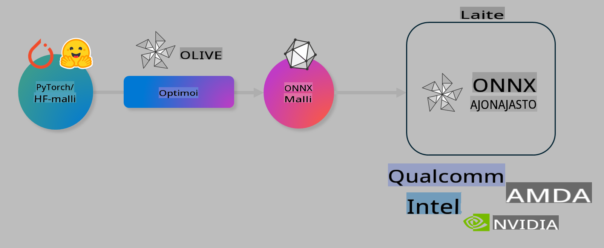

# Lab. Optimoi tekoälymalleja laitelähtöistä inferenssiä varten

## Johdanto 

> [!IMPORTANT]
> Tämä labra vaatii **Nvidia A10- tai A100-GPU:n**, johon on asennettu tarvittavat ajurit ja CUDA-työkalupakki (versio 12 tai uudempi).

> [!NOTE]
> Tämä on **35 minuutin** labra, jossa saat käytännön perehdytyksen mallien optimoinnin perusperiaatteisiin OLIVE-työkalun avulla.

## Oppimistavoitteet

Labran lopussa osaat käyttää OLIVE-työkalua seuraaviin tehtäviin:

- Kvantisoi tekoälymalli AWQ-kvantisointimenetelmällä.
- Hienosäädä tekoälymalli tiettyä tehtävää varten.
- Luo LoRA-adaptereita (hienosäädetty malli) tehokasta laitelähtöistä inferenssiä varten ONNX Runtime -ympäristössä.

### Mikä on Olive

Olive (*O*NNX *live*) on mallien optimointityökalu, jossa on mukana CLI-työkalu. Sen avulla voit valmistella malleja ONNX Runtime -ympäristölle +++https://onnxruntime.ai+++ huomioiden sekä laadun että suorituskyvyn.



Oliven syöte on yleensä PyTorch- tai Hugging Face -malli, ja tulosteena on optimoitu ONNX-malli, joka suoritetaan laitteella (deployment target), jossa pyörii ONNX Runtime. Olive optimoi mallin kohdelaitteen AI-kiihdyttimelle (NPU, GPU, CPU), jonka tarjoaa laitevalmistaja, kuten Qualcomm, AMD, Nvidia tai Intel.

Olive suorittaa *työnkulun*, joka koostuu yksittäisistä mallin optimointitehtävistä, joita kutsutaan *pass*-nimellä. Esimerkkejä passeista ovat: mallin pakkaus, graafin kaappaus, kvantisointi ja graafin optimointi. Jokaisella passilla on joukko parametreja, joita voidaan säätää parhaiden metrikkojen, kuten tarkkuuden ja viiveen, saavuttamiseksi. Olive hyödyntää hakualgoritmia automaattisesti säätääkseen passeja yksittäin tai ryhmissä.

#### Oliven edut

- **Vähennä turhautumista ja aikaa**, joka kuluu manuaaliseen kokeiluun eri optimointitekniikoilla, kuten graafin optimoinnilla, pakkauksella ja kvantisoinnilla. Määrittele laatu- ja suorituskykyvaatimuksesi, ja Olive löytää automaattisesti parhaan mallin puolestasi.
- **Yli 40 sisäänrakennettua mallin optimointikomponenttia**, jotka kattavat uusimmat tekniikat kvantisoinnissa, pakkauksessa, graafin optimoinnissa ja hienosäädössä.
- **Helppokäyttöinen CLI** yleisiin mallin optimointitehtäviin, kuten olive quantize, olive auto-opt, olive finetune.
- Mallin pakkaus ja käyttöönotto sisäänrakennettuna.
- Tukee mallien luomista **Multi LoRA -palveluille**.
- Työnkulkujen rakentaminen YAML/JSON-tiedostoilla optimointi- ja käyttöönotto-tehtävien orkestrointiin.
- **Hugging Face**- ja **Azure AI** -integraatio.
- Sisäänrakennettu **välimuisti**, joka **säästää kustannuksia**.

## Labran ohjeet
> [!NOTE]
> Varmista, että olet määrittänyt Azure AI Hubisi ja projektisi sekä A100-laskentaympäristön Labra 1:n mukaisesti.

### Vaihe 0: Yhdistä Azure AI -laskentaympäristöön

Yhdistä Azure AI -laskentaympäristöön käyttäen **VS Code** -ohjelmiston etäyhteysominaisuutta.

1. Avaa **VS Code** -työpöytäsovellus.
1. Avaa **komentopaletti** painamalla **Shift+Ctrl+P**.
1. Etsi komentopaletista **AzureML - remote: Connect to compute instance in New Window**.
1. Seuraa näytön ohjeita yhdistääksesi laskentaympäristöön. Tämä sisältää Azure-tilauksen, resurssiryhmän, projektin ja laskentaympäristön valinnan, jotka määritit Labra 1:ssä.
1. Kun olet yhdistänyt Azure ML -laskentaympäristöön, tämä näkyy **VS Coden vasemmassa alakulmassa** `><Azure ML: Compute Name`.

### Vaihe 1: Kloonaa tämä repo

Avaa uusi pääte VS Codessa painamalla **Ctrl+J** ja kloonaa tämä repo:

Päätteessä pitäisi näkyä kehotus

```
azureuser@computername:~/cloudfiles/code$ 
```
Kloonaa ratkaisu:

```bash
cd ~/localfiles
git clone https://github.com/microsoft/phi-3cookbook.git
```

### Vaihe 2: Avaa kansio VS Codessa

Avaa VS Code oikeassa kansiossa suorittamalla seuraava komento päätelaitteessa. Tämä avaa uuden ikkunan:

```bash
code phi-3cookbook/code/04.Finetuning/Olive-lab
```

Vaihtoehtoisesti voit avata kansion valitsemalla **File** > **Open Folder**.

### Vaihe 3: Riippuvuudet

Avaa päätelaitteen ikkuna VS Codessa Azure AI -laskentaympäristössä (vinkki: **Ctrl+J**) ja suorita seuraavat komennot asentaaksesi riippuvuudet:

```bash
conda create -n olive-ai python=3.11 -y
conda activate olive-ai
pip install -r requirements.txt
az extension remove -n azure-cli-ml
az extension add -n ml
```

> [!NOTE]
> Kaikkien riippuvuuksien asentaminen kestää noin 5 minuuttia.

Tässä labrassa lataat ja lähetät malleja Azure AI Model Catalogiin. Jotta voit käyttää mallikatalogia, sinun on kirjauduttava Azureen seuraavalla komennolla:

```bash
az login
```

> [!NOTE]
> Kirjautumisen yhteydessä sinua pyydetään valitsemaan tilaus. Varmista, että valitset labralle annetun tilauksen.

### Vaihe 4: Suorita Olive-komennot 

Avaa päätelaitteen ikkuna VS Codessa Azure AI -laskentaympäristössä (vinkki: **Ctrl+J**) ja varmista, että `olive-ai` conda-ympäristö on aktivoitu:

```bash
conda activate olive-ai
```

Seuraavaksi suorita seuraavat Olive-komennot komentorivillä.

1. **Tutki dataa:** Tässä esimerkissä hienosäädät Phi-3.5-Mini-mallin, jotta se erikoistuu matkailuun liittyviin kysymyksiin vastaamiseen. Alla oleva koodi näyttää datasetin ensimmäiset rivit, jotka ovat JSON-linjamuodossa:

    ```bash
    head data/data_sample_travel.jsonl
    ```
1. **Kvantisoi malli:** Ennen mallin koulutusta kvantisoi se seuraavalla komennolla, joka käyttää Active Aware Quantization (AWQ) -tekniikkaa +++https://arxiv.org/abs/2306.00978+++. AWQ kvantisoi mallin painot huomioiden inferenssin aikana tuotetut aktivoinnit. Tämä tarkoittaa, että kvantisointiprosessi ottaa huomioon aktivointien todellisen tietojakauman, mikä säilyttää mallin tarkkuuden paremmin kuin perinteiset kvantisointimenetelmät.

    ```bash
    olive quantize \
       --model_name_or_path microsoft/Phi-3.5-mini-instruct \
       --trust_remote_code \
       --algorithm awq \
       --output_path models/phi/awq \
       --log_level 1
    ```
    
    Kvantisointi kestää noin **8 minuuttia**, ja se **vähentää mallin kokoa ~7,5GB:stä ~2,5GB:iin**.
   
    Tässä labrassa näytämme, kuinka syötät malleja Hugging Facesta (esimerkiksi: `microsoft/Phi-3.5-mini-instruct`). However, Olive also allows you to input models from the Azure AI catalog by updating the `model_name_or_path` argument to an Azure AI asset ID (for example:  `azureml://registries/azureml/models/Phi-3.5-mini-instruct/versions/4`). 

1. **Train the model:** Next, the `olive finetune` -komento hienosäätää kvantisoidun mallin. Mallin kvantisointi *ennen* hienosäätöä parantaa tarkkuutta, koska hienosäätöprosessi palauttaa osan kvantisoinnista johtuvasta tarkkuuden heikkenemisestä.

    ```bash
    olive finetune \
        --method lora \
        --model_name_or_path models/phi/awq \
        --data_files "data/data_sample_travel.jsonl" \
        --data_name "json" \
        --text_template "<|user|>\n{prompt}<|end|>\n<|assistant|>\n{response}<|end|>" \
        --max_steps 100 \
        --output_path ./models/phi/ft \
        --log_level 1
    ```
    
    Hienosäätö (100 askelta) kestää noin **6 minuuttia**.

1. **Optimoi:** Kun malli on koulutettu, optimoi se Oliven `auto-opt` command, which will capture the ONNX graph and automatically perform a number of optimizations to improve the model performance for CPU by compressing the model and doing fusions. It should be noted, that you can also optimize for other devices such as NPU or GPU by just updating the `--device` and `--provider` -argumenteilla - mutta tässä labrassa käytämme CPU:ta.

    ```bash
    olive auto-opt \
       --model_name_or_path models/phi/ft/model \
       --adapter_path models/phi/ft/adapter \
       --device cpu \
       --provider CPUExecutionProvider \
       --use_ort_genai \
       --output_path models/phi/onnx-ao \
       --log_level 1
    ```
    
    Optimointi kestää noin **5 minuuttia**.

### Vaihe 5: Mallin inferenssin pikatesti

Testataksesi mallin inferenssiä, luo Python-tiedosto kansioosi nimeltä **app.py** ja kopioi-liitä seuraava koodi:

```python
import onnxruntime_genai as og
import numpy as np

print("loading model and adapters...", end="", flush=True)
model = og.Model("models/phi/onnx-ao/model")
adapters = og.Adapters(model)
adapters.load("models/phi/onnx-ao/model/adapter_weights.onnx_adapter", "travel")
print("DONE!")

tokenizer = og.Tokenizer(model)
tokenizer_stream = tokenizer.create_stream()

params = og.GeneratorParams(model)
params.set_search_options(max_length=100, past_present_share_buffer=False)
user_input = "what is the best thing to see in chicago"
params.input_ids = tokenizer.encode(f"<|user|>\n{user_input}<|end|>\n<|assistant|>\n")

generator = og.Generator(model, params)

generator.set_active_adapter(adapters, "travel")

print(f"{user_input}")

while not generator.is_done():
    generator.compute_logits()
    generator.generate_next_token()

    new_token = generator.get_next_tokens()[0]
    print(tokenizer_stream.decode(new_token), end='', flush=True)

print("\n")
```

Suorita koodi komennolla:

```bash
python app.py
```

### Vaihe 6: Lataa malli Azure AI:hin

Lähettämällä mallin Azure AI -mallirekisteriin voit jakaa mallin kehitystiimisi muiden jäsenten kanssa ja hallita mallin versioita. Lähetä malli suorittamalla seuraava komento:

> [!NOTE]
> Päivitä `{}` placeholders with the name of your resource group and Azure AI Project Name. 

To find your resource group `"resourceGroup"` ja Azure AI -projektin nimi seuraavalla komennolla:

```
az ml workspace show
```

Tai siirtymällä +++ai.azure.com+++ ja valitsemalla **management center** **project** **overview**.

Päivitä `{}` -kohdat resurssiryhmän ja Azure AI -projektin nimillä.

```bash
az ml model create \
    --name ft-for-travel \
    --version 1 \
    --path ./models/phi/onnx-ao \
    --resource-group {RESOURCE_GROUP_NAME} \
    --workspace-name {PROJECT_NAME}
```
Näet ladatun mallisi ja voit ottaa sen käyttöön osoitteessa https://ml.azure.com/model/list

**Vastuuvapauslauseke**:  
Tämä asiakirja on käännetty konepohjaisia tekoälyyn perustuvia käännöspalveluita käyttäen. Vaikka pyrimme tarkkuuteen, huomioithan, että automaattiset käännökset voivat sisältää virheitä tai epätarkkuuksia. Alkuperäistä asiakirjaa sen alkuperäisellä kielellä tulee pitää ensisijaisena lähteenä. Kriittisen tiedon osalta suositellaan ammattimaisen ihmiskääntäjän käyttöä. Emme ole vastuussa väärinkäsityksistä tai tulkintavirheistä, jotka johtuvat tämän käännöksen käytöstä.