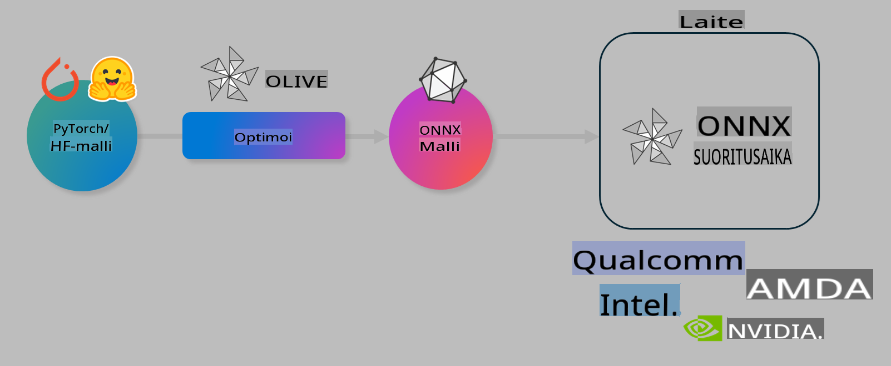

# Lab. Optimoi tekoälymalleja laitelähtöistä inferenssiä varten

## Johdanto

> [!IMPORTANT]
> Tämä labra vaatii **Nvidia A10- tai A100-GPU:n**, jossa on siihen liittyvät ajurit ja CUDA-työkalupakki (versio 12+).

> [!NOTE]
> Tämä on **35 minuutin** labra, jossa saat käytännön johdatuksen mallien optimointiin laitelähtöistä inferenssiä varten käyttäen OLIVE-työkalua.

## Oppimistavoitteet

Tämän labran lopussa osaat käyttää OLIVE-työkalua seuraaviin tehtäviin:

- Kvantisoida tekoälymalli AWQ-kvantisointimenetelmällä.
- Hienosäätää tekoälymalli tiettyä tehtävää varten.
- Luoda LoRA-sovittimia (hienosäädetty malli) tehokasta laitelähtöistä inferenssiä varten ONNX Runtime -ympäristössä.

### Mikä on Olive

Olive (*O*NNX *live*) on mallien optimointityökalu ja siihen liittyvä CLI, joka mahdollistaa mallien käyttöönoton ONNX Runtime -ympäristössä +++https://onnxruntime.ai+++ laadukkaasti ja suorituskykyisesti.



Oliven syöte on yleensä PyTorch- tai Hugging Face -malli, ja sen tuotos on optimoitu ONNX-malli, jota suoritetaan laitteessa (kohdeympäristössä), jossa on ONNX Runtime. Olive optimoi mallin kohdeympäristön AI-kiihdyttimelle (NPU, GPU, CPU), jonka tarjoaa laitevalmistaja, kuten Qualcomm, AMD, Nvidia tai Intel.

Olive suorittaa *työnkulun*, joka on järjestetty sarja yksittäisiä mallin optimointitehtäviä, joita kutsutaan *passageiksi* – esimerkkejä ovat mallin pakkaus, graafin kaappaus, kvantisointi ja graafin optimointi. Jokaisella passagella on joukko parametreja, joita voidaan hienosäätää parhaan mahdollisen tarkkuuden ja viiveen saavuttamiseksi, ja nämä arvioidaan vastaavalla arviointimenetelmällä. Olive käyttää hakualgoritmia automaattiseen hienosäätöön joko yksi passage kerrallaan tai useita yhdessä.

#### Oliven edut

- **Vähennä turhautumista ja aikaa**, joka kuluu manuaaliseen kokeiluun ja erehdykseen graafin optimoinnissa, pakkauksessa ja kvantisoinnissa. Määritä laatutavoitteesi ja suorituskykyvaatimuksesi, ja Olive löytää automaattisesti parhaan mallin puolestasi.
- **Yli 40 sisäänrakennettua optimointikomponenttia**, jotka kattavat huipputekniikat kvantisoinnissa, pakkauksessa, graafin optimoinnissa ja hienosäädössä.
- **Helppokäyttöinen CLI** yleisiin mallin optimointitehtäviin. Esimerkiksi: olive quantize, olive auto-opt, olive finetune.
- Mallien pakkaus ja käyttöönotto sisäänrakennettuna.
- Tukee mallien luontia **Multi LoRA -palveluille**.
- Työnkulkujen rakentaminen YAML/JSON-muodossa optimointi- ja käyttöönottoaskelten orkestrointia varten.
- **Hugging Face**- ja **Azure AI** -integraatio.
- Sisäänrakennettu **välimuistimekanismi**, joka **säästää kustannuksia**.

## Labran ohjeet
> [!NOTE]
> Varmista, että olet määrittänyt Azure AI Hubin ja projektin sekä asettanut A100-laskentaympäristön Labra 1:n mukaisesti.

### Vaihe 0: Yhdistä Azure AI -laskentaympäristöön

Yhdistä Azure AI -laskentaympäristöön käyttäen **VS Code** -sovelluksen etäyhteysominaisuutta.

1. Avaa **VS Code** -työpöytäsovellus:
1. Avaa **komentopaletti** painamalla **Shift+Ctrl+P**.
1. Etsi komentopaletista **AzureML - remote: Connect to compute instance in New Window**.
1. Seuraa näytön ohjeita yhdistääksesi laskentaympäristöön. Tämä sisältää Azure-tilauksen, resurssiryhmän, projektin ja Labra 1:ssä määritetyn laskentaympäristön valitsemisen.
1. Kun olet yhdistetty Azure ML -laskentaympäristöön, tämä näkyy **VS Coden vasemmassa alakulmassa** `><Azure ML: Compute Name`.

### Vaihe 1: Kloonaa tämä repo

VS Codessa voit avata uuden päätteen painamalla **Ctrl+J** ja kloonata tämän repositorion:

Päätteessä pitäisi näkyä kehote

```
azureuser@computername:~/cloudfiles/code$ 
```
Kloonaa ratkaisu 

```bash
cd ~/localfiles
git clone https://github.com/microsoft/phi-3cookbook.git
```

### Vaihe 2: Avaa kansio VS Codessa

Avaa VS Code oikeassa kansiossa suorittamalla seuraava komento päätteen kautta. Tämä avaa uuden ikkunan:

```bash
code phi-3cookbook/code/04.Finetuning/Olive-lab
```

Vaihtoehtoisesti voit avata kansion valitsemalla **File** > **Open Folder**.

### Vaihe 3: Riippuvuudet

Avaa päätteen ikkuna VS Codessa Azure AI -laskentaympäristössä (vinkki: **Ctrl+J**) ja suorita seuraavat komennot asentaaksesi riippuvuudet:

```bash
conda create -n olive-ai python=3.11 -y
conda activate olive-ai
pip install -r requirements.txt
az extension remove -n azure-cli-ml
az extension add -n ml
```

> [!NOTE]
> Kaikkien riippuvuuksien asentaminen kestää noin **5 minuuttia**.

Tässä labrassa ladataan ja ladataan malleja Azure AI -mallikatalogiin. Jotta pääset käsiksi mallikatalogiin, sinun täytyy kirjautua Azureen seuraavalla komennolla:

```bash
az login
```

> [!NOTE]
> Kirjautumisen aikana sinua pyydetään valitsemaan tilauksesi. Varmista, että valitset tämän labran käyttöön annetun tilauksen.

### Vaihe 4: Suorita Olive-komennot

Avaa päätteen ikkuna VS Codessa Azure AI -laskentaympäristössä (vinkki: **Ctrl+J**) ja varmista, että `olive-ai`-conda-ympäristö on aktivoitu:

```bash
conda activate olive-ai
```

Seuraavaksi suorita seuraavat Olive-komennot komentorivillä.

1. **Tutki dataa:** Tässä esimerkissä hienosäädetään Phi-3.5-Mini-malli, jotta se erikoistuu vastaamaan matkailuun liittyviin kysymyksiin. Alla oleva koodi näyttää datasetin ensimmäiset rivit, jotka ovat JSON-linjamuodossa:
   
    ```bash
    head data/data_sample_travel.jsonl
    ```
1. **Kvantisoi malli:** Ennen mallin hienosäätöä se kvantisoidaan seuraavalla komennolla, joka käyttää tekniikkaa nimeltä Active Aware Quantization (AWQ) +++https://arxiv.org/abs/2306.00978+++. AWQ kvantisoi mallin painot ottamalla huomioon inferenssin aikana syntyvät aktivoinnit. Tämä tarkoittaa, että kvantisointiprosessi ottaa huomioon aktivointien todellisen datan jakautuman, mikä säilyttää mallin tarkkuuden paremmin verrattuna perinteisiin painojen kvantisointimenetelmiin.
    
    ```bash
    olive quantize \
       --model_name_or_path microsoft/Phi-3.5-mini-instruct \
       --trust_remote_code \
       --algorithm awq \
       --output_path models/phi/awq \
       --log_level 1
    ```
    
    Kvantisointi kestää **noin 8 minuuttia**, ja se **pienentää mallin kokoa noin 7,5 GB:stä noin 2,5 GB:hen**.
   
   Tässä labrassa näytetään, miten malleja voidaan tuoda Hugging Facesta (esimerkiksi: `microsoft/Phi-3.5-mini-instruct`). However, Olive also allows you to input models from the Azure AI catalog by updating the `model_name_or_path` argument to an Azure AI asset ID (for example:  `azureml://registries/azureml/models/Phi-3.5-mini-instruct/versions/4`). 

1. **Train the model:** Next, the `olive finetune` -komento hienosäätää kvantisoidun mallin. Kvantisointi ennen hienosäätöä parantaa tarkkuutta, koska hienosäätöprosessi palauttaa osan kvantisoinnista johtuvasta tarkkuuden menetyksestä.
    
    ```bash
    olive finetune \
        --method lora \
        --model_name_or_path models/phi/awq \
        --data_files "data/data_sample_travel.jsonl" \
        --data_name "json" \
        --text_template "<|user|>\n{prompt}<|end|>\n<|assistant|>\n{response}<|end|>" \
        --max_steps 100 \
        --output_path ./models/phi/ft \
        --log_level 1
    ```
    
    Hienosäätö kestää **noin 6 minuuttia** (100 askelta).

1. **Optimoi:** Kun malli on koulutettu, se optimoidaan Oliven `auto-opt` command, which will capture the ONNX graph and automatically perform a number of optimizations to improve the model performance for CPU by compressing the model and doing fusions. It should be noted, that you can also optimize for other devices such as NPU or GPU by just updating the `--device` and `--provider` -argumenttien avulla - mutta tässä labrassa käytetään CPU:ta.

    ```bash
    olive auto-opt \
       --model_name_or_path models/phi/ft/model \
       --adapter_path models/phi/ft/adapter \
       --device cpu \
       --provider CPUExecutionProvider \
       --use_ort_genai \
       --output_path models/phi/onnx-ao \
       --log_level 1
    ```
    
    Optimointi kestää **noin 5 minuuttia**.

### Vaihe 5: Mallin inferenssin nopea testi

Testataksesi mallin inferenssiä, luo kansioon Python-tiedosto nimeltä **app.py** ja kopioi-liitä seuraava koodi:

```python
import onnxruntime_genai as og
import numpy as np

print("loading model and adapters...", end="", flush=True)
model = og.Model("models/phi/onnx-ao/model")
adapters = og.Adapters(model)
adapters.load("models/phi/onnx-ao/model/adapter_weights.onnx_adapter", "travel")
print("DONE!")

tokenizer = og.Tokenizer(model)
tokenizer_stream = tokenizer.create_stream()

params = og.GeneratorParams(model)
params.set_search_options(max_length=100, past_present_share_buffer=False)
user_input = "what is the best thing to see in chicago"
params.input_ids = tokenizer.encode(f"<|user|>\n{user_input}<|end|>\n<|assistant|>\n")

generator = og.Generator(model, params)

generator.set_active_adapter(adapters, "travel")

print(f"{user_input}")

while not generator.is_done():
    generator.compute_logits()
    generator.generate_next_token()

    new_token = generator.get_next_tokens()[0]
    print(tokenizer_stream.decode(new_token), end='', flush=True)

print("\n")
```

Suorita koodi komennolla:

```bash
python app.py
```

### Vaihe 6: Lataa malli Azure AI:hin

Mallin lataaminen Azure AI -mallirepositorioon mahdollistaa sen jakamisen kehitystiimisi muiden jäsenten kanssa ja käsittelee myös mallin versionhallinnan. Lataa malli suorittamalla seuraava komento:

> [!NOTE]
> Päivitä `{}` placeholders with the name of your resource group and Azure AI Project Name. 

To find your resource group `"resourceGroup" ja Azure AI -projektin nimi, ja suorita seuraava komento:

```
az ml workspace show
```

Tai siirry +++ai.azure.com+++ ja valitse **management center** **project** **overview**.

Päivitä `{}` paikkamerkit resurssiryhmäsi ja Azure AI -projektisi nimillä.

```bash
az ml model create \
    --name ft-for-travel \
    --version 1 \
    --path ./models/phi/onnx-ao \
    --resource-group {RESOURCE_GROUP_NAME} \
    --workspace-name {PROJECT_NAME}
```
Tämän jälkeen voit nähdä ladatun mallisi ja ottaa sen käyttöön osoitteessa https://ml.azure.com/model/list

**Vastuuvapauslauseke**:  
Tämä asiakirja on käännetty konepohjaisten tekoälykäännöspalveluiden avulla. Vaikka pyrimme tarkkuuteen, huomioithan, että automaattiset käännökset voivat sisältää virheitä tai epätarkkuuksia. Alkuperäistä asiakirjaa sen alkuperäisellä kielellä tulee pitää auktoritatiivisena lähteenä. Kriittisen tiedon osalta suositellaan ammattimaista ihmiskääntäjää. Emme ole vastuussa tämän käännöksen käytöstä johtuvista väärinkäsityksistä tai virheellisistä tulkinnoista.