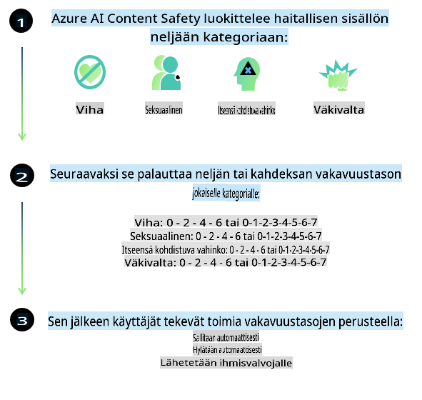
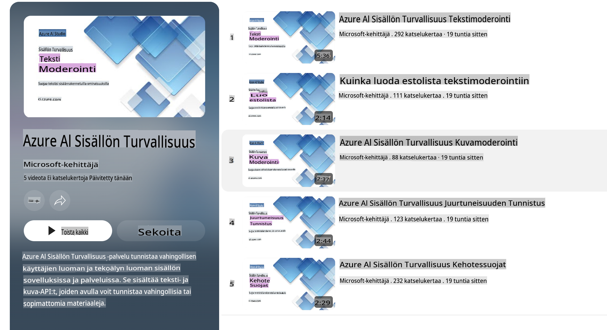

# AI-turvallisuus Phi-malleille
Phi-mallien perhe on kehitetty [Microsoftin vastuullisen tekoälyn standardin](https://query.prod.cms.rt.microsoft.com/cms/api/am/binary/RE5cmFl) mukaisesti. Tämä on yrityksen laajuinen vaatimuskokonaisuus, joka perustuu kuuteen periaatteeseen: vastuuvelvollisuus, läpinäkyvyys, oikeudenmukaisuus, luotettavuus ja turvallisuus, yksityisyys ja tietoturva sekä osallisuus. Nämä muodostavat [Microsoftin vastuullisen tekoälyn periaatteet](https://www.microsoft.com/ai/responsible-ai).

Kuten aiemmat Phi-mallit, myös tämä julkaisu hyödyntää monipuolista turvallisuusarviointia ja turvallisuuden jälkikoulutusmenetelmiä. Lisäksi on otettu käyttöön lisätoimenpiteitä mallin monikielisten ominaisuuksien huomioimiseksi. Lähestymistapamme turvallisuuskoulutukseen ja -arviointeihin, mukaan lukien testaukset useilla kielillä ja riskiluokilla, on kuvattu [Phi Safety Post-Training Paper](https://arxiv.org/abs/2407.13833) -julkaisussa. Vaikka Phi-mallit hyötyvät tästä lähestymistavasta, kehittäjien tulisi soveltaa vastuullisen tekoälyn parhaita käytäntöjä, mukaan lukien riskien kartoittaminen, mittaaminen ja lieventäminen ottaen huomioon heidän erityinen käyttötapauksensa sekä kulttuurinen ja kielellinen konteksti.

## Parhaat käytännöt

Kuten muutkin mallit, Phi-malliperhe voi käyttäytyä tavoilla, jotka ovat epäoikeudenmukaisia, epäluotettavia tai loukkaavia.

Joihinkin SLM- ja LLM-mallien rajoittaviin käyttäytymismalleihin, joista tulisi olla tietoinen, kuuluu:

- **Palvelun laatu:** Phi-mallit on ensisijaisesti koulutettu englanninkielisellä tekstillä. Muut kielet kuin englanti saattavat toimia heikommin. Englannin kielen variantit, joita on vähemmän edustettuina koulutusdatassa, voivat toimia huonommin kuin standardi amerikkalainen englanti.
- **Haitallinen edustus ja stereotypioiden vahvistaminen:** Nämä mallit voivat joko yli- tai aliedustaa tiettyjä ihmisryhmiä, jättää jotkut ryhmät kokonaan huomiotta tai vahvistaa alentavia tai negatiivisia stereotypioita. Vaikka turvallisuuden jälkikoulutusta on tehty, nämä rajoitteet voivat silti olla läsnä johtuen eri ryhmien edustuksen tasoeroista tai negatiivisten stereotypioiden yleisyydestä koulutusdatassa, joka heijastaa todellisia yhteiskunnallisia vinoumia.
- **Sopimaton tai loukkaava sisältö:** Mallit voivat tuottaa myös muunlaista sopimatonta tai loukkaavaa sisältöä, mikä saattaa tehdä niistä sopimattomia herkkien kontekstien käyttöön ilman lisätoimenpiteitä, jotka on räätälöity käyttötapaukseen.
- **Tietojen luotettavuus:** Kielelliset mallit voivat tuottaa järjettömiä tai keksittyjä sisältöjä, jotka voivat kuulostaa uskottavilta mutta ovat epätarkkoja tai vanhentuneita.
- **Rajoitettu koodin kattavuus:** Suurin osa Phi-3:n koulutusdatasta perustuu Python-kieleen ja yleisiin kirjastoihin, kuten "typing, math, random, collections, datetime, itertools". Jos malli tuottaa Python-skriptejä, jotka käyttävät muita kirjastoja tai skriptejä muilla kielillä, suosittelemme vahvasti, että käyttäjät tarkistavat manuaalisesti kaikki API-kutsut.

Kehittäjien tulisi soveltaa vastuullisen tekoälyn parhaita käytäntöjä ja varmistaa, että tietty käyttötapaus noudattaa asiaankuuluvia lakeja ja säädöksiä (esim. yksityisyys, kauppa jne.).

## Vastuullisen tekoälyn näkökohdat

Kuten muutkin kielimallit, Phi-sarjan mallit voivat käyttäytyä tavoilla, jotka ovat epäoikeudenmukaisia, epäluotettavia tai loukkaavia. Joihinkin rajoittaviin käyttäytymismalleihin, joista tulisi olla tietoinen, kuuluu:

**Palvelun laatu:** Phi-mallit on ensisijaisesti koulutettu englanninkielisellä tekstillä. Muut kielet kuin englanti saattavat toimia heikommin. Englannin kielen variantit, joita on vähemmän edustettuina koulutusdatassa, voivat toimia huonommin kuin standardi amerikkalainen englanti.

**Haitallinen edustus ja stereotypioiden vahvistaminen:** Nämä mallit voivat joko yli- tai aliedustaa tiettyjä ihmisryhmiä, jättää jotkut ryhmät kokonaan huomiotta tai vahvistaa alentavia tai negatiivisia stereotypioita. Vaikka turvallisuuden jälkikoulutusta on tehty, nämä rajoitteet voivat silti olla läsnä johtuen eri ryhmien edustuksen tasoeroista tai negatiivisten stereotypioiden yleisyydestä koulutusdatassa, joka heijastaa todellisia yhteiskunnallisia vinoumia.

**Sopimaton tai loukkaava sisältö:** Mallit voivat tuottaa myös muunlaista sopimatonta tai loukkaavaa sisältöä, mikä saattaa tehdä niistä sopimattomia herkkien kontekstien käyttöön ilman lisätoimenpiteitä, jotka on räätälöity käyttötapaukseen.

**Tietojen luotettavuus:** Kielelliset mallit voivat tuottaa järjettömiä tai keksittyjä sisältöjä, jotka voivat kuulostaa uskottavilta mutta ovat epätarkkoja tai vanhentuneita.

**Rajoitettu koodin kattavuus:** Suurin osa Phi-3:n koulutusdatasta perustuu Python-kieleen ja yleisiin kirjastoihin, kuten "typing, math, random, collections, datetime, itertools". Jos malli tuottaa Python-skriptejä, jotka käyttävät muita kirjastoja tai skriptejä muilla kielillä, suosittelemme vahvasti, että käyttäjät tarkistavat manuaalisesti kaikki API-kutsut.

Kehittäjien tulisi soveltaa vastuullisen tekoälyn parhaita käytäntöjä ja varmistaa, että tietty käyttötapaus noudattaa asiaankuuluvia lakeja ja säädöksiä (esim. yksityisyys, kauppa jne.). Tärkeitä huomioon otettavia alueita ovat:

**Allokointi:** Mallit eivät välttämättä sovellu tilanteisiin, joissa päätöksillä on merkittävä vaikutus oikeudelliseen asemaan tai resurssien tai elämänmahdollisuuksien jakautumiseen (esim. asuminen, työllisyys, luotto jne.) ilman lisäarviointeja ja -toimenpiteitä vinoumien vähentämiseksi.

**Korkean riskin tilanteet:** Kehittäjien tulisi arvioida mallien soveltuvuutta korkean riskin tilanteissa, joissa epäoikeudenmukaiset, epäluotettavat tai loukkaavat tulokset voivat olla erittäin haitallisia tai aiheuttaa vahinkoa. Tämä koskee erityisesti neuvonantoa herkissä tai asiantuntijaa vaativissa tilanteissa, joissa tarkkuus ja luotettavuus ovat kriittisiä (esim. juridinen tai terveydellinen neuvonta). Lisäsuojatoimenpiteitä tulisi toteuttaa sovellustasolla käyttöympäristön mukaan.

**Virheellinen tieto:** Mallit voivat tuottaa epätarkkaa tietoa. Kehittäjien tulisi noudattaa läpinäkyvyyden parhaita käytäntöjä ja informoida loppukäyttäjiä siitä, että he ovat vuorovaikutuksessa tekoälyjärjestelmän kanssa. Sovellustasolla kehittäjät voivat rakentaa palautemekanismeja ja prosesseja, jotka pohjaavat vastaukset käyttötapauskohtaiseen, kontekstiin liittyvään tietoon. Tätä tekniikkaa kutsutaan nimellä Retrieval Augmented Generation (RAG).

**Haitallisen sisällön tuottaminen:** Kehittäjien tulisi arvioida tuotoksia kontekstin mukaan ja käyttää saatavilla olevia turvallisuusluokittimia tai räätälöityjä ratkaisuja, jotka sopivat heidän käyttötapaukseensa.

**Väärinkäyttö:** Muita väärinkäytön muotoja, kuten petokset, roskaposti tai haittaohjelmien tuotanto, voi olla mahdollista, ja kehittäjien tulisi varmistaa, että heidän sovelluksensa eivät riko soveltuvia lakeja ja säädöksiä.

### Mallien hienosäätö ja tekoälyn sisältöturvallisuus

Kun malli on hienosäädetty, suosittelemme vahvasti hyödyntämään [Azure AI Content Safety](https://learn.microsoft.com/azure/ai-services/content-safety/overview) -toimenpiteitä mallien tuottaman sisällön valvomiseksi, mahdollisten riskien, uhkien ja laatuongelmien tunnistamiseksi ja estämiseksi.

[Azure AI Content Safety](https://learn.microsoft.com/azure/ai-services/content-safety/overview) tukee sekä teksti- että kuvasisältöä. Se voidaan ottaa käyttöön pilvessä, eristetyissä säilöissä ja reunalaitteissa tai upotetuissa järjestelmissä.

## Azure AI Content Safety -ratkaisun yleiskatsaus

Azure AI Content Safety ei ole yhden koon ratkaisu kaikille; sitä voidaan mukauttaa yritysten omien politiikkojen mukaiseksi. Lisäksi sen monikieliset mallit mahdollistavat useiden kielten ymmärtämisen samanaikaisesti.

- **Azure AI Content Safety**
- **Microsoft Developer**
- **5 videota**

Azure AI Content Safety -palvelu havaitsee haitallista käyttäjien luomaa ja tekoälyn tuottamaa sisältöä sovelluksissa ja palveluissa. Se sisältää teksti- ja kuva-API-rajapinnat, joiden avulla voidaan havaita haitallista tai sopimatonta materiaalia.

[AI Content Safety -soittolista](https://www.youtube.com/playlist?list=PLlrxD0HtieHjaQ9bJjyp1T7FeCbmVcPkQ)

**Vastuuvapauslauseke**:  
Tämä asiakirja on käännetty konepohjaisten tekoälyyn perustuvien käännöspalvelujen avulla. Vaikka pyrimme tarkkuuteen, huomioithan, että automaattiset käännökset voivat sisältää virheitä tai epätarkkuuksia. Alkuperäistä asiakirjaa sen alkuperäisellä kielellä tulee pitää ensisijaisena lähteenä. Kriittistä tietoa varten suositellaan ammattimaista ihmisen tekemää käännöstä. Emme ole vastuussa tämän käännöksen käytöstä aiheutuvista väärinkäsityksistä tai virhetulkinnoista.