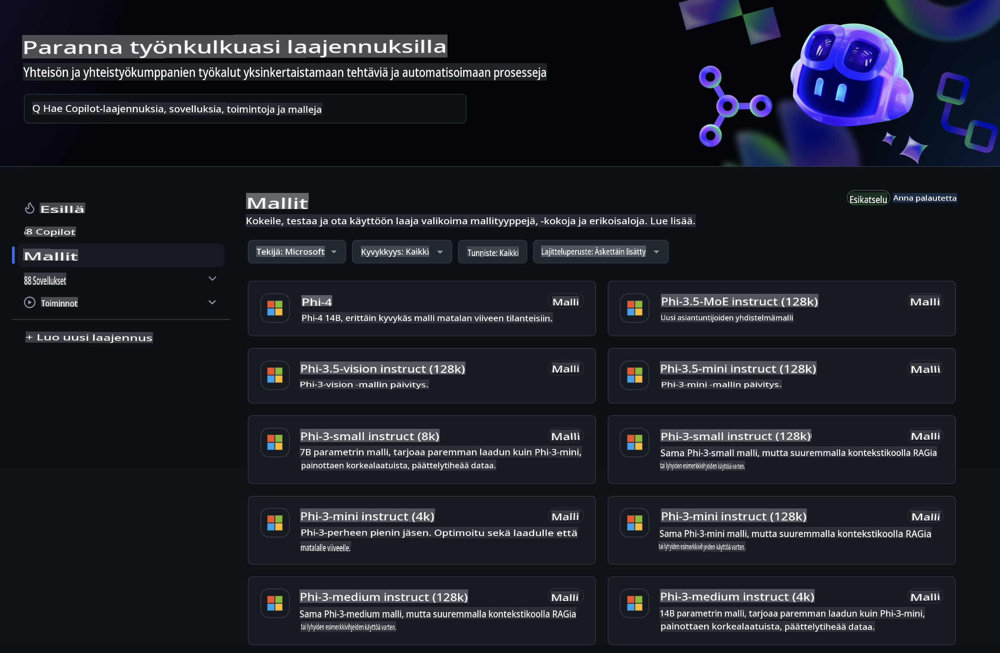
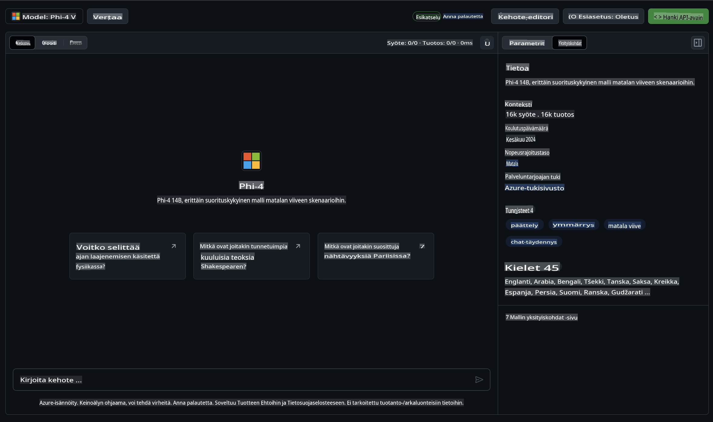
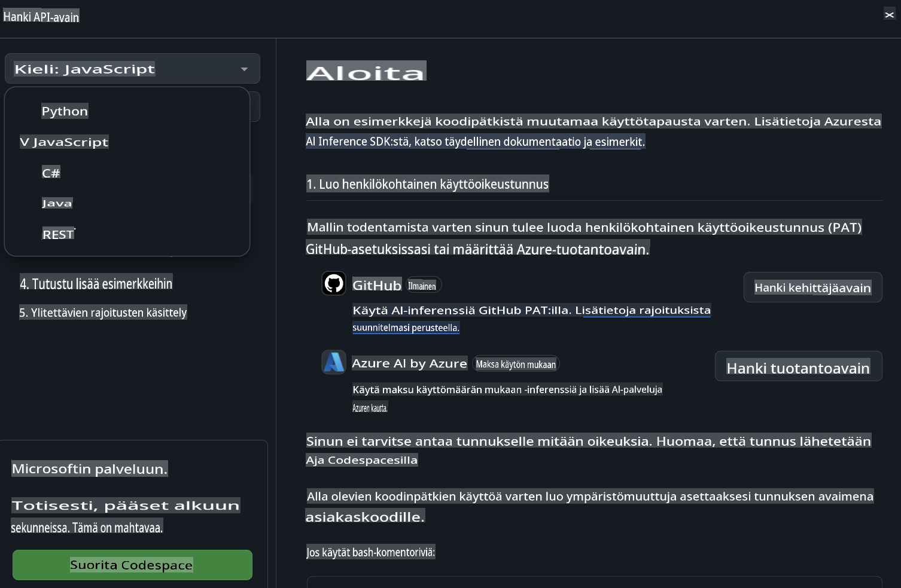
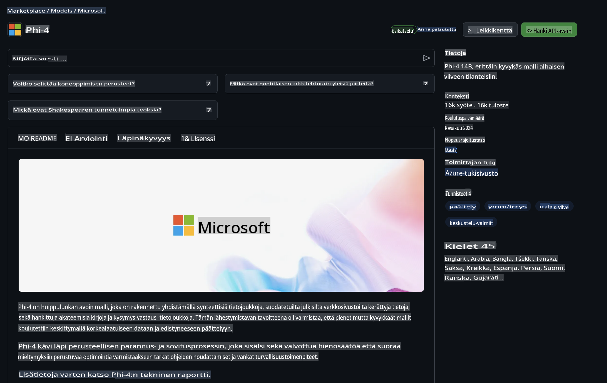

## Phi-perhe GitHub-malleissa

Tervetuloa [GitHub Models](https://github.com/marketplace/models) -sivustolle! Olemme valmiina auttamaan sinua tutustumaan Azure AI:lla isännöityihin tekoälymalleihin.



Lisätietoja GitHub Models -sivuston malleista löydät [GitHub Model Marketplace](https://github.com/marketplace/models) -sivulta.

## Saatavilla olevat mallit

Jokaisella mallilla on oma käyttöympäristönsä ja esimerkkikoodinsa.



### Phi-perhe GitHub Model Catalogissa

- [Phi-4](https://github.com/marketplace/models/azureml/Phi-4)

- [Phi-3.5-MoE instruct (128k)](https://github.com/marketplace/models/azureml/Phi-3-5-MoE-instruct)

- [Phi-3.5-vision instruct (128k)](https://github.com/marketplace/models/azureml/Phi-3-5-vision-instruct)

- [Phi-3.5-mini instruct (128k)](https://github.com/marketplace/models/azureml/Phi-3-5-mini-instruct)

- [Phi-3-Medium-128k-Instruct](https://github.com/marketplace/models/azureml/Phi-3-medium-128k-instruct)

- [Phi-3-medium-4k-instruct](https://github.com/marketplace/models/azureml/Phi-3-medium-4k-instruct)

- [Phi-3-mini-128k-instruct](https://github.com/marketplace/models/azureml/Phi-3-mini-128k-instruct)

- [Phi-3-mini-4k-instruct](https://github.com/marketplace/models/azureml/Phi-3-mini-4k-instruct)

- [Phi-3-small-128k-instruct](https://github.com/marketplace/models/azureml/Phi-3-small-128k-instruct)

- [Phi-3-small-8k-instruct](https://github.com/marketplace/models/azureml/Phi-3-small-8k-instruct)

## Aloittaminen

Tarjolla on muutamia valmiita esimerkkejä, joita voit kokeilla heti. Löydät ne samples-kansiosta. Jos haluat siirtyä suoraan suosikkikieleesi, löydät esimerkit seuraavilla kielillä:

- Python
- JavaScript
- C#
- Java
- cURL

Lisäksi on olemassa oma Codespaces-ympäristö esimerkkien ja mallien suorittamiseen.



## Esimerkkikoodi

Alla on esimerkkikoodinpätkiä muutamille käyttötapauksille. Lisätietoja Azure AI Inference SDK:sta löydät täydellisestä dokumentaatiosta ja esimerkeistä.

## Asennus

1. Luo henkilökohtainen käyttöoikeustunnus  
Sinun ei tarvitse antaa tunnukselle mitään oikeuksia. Huomaa, että tunnus lähetetään Microsoft-palveluun.

Käyttääksesi alla olevia koodinpätkiä, luo ympäristömuuttuja ja aseta tunnus asiakkaan koodin avaimena.

Jos käytät bashia:  
```
export GITHUB_TOKEN="<your-github-token-goes-here>"
```  
Jos käytät powershelliä:  

```
$Env:GITHUB_TOKEN="<your-github-token-goes-here>"
```  

Jos käytät Windowsin komentokehotetta:  

```
set GITHUB_TOKEN=<your-github-token-goes-here>
```  

## Python-esimerkki

### Asenna riippuvuudet  
Asenna Azure AI Inference SDK pipin avulla (Vaatii: Python >=3.8):  

```
pip install azure-ai-inference
```  

### Suorita yksinkertainen esimerkki

Tämä esimerkki havainnollistaa peruskutsua chat completion -rajapintaan. Se käyttää GitHub AI -mallin päätelmäpistettä ja henkilökohtaista GitHub-tunnustasi. Kutsu on synkroninen.

```python
import os
from azure.ai.inference import ChatCompletionsClient
from azure.ai.inference.models import SystemMessage, UserMessage
from azure.core.credentials import AzureKeyCredential

endpoint = "https://models.inference.ai.azure.com"
model_name = "Phi-4"
token = os.environ["GITHUB_TOKEN"]

client = ChatCompletionsClient(
    endpoint=endpoint,
    credential=AzureKeyCredential(token),
)

response = client.complete(
    messages=[
        UserMessage(content="I have $20,000 in my savings account, where I receive a 4% profit per year and payments twice a year. Can you please tell me how long it will take for me to become a millionaire? Also, can you please explain the math step by step as if you were explaining it to an uneducated person?"),
    ],
    temperature=0.4,
    top_p=1.0,
    max_tokens=2048,
    model=model_name
)

print(response.choices[0].message.content)
```  

### Suorita monivaiheinen keskustelu

Tämä esimerkki näyttää, miten chat completion -rajapinnalla voidaan toteuttaa monivaiheinen keskustelu. Kun käytät mallia chat-sovelluksessa, sinun tulee hallita keskustelun historiaa ja lähettää uusimmat viestit mallille.

```
import os
from azure.ai.inference import ChatCompletionsClient
from azure.ai.inference.models import AssistantMessage, SystemMessage, UserMessage
from azure.core.credentials import AzureKeyCredential

token = os.environ["GITHUB_TOKEN"]
endpoint = "https://models.inference.ai.azure.com"
# Replace Model_Name
model_name = "Phi-4"

client = ChatCompletionsClient(
    endpoint=endpoint,
    credential=AzureKeyCredential(token),
)

messages = [
    SystemMessage(content="You are a helpful assistant."),
    UserMessage(content="What is the capital of France?"),
    AssistantMessage(content="The capital of France is Paris."),
    UserMessage(content="What about Spain?"),
]

response = client.complete(messages=messages, model=model_name)

print(response.choices[0].message.content)
```  

### Suorita tulostuksen striimaus

Parempaa käyttökokemusta varten kannattaa striimata mallin vastaus, jotta ensimmäinen token näkyy nopeasti eikä pitkiä vastauksia tarvitse odottaa.

```
import os
from azure.ai.inference import ChatCompletionsClient
from azure.ai.inference.models import SystemMessage, UserMessage
from azure.core.credentials import AzureKeyCredential

token = os.environ["GITHUB_TOKEN"]
endpoint = "https://models.inference.ai.azure.com"
# Replace Model_Name
model_name = "Phi-4"

client = ChatCompletionsClient(
    endpoint=endpoint,
    credential=AzureKeyCredential(token),
)

response = client.complete(
    stream=True,
    messages=[
        SystemMessage(content="You are a helpful assistant."),
        UserMessage(content="Give me 5 good reasons why I should exercise every day."),
    ],
    model=model_name,
)

for update in response:
    if update.choices:
        print(update.choices[0].delta.content or "", end="")

client.close()
```  

## ILMAINEN käyttö ja GitHub Models -käyttörajoitukset



[Leikkikentän ja ilmaisen API-käytön rajoitukset](https://docs.github.com/en/github-models/prototyping-with-ai-models#rate-limits) on suunniteltu auttamaan sinua kokeilemaan malleja ja prototyyppien kehittämisessä. Jos haluat käyttää malleja näiden rajoitusten ulkopuolella ja skaalata sovellustasi, sinun on hankittava resurssit Azure-tililtä ja todennettava sieltä henkilökohtaisen GitHub-tunnuksesi sijaan. Sinun ei tarvitse muuttaa mitään muuta koodissasi. Käytä tätä linkkiä saadaksesi lisätietoja ilmaisen tason rajoitusten ylittämisestä Azure AI:ssa.

### Huomautukset

Muista, että mallin kanssa vuorovaikuttaessasi kokeilet tekoälyä, joten virheet ovat mahdollisia.

Ominaisuus on alisteinen erilaisille rajoituksille (kuten pyynnöt minuutissa, pyynnöt päivässä, tokenit pyyntöä kohden ja samanaikaiset pyynnöt), eikä sitä ole suunniteltu tuotantokäyttöön.

GitHub Models käyttää Azure AI Content Safety -suodattimia. Näitä suodattimia ei voi poistaa käytöstä osana GitHub Models -kokemusta. Jos päätät käyttää malleja maksullisen palvelun kautta, määritä sisältösuodattimet tarpeidesi mukaan.

Tämä palvelu kuuluu GitHubin ennakkoversioehtoihin.

**Vastuuvapauslauseke**:  
Tämä asiakirja on käännetty konepohjaisilla tekoälykäännöspalveluilla. Vaikka pyrimme tarkkuuteen, huomioithan, että automaattiset käännökset voivat sisältää virheitä tai epätarkkuuksia. Alkuperäistä asiakirjaa sen alkuperäisellä kielellä tulee pitää ensisijaisena lähteenä. Kriittistä tietoa varten suositellaan ammattimaista ihmiskääntäjää. Emme ole vastuussa tämän käännöksen käytöstä johtuvista väärinkäsityksistä tai virhetulkinnoista.