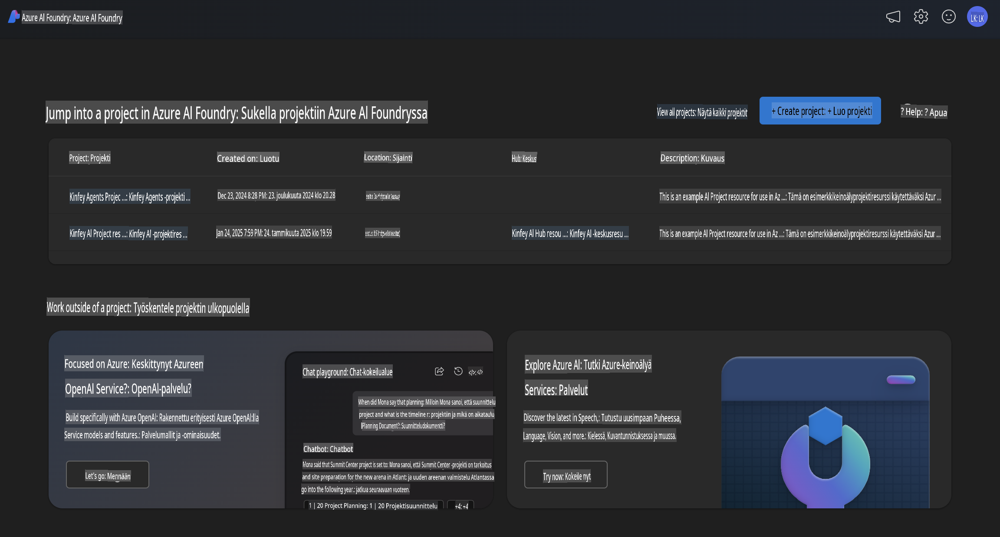
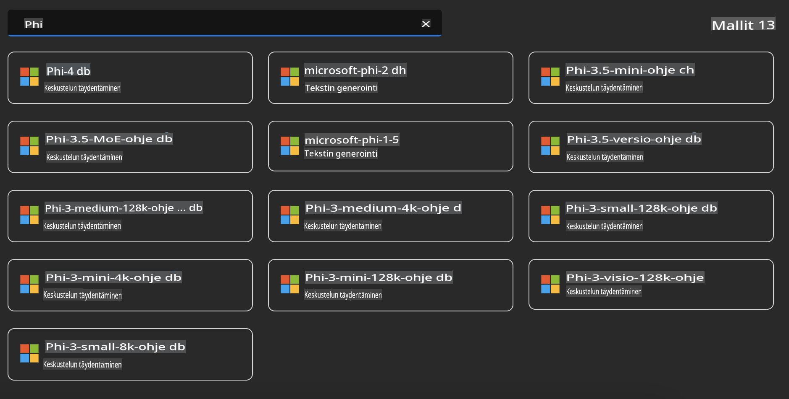
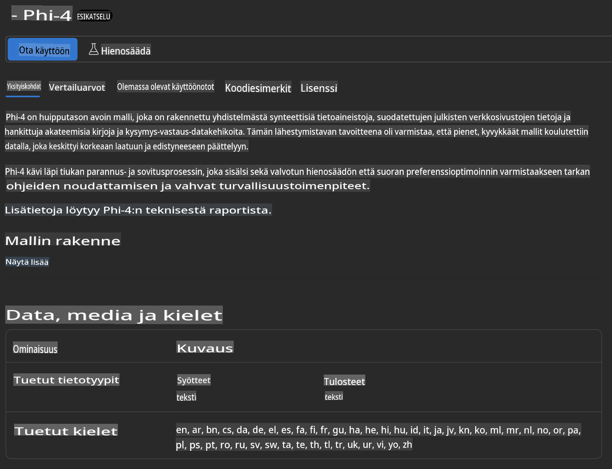
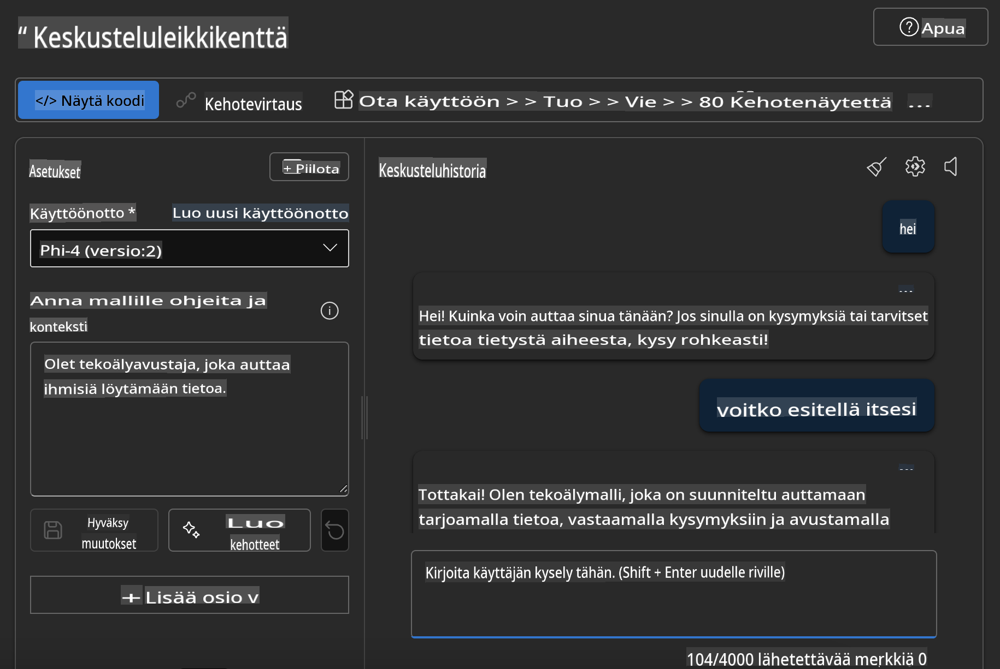

## Phi-perhe Azure AI Foundryssa

[Azure AI Foundry](https://ai.azure.com) on luotettava alusta, joka antaa kehittäjille mahdollisuuden innovoida ja muokata tulevaisuutta tekoälyn avulla turvallisella, varmistetulla ja vastuullisella tavalla.

[Azure AI Foundry](https://ai.azure.com) on suunniteltu kehittäjille, jotta he voivat:

- Rakentaa generatiivisia tekoälysovelluksia yritystason alustalla.
- Tutkia, rakentaa, testata ja ottaa käyttöön uusimpia tekoälytyökaluja ja koneoppimismalleja vastuullisen tekoälyn periaatteiden mukaisesti.
- Tehdä yhteistyötä tiimin kanssa koko sovelluskehityksen elinkaaren ajan.

Azure AI Foundryssa voit tutkia laajaa mallien, palveluiden ja ominaisuuksien valikoimaa ja ryhtyä rakentamaan tekoälysovelluksia, jotka palvelevat tavoitteitasi parhaiten. Azure AI Foundryn alusta mahdollistaa skaalautuvuuden, jotta voit helposti muuntaa konseptitodisteet täysimittaisiksi tuotantosovelluksiksi. Jatkuva seuranta ja hienosäätö tukevat pitkäaikaista menestystä.



Azure AI Foundryssa voit AOAI-palvelun lisäksi käyttää myös kolmannen osapuolen malleja Azure AI Foundryn Mallikatalogissa. Tämä on hyvä vaihtoehto, jos haluat käyttää Azure AI Foundrya tekoälyratkaisualustana.

Voimme nopeasti ottaa käyttöön Phi-perheen malleja Azure AI Foundryn Mallikatalogin kautta.



### **Phi-4:n käyttöönotto Azure AI Foundryssa**



### **Phi-4:n testaaminen Azure AI Foundry Playgroundissa**



### **Python-koodin suorittaminen kutsumaan Azure AI Foundryn Phi-4:ää**

```python

import os  
import base64
from openai import AzureOpenAI  
from azure.identity import DefaultAzureCredential, get_bearer_token_provider  
        
endpoint = os.getenv("ENDPOINT_URL", "Your Azure AOAI Service Endpoint")  
deployment = os.getenv("DEPLOYMENT_NAME", "Phi-4")  
      
token_provider = get_bearer_token_provider(  
    DefaultAzureCredential(),  
    "https://cognitiveservices.azure.com/.default"  
)  
  
client = AzureOpenAI(  
    azure_endpoint=endpoint,  
    azure_ad_token_provider=token_provider,  
    api_version="2024-05-01-preview",  
)  
  

chat_prompt = [
    {
        "role": "system",
        "content": "You are an AI assistant that helps people find information."
    },
    {
        "role": "user",
        "content": "can you introduce yourself"
    }
] 
    
# Include speech result if speech is enabled  
messages = chat_prompt 

completion = client.chat.completions.create(  
    model=deployment,  
    messages=messages,
    max_tokens=800,  
    temperature=0.7,  
    top_p=0.95,  
    frequency_penalty=0,  
    presence_penalty=0,
    stop=None,  
    stream=False  
)  
  
print(completion.to_json())  

```

**Vastuuvapauslauseke**:  
Tämä asiakirja on käännetty konepohjaisten tekoälyyn perustuvien käännöspalveluiden avulla. Pyrimme tarkkuuteen, mutta huomioithan, että automaattiset käännökset voivat sisältää virheitä tai epätarkkuuksia. Alkuperäistä asiakirjaa sen alkuperäisellä kielellä tulee pitää ensisijaisena lähteenä. Kriittisen tiedon osalta suositellaan ammattimaista ihmiskääntäjää. Emme ole vastuussa tämän käännöksen käytöstä aiheutuvista väärinkäsityksistä tai virhetulkinnoista.