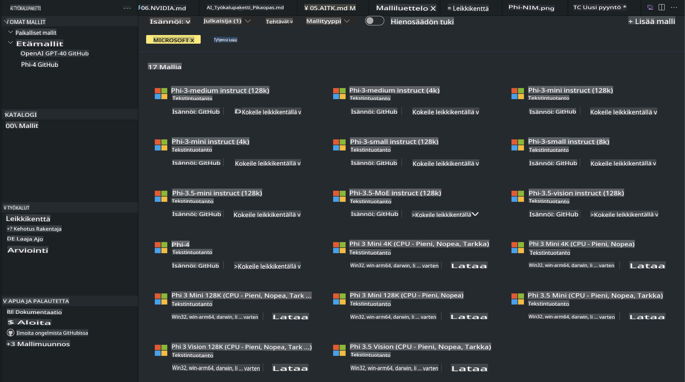
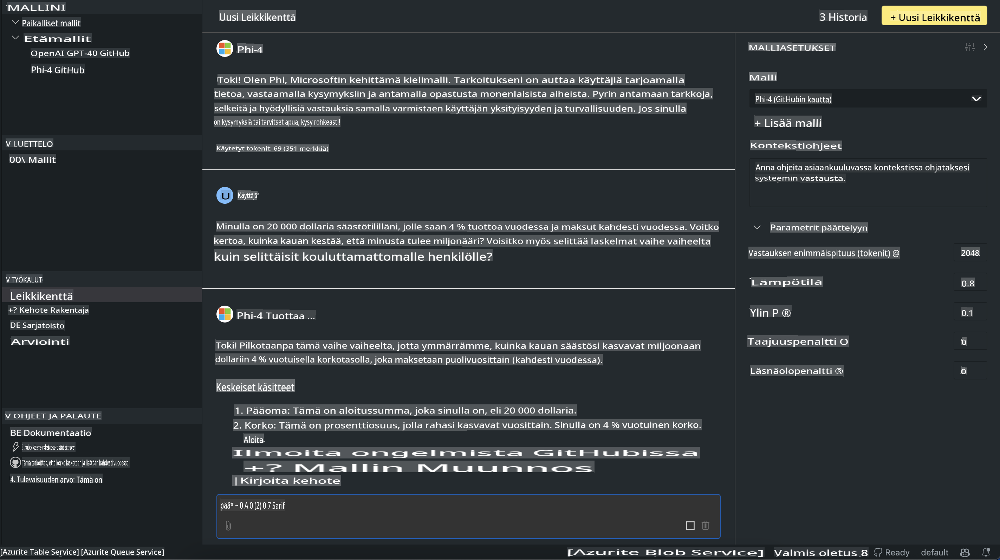

# Phi-perhe AITK:ssa

[AI Toolkit for VS Code](https://marketplace.visualstudio.com/items?itemName=ms-windows-ai-studio.windows-ai-studio) yksinkertaistaa generatiivisten tekoälysovellusten kehittämistä yhdistämällä huippuluokan tekoälykehitystyökalut ja mallit, kuten Azure AI Foundry Catalog ja muut katalogit, kuten Hugging Face. Voit selata AI-mallikatalogeja, joita tukevat GitHub Models ja Azure AI Foundry Model Catalogs, ladata niitä paikallisesti tai etänä, hienosäätää, testata ja käyttää niitä sovelluksessasi.

AI Toolkit Preview toimii paikallisesti. Paikallinen inferenssi tai hienosäätö riippuu valitsemastasi mallista, ja saatat tarvita GPU:n, kuten NVIDIA CUDA GPU:n. Voit myös käyttää GitHub-malleja suoraan AITK:n avulla.

## Aloittaminen

[Lue lisää Windows Subsystem for Linuxin asennuksesta](https://learn.microsoft.com/windows/wsl/install?WT.mc_id=aiml-137032-kinfeylo)

ja [oletusjakelun vaihtamisesta](https://learn.microsoft.com/windows/wsl/install#change-the-default-linux-distribution-installed).

[AI Toolkit GitHub -repo](https://github.com/microsoft/vscode-ai-toolkit/)

- Windows, Linux, macOS
  
- Hienosäätöä varten sekä Windowsissa että Linuxissa tarvitset Nvidia GPU:n. Lisäksi **Windows** vaatii Linux-alijärjestelmän Ubuntu-jakelulla (versio 18.4 tai uudempi). [Lue lisää Windows Subsystem for Linuxin asennuksesta](https://learn.microsoft.com/windows/wsl/install) ja [oletusjakelun vaihtamisesta](https://learn.microsoft.com/windows/wsl/install#change-the-default-linux-distribution-installed).

### AI Toolkitin asentaminen

AI Toolkit toimitetaan [Visual Studio Code -laajennuksena](https://code.visualstudio.com/docs/setup/additional-components#_vs-code-extensions), joten sinun täytyy ensin asentaa [VS Code](https://code.visualstudio.com/docs/setup/windows?WT.mc_id=aiml-137032-kinfeylo) ja ladata AI Toolkit [VS Marketplacesta](https://marketplace.visualstudio.com/items?itemName=ms-windows-ai-studio.windows-ai-studio).  
[AI Toolkit on saatavilla Visual Studio Marketplacessa](https://marketplace.visualstudio.com/items?itemName=ms-windows-ai-studio.windows-ai-studio) ja sen voi asentaa kuten minkä tahansa muun VS Code -laajennuksen. 

Jos et ole aiemmin asentanut VS Code -laajennuksia, noudata näitä ohjeita:

### Kirjautuminen

1. Valitse VS Coden toimintopalkista **Extensions**
1. Kirjoita hakupalkkiin "AI Toolkit"
1. Valitse "AI Toolkit for Visual Studio Code"
1. Valitse **Install**

Nyt olet valmis käyttämään laajennusta!

Sinua pyydetään kirjautumaan GitHubiin, joten napsauta "Allow" jatkaaksesi. Sinut ohjataan GitHubin kirjautumissivulle.

Kirjaudu sisään ja noudata ohjeita. Kun prosessi on valmis, sinut ohjataan takaisin VS Codeen.

Kun laajennus on asennettu, näet AI Toolkit -kuvakkeen toimintopalkissa.

Tutustutaan saatavilla oleviin toimintoihin!

### Käytettävissä olevat toiminnot

AI Toolkitin ensisijainen sivupalkki on jaettu seuraaviin osioihin:  

- **Models**
- **Resources**
- **Playground**  
- **Fine-tuning**
- **Evaluation**

Kaikki nämä löytyvät Resources-osiosta. Aloittaaksesi valitse **Model Catalog**.

### Mallin lataaminen katalogista

Kun avaat AI Toolkitin VS Coden sivupalkista, voit valita seuraavista vaihtoehdoista:



- Etsi tuettu malli **Model Catalogista** ja lataa se paikallisesti
- Testaa mallin inferenssiä **Model Playgroundissa**
- Hienosäädä mallia paikallisesti tai etänä **Model Fine-tuningissa**
- Ota hienosäädetyt mallit käyttöön pilvessä AI Toolkitin komennon avulla
- Arvioi malleja

> [!NOTE]
>
> **GPU vs CPU**
>
> Huomaat, että mallikorteissa näkyy mallin koko, alusta ja kiihdyttimen tyyppi (CPU, GPU). Optimaalisen suorituskyvyn saavuttamiseksi **Windows-laitteilla, joissa on vähintään yksi GPU**, valitse mallit, jotka on suunnattu vain Windowsille.
>
> Tämä varmistaa, että malli on optimoitu DirectML-kiihdyttimelle.
>
> Mallien nimet ovat muodossa:
>
> - `{model_name}-{accelerator}-{quantization}-{format}`.
>
> Tarkistaaksesi, onko Windows-laitteessasi GPU, avaa **Tehtävienhallinta** ja valitse **Suorituskyky**-välilehti. Jos sinulla on GPU:ita, ne näkyvät nimillä kuten "GPU 0" tai "GPU 1".

### Mallin ajaminen Playgroundissa

Kun kaikki parametrit on asetettu, napsauta **Generate Project**.

Kun mallisi on ladattu, valitse **Load in Playground** mallikortista katalogissa:

- Käynnistä mallin lataus
- Asenna kaikki tarvittavat edellytykset ja riippuvuudet
- Luo VS Code -työtila



### REST-rajapinnan käyttäminen sovelluksessasi 

AI Toolkit sisältää paikallisen REST-rajapinnan verkkopalvelimen **portissa 5272**, joka käyttää [OpenAI chat completions -muotoa](https://platform.openai.com/docs/api-reference/chat/create). 

Tämä mahdollistaa sovelluksesi testaamisen paikallisesti ilman, että sinun tarvitsee luottaa pilvitekoälymallipalveluun. Esimerkiksi seuraava JSON-tiedosto näyttää, kuinka pyynnön runko konfiguroidaan:

```json
{
    "model": "Phi-4",
    "messages": [
        {
            "role": "user",
            "content": "what is the golden ratio?"
        }
    ],
    "temperature": 0.7,
    "top_p": 1,
    "top_k": 10,
    "max_tokens": 100,
    "stream": true
}
```

Voit testata REST-rajapintaa esimerkiksi [Postmanilla](https://www.postman.com/) tai CURL-työkalulla:

```bash
curl -vX POST http://127.0.0.1:5272/v1/chat/completions -H 'Content-Type: application/json' -d @body.json
```

### OpenAI-asiakaskirjaston käyttäminen Pythonilla

```python
from openai import OpenAI

client = OpenAI(
    base_url="http://127.0.0.1:5272/v1/", 
    api_key="x" # required for the API but not used
)

chat_completion = client.chat.completions.create(
    messages=[
        {
            "role": "user",
            "content": "what is the golden ratio?",
        }
    ],
    model="Phi-4",
)

print(chat_completion.choices[0].message.content)
```

### Azure OpenAI -asiakaskirjaston käyttäminen .NET:ssä

Lisää [Azure OpenAI -asiakaskirjasto .NET:lle](https://www.nuget.org/packages/Azure.AI.OpenAI/) projektiisi NuGetin avulla:

```bash
dotnet add {project_name} package Azure.AI.OpenAI --version 1.0.0-beta.17
```

Lisää projektiisi C#-tiedosto nimeltä **OverridePolicy.cs** ja liitä seuraava koodi:

```csharp
// OverridePolicy.cs
using Azure.Core.Pipeline;
using Azure.Core;

internal partial class OverrideRequestUriPolicy(Uri overrideUri)
    : HttpPipelineSynchronousPolicy
{
    private readonly Uri _overrideUri = overrideUri;

    public override void OnSendingRequest(HttpMessage message)
    {
        message.Request.Uri.Reset(_overrideUri);
    }
}
```

Seuraavaksi liitä seuraava koodi **Program.cs**-tiedostoosi:

```csharp
// Program.cs
using Azure.AI.OpenAI;

Uri localhostUri = new("http://localhost:5272/v1/chat/completions");

OpenAIClientOptions clientOptions = new();
clientOptions.AddPolicy(
    new OverrideRequestUriPolicy(localhostUri),
    Azure.Core.HttpPipelinePosition.BeforeTransport);
OpenAIClient client = new(openAIApiKey: "unused", clientOptions);

ChatCompletionsOptions options = new()
{
    DeploymentName = "Phi-4",
    Messages =
    {
        new ChatRequestSystemMessage("You are a helpful assistant. Be brief and succinct."),
        new ChatRequestUserMessage("What is the golden ratio?"),
    }
};

StreamingResponse<StreamingChatCompletionsUpdate> streamingChatResponse
    = await client.GetChatCompletionsStreamingAsync(options);

await foreach (StreamingChatCompletionsUpdate chatChunk in streamingChatResponse)
{
    Console.Write(chatChunk.ContentUpdate);
}
```

## Hienosäätö AI Toolkitilla

- Aloita mallien löytämisestä ja Playgroundista.
- Mallien hienosäätö ja inferenssi paikallisia laskentaresursseja käyttäen.
- Etähienosäätö ja inferenssi käyttäen Azure-resursseja.

[Hienosäätö AI Toolkitilla](../../03.FineTuning/Finetuning_VSCodeaitoolkit.md)

## AI Toolkit Q&A -resurssit

Katso [Q&A-sivultamme](https://github.com/microsoft/vscode-ai-toolkit/blob/main/archive/QA.md) yleisimmät ongelmat ja ratkaisut.

**Vastuuvapauslauseke**:  
Tämä asiakirja on käännetty konepohjaisia tekoälykäännöspalveluita käyttäen. Pyrimme tarkkuuteen, mutta huomioithan, että automaattiset käännökset voivat sisältää virheitä tai epätarkkuuksia. Alkuperäistä asiakirjaa sen alkuperäisellä kielellä tulee pitää ensisijaisena lähteenä. Kriittistä tietoa varten suositellaan ammattimaista ihmiskäännöstä. Emme ole vastuussa tämän käännöksen käytöstä johtuvista väärinkäsityksistä tai virheellisistä tulkinnoista.