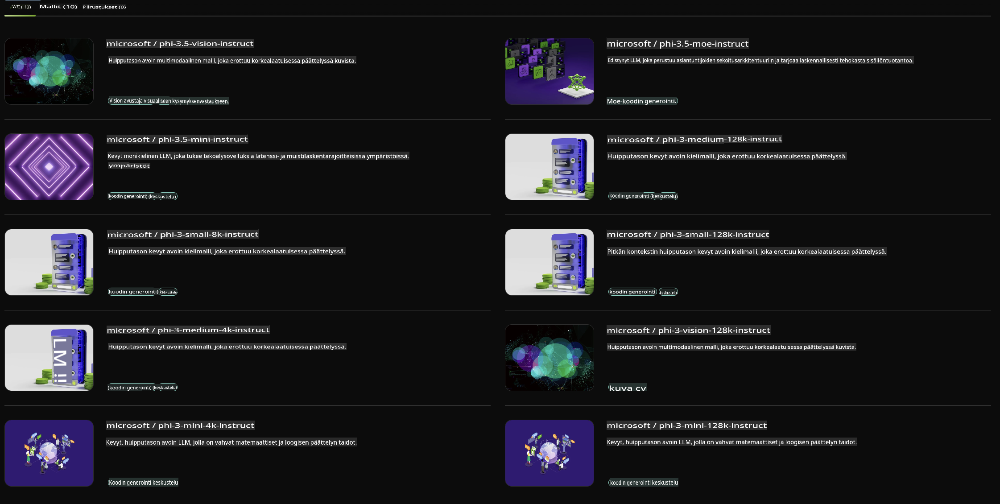

## Phi-perhe NVIDIA NIM:ssä

NVIDIA NIM on joukko helposti käytettäviä mikropalveluja, jotka on suunniteltu nopeuttamaan generatiivisten tekoälymallien käyttöönottoa pilvessä, datakeskuksissa ja työasemilla. NIM:t luokitellaan malliperheiden ja yksittäisten mallien mukaan. Esimerkiksi NVIDIA NIM suurille kielimalleille (LLM) tuo huipputason LLM-mallien voiman yrityssovelluksiin, tarjoten vertaansa vailla olevia luonnollisen kielen käsittelyn ja ymmärtämisen ominaisuuksia.

NIM tekee IT- ja DevOps-tiimeille helpoksi isännöidä suuria kielimalleja (LLM) itsehallituissa ympäristöissään ja samalla tarjoaa kehittäjille alan standardien mukaiset API:t. Näiden avulla voidaan rakentaa tehokkaita apureita, chatbotteja ja tekoälyavustajia, jotka voivat mullistaa liiketoiminnan. Hyödyntämällä NVIDIA:n huipputason GPU-kiihdytystä ja skaalautuvaa käyttöönottoa, NIM tarjoaa nopeimman reitin ennustamiseen ja vertaansa vailla olevan suorituskyvyn.

Voit käyttää NVIDIA NIM:ää Phi-perheen mallien ennustamiseen.



### **Esimerkit - Phi-3-Vision NVIDIA NIM:ssä**

Kuvitellaan, että sinulla on kuva (`demo.png`) ja haluat luoda Python-koodia, joka käsittelee tämän kuvan ja tallentaa siitä uuden version (`phi-3-vision.jpg`).

Yllä oleva koodi automatisoi tämän prosessin seuraavasti:

1. Ympäristön ja tarvittavien asetusten määrittäminen.
2. Kehotteen luominen, joka ohjeistaa mallia tuottamaan tarvittavan Python-koodin.
3. Kehotteen lähettäminen mallille ja tuotetun koodin vastaanottaminen.
4. Tuotetun koodin erottaminen ja suorittaminen.
5. Alkuperäisen ja käsitellyn kuvan näyttäminen.

Tämä lähestymistapa hyödyntää tekoälyn voimaa automatisoimaan kuvankäsittelytehtäviä, tehden tavoitteiden saavuttamisesta helpompaa ja nopeampaa.

[Esimerkkikoodiratkaisu](../../../../../code/06.E2E/E2E_Nvidia_NIM_Phi3_Vision.ipynb)

Käydään läpi, mitä koko koodi tekee vaihe vaiheelta:

1. **Tarvittavan paketin asennus**:
    ```python
    !pip install langchain_nvidia_ai_endpoints -U
    ```  
    Tämä komento asentaa `langchain_nvidia_ai_endpoints`-paketin varmistaen, että se on viimeisin versio.

2. **Tarvittavien moduulien tuonti**:
    ```python
    from langchain_nvidia_ai_endpoints import ChatNVIDIA
    import getpass
    import os
    import base64
    ```  
    Nämä tuonnit tuovat tarvittavat moduulit NVIDIA AI -päätepisteiden kanssa vuorovaikuttamiseen, salasanojen turvalliseen käsittelyyn, käyttöjärjestelmän kanssa työskentelyyn sekä base64-muotoisen datan koodaukseen ja purkamiseen.

3. **API-avaimen määrittäminen**:
    ```python
    if not os.getenv("NVIDIA_API_KEY"):
        os.environ["NVIDIA_API_KEY"] = getpass.getpass("Enter your NVIDIA API key: ")
    ```  
    Tämä koodi tarkistaa, onko `NVIDIA_API_KEY`-ympäristömuuttuja asetettu. Jos ei, se kehottaa käyttäjää syöttämään API-avaimen turvallisesti.

4. **Malli ja kuvan polku**:
    ```python
    model = 'microsoft/phi-3-vision-128k-instruct'
    chat = ChatNVIDIA(model=model)
    img_path = './imgs/demo.png'
    ```  
    Tämä määrittää käytettävän mallin, luo `ChatNVIDIA`-instanssin valitulla mallilla ja määrittää polun kuvatiedostoon.

5. **Tekstikehotteen luominen**:
    ```python
    text = "Please create Python code for image, and use plt to save the new picture under imgs/ and name it phi-3-vision.jpg."
    ```  
    Tämä määrittää tekstikehotteen, joka ohjeistaa mallia tuottamaan Python-koodia kuvan käsittelyä varten.

6. **Kuvan koodaus base64-muotoon**:
    ```python
    with open(img_path, "rb") as f:
        image_b64 = base64.b64encode(f.read()).decode()
    image = f''
    ```  
    Tämä koodi lukee kuvatiedoston, koodaa sen base64-muotoon ja luo HTML-kuvatagin koodatulla datalla.

7. **Tekstin ja kuvan yhdistäminen kehotteeksi**:
    ```python
    prompt = f"{text} {image}"
    ```  
    Tämä yhdistää tekstikehotteen ja HTML-kuvatagin yhdeksi merkkijonoksi.

8. **Koodin generointi ChatNVIDIA:n avulla**:
    ```python
    code = ""
    for chunk in chat.stream(prompt):
        print(chunk.content, end="")
        code += chunk.content
    ```  
    Tämä koodi lähettää kehotteen `ChatNVIDIA` model and collects the generated code in chunks, printing and appending each chunk to the `code`-merkkijonolle.

9. **Python-koodin erottaminen tuotetusta sisällöstä**:
    ```python
    begin = code.index('```python') + 9  
    code = code[begin:]  
    end = code.index('```')
    code = code[:end]
    ```  
    Tämä erottelee varsinaisen Python-koodin tuotetusta sisällöstä poistamalla markdown-muotoilun.

10. **Tuotetun koodin suorittaminen**:
    ```python
    import subprocess
    result = subprocess.run(["python", "-c", code], capture_output=True)
    ```  
    Tämä suorittaa erotetun Python-koodin aliprosessina ja tallentaa sen tulosteen.

11. **Kuvien näyttäminen**:
    ```python
    from IPython.display import Image, display
    display(Image(filename='./imgs/phi-3-vision.jpg'))
    display(Image(filename='./imgs/demo.png'))
    ```  
    Nämä rivit näyttävät kuvat `IPython.display`-moduulin avulla.

**Vastuuvapauslauseke**:  
Tämä asiakirja on käännetty konepohjaisten tekoälykäännöspalveluiden avulla. Vaikka pyrimme tarkkuuteen, huomioithan, että automaattiset käännökset voivat sisältää virheitä tai epätarkkuuksia. Alkuperäistä asiakirjaa sen alkuperäisellä kielellä tulee pitää auktoritatiivisena lähteenä. Kriittisen tiedon osalta suositellaan ammattimaista ihmiskäännöstä. Emme ole vastuussa tämän käännöksen käytöstä aiheutuvista väärinkäsityksistä tai virhetulkinnoista.