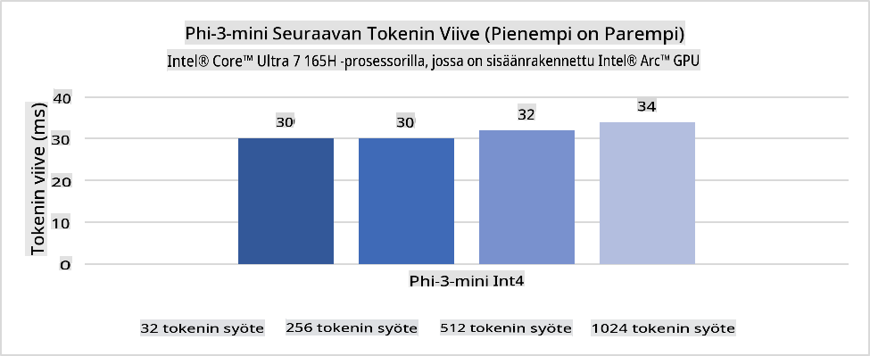
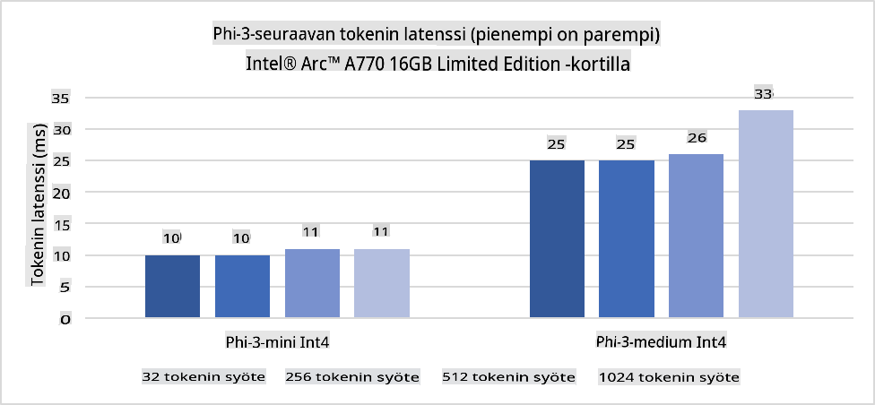
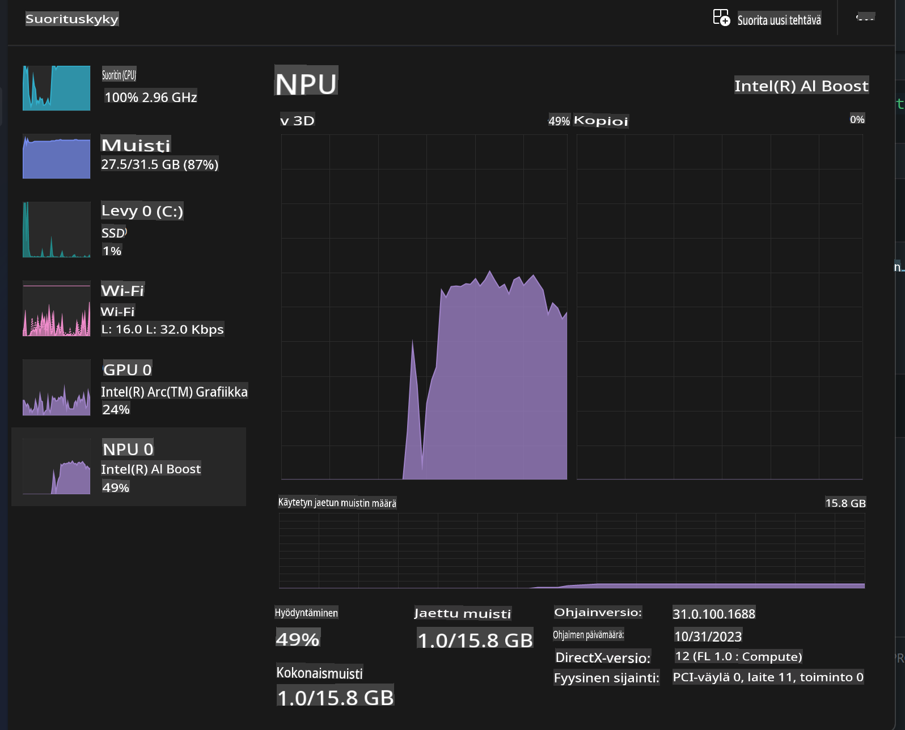
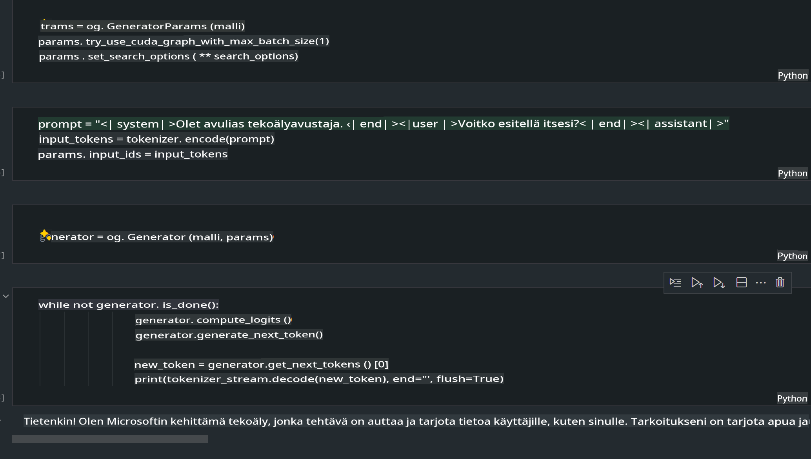
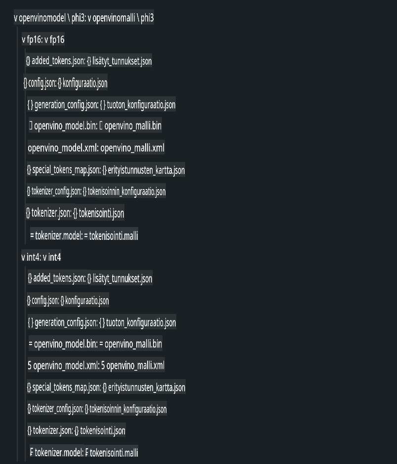
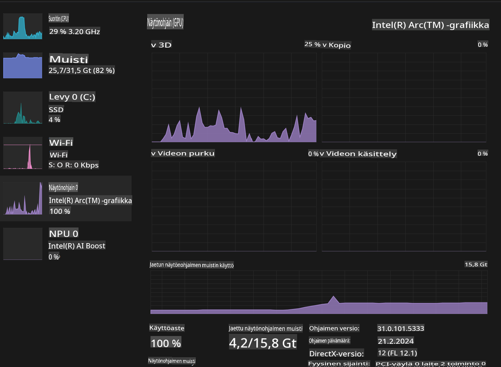

# **Inference Phi-3 AI PC:ssä**

Generatiivisen tekoälyn kehittyessä ja reunalaitteiden laitteistokyvykkyyksien parantuessa yhä useammat generatiiviset tekoälymallit voidaan nyt integroida käyttäjien omiin BYOD-laitteisiin (Bring Your Own Device). AI PC:t ovat yksi näistä malleista. Vuodesta 2024 alkaen Intel, AMD ja Qualcomm ovat tehneet yhteistyötä PC-valmistajien kanssa tuodakseen markkinoille AI PC:t, jotka mahdollistavat paikallisten generatiivisten tekoälymallien käyttöönoton laitteistomuutosten avulla. Tässä keskustelussa keskitymme Intel AI PC:ihin ja tutkimme, kuinka Phi-3 otetaan käyttöön Intel AI PC:ssä.

### Mikä on NPU

NPU (Neural Processing Unit) on erikoistunut prosessori tai laskentayksikkö suuremmassa SoC:ssä, joka on suunniteltu erityisesti nopeuttamaan neuroverkkojen toimintoja ja tekoälytehtäviä. Toisin kuin yleiskäyttöiset CPU:t ja GPU:t, NPU:t on optimoitu datavetoiseen rinnakkaislaskentaan, mikä tekee niistä erittäin tehokkaita käsittelemään suuria multimediamääriä, kuten videoita ja kuvia, sekä neuroverkkojen datan prosessointia. Ne ovat erityisen taitavia tekoälyyn liittyvissä tehtävissä, kuten puheentunnistuksessa, taustan sumentamisessa videopuheluissa sekä kuvien ja videoiden muokkausprosesseissa, kuten objektien tunnistamisessa.

## NPU vs GPU

Vaikka monet tekoäly- ja koneoppimistyökuormat toimivat GPU:illa, on tärkeä ero GPU:iden ja NPU:iden välillä.
GPU:t tunnetaan rinnakkaislaskentakyvyistään, mutta kaikki GPU:t eivät ole yhtä tehokkaita graafisen prosessoinnin ulkopuolella. NPU:t puolestaan on suunniteltu erityisesti neuroverkkojen monimutkaisiin laskutoimituksiin, mikä tekee niistä erittäin tehokkaita tekoälytehtävissä.

Yhteenvetona voidaan todeta, että NPU:t ovat matematiikan taitureita, jotka vauhdittavat tekoälylaskentaa, ja ne ovat keskeisessä asemassa tekoäly-PC:iden uudella aikakaudella!

***Tämä esimerkki perustuu Intelin uusimpaan Intel Core Ultra -prosessoriin.***

## **1. Phi-3-mallin suorittaminen NPU:lla**

Intel® NPU -laite on tekoälylaskennan kiihdytin, joka on integroitu Intelin asiakasprosessoreihin, alkaen Intel® Core™ Ultra -prosessorisukupolvesta (aiemmin tunnettu nimellä Meteor Lake). Se mahdollistaa tekoälytehtävien energiatehokkaan suorittamisen.





**Intel NPU Acceleration Library**

Intel NPU Acceleration Library [https://github.com/intel/intel-npu-acceleration-library](https://github.com/intel/intel-npu-acceleration-library) on Python-kirjasto, joka on suunniteltu parantamaan sovellustesi tehokkuutta hyödyntämällä Intel Neural Processing Unit (NPU) -laitteen laskentatehoa nopeisiin laskentoihin yhteensopivalla laitteistolla.

Esimerkki Phi-3-mini-mallista AI PC:ssä, jossa on Intel® Core™ Ultra -prosessori.


Asenna Python-kirjasto pip-komennolla

```bash

   pip install intel-npu-acceleration-library

```

***Huomio*** Projekti on yhä kehitteillä, mutta referenssimalli on jo erittäin kattava.

### **Phi-3:n suorittaminen Intel NPU Acceleration Librarylla**

Intel NPU -kiihdytyksen avulla tämä kirjasto ei vaikuta perinteiseen koodausprosessiin. Tarvitset vain tämän kirjaston alkuperäisen Phi-3-mallin kvantisointiin, kuten FP16, INT8, INT4, esimerkiksi

```python
from transformers import AutoTokenizer, pipeline,TextStreamer
from intel_npu_acceleration_library import NPUModelForCausalLM, int4
from intel_npu_acceleration_library.compiler import CompilerConfig
import warnings

model_id = "microsoft/Phi-3-mini-4k-instruct"

compiler_conf = CompilerConfig(dtype=int4)
model = NPUModelForCausalLM.from_pretrained(
    model_id, use_cache=True, config=compiler_conf, attn_implementation="sdpa"
).eval()

tokenizer = AutoTokenizer.from_pretrained(model_id)

text_streamer = TextStreamer(tokenizer, skip_prompt=True)
```

Kun kvantisointi onnistuu, jatka suorittamista kutsuaksesi NPU:ta ajamaan Phi-3-mallia.

```python
generation_args = {
   "max_new_tokens": 1024,
   "return_full_text": False,
   "temperature": 0.3,
   "do_sample": False,
   "streamer": text_streamer,
}

pipe = pipeline(
   "text-generation",
   model=model,
   tokenizer=tokenizer,
)

query = "<|system|>You are a helpful AI assistant.<|end|><|user|>Can you introduce yourself?<|end|><|assistant|>"

with warnings.catch_warnings():
    warnings.simplefilter("ignore")
    pipe(query, **generation_args)
```

Koodia suoritettaessa voimme tarkastella NPU:n tilaa Tehtävienhallinnassa.



***Esimerkit*** : [AIPC_NPU_DEMO.ipynb](../../../../../code/03.Inference/AIPC/AIPC_NPU_DEMO.ipynb)

## **2. Phi-3-mallin suorittaminen DirectML + ONNX Runtimella**

### **Mikä on DirectML**

[DirectML](https://github.com/microsoft/DirectML) on suorituskykyinen, laitteistokiihdytetty DirectX 12 -kirjasto koneoppimista varten. DirectML tarjoaa GPU-kiihdytyksen yleisiin koneoppimistehtäviin laajalle valikoimalle tuettuja laitteistoja ja ajureita, mukaan lukien kaikki DirectX 12 -yhteensopivat GPU:t valmistajilta, kuten AMD, Intel, NVIDIA ja Qualcomm.

Käytettäessä yksinään DirectML API on matalan tason DirectX 12 -kirjasto ja sopii korkean suorituskyvyn, matalan viiveen sovelluksiin, kuten kehyksiin, peleihin ja muihin reaaliaikasovelluksiin. DirectML:n saumaton yhteensopivuus Direct3D 12:n kanssa sekä sen alhainen ylikuormitus ja yhdenmukaisuus eri laitteistoilla tekevät siitä ihanteellisen koneoppimisen kiihdyttämiseen, kun tarvitaan sekä korkeaa suorituskykyä että tulosten luotettavuutta ja ennustettavuutta eri laitteistoilla.

***Huomio*** : Uusin DirectML tukee jo NPU:ta (https://devblogs.microsoft.com/directx/introducing-neural-processor-unit-npu-support-in-directml-developer-preview/)

### DirectML ja CUDA kyvykkyyksien ja suorituskyvyn osalta:

**DirectML** on Microsoftin kehittämä koneoppimiskirjasto. Se on suunniteltu kiihdyttämään koneoppimistyökuormia Windows-laitteilla, mukaan lukien pöytäkoneet, kannettavat ja reunalaitteet.
- DX12-pohjainen: DirectML on rakennettu DirectX 12:n (DX12) päälle, mikä tarjoaa laajan laitteistotuen GPU:ille, mukaan lukien sekä NVIDIA että AMD.
- Laajempi tuki: Koska se hyödyntää DX12:ta, DirectML voi toimia millä tahansa GPU:lla, joka tukee DX12:ta, jopa integroiduilla GPU:illa.
- Kuvankäsittely: DirectML käsittelee kuvia ja muuta dataa neuroverkkojen avulla, mikä tekee siitä sopivan tehtäviin, kuten kuvantunnistukseen ja objektien havaitsemiseen.
- Helppo käyttöönotto: DirectML:n käyttöönotto on suoraviivaista, eikä se vaadi erityisiä SDK:ita tai kirjastoja GPU-valmistajilta.
- Suorituskyky: Joissain tapauksissa DirectML toimii hyvin ja voi olla nopeampi kuin CUDA tietyissä työkuormissa.
- Rajoitukset: On kuitenkin tilanteita, joissa DirectML voi olla hitaampi, erityisesti float16:lle suurilla eräkokoilla.

**CUDA** on NVIDIA:n rinnakkaislaskenta-alusta ja ohjelmointimalli. Se mahdollistaa kehittäjien hyödyntää NVIDIA GPU:iden laskentatehoa yleiskäyttöiseen laskentaan, mukaan lukien koneoppiminen ja tieteelliset simulaatiot.
- NVIDIA-spesifinen: CUDA on tiiviisti integroitu NVIDIA GPU:ihin ja suunniteltu erityisesti niille.
- Erittäin optimoitu: Se tarjoaa erinomaisen suorituskyvyn GPU-kiihdytetyille tehtäville, erityisesti NVIDIA GPU:ita käytettäessä.
- Laajasti käytetty: Monet koneoppimiskehykset ja -kirjastot (kuten TensorFlow ja PyTorch) tukevat CUDA:aa.
- Räätälöinti: Kehittäjät voivat hienosäätää CUDA-asetuksia tiettyihin tehtäviin, mikä voi johtaa optimaaliseen suorituskykyyn.
- Rajoitukset: CUDA:n riippuvuus NVIDIA-laitteistosta voi olla rajoittava, jos haluat laajemman yhteensopivuuden eri GPU:iden välillä.

### DirectML:n ja CUDA:n valinta

Valinta DirectML:n ja CUDA:n välillä riippuu erityisestä käyttötapauksestasi, käytettävissä olevasta laitteistosta ja mieltymyksistäsi.
Jos etsit laajempaa yhteensopivuutta ja helppoa käyttöönottoa, DirectML voi olla hyvä valinta. Jos kuitenkin sinulla on NVIDIA GPU:ita ja tarvitset erittäin optimoitua suorituskykyä, CUDA on edelleen vahva vaihtoehto. Yhteenvetona, molemmilla on omat vahvuutensa ja heikkoutensa, joten harkitse vaatimuksiasi ja käytettävissä olevaa laitteistoa päätöstä tehdessäsi.

### **Generatiivinen tekoäly ONNX Runtimella**

Tekoälyn aikakaudella tekoälymallien siirrettävyys on erittäin tärkeää. ONNX Runtime mahdollistaa helposti koulutettujen mallien käyttöönoton eri laitteilla. Kehittäjien ei tarvitse huolehtia inferenssikehyksestä, vaan he voivat käyttää yhtenäistä API:a mallien inferenssin suorittamiseen. Generatiivisen tekoälyn aikakaudella ONNX Runtime on myös tehnyt koodioptimointeja (https://onnxruntime.ai/docs/genai/). Optimoidun ONNX Runtime -ympäristön avulla kvantisoitu generatiivinen tekoälymalli voidaan suorittaa eri päätelaitteilla. Generatiivisessa tekoälyssä ONNX Runtimella voit suorittaa tekoälymallin API:n Pythonilla, C#:lla tai C/C++:lla. Tietenkin iPhone-käyttöönotto voi hyödyntää C++:n Generative AI with ONNX Runtime API:ta.

[Esimerkkikoodi](https://github.com/Azure-Samples/Phi-3MiniSamples/tree/main/onnx)

***Generatiivisen tekoälyn kääntäminen ONNX Runtime -kirjastolla***

```bash

winget install --id=Kitware.CMake  -e

git clone https://github.com/microsoft/onnxruntime.git

cd .\onnxruntime\

./build.bat --build_shared_lib --skip_tests --parallel --use_dml --config Release

cd ../

git clone https://github.com/microsoft/onnxruntime-genai.git

cd .\onnxruntime-genai\

mkdir ort

cd ort

mkdir include

mkdir lib

copy ..\onnxruntime\include\onnxruntime\core\providers\dml\dml_provider_factory.h ort\include

copy ..\onnxruntime\include\onnxruntime\core\session\onnxruntime_c_api.h ort\include

copy ..\onnxruntime\build\Windows\Release\Release\*.dll ort\lib

copy ..\onnxruntime\build\Windows\Release\Release\onnxruntime.lib ort\lib

python build.py --use_dml


```

**Kirjaston asennus**

```bash

pip install .\onnxruntime_genai_directml-0.3.0.dev0-cp310-cp310-win_amd64.whl

```

Tässä on suoritustulos.



***Esimerkit*** : [AIPC_DirectML_DEMO.ipynb](../../../../../code/03.Inference/AIPC/AIPC_DirectML_DEMO.ipynb)

## **3. Phi-3-mallin suorittaminen Intel OpenVinolla**

### **Mikä on OpenVINO**

[OpenVINO](https://github.com/openvinotoolkit/openvino) on avoimen lähdekoodin työkalupakki syväoppimismallien optimointiin ja käyttöönottoon. Se tarjoaa parannettua syväoppimissuorituskykyä visuaalisille, auditiivisille ja kielellisille malleille suosituista kehyksistä, kuten TensorFlow ja PyTorch. OpenVINO voidaan yhdistää myös CPU:hun ja GPU:hun Phi-3-mallin suorittamiseksi.

***Huomio***: Tällä hetkellä OpenVINO ei tue NPU:ta.

### **OpenVINO-kirjaston asennus**

```bash

 pip install git+https://github.com/huggingface/optimum-intel.git

 pip install git+https://github.com/openvinotoolkit/nncf.git

 pip install openvino-nightly

```

### **Phi-3:n suorittaminen OpenVINOn avulla**

Kuten NPU:ssa, OpenVINO suorittaa generatiivisten tekoälymallien kutsun kvantisoitujen mallien avulla. Meidän täytyy ensin kvantisoida Phi-3-malli ja suorittaa mallin kvantisointi komentorivillä optimum-cli:n avulla.

**INT4**

```bash

optimum-cli export openvino --model "microsoft/Phi-3-mini-4k-instruct" --task text-generation-with-past --weight-format int4 --group-size 128 --ratio 0.6  --sym  --trust-remote-code ./openvinomodel/phi3/int4

```

**FP16**

```bash

optimum-cli export openvino --model "microsoft/Phi-3-mini-4k-instruct" --task text-generation-with-past --weight-format fp16 --trust-remote-code ./openvinomodel/phi3/fp16

```

Muunnettu formaatti näyttää tältä.



Lataa mallipolut (model_dir), liittyvät asetukset (ov_config = {"PERFORMANCE_HINT": "LATENCY", "NUM_STREAMS": "1", "CACHE_DIR": ""}) ja laitteistokiihdytetyt laitteet (GPU.0) OVModelForCausalLM:n avulla.

```python

ov_model = OVModelForCausalLM.from_pretrained(
     model_dir,
     device='GPU.0',
     ov_config=ov_config,
     config=AutoConfig.from_pretrained(model_dir, trust_remote_code=True),
     trust_remote_code=True,
)

```

Koodia suoritettaessa voimme tarkastella GPU:n tilaa Tehtävienhallinnassa.



***Esimerkit*** : [AIPC_OpenVino_Demo.ipynb](../../../../../code/03.Inference/AIPC/AIPC_OpenVino_Demo.ipynb)

### ***Huomio***: Yllä olevilla kolmella menetelmällä on omat etunsa, mutta AI PC -inferenssiä varten suositellaan käyttämään NPU-kiihdytystä.

**Vastuuvapauslauseke**:  
Tämä asiakirja on käännetty konepohjaisilla tekoälykäännöspalveluilla. Pyrimme tarkkuuteen, mutta huomioithan, että automaattiset käännökset voivat sisältää virheitä tai epätarkkuuksia. Alkuperäistä asiakirjaa sen alkuperäisellä kielellä tulisi pitää ensisijaisena lähteenä. Tärkeissä tiedoissa suositellaan ammattimaisen ihmiskääntäjän käyttöä. Emme ole vastuussa tämän käännöksen käytöstä johtuvista väärinkäsityksistä tai virhetulkinnoista.