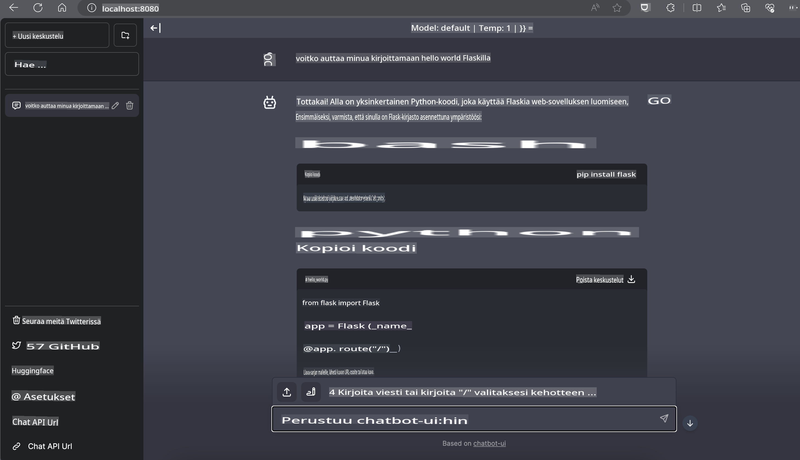

# **Inference Phi-3 Nvidia Jetsonilla**

Nvidia Jetson on sarja sulautettuja laskentakortteja, jotka ovat peräisin Nvidialta. Jetson TK1-, TX1- ja TX2-malleissa on Nvidian Tegra-prosessori (tai SoC), joka sisältää ARM-arkkitehtuuriin perustuvan keskusyksikön (CPU). Jetson on vähävirtainen järjestelmä, joka on suunniteltu nopeuttamaan koneoppimissovelluksia. Nvidia Jetsonia käyttävät ammattikehittäjät uraauurtavien tekoälytuotteiden luomiseen kaikilla toimialoilla sekä opiskelijat ja harrastajat käytännön tekoälyoppimiseen ja upeiden projektien toteuttamiseen. SLM otetaan käyttöön reunalaitteissa, kuten Jetsonissa, mikä mahdollistaa teollisuuden generatiivisten tekoälysovellusten paremman toteutuksen.

## Käyttöönotto NVIDIA Jetsonilla:
Kehittäjät, jotka työskentelevät autonomisten robotiikka- ja sulautettujen laitteiden parissa, voivat hyödyntää Phi-3 Miniä. Phi-3:n suhteellisen pieni koko tekee siitä ihanteellisen reunakäyttöön. Parametrit on hienosäädetty huolellisesti koulutuksen aikana, mikä varmistaa korkean tarkkuuden vastauksissa.

### TensorRT-LLM Optimointi:
NVIDIAn [TensorRT-LLM-kirjasto](https://github.com/NVIDIA/TensorRT-LLM?WT.mc_id=aiml-138114-kinfeylo) optimoi suurten kielimallien päättelyn. Se tukee Phi-3 Minin pitkää kontekstikkunaa, parantaen sekä läpimenoaikaa että viivettä. Optimointeihin sisältyy tekniikoita, kuten LongRoPE, FP8 ja inflight batching.

### Saatavuus ja käyttöönotto:
Kehittäjät voivat tutkia Phi-3 Miniä 128K kontekstikkunalla [NVIDIAn AI-sivustolla](https://www.nvidia.com/en-us/ai-data-science/generative-ai/). Se on pakattu NVIDIA NIM:ksi, mikropalveluksi, jossa on vakio-API, ja joka voidaan ottaa käyttöön missä tahansa. Lisäksi [TensorRT-LLM-toteutukset GitHubissa](https://github.com/NVIDIA/TensorRT-LLM).

## **1. Valmistelut**

a. Jetson Orin NX / Jetson NX

b. JetPack 5.1.2+
   
c. Cuda 11.8
   
d. Python 3.8+

## **2. Phi-3:n suorittaminen Jetsonilla**

Voimme valita [Ollama](https://ollama.com) tai [LlamaEdge](https://llamaedge.com).

Jos haluat käyttää gguf:ia pilvessä ja reunalaitteissa samanaikaisesti, LlamaEdge voidaan ymmärtää WasmEdgeksi (WasmEdge on kevyt, suorituskykyinen ja skaalautuva WebAssembly-ajoympäristö, joka soveltuu pilvinatiivien, reunalaitteiden ja hajautettujen sovellusten käyttöön. Se tukee serverless-sovelluksia, sulautettuja toimintoja, mikropalveluita, älysopimuksia ja IoT-laitteita. Voit ottaa käyttöön gguf:n kvantitatiivisen mallin reunalaitteissa ja pilvessä LlamaEdgen avulla).


Tässä ovat vaiheet käyttöä varten:

1. Asenna ja lataa tarvittavat kirjastot ja tiedostot

```bash

curl -sSf https://raw.githubusercontent.com/WasmEdge/WasmEdge/master/utils/install.sh | bash -s -- --plugin wasi_nn-ggml

curl -LO https://github.com/LlamaEdge/LlamaEdge/releases/latest/download/llama-api-server.wasm

curl -LO https://github.com/LlamaEdge/chatbot-ui/releases/latest/download/chatbot-ui.tar.gz

tar xzf chatbot-ui.tar.gz

```

**Huomio**: llama-api-server.wasm ja chatbot-ui tulee olla samassa hakemistossa

2. Suorita skriptit terminaalissa

```bash

wasmedge --dir .:. --nn-preload default:GGML:AUTO:{Your gguf path} llama-api-server.wasm -p phi-3-chat

```

Tässä on suorituskyvyn tulos:



***Esimerkkikoodi*** [Phi-3 mini WASM Notebook Sample](https://github.com/Azure-Samples/Phi-3MiniSamples/tree/main/wasm)

Yhteenvetona voidaan todeta, että Phi-3 Mini edustaa merkittävää edistysaskelta kielimallinnuksessa, yhdistäen tehokkuuden, kontekstitietoisuuden ja NVIDIAn optimointiosaamisen. Olitpa rakentamassa robotteja tai reunasovelluksia, Phi-3 Mini on voimakas työkalu, joka kannattaa tuntea.

**Vastuuvapauslauseke**:  
Tämä asiakirja on käännetty konepohjaisilla tekoälykäännöspalveluilla. Pyrimme tarkkuuteen, mutta huomioithan, että automaattiset käännökset voivat sisältää virheitä tai epätarkkuuksia. Alkuperäistä asiakirjaa sen alkuperäisellä kielellä tulee pitää ensisijaisena lähteenä. Kriittisten tietojen kohdalla suositellaan ammattimaista ihmiskäännöstä. Emme ole vastuussa väärinkäsityksistä tai virhetulkinnoista, jotka johtuvat tämän käännöksen käytöstä.