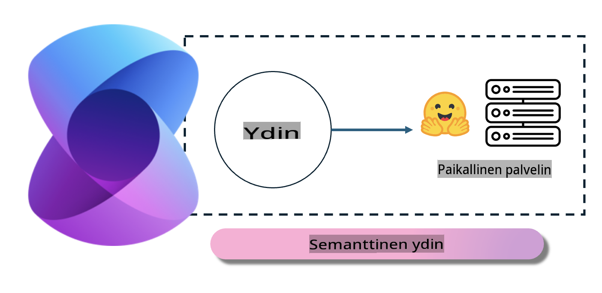
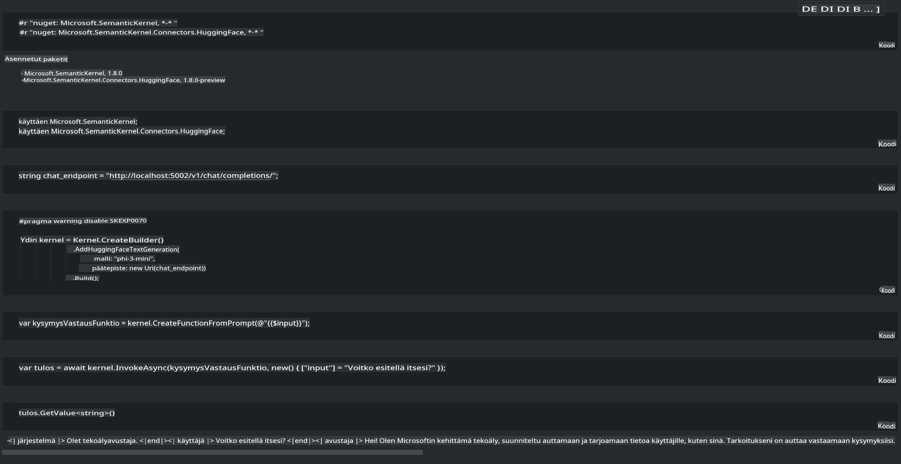

# **Inference Phi-3 paikallisessa palvelimessa**

Voimme ottaa Phi-3:n käyttöön paikallisessa palvelimessa. Käyttäjät voivat valita [Ollama](https://ollama.com) tai [LM Studio](https://llamaedge.com) -ratkaisut, tai he voivat kirjoittaa oman koodinsa. Phi-3:n paikallisiin palveluihin voi yhdistää [Semantic Kernel](https://github.com/microsoft/semantic-kernel?WT.mc_id=aiml-138114-kinfeylo) tai [Langchain](https://www.langchain.com/) avulla Copilot-sovellusten rakentamiseksi.

## **Phi-3-mini käyttö Semantic Kernelin avulla**

Copilot-sovelluksessa luomme sovelluksia Semantic Kernelin tai LangChainin avulla. Tällainen sovelluskehys on yleensä yhteensopiva Azure OpenAI Servicen / OpenAI-mallien kanssa ja voi myös tukea avoimen lähdekoodin malleja Hugging Facessa sekä paikallisia malleja. Mitä tehdä, jos haluamme käyttää Semantic Kerneliä Phi-3-minin kanssa? Käyttäen esimerkkinä .NET:iä, voimme yhdistää sen Semantic Kernelin Hugging Face Connectoriin. Oletuksena se vastaa Hugging Facen mallin tunnistetta (ensimmäisellä käyttökerralla malli ladataan Hugging Facesta, mikä vie aikaa). Voit myös yhdistää itse rakennettuun paikalliseen palveluun. Näistä kahdesta suosittelemme jälkimmäistä, koska se tarjoaa enemmän autonomiaa, erityisesti yrityssovelluksissa.

Kuvasta nähdään, että paikallisiin palveluihin yhdistäminen Semantic Kernelin kautta mahdollistaa helpon yhteyden itse rakennettuun Phi-3-mini-mallipalvelimeen. Tässä on suorituskyvyn tulos:

***Esimerkkikoodi*** https://github.com/kinfey/Phi3MiniSamples/tree/main/semantickernel

**Vastuuvapauslauseke**:  
Tämä asiakirja on käännetty konepohjaisia tekoälyyn perustuvia käännöspalveluita käyttäen. Vaikka pyrimme tarkkuuteen, huomioithan, että automaattiset käännökset voivat sisältää virheitä tai epätarkkuuksia. Alkuperäistä asiakirjaa sen alkuperäisellä kielellä tulisi pitää ensisijaisena lähteenä. Kriittistä tietoa varten suositellaan ammattimaista ihmisen tekemää käännöstä. Emme ole vastuussa väärinkäsityksistä tai virheellisistä tulkinnoista, jotka johtuvat tämän käännöksen käytöstä.