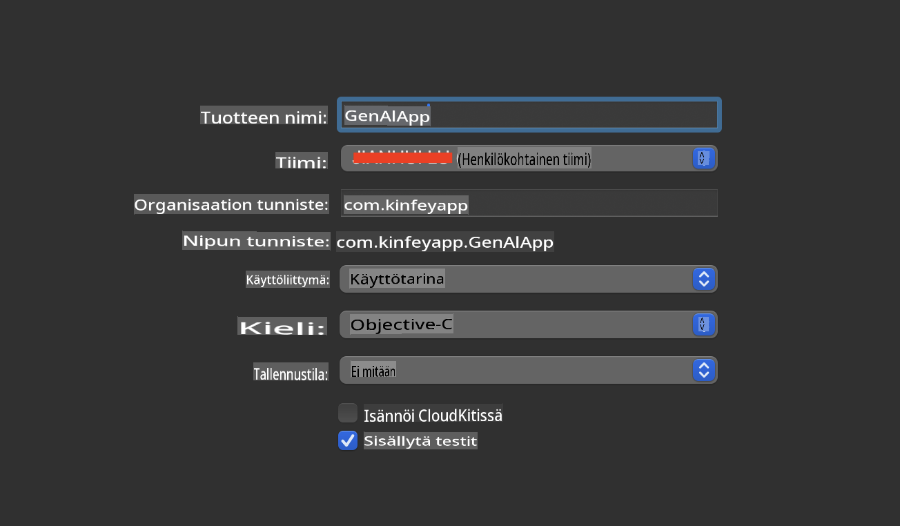
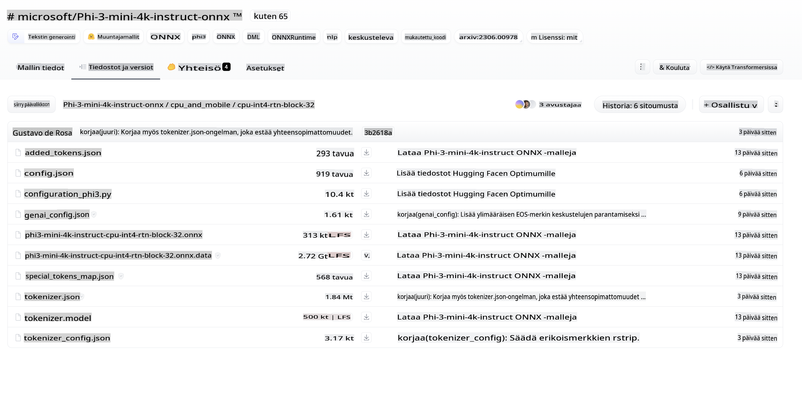
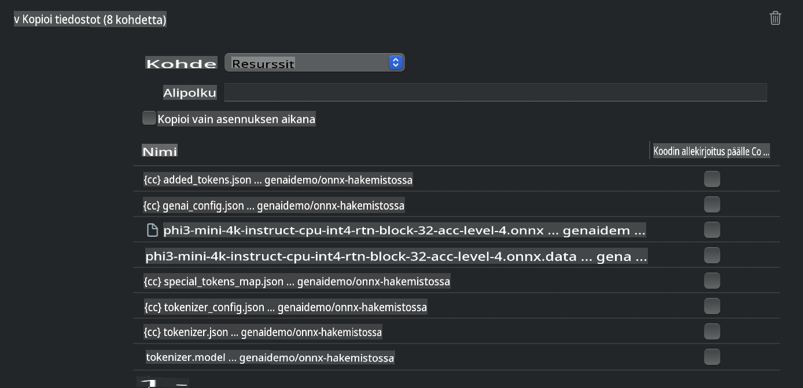
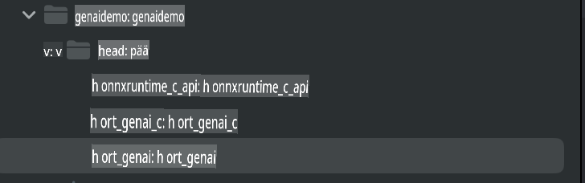
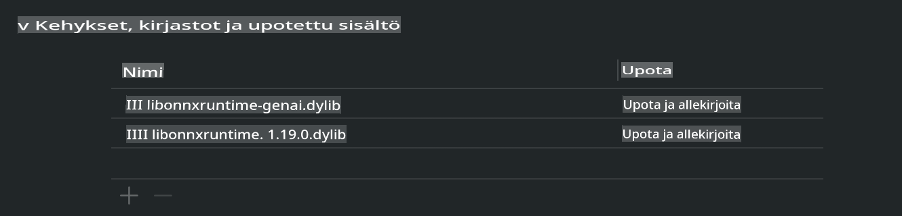
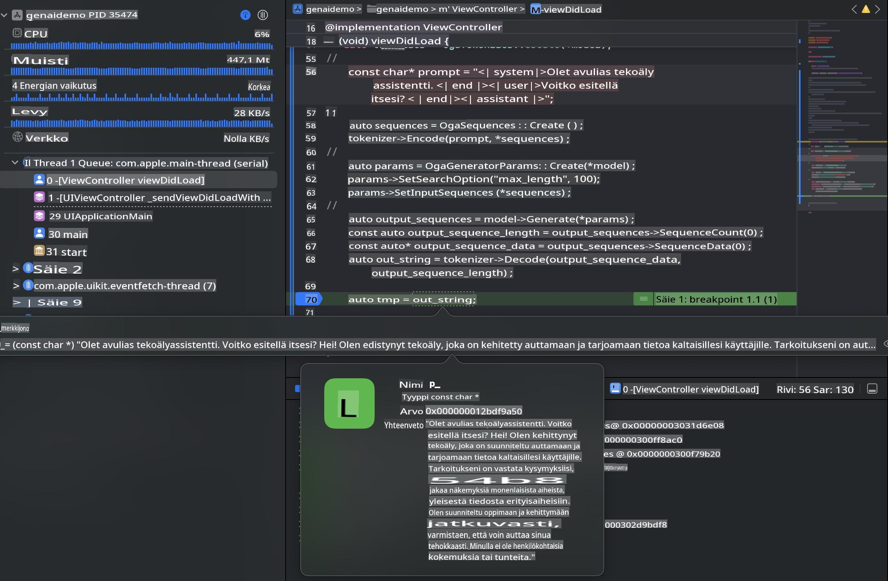

# **Inference Phi-3 iOS-laitteessa**

Phi-3-mini on Microsoftin uusi mallisarja, joka mahdollistaa suurten kielimallien (LLM) käytön reunalaitteilla ja IoT-laitteilla. Phi-3-mini on saatavilla iOS-, Android- ja reunalaiteympäristöihin, mikä mahdollistaa generatiivisen tekoälyn käytön BYOD-ympäristöissä. Alla oleva esimerkki näyttää, kuinka Phi-3-mini otetaan käyttöön iOS-laitteella.

## **1. Valmistelut**

- **a.** macOS 14+
- **b.** Xcode 15+
- **c.** iOS SDK 17.x (iPhone 14 A16 tai uudempi)
- **d.** Asenna Python 3.10+ (Conda suositeltu)
- **e.** Asenna Python-kirjasto: `python-flatbuffers`
- **f.** Asenna CMake

### Semantic Kernel ja päättely

Semantic Kernel on sovelluskehys, jonka avulla voit luoda sovelluksia, jotka ovat yhteensopivia Azure OpenAI Servicen, OpenAI-mallien ja jopa paikallisten mallien kanssa. Paikallisten palveluiden käyttö Semantic Kernelin kautta mahdollistaa helpon integroinnin itseisännöityyn Phi-3-mini-mallipalvelimeesi.

### Kvantisoitujen mallien kutsuminen Ollaman tai LlamaEdgen avulla

Monet käyttäjät suosivat kvantisoituja malleja mallien paikalliseen suorittamiseen. [Ollama](https://ollama.com) ja [LlamaEdge](https://llamaedge.com) mahdollistavat erilaisten kvantisoitujen mallien käytön:

#### **Ollama**

Voit suorittaa `ollama run phi3` suoraan tai määrittää sen offline-tilassa. Luo Modelfile, jossa on polku `gguf`-tiedostoon. Esimerkki Phi-3-mini-kvantisoidun mallin suorittamisesta:

```gguf
FROM {Add your gguf file path}
TEMPLATE \"\"\"<|user|> .Prompt<|end|> <|assistant|>\"\"\"
PARAMETER stop <|end|>
PARAMETER num_ctx 4096
```

#### **LlamaEdge**

Jos haluat käyttää `gguf` sekä pilvessä että reunalaitteilla samanaikaisesti, LlamaEdge on erinomainen vaihtoehto.

## **2. ONNX Runtime -ympäristön kääntäminen iOS:lle**

```bash

git clone https://github.com/microsoft/onnxruntime.git

cd onnxruntime

./build.sh --build_shared_lib --ios --skip_tests --parallel --build_dir ./build_ios --ios --apple_sysroot iphoneos --osx_arch arm64 --apple_deploy_target 17.5 --cmake_generator Xcode --config Release

cd ../

```

### **Huomio**

- **a.** Varmista ennen kääntämistä, että Xcode on oikein konfiguroitu, ja aseta se aktiiviseksi kehittäjäympäristöksi terminaalissa:

    ```bash
    sudo xcode-select -switch /Applications/Xcode.app/Contents/Developer
    ```

- **b.** ONNX Runtime on käännettävä eri alustoille. iOS:lle voit kääntää `arm64` or `x86_64`.

- **c.** Suositellaan käyttämään uusinta iOS SDK:ta kääntämiseen. Voit kuitenkin käyttää vanhempaa versiota, jos tarvitset yhteensopivuutta aiempien SDK-versioiden kanssa.

## **3. Generatiivisen tekoälyn kääntäminen ONNX Runtime -ympäristössä iOS:lle**

> **Huom:** Koska Generatiivinen tekoäly ONNX Runtime -ympäristössä on esikatselussa, ole tietoinen mahdollisista muutoksista.

```bash

git clone https://github.com/microsoft/onnxruntime-genai
 
cd onnxruntime-genai
 
mkdir ort
 
cd ort
 
mkdir include
 
mkdir lib
 
cd ../
 
cp ../onnxruntime/include/onnxruntime/core/session/onnxruntime_c_api.h ort/include
 
cp ../onnxruntime/build_ios/Release/Release-iphoneos/libonnxruntime*.dylib* ort/lib
 
export OPENCV_SKIP_XCODEBUILD_FORCE_TRYCOMPILE_DEBUG=1
 
python3 build.py --parallel --build_dir ./build_ios --ios --ios_sysroot iphoneos --ios_arch arm64 --ios_deployment_target 17.5 --cmake_generator Xcode --cmake_extra_defines CMAKE_XCODE_ATTRIBUTE_CODE_SIGNING_ALLOWED=NO

```

## **4. Sovelluksen luominen Xcodessa**

Valitsin Objective-C:n sovelluskehitykseen, koska ONNX Runtime C++ API:n käyttäminen generatiivisen tekoälyn kanssa toimii paremmin Objective-C:n kanssa. Toki voit myös käyttää Swift bridging -ratkaisua.



## **5. ONNX-kvantisoidun INT4-mallin kopioiminen sovellusprojektiin**

Meidän täytyy tuoda INT4-kvantisointimalli ONNX-muodossa, joka täytyy ladata ensin.



Lataamisen jälkeen malli lisätään projektin Resources-kansioon Xcodessa.



## **6. C++ API:n lisääminen ViewControllereihin**

> **Huomio:**

- **a.** Lisää vastaavat C++ header-tiedostot projektiin.

  

- **b.** Sisällytä `onnxruntime-genai` dynamic library in Xcode.

  

- **c.** Use the C Samples code for testing. You can also add additional features like ChatUI for more functionality.

- **d.** Since you need to use C++ in your project, rename `ViewController.m` to `ViewController.mm` aktivoidaksesi Objective-C++-tuen.

```objc

    NSString *llmPath = [[NSBundle mainBundle] resourcePath];
    char const *modelPath = llmPath.cString;

    auto model =  OgaModel::Create(modelPath);

    auto tokenizer = OgaTokenizer::Create(*model);

    const char* prompt = "<|system|>You are a helpful AI assistant.<|end|><|user|>Can you introduce yourself?<|end|><|assistant|>";

    auto sequences = OgaSequences::Create();
    tokenizer->Encode(prompt, *sequences);

    auto params = OgaGeneratorParams::Create(*model);
    params->SetSearchOption("max_length", 100);
    params->SetInputSequences(*sequences);

    auto output_sequences = model->Generate(*params);
    const auto output_sequence_length = output_sequences->SequenceCount(0);
    const auto* output_sequence_data = output_sequences->SequenceData(0);
    auto out_string = tokenizer->Decode(output_sequence_data, output_sequence_length);
    
    auto tmp = out_string;

```

## **7. Sovelluksen suorittaminen**

Kun kaikki on valmis, voit suorittaa sovelluksen ja nähdä Phi-3-mini-mallin päättelyn tulokset.



Lisää esimerkkikoodia ja yksityiskohtaisia ohjeita löydät [Phi-3 Mini Samples repository](https://github.com/Azure-Samples/Phi-3MiniSamples/tree/main/ios).

**Vastuuvapauslauseke**:  
Tämä asiakirja on käännetty konepohjaisten tekoälykäännöspalveluiden avulla. Vaikka pyrimme tarkkuuteen, huomioithan, että automaattiset käännökset voivat sisältää virheitä tai epätarkkuuksia. Alkuperäistä asiakirjaa sen alkuperäisellä kielellä tulee pitää ensisijaisena lähteenä. Kriittisen tiedon kohdalla suositellaan ammattimaista ihmiskääntäjää. Emme ole vastuussa tämän käännöksen käytöstä aiheutuvista väärinkäsityksistä tai virhetulkinnoista.