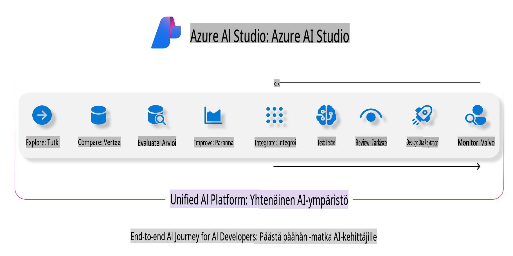
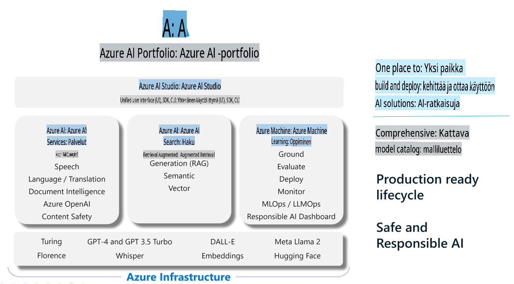

# **Azure AI Foundryn käyttäminen arviointiin**

Näin arvioit generatiivisen tekoälysovelluksesi [Azure AI Foundryn](https://ai.azure.com?WT.mc_id=aiml-138114-kinfeylo) avulla. Riippumatta siitä, arvioitko yksittäisiä vuorovaikutuksia vai monivaiheisia keskusteluja, Azure AI Foundry tarjoaa työkaluja mallin suorituskyvyn ja turvallisuuden arvioimiseen.

## Kuinka arvioida generatiivisia tekoälysovelluksia Azure AI Foundrylla
Lisätietoja löydät [Azure AI Foundry -dokumentaatiosta](https://learn.microsoft.com/azure/ai-studio/how-to/evaluate-generative-ai-app?WT.mc_id=aiml-138114-kinfeylo).

Aloita seuraavilla vaiheilla:

## Generatiivisten tekoälymallien arviointi Azure AI Foundryssa

**Edellytykset**

- Testidatasetti joko CSV- tai JSON-muodossa.
- Käyttöön otettu generatiivinen tekoälymalli (esim. Phi-3, GPT 3.5, GPT 4 tai Davinci-mallit).
- Suoritusaika laskentayksikön kanssa arvioinnin suorittamiseen.

## Sisäänrakennetut arviointimittarit

Azure AI Foundry mahdollistaa sekä yksittäisten vuorovaikutusten että monimutkaisten, monivaiheisten keskustelujen arvioinnin.  
RAG-skenaarioissa (Retrieval Augmented Generation), joissa malli perustuu tiettyihin tietoihin, suorituskykyä voidaan arvioida sisäänrakennettujen arviointimittareiden avulla.  
Lisäksi voit arvioida yleisiä yksittäisiä kysymys-vastaus-skenaarioita (ei-RAG).

## Arviointiajon luominen

Azure AI Foundryn käyttöliittymässä siirry joko Evaluate-sivulle tai Prompt Flow -sivulle.  
Seuraa arvioinnin luontiopasta määrittääksesi arviointiajon. Anna arvioinnille halutessasi nimi.  
Valitse skenaario, joka vastaa sovelluksesi tavoitteita.  
Valitse yksi tai useampi arviointimittari mallin tulosten arvioimiseksi.

## Mukautettu arviointiprosessi (valinnainen)

Suuremman joustavuuden saavuttamiseksi voit luoda mukautetun arviointiprosessin. Mukauta arviointia omien erityistarpeidesi mukaan.

## Tulosten tarkastelu

Arvioinnin suorittamisen jälkeen kirjaa, tarkastele ja analysoi yksityiskohtaisia arviointimittareita Azure AI Foundryssa.  
Saat arvokasta tietoa sovelluksesi kyvyistä ja rajoituksista.

**Huomio** Azure AI Foundry on tällä hetkellä julkisessa esikatselussa, joten käytä sitä kokeilu- ja kehitystarkoituksiin. Tuotantokäyttöön suositellaan muita vaihtoehtoja. Tutustu viralliseen [AI Foundry -dokumentaatioon](https://learn.microsoft.com/azure/ai-studio/?WT.mc_id=aiml-138114-kinfeylo) saadaksesi lisätietoja ja vaiheittaiset ohjeet.

**Vastuuvapauslauseke**:  
Tämä asiakirja on käännetty konepohjaisilla tekoälykäännöspalveluilla. Pyrimme tarkkuuteen, mutta huomioithan, että automaattiset käännökset voivat sisältää virheitä tai epätarkkuuksia. Alkuperäistä asiakirjaa sen alkuperäisellä kielellä tulisi pitää ensisijaisena lähteenä. Kriittisen tiedon osalta suositellaan ammattimaista ihmiskääntäjää. Emme ole vastuussa tämän käännöksen käytöstä aiheutuvista väärinkäsityksistä tai virhetulkinnoista.