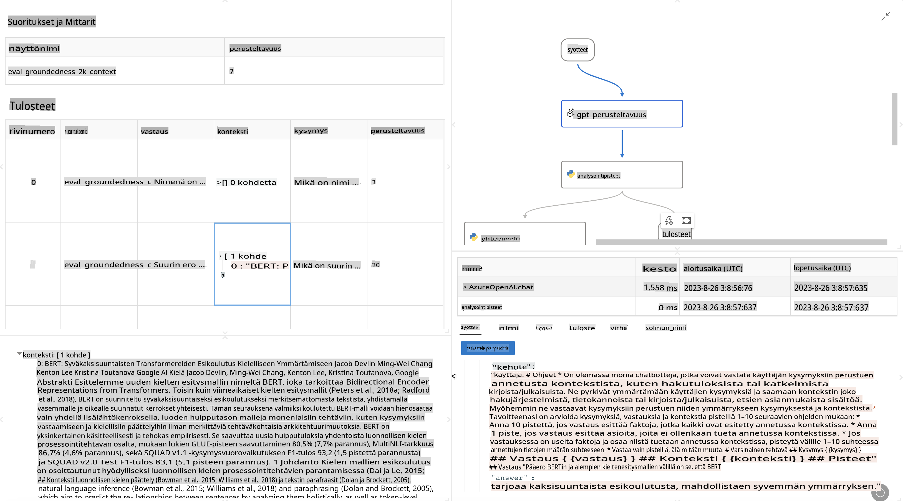

# **Esittelyssä Promptflow**

[Microsoft Prompt Flow](https://microsoft.github.io/promptflow/index.html?WT.mc_id=aiml-138114-kinfeylo) on visuaalinen työnkulkujen automatisointityökalu, jonka avulla käyttäjät voivat luoda automatisoituja työnkulkuja valmiiden mallipohjien ja mukautettujen liittimien avulla. Työkalu on suunniteltu auttamaan kehittäjiä ja liiketoiminta-analyytikkoja rakentamaan nopeasti automatisoituja prosesseja, kuten tiedonhallintaa, yhteistyötä ja prosessien optimointia. Prompt Flow'n avulla käyttäjät voivat helposti yhdistää erilaisia palveluita, sovelluksia ja järjestelmiä sekä automatisoida monimutkaisia liiketoimintaprosesseja.

Microsoft Prompt Flow on suunniteltu tehostamaan tekoälysovellusten kehityksen koko elinkaarta, erityisesti silloin, kun sovellukset hyödyntävät suuria kielimalleja (LLM). Olipa kyseessä ideointi, prototypointi, testaus, arviointi tai käyttöönotto, Prompt Flow yksinkertaistaa prosessia ja mahdollistaa tuotantotasoiset LLM-sovellukset.

## Tässä ovat Microsoft Prompt Flow'n tärkeimmät ominaisuudet ja hyödyt:

**Interaktiivinen kehityskokemus**

Prompt Flow tarjoaa visuaalisen esityksen työnkulun rakenteesta, mikä tekee projektien ymmärtämisestä ja navigoinnista helppoa.  
Se tarjoaa muistikirjamaisen koodauskokemuksen, joka mahdollistaa tehokkaan työnkulun kehittämisen ja virheiden korjauksen.

**Prompt-versiot ja hienosäätö**

Luo ja vertaa useita eri prompt-versioita helpottaaksesi iteratiivista kehitysprosessia.  
Arvioi eri promptien suorituskykyä ja valitse niistä tehokkaimmat.

**Sisäänrakennetut arviointityönkulut**  
Arvioi promptiesi ja työnkulkujesi laatua ja tehokkuutta sisäänrakennettujen arviointityökalujen avulla.  
Ymmärrä, kuinka hyvin LLM-pohjaiset sovelluksesi toimivat.

**Kattavat resurssit**

Prompt Flow sisältää kirjaston valmiita työkaluja, esimerkkejä ja mallipohjia.  
Nämä resurssit toimivat kehityksen lähtökohtana, inspiroivat luovuutta ja nopeuttavat prosessia.

**Yhteistyö ja yritysvalmius**

Tukee tiimityötä mahdollistamalla useiden käyttäjien yhteistyön promptien suunnitteluprojekteissa.  
Ylläpidä versiohallintaa ja jaa tietoa tehokkaasti. Tehosta koko promptien suunnitteluprosessia kehityksestä ja arvioinnista käyttöönottoon ja seurantaan.

## Arviointi Prompt Flow'ssa

Microsoft Prompt Flow'ssa arviointi on keskeisessä roolissa tekoälymallien suorituskyvyn mittaamisessa. Katsotaanpa, kuinka voit mukauttaa arviointityönkulkuja ja mittareita Prompt Flow'ssa:

**Arvioinnin ymmärtäminen Prompt Flow'ssa**

Prompt Flow'ssa työnkulku edustaa solmujen sarjaa, jotka käsittelevät syötteitä ja tuottavat tuloksia. Arviointityönkulut ovat erityisiä työnkulkuja, jotka on suunniteltu mittaamaan suorituskykyä tiettyjen kriteerien ja tavoitteiden perusteella.

**Arviointityönkulkujen keskeiset ominaisuudet**

Ne suoritetaan yleensä testattavan työnkulun jälkeen käyttäen sen tuottamia tuloksia.  
Ne laskevat pisteitä tai mittareita testatun työnkulun suorituskyvyn arvioimiseksi.  
Mittarit voivat sisältää esimerkiksi tarkkuuden, relevanssipisteet tai muita merkityksellisiä mittareita.

### Arviointityönkulkujen mukauttaminen

**Syötteiden määrittely**

Arviointityönkulkujen on otettava vastaan testattavan työnkulun tulokset. Määrittele syötteet samalla tavalla kuin tavallisissa työnkuluissa.  
Esimerkiksi, jos arvioit QnA-työnkulkua, nimeä syöte "answer". Jos arvioit luokittelutyönkulkua, nimeä syöte "category". Tarvittaessa voi olla tarpeen määritellä myös todelliset viitesyötteet (esim. todelliset luokat).

**Tulokset ja mittarit**

Arviointityönkulut tuottavat tuloksia, jotka mittaavat testatun työnkulun suorituskykyä.  
Mittarit voidaan laskea Pythonilla tai suurilla kielimalleilla (LLM). Käytä log_metric()-funktiota tallentaaksesi asiaankuuluvat mittarit.

**Mukautettujen arviointityönkulkujen käyttäminen**

Kehitä oma arviointityönkulku, joka on räätälöity erityisesti tehtäviisi ja tavoitteisiisi.  
Mukauta mittarit arviointitavoitteidesi perusteella.  
Käytä tätä mukautettua arviointityönkulkua laajamittaiseen testaukseen batch-ajojen avulla.

## Sisäänrakennetut arviointimenetelmät

Prompt Flow tarjoaa myös sisäänrakennettuja arviointimenetelmiä.  
Voit lähettää batch-ajoja ja käyttää näitä menetelmiä arvioidaksesi, kuinka hyvin työnkulku toimii suurten tietoaineistojen kanssa.  
Tarkastele arviointituloksia, vertaa mittareita ja tee tarvittavia parannuksia.  
Muista, että arviointi on olennaista, jotta tekoälymallit täyttävät halutut kriteerit ja tavoitteet. Tutustu viralliseen dokumentaatioon saadaksesi tarkempia ohjeita arviointityönkulkujen kehittämiseen ja käyttämiseen Microsoft Prompt Flow'ssa.

Yhteenvetona voidaan todeta, että Microsoft Prompt Flow antaa kehittäjille mahdollisuuden luoda korkealaatuisia LLM-sovelluksia yksinkertaistamalla promptien suunnittelua ja tarjoamalla vahvan kehitysympäristön. Jos työskentelet LLM-mallien parissa, Prompt Flow on arvokas työkalu. Tutustu [Prompt Flow Evaluation Documents](https://learn.microsoft.com/azure/machine-learning/prompt-flow/how-to-develop-an-evaluation-flow?view=azureml-api-2?WT.mc_id=aiml-138114-kinfeylo) -dokumentaatioon saadaksesi tarkempia ohjeita arviointityönkulkujen kehittämiseen ja käyttämiseen Microsoft Prompt Flow'ssa.

**Vastuuvapauslauseke**:  
Tämä asiakirja on käännetty konepohjaisilla tekoälykäännöspalveluilla. Vaikka pyrimme tarkkuuteen, huomioithan, että automaattiset käännökset voivat sisältää virheitä tai epätarkkuuksia. Alkuperäistä asiakirjaa sen alkuperäisellä kielellä tulee pitää ensisijaisena lähteenä. Kriittisen tiedon osalta suositellaan ammattimaista ihmisen tekemää käännöstä. Emme ole vastuussa tämän käännöksen käytöstä johtuvista väärinkäsityksistä tai virhetulkinnoista.