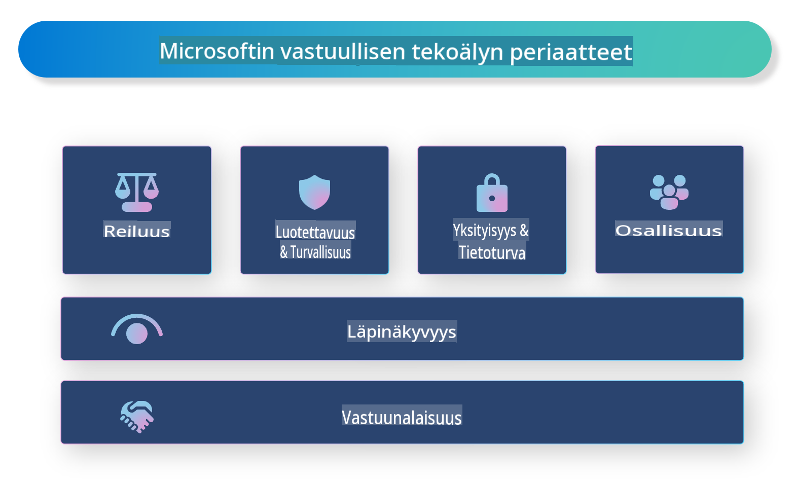

# **Esittele vastuullinen tekoäly**

[Microsoft Responsible AI](https://www.microsoft.com/ai/responsible-ai?WT.mc_id=aiml-138114-kinfeylo) on aloite, jonka tavoitteena on auttaa kehittäjiä ja organisaatioita rakentamaan tekoälyjärjestelmiä, jotka ovat läpinäkyviä, luotettavia ja vastuullisia. Aloite tarjoaa ohjeita ja resursseja vastuullisten tekoälyratkaisujen kehittämiseen, jotka noudattavat eettisiä periaatteita, kuten yksityisyyttä, oikeudenmukaisuutta ja läpinäkyvyyttä. Tarkastelemme myös joitakin vastuullisen tekoälyn rakentamiseen liittyviä haasteita ja parhaita käytäntöjä.

## Microsoft Responsible AI -yleiskatsaus

**Eettiset periaatteet**  

Microsoft Responsible AI perustuu eettisiin periaatteisiin, kuten yksityisyyteen, oikeudenmukaisuuteen, läpinäkyvyyteen, vastuullisuuteen ja turvallisuuteen. Näiden periaatteiden tarkoituksena on varmistaa, että tekoälyjärjestelmät kehitetään eettisesti ja vastuullisesti.

**Läpinäkyvä tekoäly**  

Microsoft Responsible AI korostaa läpinäkyvyyden merkitystä tekoälyjärjestelmissä. Tämä sisältää selkeiden selitysten tarjoamisen siitä, miten tekoälymallit toimivat, sekä varmistamisen, että datalähteet ja algoritmit ovat julkisesti saatavilla.

**Vastuullinen tekoäly**  

[Microsoft Responsible AI](https://www.microsoft.com/ai/responsible-ai?WT.mc_id=aiml-138114-kinfeylo) edistää vastuullisten tekoälyjärjestelmien kehittämistä, jotka voivat tarjota tietoa siitä, miten tekoälymallit tekevät päätöksiä. Tämä auttaa käyttäjiä ymmärtämään ja luottamaan tekoälyjärjestelmien tuottamiin tuloksiin.

**Osallisuus**  

Tekoälyjärjestelmät tulisi suunnitella hyödyttämään kaikkia. Microsoft pyrkii luomaan osallistavaa tekoälyä, joka ottaa huomioon erilaiset näkökulmat ja välttää ennakkoluuloja tai syrjintää.

**Luotettavuus ja turvallisuus**  

Tekoälyjärjestelmien luotettavuuden ja turvallisuuden varmistaminen on olennaista. Microsoft keskittyy rakentamaan kestäviä malleja, jotka toimivat johdonmukaisesti ja välttävät haitallisia seurauksia.

**Oikeudenmukaisuus tekoälyssä**  

Microsoft Responsible AI tunnistaa, että tekoälyjärjestelmät voivat ylläpitää ennakkoluuloja, jos ne koulutetaan vinoutuneella datalla tai algoritmeilla. Aloite tarjoaa ohjeita oikeudenmukaisten tekoälyjärjestelmien kehittämiseen, jotka eivät syrji esimerkiksi rodun, sukupuolen tai iän perusteella.

**Yksityisyys ja turvallisuus**  

Microsoft Responsible AI korostaa käyttäjien yksityisyyden ja dataturvallisuuden suojaamisen tärkeyttä tekoälyjärjestelmissä. Tämä sisältää vahvan datan salauksen ja pääsynhallinnan toteuttamisen sekä tekoälyjärjestelmien säännöllisen tarkastamisen haavoittuvuuksien varalta.

**Vastuullisuus ja vastuu**  

Microsoft Responsible AI edistää vastuullisuutta ja vastuunottoa tekoälyn kehittämisessä ja käyttöönotossa. Tämä sisältää sen varmistamisen, että kehittäjät ja organisaatiot ovat tietoisia tekoälyjärjestelmien mahdollisista riskeistä ja ryhtyvät toimiin niiden lieventämiseksi.

## Parhaat käytännöt vastuullisten tekoälyjärjestelmien rakentamiseen

**Käytä monipuolisia datasarjoja tekoälymallien kehittämisessä**  

Vinoutumien välttämiseksi tekoälyjärjestelmissä on tärkeää käyttää monipuolisia datasarjoja, jotka edustavat erilaisia näkökulmia ja kokemuksia.

**Hyödynnä selitettävän tekoälyn tekniikoita**  

Selitettävän tekoälyn tekniikat voivat auttaa käyttäjiä ymmärtämään, miten tekoälymallit tekevät päätöksiä, mikä lisää järjestelmän luotettavuutta.

**Tarkasta tekoälyjärjestelmät säännöllisesti haavoittuvuuksien varalta**  

Tekoälyjärjestelmien säännölliset tarkastukset voivat auttaa tunnistamaan mahdolliset riskit ja haavoittuvuudet, jotka on ratkaistava.

**Toteuta vahva datan salaus ja pääsynhallinta**  

Datan salaus ja pääsynhallinta voivat auttaa suojaamaan käyttäjien yksityisyyttä ja turvallisuutta tekoälyjärjestelmissä.

**Noudata tekoälyn kehityksessä eettisiä periaatteita**  

Eettisten periaatteiden, kuten oikeudenmukaisuuden, läpinäkyvyyden ja vastuullisuuden, noudattaminen voi auttaa rakentamaan luottamusta tekoälyjärjestelmiin ja varmistamaan niiden vastuullisen kehittämisen.

## Vastuullisen tekoälyn hyödyntäminen AI Foundrylla  

[Azure AI Foundry](https://ai.azure.com?WT.mc_id=aiml-138114-kinfeylo) on tehokas alusta, joka mahdollistaa kehittäjille ja organisaatioille älykkäiden, huipputeknisten, markkinavalmiiden ja vastuullisten sovellusten nopean luomisen. Tässä on joitakin Azure AI Foundryn keskeisiä ominaisuuksia ja kyvykkyyksiä:

**Valmiit API:t ja mallit**  

Azure AI Foundry tarjoaa valmiita ja muokattavia API-rajapintoja ja malleja. Ne kattavat laajan valikoiman tekoälytehtäviä, mukaan lukien generatiivinen tekoäly, luonnollisen kielen käsittely keskusteluihin, haku, monitorointi, käännös, puhe, visio ja päätöksenteko.

**Prompt Flow**  

Prompt Flow Azure AI Foundryssa mahdollistaa keskustelupohjaisten tekoälykokemusten luomisen. Sen avulla voit suunnitella ja hallita keskustelun kulkuja, mikä helpottaa chatbotien, virtuaaliavustajien ja muiden vuorovaikutteisten sovellusten rakentamista.

**Retrieval Augmented Generation (RAG)**  

RAG on tekniikka, joka yhdistää hakuun perustuvat ja generatiiviset lähestymistavat. Se parantaa tuotettujen vastausten laatua hyödyntämällä sekä olemassa olevaa tietoa (haku) että luovaa generointia (generointi).

**Generatiivisen tekoälyn arviointi- ja seurantamittarit**  

Azure AI Foundry tarjoaa työkaluja generatiivisten tekoälymallien arviointiin ja seurantaan. Voit arvioida niiden suorituskykyä, oikeudenmukaisuutta ja muita tärkeitä mittareita vastuullisen käyttöönoton varmistamiseksi. Lisäksi, jos olet luonut hallintapaneelin, voit käyttää Azure Machine Learning Studion kooditonta käyttöliittymää mukauttaaksesi ja luodaksesi vastuullisen tekoälyn hallintapaneelin ja siihen liittyvän tuloskortin [Responsible AI Toolbox](https://responsibleaitoolbox.ai/?WT.mc_id=aiml-138114-kinfeylo) Python-kirjastojen avulla. Tämä tuloskortti auttaa jakamaan keskeisiä näkemyksiä, kuten oikeudenmukaisuudesta ja ominaisuuksien tärkeydestä, sekä teknisten että ei-teknisten sidosryhmien kanssa.

Hyödyntääksesi AI Foundrya vastuullisessa tekoälyssä, voit noudattaa näitä parhaita käytäntöjä:

**Määrittele tekoälyjärjestelmäsi ongelma ja tavoitteet**  

Ennen kehitysprosessin aloittamista on tärkeää määritellä selkeästi ongelma tai tavoite, jonka tekoälyjärjestelmäsi pyrkii ratkaisemaan. Tämä auttaa tunnistamaan tarvittavat tiedot, algoritmit ja resurssit tehokkaan mallin rakentamiseksi.

**Kerää ja esikäsittele relevanttia dataa**  

Tekoälyjärjestelmän suorituskykyyn vaikuttaa merkittävästi sen koulutuksessa käytetyn datan laatu ja määrä. Siksi on tärkeää kerätä relevanttia dataa, puhdistaa se, esikäsitellä se ja varmistaa, että se edustaa väestöä tai ongelmaa, jota pyrit ratkaisemaan.

**Valitse sopivat arviointimenetelmät**  

Käytettävissä on useita arviointialgoritmeja. On tärkeää valita sopivin algoritmi datasi ja ongelmasi perusteella.

**Arvioi ja tulkitse malli**  

Kun olet rakentanut tekoälymallin, on tärkeää arvioida sen suorituskykyä sopivilla mittareilla ja tulkita tulokset läpinäkyvällä tavalla. Tämä auttaa tunnistamaan mallin mahdolliset vinoumat tai rajoitukset ja tekemään parannuksia tarvittaessa.

**Varmista läpinäkyvyys ja selitettävyys**  

Tekoälyjärjestelmien tulisi olla läpinäkyviä ja selitettäviä, jotta käyttäjät voivat ymmärtää, miten ne toimivat ja miten päätöksiä tehdään. Tämä on erityisen tärkeää sovelluksissa, joilla on merkittävä vaikutus ihmisten elämään, kuten terveydenhuollossa, rahoituksessa ja oikeusjärjestelmässä.

**Seuraa ja päivitä mallia**  

Tekoälyjärjestelmiä tulisi jatkuvasti seurata ja päivittää, jotta ne pysyvät tarkkoina ja tehokkaina ajan mittaan. Tämä vaatii jatkuvaa ylläpitoa, testausta ja mallin uudelleenkoulutusta.

Lopuksi, Microsoft Responsible AI on aloite, joka pyrkii auttamaan kehittäjiä ja organisaatioita rakentamaan tekoälyjärjestelmiä, jotka ovat läpinäkyviä, luotettavia ja vastuullisia. Muista, että vastuullisen tekoälyn toteuttaminen on olennaista, ja Azure AI Foundry pyrkii tekemään siitä käytännöllistä organisaatioille. Noudattamalla eettisiä periaatteita ja parhaita käytäntöjä voimme varmistaa, että tekoälyjärjestelmät kehitetään ja otetaan käyttöön vastuullisesti, yhteiskuntaa hyödyttävällä tavalla.

**Vastuuvapauslauseke**:  
Tämä asiakirja on käännetty konepohjaisilla tekoälykäännöspalveluilla. Pyrimme tarkkuuteen, mutta huomioithan, että automaattiset käännökset voivat sisältää virheitä tai epätarkkuuksia. Alkuperäistä asiakirjaa sen alkuperäisellä kielellä tulee pitää auktoritatiivisena lähteenä. Kriittisen tiedon osalta suositellaan ammattimaista ihmiskääntäjää. Emme ole vastuussa tämän käännöksen käytöstä aiheutuvista väärinkäsityksistä tai virhetulkinnoista.