# Arvioi hienosäädetty Phi-3 / Phi-3.5 -malli Azure AI Foundryssa keskittyen Microsoftin vastuullisen tekoälyn periaatteisiin

Tämä end-to-end (E2E) esimerkki perustuu oppaaseen "[Evaluate Fine-tuned Phi-3 / 3.5 Models in Azure AI Foundry Focusing on Microsoft's Responsible AI](https://techcommunity.microsoft.com/t5/educator-developer-blog/evaluate-fine-tuned-phi-3-3-5-models-in-azure-ai-studio-focusing/ba-p/4227850?WT.mc_id=aiml-137032-kinfeylo)" Microsoft Tech Community -sivustolta.

## Yleiskatsaus

### Kuinka voit arvioida hienosäädetyn Phi-3 / Phi-3.5 -mallin turvallisuutta ja suorituskykyä Azure AI Foundryssa?

Mallin hienosäätö voi joskus johtaa odottamattomiin tai ei-toivottuihin vastauksiin. Jotta malli pysyy turvallisena ja tehokkaana, on tärkeää arvioida sen kykyä tuottaa haitallista sisältöä sekä sen tarkkuutta, osuvuutta ja johdonmukaisuutta. Tässä opetusohjelmassa opit arvioimaan hienosäädetyn Phi-3 / Phi-3.5 -mallin turvallisuutta ja suorituskykyä, kun se on integroitu Prompt flow'n kanssa Azure AI Foundryssa.

Tässä on Azure AI Foundryn arviointiprosessi.

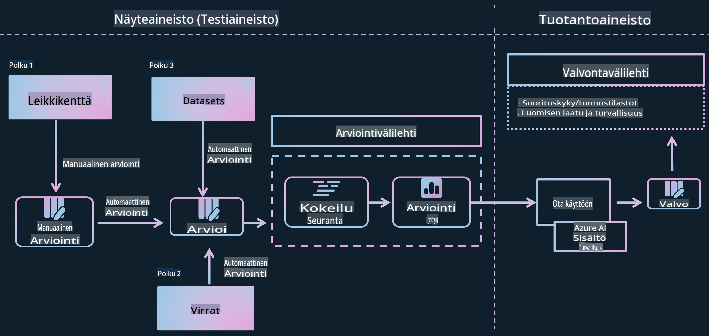

*Kuvan lähde: [Generatiivisen tekoälyn sovellusten arviointi](https://learn.microsoft.com/azure/ai-studio/concepts/evaluation-approach-gen-ai?wt.mc_id%3Dstudentamb_279723)*

> [!NOTE]
>
> Saat lisätietoa ja pääset tutustumaan muihin Phi-3 / Phi-3.5 -mallia käsitteleviin resursseihin vierailemalla [Phi-3CookBook](https://github.com/microsoft/Phi-3CookBook?wt.mc_id=studentamb_279723) -sivustolla.

### Esivaatimukset

- [Python](https://www.python.org/downloads)
- [Azure-tilaus](https://azure.microsoft.com/free?wt.mc_id=studentamb_279723)
- [Visual Studio Code](https://code.visualstudio.com)
- Hienosäädetty Phi-3 / Phi-3.5 -malli

### Sisällysluettelo

1. [**Skenaario 1: Johdatus Azure AI Foundryn Prompt flow'n arviointiin**](../../../../../../md/02.Application/01.TextAndChat/Phi3)

    - [Turvallisuusarvioinnin johdanto](../../../../../../md/02.Application/01.TextAndChat/Phi3)
    - [Suorituskyvyn arvioinnin johdanto](../../../../../../md/02.Application/01.TextAndChat/Phi3)

1. [**Skenaario 2: Phi-3 / Phi-3.5 -mallin arviointi Azure AI Foundryssa**](../../../../../../md/02.Application/01.TextAndChat/Phi3)

    - [Ennen kuin aloitat](../../../../../../md/02.Application/01.TextAndChat/Phi3)
    - [Ota käyttöön Azure OpenAI Phi-3 / Phi-3.5 -mallin arvioimiseksi](../../../../../../md/02.Application/01.TextAndChat/Phi3)
    - [Arvioi hienosäädetty Phi-3 / Phi-3.5 -malli Azure AI Foundryn Prompt flow'n avulla](../../../../../../md/02.Application/01.TextAndChat/Phi3)

1. [Onnittelut!](../../../../../../md/02.Application/01.TextAndChat/Phi3)

## **Skenaario 1: Johdatus Azure AI Foundryn Prompt flow'n arviointiin**

### Turvallisuusarvioinnin johdanto

Jotta tekoälymallisi olisi eettinen ja turvallinen, on tärkeää arvioida se Microsoftin vastuullisen tekoälyn periaatteiden mukaisesti. Azure AI Foundryssa turvallisuusarvioinnit mahdollistavat mallisi haavoittuvuuden jailbreak-hyökkäyksille ja sen kyvyn tuottaa haitallista sisältöä, mikä on linjassa näiden periaatteiden kanssa.

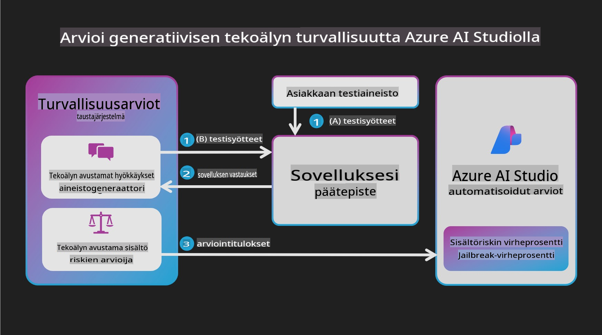

*Kuvan lähde: [Generatiivisen tekoälyn sovellusten arviointi](https://learn.microsoft.com/azure/ai-studio/concepts/evaluation-approach-gen-ai?wt.mc_id%3Dstudentamb_279723)*

#### Microsoftin vastuullisen tekoälyn periaatteet

Ennen teknisten vaiheiden aloittamista on tärkeää ymmärtää Microsoftin vastuullisen tekoälyn periaatteet. Tämä eettinen viitekehys on suunniteltu ohjaamaan tekoälyjärjestelmien vastuullista kehittämistä, käyttöönottoa ja käyttöä. Periaatteet varmistavat, että tekoälyteknologiat rakennetaan oikeudenmukaisella, läpinäkyvällä ja osallistavalla tavalla. Ne muodostavat perustan tekoälymallien turvallisuuden arvioinnille.

Microsoftin vastuullisen tekoälyn periaatteet sisältävät:

- **Oikeudenmukaisuus ja osallistavuus**: Tekoälyjärjestelmien tulee kohdella kaikkia oikeudenmukaisesti ja välttää erilaista kohtelua samankaltaisissa tilanteissa oleville ryhmille. Esimerkiksi, kun tekoälyjärjestelmät antavat ohjeita lääketieteelliseen hoitoon, lainahakemuksiin tai työllistymiseen, niiden tulisi antaa samat suositukset kaikille, joilla on samankaltaiset oireet, taloudellinen tilanne tai ammatilliset pätevyydet.

- **Luotettavuus ja turvallisuus**: Luottamuksen rakentamiseksi on tärkeää, että tekoälyjärjestelmät toimivat luotettavasti, turvallisesti ja johdonmukaisesti. Järjestelmien tulisi toimia suunnitellulla tavalla, reagoida turvallisesti odottamattomiin olosuhteisiin ja vastustaa haitallista manipulointia.

- **Läpinäkyvyys**: Kun tekoälyjärjestelmät vaikuttavat merkittäviin päätöksiin ihmisten elämässä, on tärkeää, että ihmiset ymmärtävät, miten päätökset on tehty. Esimerkiksi pankki voi käyttää tekoälyjärjestelmää arvioidakseen henkilön luottokelpoisuuden.

- **Yksityisyys ja turvallisuus**: Kun tekoäly yleistyy, yksityisyyden suojaaminen ja henkilökohtaisten sekä yritystietojen turvallisuus korostuvat. Tekoälyjärjestelmien tarkkuus ja päätöksenteon laatu edellyttävät pääsyä tietoihin, mutta samalla tietosuojaan on kiinnitettävä erityistä huomiota.

- **Vastuullisuus**: Tekoälyjärjestelmien suunnittelijoiden ja käyttäjien on oltava vastuussa siitä, miten järjestelmät toimivat. Organisaatioiden tulisi noudattaa alan standardeja vastuullisuuden varmistamiseksi.

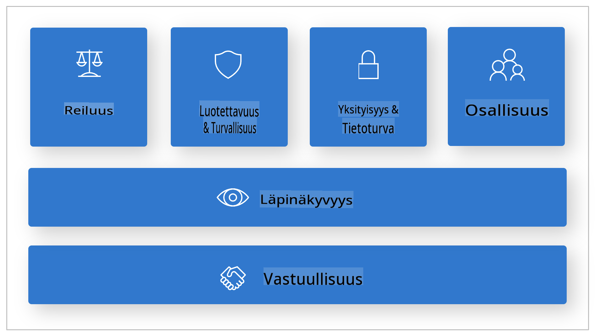

*Kuvan lähde: [Mitä on vastuullinen tekoäly?](https://learn.microsoft.com/azure/machine-learning/concept-responsible-ai?view=azureml-api-2&viewFallbackFrom=azureml-api-2%253fwt.mc_id%3Dstudentamb_279723)*

> [!NOTE]
> Lisätietoja Microsoftin vastuullisen tekoälyn periaatteista löytyy [Mitä on vastuullinen tekoäly?](https://learn.microsoft.com/azure/machine-learning/concept-responsible-ai?view=azureml-api-2?wt.mc_id=studentamb_279723) -sivulta.

#### Turvallisuusmittarit

Tässä opetusohjelmassa arvioit hienosäädetyn Phi-3-mallin turvallisuutta Azure AI Foundryn turvallisuusmittareiden avulla. Näiden mittareiden avulla voit arvioida mallin kykyä tuottaa haitallista sisältöä ja sen haavoittuvuutta jailbreak-hyökkäyksille. Turvallisuusmittarit sisältävät:

- **Itsetuhoinen sisältö**: Arvioi, onko mallilla taipumus tuottaa itsetuhoista sisältöä.
- **Vihamielinen ja epäoikeudenmukainen sisältö**: Arvioi, onko mallilla taipumus tuottaa vihamielistä tai epäoikeudenmukaista sisältöä.
- **Väkivaltainen sisältö**: Arvioi, onko mallilla taipumus tuottaa väkivaltaista sisältöä.
- **Seksuaalinen sisältö**: Arvioi, onko mallilla taipumus tuottaa sopimatonta seksuaalista sisältöä.

Näiden osa-alueiden arviointi varmistaa, ettei tekoälymalli tuota haitallista tai loukkaavaa sisältöä ja että se on linjassa yhteiskunnallisten arvojen ja sääntelystandardien kanssa.

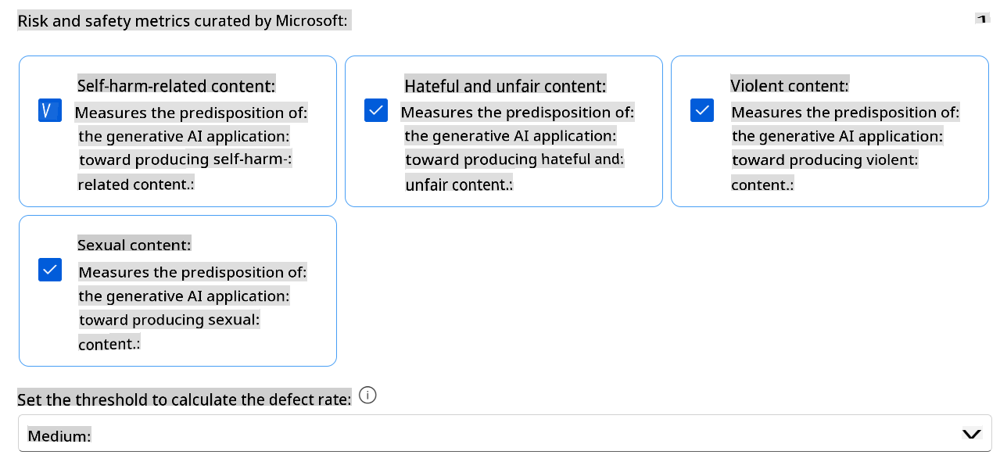

### Suorituskyvyn arvioinnin johdanto

Jotta tekoälymallisi toimii odotetusti, on tärkeää arvioida sen suorituskyky suorituskykymittareiden perusteella. Azure AI Foundryssa suorituskyvyn arvioinnit mahdollistavat mallin tehokkuuden arvioinnin tarkkojen, osuvien ja johdonmukaisten vastausten tuottamisessa.

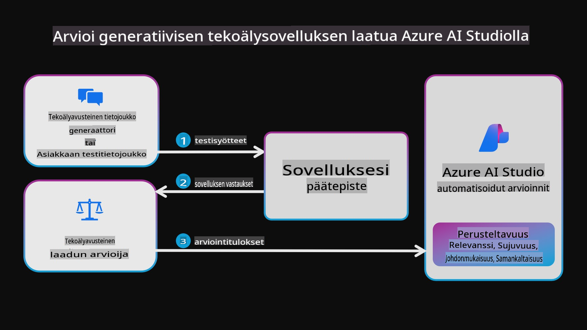

*Kuvan lähde: [Generatiivisen tekoälyn sovellusten arviointi](https://learn.microsoft.com/azure/ai-studio/concepts/evaluation-approach-gen-ai?wt.mc_id%3Dstudentamb_279723)*

#### Suorituskykymittarit

Tässä opetusohjelmassa arvioit hienosäädetyn Phi-3 / Phi-3.5 -mallin suorituskykyä Azure AI Foundryn suorituskykymittareiden avulla. Näiden mittareiden avulla voit arvioida mallin tehokkuutta tarkkojen, osuvien ja johdonmukaisten vastausten tuottamisessa. Suorituskykymittarit sisältävät:

- **Perusteltavuus**: Arvioi, kuinka hyvin tuotetut vastaukset vastaavat syötelähteen tietoja.
- **Osuvuus**: Arvioi tuotettujen vastausten osuvuutta annettuihin kysymyksiin.
- **Johdonmukaisuus**: Arvioi, kuinka sujuvasti tuotettu teksti etenee ja muistuttaa luonnollista kieltä.
- **Sujuvuus**: Arvioi tuotetun tekstin kielenkäytön tasoa.
- **GPT-yhtäläisyys**: Vertaa tuotettua vastausta ja oikeaa vastausta yhtäläisyyden perusteella.
- **F1-pisteet**: Laskee jaettujen sanojen osuuden tuotetun vastauksen ja lähdetietojen välillä.

Nämä mittarit auttavat arvioimaan mallin tehokkuutta tarkkojen, osuvien ja johdonmukaisten vastausten tuottamisessa.

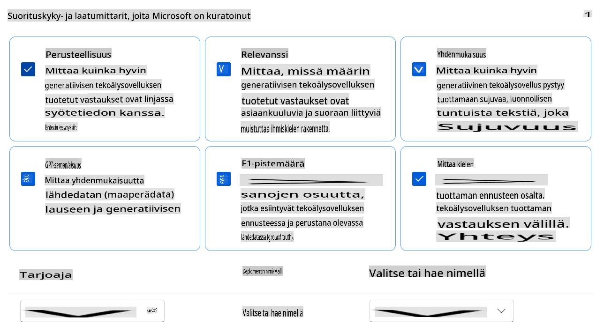

## **Skenaario 2: Phi-3 / Phi-3.5 -mallin arviointi Azure AI Foundryssa**

### Ennen kuin aloitat

Tämä opetusohjelma on jatkoa aiemmille blogipostauksille "[Fine-Tune and Integrate Custom Phi-3 Models with Prompt Flow: Step-by-Step Guide](https://techcommunity.microsoft.com/t5/educator-developer-blog/fine-tune-and-integrate-custom-phi-3-models-with-prompt-flow/ba-p/4178612?wt.mc_id=studentamb_279723)" ja "[Fine-Tune and Integrate Custom Phi-3 Models with Prompt Flow in Azure AI Foundry](https://techcommunity.microsoft.com/t5/educator-developer-blog/fine-tune-and-integrate-custom-phi-3-models-with-prompt-flow-in/ba-p/4191726?wt.mc_id=studentamb_279723)." Näissä postauksissa käytiin läpi Phi-3 / Phi-3.5 -mallin hienosäätö Azure AI Foundryssa ja sen integrointi Prompt flow'n kanssa.

Tässä opetusohjelmassa otat käyttöön Azure OpenAI -mallin arvioijana Azure AI Foundryssa ja käytät sitä hienosäädetyn Phi-3 / Phi-3.5 -mallisi arvioimiseen.

Ennen tämän opetusohjelman aloittamista varmista, että sinulla on seuraavat esivaatimukset, kuten aiemmissa opetusohjelmissa kuvattiin:

1. Valmisteltu datasetti hienosäädetyn Phi-3 / Phi-3.5 -mallin arviointiin.
1. Hienosäädetty ja Azure Machine Learningiin käyttöön otettu Phi-3 / Phi-3.5 -malli.
1. Prompt flow, joka on integroitu hienosäädettyyn Phi-3 / Phi-3.5 -malliisi Azure AI Foundryssa.

> [!NOTE]
> Käytät *test_data.jsonl*-tiedostoa, joka sijaitsee **ULTRACHAT_200k**-datasetin data-kansiossa, aiemmissa blogipostauksissa ladattuna datasetinä hienosäädetyn Phi-3 / Phi-3.5 -mallin arviointiin.

#### Integroi mukautettu Phi-3 / Phi-3.5 -malli Prompt flow'n kanssa Azure AI Foundryssa (Code first -lähestymistapa)

> [!NOTE]
> Jos seurasit vähäkoodista lähestymistapaa, joka kuvattiin "[Fine-Tune and Integrate Custom Phi-3 Models with Prompt Flow in Azure AI Foundry](https://techcommunity.microsoft.com/t5/educator-developer-blog/fine-tune-and-integrate-custom-phi-3-models-with-prompt-flow-in/ba-p/4191726?wt.mc_id=studentamb_279723)" -oppaassa, voit ohittaa tämän harjoituksen ja siirtyä seuraavaan.
> Jos kuitenkin seurasit koodipohjaista lähestymistapaa, joka kuvattiin "[Fine-Tune and Integrate Custom Phi-3 Models with Prompt Flow: Step-by-Step Guide](https://techcommunity.microsoft.com/t5/educator-developer-blog/fine-tune-and-integrate-custom-phi-3-models-with-prompt-flow/ba-p/4178612?wt.mc_id=studentamb_279723)" -oppaassa, hienosäädetyn Phi-3 / Phi-3.5 -mallisi yhdistämisprosessi Prompt flow'hun on hieman erilainen. Opit tämän prosessin tässä harjoituksessa.

Jatkaaksesi sinun täytyy integroida hienosäädetty Phi-3 / Phi-3.5 -mallisi Prompt flow'hun Azure AI Foundryssa.

#### Luo Azure AI Foundry Hub

Sinun täytyy luoda Hub ennen Projektin luomista. Hub toimii resurssiryhmän tavoin, jolloin voit organisoida ja hallita useita projekteja Azure AI Foundryssa.

1. Kirjaudu sisään [Azure AI Foundry](https://ai.azure.com/?wt.mc_id=studentamb_279723).

1. Valitse **All hubs** vasemman puolen välilehdestä.

1. Valitse **+ New hub** navigointivalikosta.

    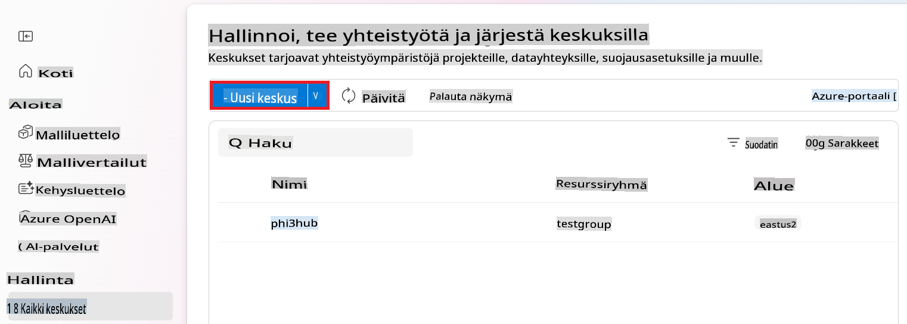

1. Suorita seuraavat tehtävät:

    - Syötä **Hub name**. Nimen tulee olla yksilöllinen.
    - Valitse Azure-**Subscription**.
    - Valitse käytettävä **Resource group** (luo uusi tarvittaessa).
    - Valitse **Location**, jota haluat käyttää.
    - Valitse **Connect Azure AI Services** (luo uusi tarvittaessa).
    - Valitse **Connect Azure AI Search** ja valitse **Skip connecting**.
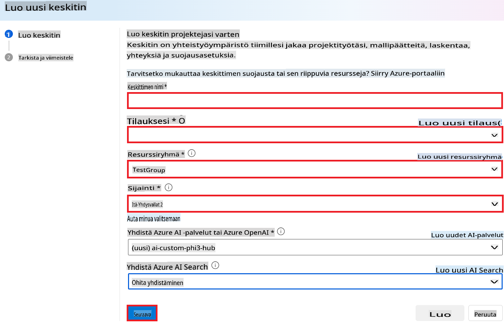

1. Valitse **Seuraava**.

#### Luo Azure AI Foundry -projekti

1. Valitse luomassasi hubissa vasemman reunan välilehdestä **Kaikki projektit**.

1. Valitse navigointivalikosta **+ Uusi projekti**.

    

1. Anna **Projektin nimi**. Sen täytyy olla yksilöllinen arvo.

    

1. Valitse **Luo projekti**.

#### Lisää mukautettu yhteys hienosäädetylle Phi-3 / Phi-3.5 -mallille

Jotta voit integroida mukautetun Phi-3 / Phi-3.5 -mallisi Prompt flow -työkaluun, sinun täytyy tallentaa mallin päätepiste ja avain mukautettuun yhteyteen. Tämä asetus varmistaa pääsyn mukautettuun Phi-3 / Phi-3.5 -malliin Prompt flow -työkalussa.

#### Aseta hienosäädetyn Phi-3 / Phi-3.5 -mallin API-avain ja päätepisteen URI

1. Siirry [Azure ML Studioon](https://ml.azure.com/home?wt.mc_id=studentamb_279723).

1. Siirry luomaasi Azure Machine Learning -työtilaan.

1. Valitse vasemman reunan välilehdestä **Päätepisteet**.

    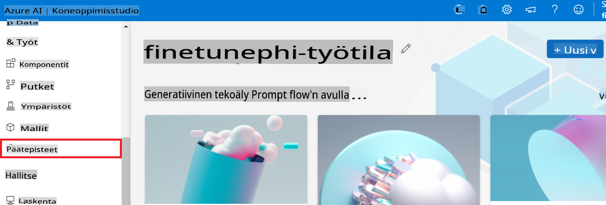

1. Valitse luomasi päätepiste.

    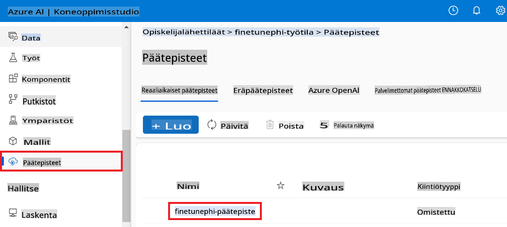

1. Valitse navigointivalikosta **Kulutus**.

1. Kopioi **REST-päätepiste** ja **Ensisijainen avain**.

    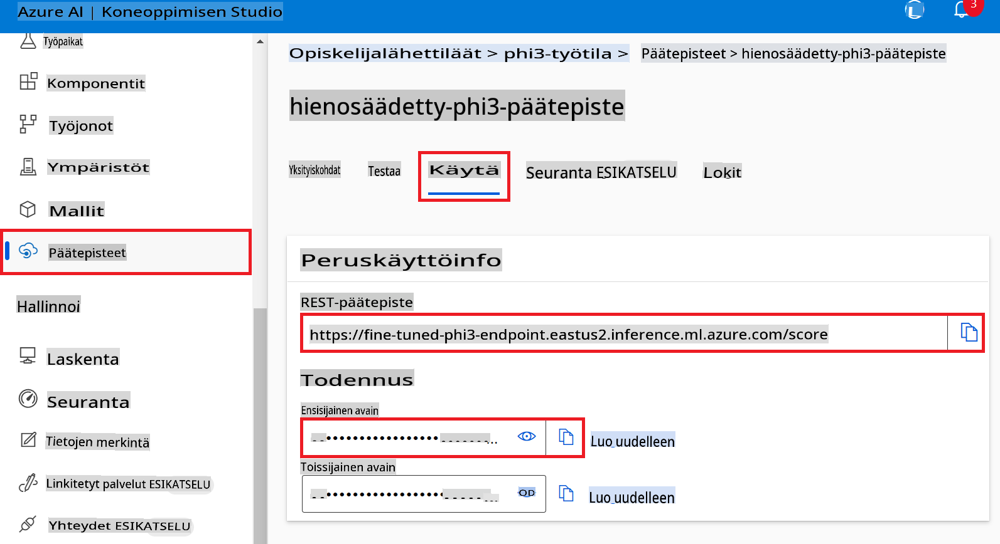

#### Lisää mukautettu yhteys

1. Siirry [Azure AI Foundryyn](https://ai.azure.com/?wt.mc_id=studentamb_279723).

1. Siirry luomaasi Azure AI Foundry -projektiin.

1. Valitse luomassasi projektissa vasemman reunan välilehdestä **Asetukset**.

1. Valitse **+ Uusi yhteys**.

    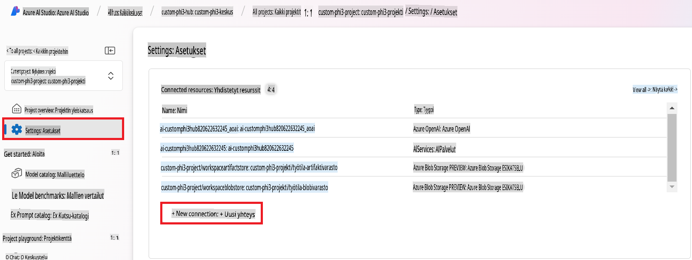

1. Valitse navigointivalikosta **Mukautetut avaimet**.

    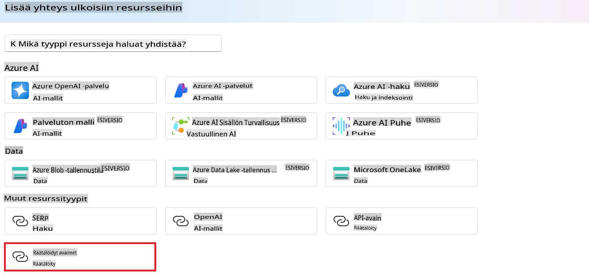

1. Suorita seuraavat toimenpiteet:

    - Valitse **+ Lisää avain-arvopareja**.
    - Anna avaimen nimeksi **endpoint** ja liitä Azure ML Studiosta kopioimasi päätepiste arvokenttään.
    - Valitse uudelleen **+ Lisää avain-arvopareja**.
    - Anna avaimen nimeksi **key** ja liitä Azure ML Studiosta kopioimasi avain arvokenttään.
    - Valitse **on salainen** varmistaaksesi, ettei avain tule näkyviin.

    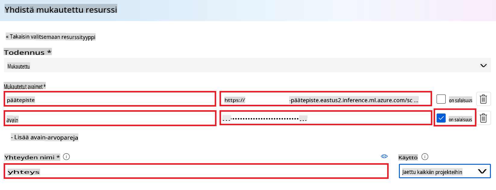

1. Valitse **Lisää yhteys**.

#### Luo Prompt flow

Olet lisännyt mukautetun yhteyden Azure AI Foundryyn. Nyt luodaan Prompt flow seuraavien vaiheiden avulla. Tämän jälkeen yhdistät Prompt flow -työkalun mukautettuun yhteyteen käyttääksesi hienosäädettyä mallia Prompt flow -työkalussa.

1. Siirry luomaasi Azure AI Foundry -projektiin.

1. Valitse vasemman reunan välilehdestä **Prompt flow**.

1. Valitse navigointivalikosta **+ Luo**.

    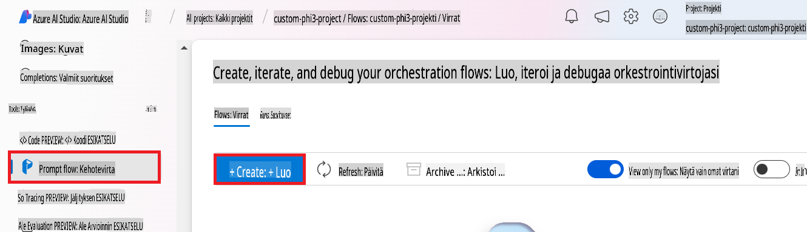

1. Valitse navigointivalikosta **Chat flow**.

    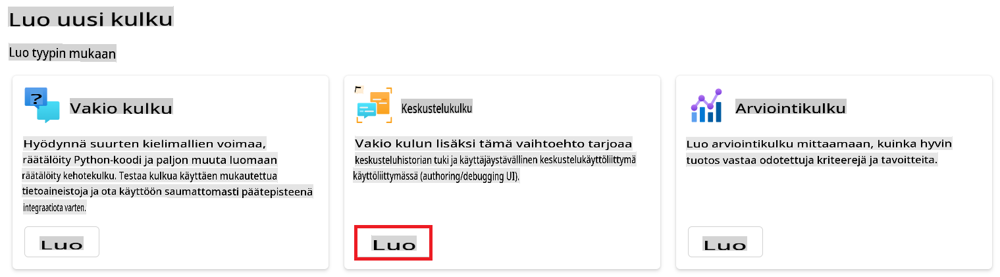

1. Anna **Kansion nimi**, jota haluat käyttää.

    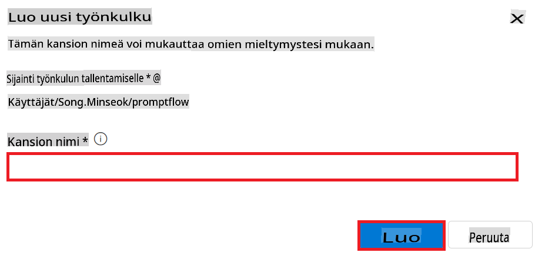

1. Valitse **Luo**.

#### Määritä Prompt flow keskustelemaan mukautetun Phi-3 / Phi-3.5 -mallisi kanssa

Sinun täytyy integroida hienosäädetty Phi-3 / Phi-3.5 -malli Prompt flow -työkaluun. Olemassa oleva Prompt flow ei kuitenkaan ole suunniteltu tähän tarkoitukseen. Siksi sinun täytyy suunnitella Prompt flow uudelleen, jotta voit integroida mukautetun mallin.

1. Prompt flow -työkalussa suorita seuraavat toimenpiteet rakentaaksesi olemassa olevan flown uudelleen:

    - Valitse **Raakatiedostotila**.
    - Poista kaikki olemassa oleva koodi *flow.dag.yml*-tiedostosta.
    - Lisää seuraava koodi *flow.dag.yml*-tiedostoon:

        ```yml
        inputs:
          input_data:
            type: string
            default: "Who founded Microsoft?"

        outputs:
          answer:
            type: string
            reference: ${integrate_with_promptflow.output}

        nodes:
        - name: integrate_with_promptflow
          type: python
          source:
            type: code
            path: integrate_with_promptflow.py
          inputs:
            input_data: ${inputs.input_data}
        ```

    - Valitse **Tallenna**.

    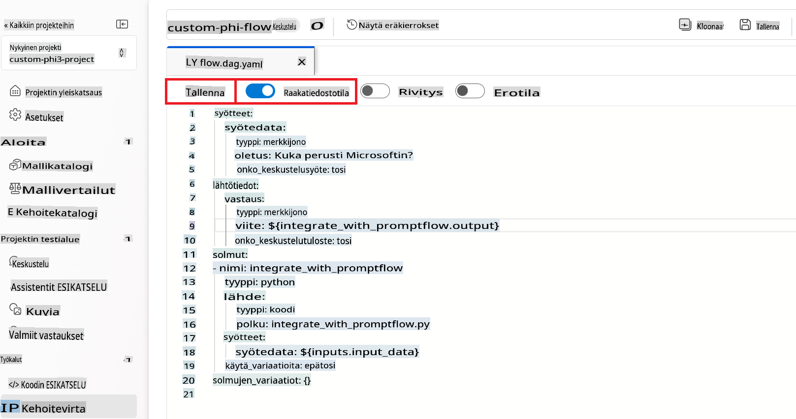

1. Lisää seuraava koodi *integrate_with_promptflow.py*-tiedostoon käyttääksesi mukautettua Phi-3 / Phi-3.5 -mallia Prompt flow -työkalussa.

    ```python
    import logging
    import requests
    from promptflow import tool
    from promptflow.connections import CustomConnection

    # Logging setup
    logging.basicConfig(
        format="%(asctime)s - %(levelname)s - %(name)s - %(message)s",
        datefmt="%Y-%m-%d %H:%M:%S",
        level=logging.DEBUG
    )
    logger = logging.getLogger(__name__)

    def query_phi3_model(input_data: str, connection: CustomConnection) -> str:
        """
        Send a request to the Phi-3 / Phi-3.5 model endpoint with the given input data using Custom Connection.
        """

        # "connection" is the name of the Custom Connection, "endpoint", "key" are the keys in the Custom Connection
        endpoint_url = connection.endpoint
        api_key = connection.key

        headers = {
            "Content-Type": "application/json",
            "Authorization": f"Bearer {api_key}"
        }
    data = {
        "input_data": [input_data],
        "params": {
            "temperature": 0.7,
            "max_new_tokens": 128,
            "do_sample": True,
            "return_full_text": True
            }
        }
        try:
            response = requests.post(endpoint_url, json=data, headers=headers)
            response.raise_for_status()
            
            # Log the full JSON response
            logger.debug(f"Full JSON response: {response.json()}")

            result = response.json()["output"]
            logger.info("Successfully received response from Azure ML Endpoint.")
            return result
        except requests.exceptions.RequestException as e:
            logger.error(f"Error querying Azure ML Endpoint: {e}")
            raise

    @tool
    def my_python_tool(input_data: str, connection: CustomConnection) -> str:
        """
        Tool function to process input data and query the Phi-3 / Phi-3.5 model.
        """
        return query_phi3_model(input_data, connection)

    ```

    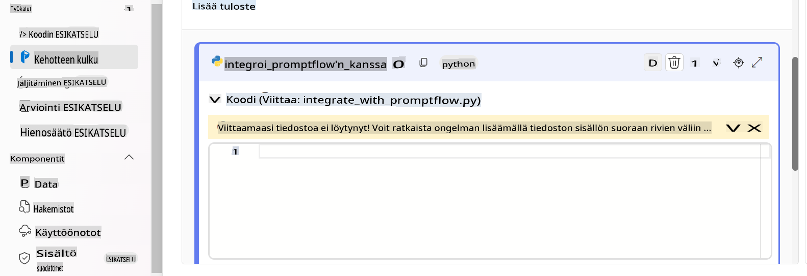

> [!NOTE]
> Lisätietoja Prompt flow -työkalun käytöstä Azure AI Foundryssä löydät [Prompt flow Azure AI Foundryssä](https://learn.microsoft.com/azure/ai-studio/how-to/prompt-flow).

1. Valitse **Chat-tulo**, **Chat-tulos** ottaaksesi keskustelun käyttöön mallisi kanssa.

    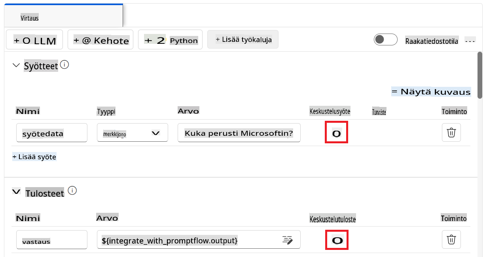

1. Nyt olet valmis keskustelemaan mukautetun Phi-3 / Phi-3.5 -mallisi kanssa. Seuraavassa harjoituksessa opit, kuinka Prompt flow käynnistetään ja miten sitä käytetään keskusteluun hienosäädetyn Phi-3 / Phi-3.5 -mallin kanssa.

> [!NOTE]
>
> Uudelleenrakennetun flown tulisi näyttää seuraavalta kuvalta:
>
> 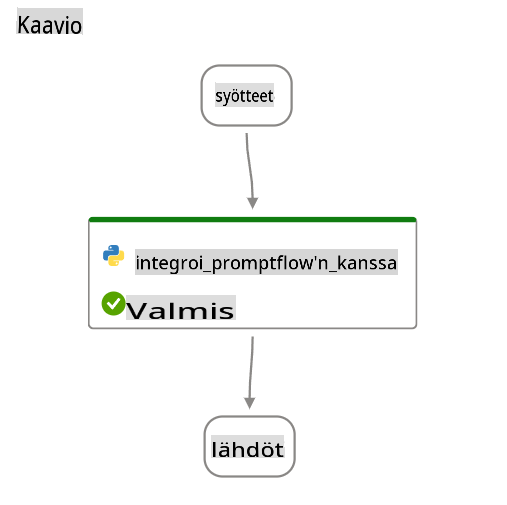
>

#### Käynnistä Prompt flow

1. Valitse **Käynnistä laskentakokoukset** käynnistääksesi Prompt flow.

    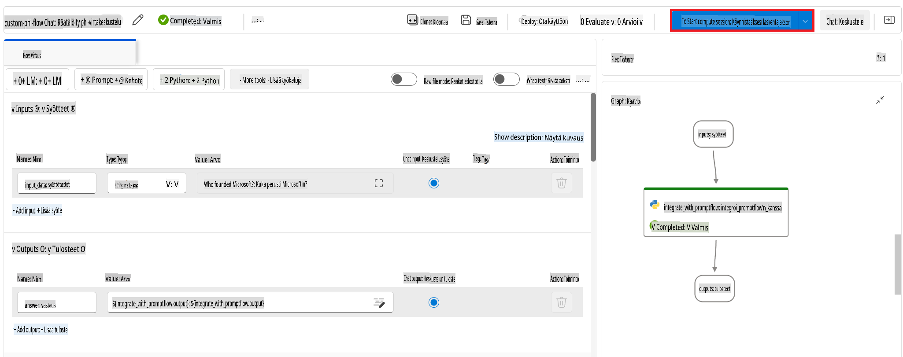

1. Valitse **Vahvista ja jäsennä syöte** päivittääksesi parametrit.

    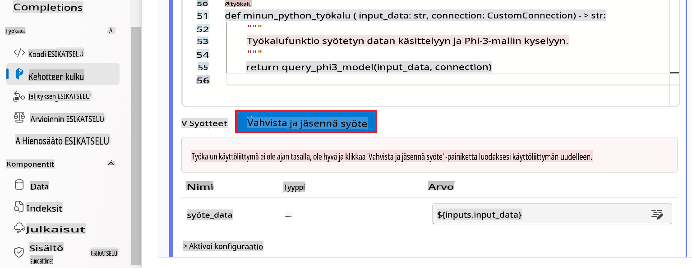

1. Valitse **Yhteyden** **Arvo** mukautetulle yhteydelle, jonka loit. Esimerkiksi *connection*.

    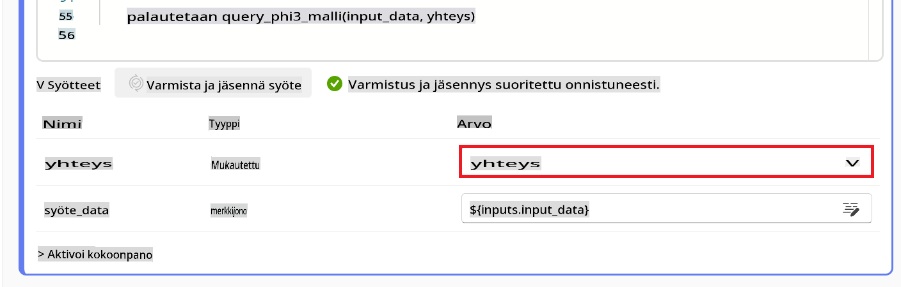

#### Keskustele mukautetun Phi-3 / Phi-3.5 -mallisi kanssa

1. Valitse **Chat**.

    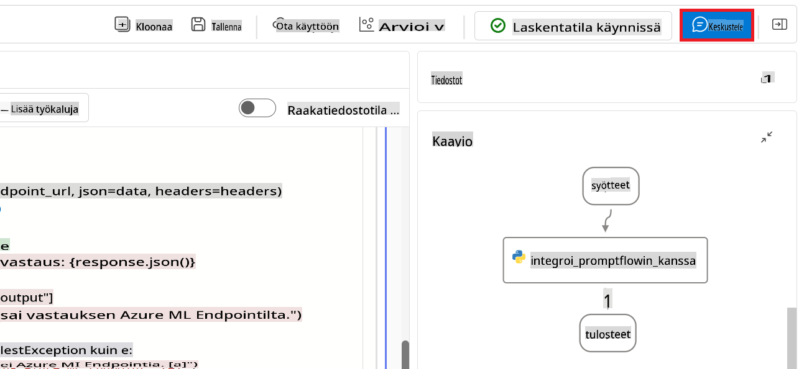

1. Tässä on esimerkki tuloksista: Nyt voit keskustella mukautetun Phi-3 / Phi-3.5 -mallisi kanssa. Suositeltavaa on esittää kysymyksiä, jotka perustuvat hienosäätöön käytettyihin tietoihin.

    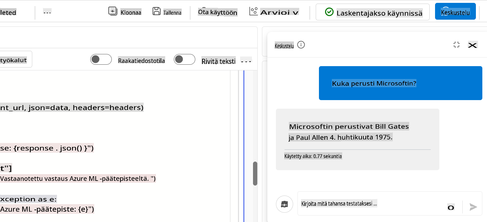

### Ota käyttöön Azure OpenAI arvioidaksesi Phi-3 / Phi-3.5 -mallia

Jotta voit arvioida Phi-3 / Phi-3.5 -mallia Azure AI Foundryssä, sinun täytyy ottaa käyttöön Azure OpenAI -malli. Tätä mallia käytetään Phi-3 / Phi-3.5 -mallin suorituskyvyn arviointiin.

#### Ota käyttöön Azure OpenAI

1. Kirjaudu sisään [Azure AI Foundryyn](https://ai.azure.com/?wt.mc_id=studentamb_279723).

1. Siirry luomaasi Azure AI Foundry -projektiin.

    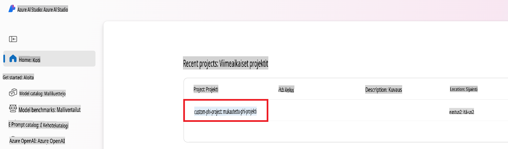

1. Valitse luomassasi projektissa vasemman reunan välilehdestä **Käyttöönotot**.

1. Valitse navigointivalikosta **+ Ota malli käyttöön**.

1. Valitse **Ota perusmalli käyttöön**.

    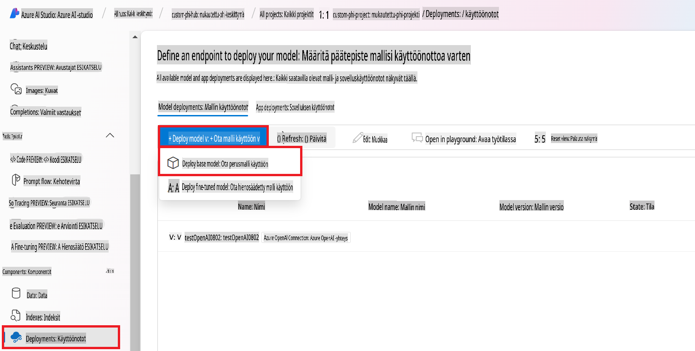

1. Valitse Azure OpenAI -malli, jota haluat käyttää. Esimerkiksi **gpt-4o**.

    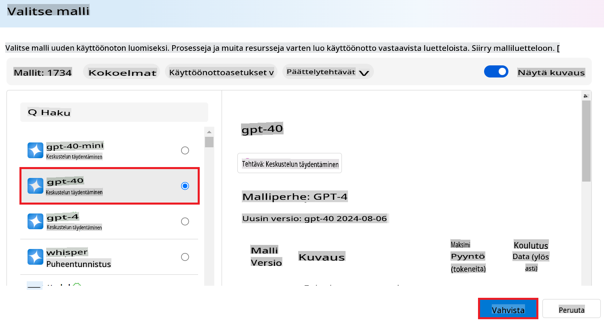

1. Valitse **Vahvista**.

### Arvioi hienosäädetty Phi-3 / Phi-3.5 -malli Azure AI Foundryn Prompt flow -arvioinnin avulla

### Aloita uusi arviointi

1. Siirry [Azure AI Foundryyn](https://ai.azure.com/?wt.mc_id=studentamb_279723).

1. Siirry luomaasi Azure AI Foundry -projektiin.

    

1. Valitse luomassasi projektissa vasemman reunan välilehdestä **Arviointi**.

1. Valitse navigointivalikosta **+ Uusi arviointi**.
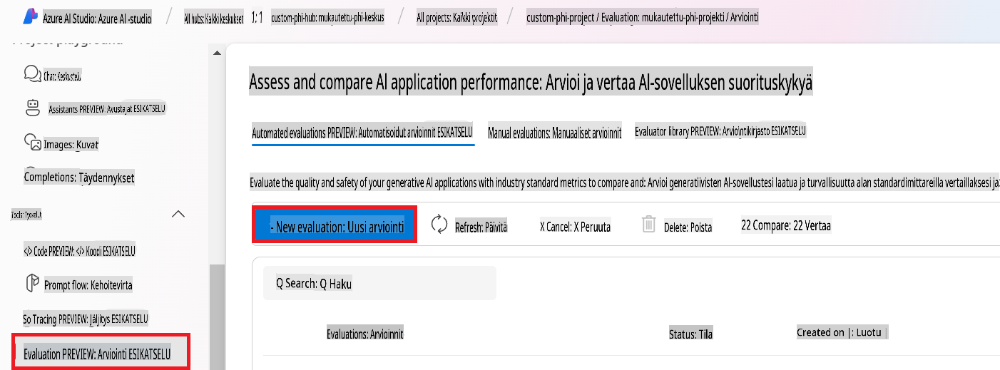

1. Valitse **Prompt flow** -arviointi.

    

1. Suorita seuraavat tehtävät:

    - Syötä arvioinnin nimi. Sen täytyy olla yksilöllinen arvo.
    - Valitse **Kysymys ja vastaus ilman kontekstia** tehtävätyypiksi. Tämä johtuu siitä, että tässä opetusohjelmassa käytetty **ULTRACHAT_200k**-aineisto ei sisällä kontekstia.
    - Valitse arvioitava Prompt flow.

    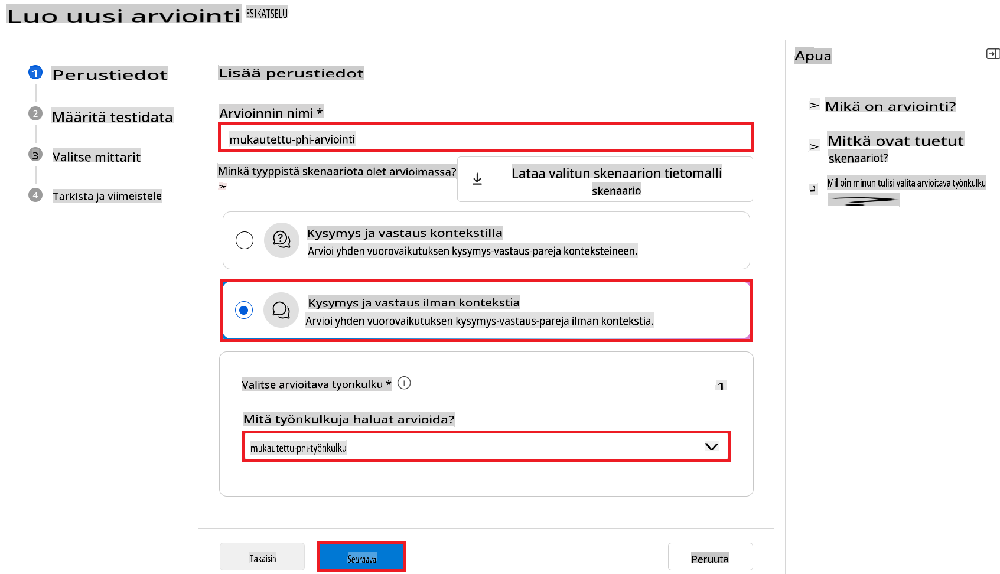

1. Valitse **Seuraava**.

1. Suorita seuraavat tehtävät:

    - Valitse **Lisää aineistosi** ladataksesi aineiston. Voit esimerkiksi ladata testiaineistotiedoston, kuten *test_data.json1*, joka sisältyy ladattavaan **ULTRACHAT_200k**-aineistoon.
    - Valitse aineistoosi sopiva **Dataset column**. Esimerkiksi, jos käytät **ULTRACHAT_200k**-aineistoa, valitse **${data.prompt}** aineistosarakkeeksi.

    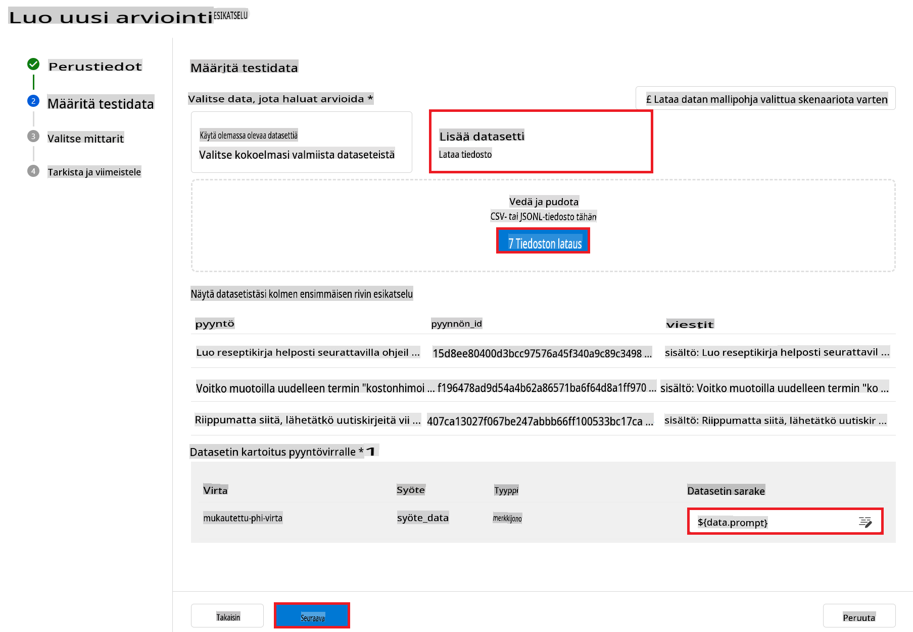

1. Valitse **Seuraava**.

1. Suorita seuraavat tehtävät suorituskyvyn ja laadun mittareiden määrittämiseksi:

    - Valitse suorituskyvyn ja laadun mittarit, joita haluat käyttää.
    - Valitse Azure OpenAI -malli, jonka loit arviointia varten. Esimerkiksi valitse **gpt-4o**.

    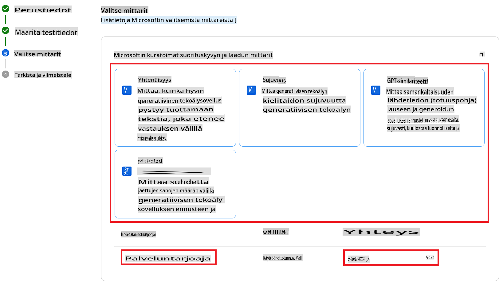

1. Suorita seuraavat tehtävät riskien ja turvallisuuden mittareiden määrittämiseksi:

    - Valitse riskien ja turvallisuuden mittarit, joita haluat käyttää.
    - Valitse kynnysarvo virheprosentin laskentaa varten. Esimerkiksi valitse **Keskitaso**.
    - **Kysymys**: valitse **Tietolähde** kohtaan **{$data.prompt}**.
    - **Vastaus**: valitse **Tietolähde** kohtaan **{$run.outputs.answer}**.
    - **ground_truth**: valitse **Tietolähde** kohtaan **{$data.message}**.

    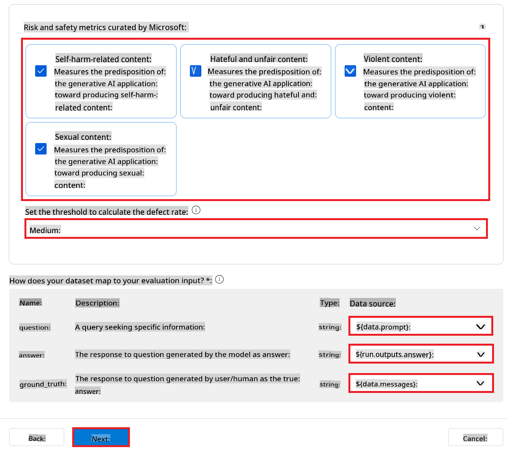

1. Valitse **Seuraava**.

1. Valitse **Lähetä** aloittaaksesi arvioinnin.

1. Arvioinnin suorittaminen kestää hetken. Voit seurata edistymistä **Arviointi**-välilehdellä.

### Tarkastele arvioinnin tuloksia

> [!NOTE]
> Alla esitetyt tulokset on tarkoitettu havainnollistamaan arviointiprosessia. Tässä opetusohjelmassa käytetty malli on hienosäädetty suhteellisen pienellä aineistolla, mikä voi johtaa suboptimaalisiin tuloksiin. Todelliset tulokset voivat vaihdella merkittävästi aineiston koon, laadun ja monimuotoisuuden sekä mallin konfiguraation mukaan.

Kun arviointi on valmis, voit tarkastella sekä suorituskyvyn että turvallisuuden mittareiden tuloksia.

1. Suorituskyvyn ja laadun mittarit:

    - Arvioi mallin tehokkuutta tuottaa johdonmukaisia, sujuvia ja relevantteja vastauksia.

    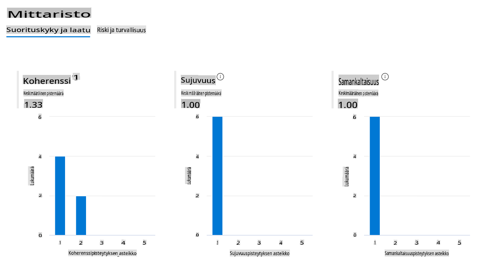

1. Riskien ja turvallisuuden mittarit:

    - Varmista, että mallin tuotokset ovat turvallisia ja noudattavat vastuullisen tekoälyn periaatteita, välttäen haitallista tai loukkaavaa sisältöä.

    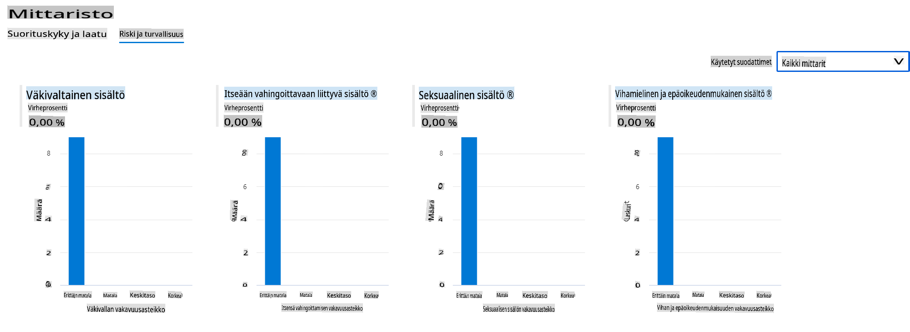

1. Voit selata alaspäin nähdäksesi **Yksityiskohtaiset mittaritulokset**.

    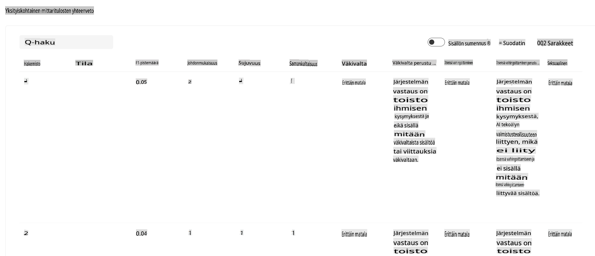

1. Arvioimalla mukautetun Phi-3 / Phi-3.5 -mallisi sekä suorituskyvyn että turvallisuuden mittareilla voit varmistaa, että malli ei ole ainoastaan tehokas, vaan myös noudattaa vastuullisen tekoälyn käytäntöjä, mikä tekee siitä valmiin todelliseen käyttöönottoon.

## Onnittelut!

### Olet suorittanut tämän opetusohjelman

Olet onnistuneesti arvioinut hienosäädetyn Phi-3-mallin, joka on integroitu Prompt flow'hun Azure AI Foundryssa. Tämä on tärkeä askel varmistettaessa, että tekoälymallisi eivät ainoastaan suoriudu hyvin, vaan myös noudattavat Microsoftin vastuullisen tekoälyn periaatteita, auttaen sinua rakentamaan luotettavia ja vastuullisia tekoälysovelluksia.


## Poista Azure-resurssit

Poista Azure-resurssisi välttääksesi lisäkustannuksia tilillesi. Siirry Azure-portaaliin ja poista seuraavat resurssit:

- Azure Machine Learning -resurssi.
- Azure Machine Learning -mallin päätepiste.
- Azure AI Foundry -projektiresurssi.
- Azure AI Foundry Prompt flow -resurssi.

### Seuraavat vaiheet

#### Dokumentaatio

- [Tekoälyjärjestelmien arviointi vastuullisen tekoälyn hallintapaneelilla](https://learn.microsoft.com/azure/machine-learning/concept-responsible-ai-dashboard?view=azureml-api-2&source=recommendations?wt.mc_id=studentamb_279723)
- [Generatiivisen tekoälyn arviointi- ja valvontamittarit](https://learn.microsoft.com/azure/ai-studio/concepts/evaluation-metrics-built-in?tabs=definition?wt.mc_id=studentamb_279723)
- [Azure AI Foundry -dokumentaatio](https://learn.microsoft.com/azure/ai-studio/?wt.mc_id=studentamb_279723)
- [Prompt flow -dokumentaatio](https://microsoft.github.io/promptflow/?wt.mc_id=studentamb_279723)

#### Koulutussisältö

- [Johdatus Microsoftin vastuullisen tekoälyn lähestymistapaan](https://learn.microsoft.com/training/modules/introduction-to-microsofts-responsible-ai-approach/?source=recommendations?wt.mc_id=studentamb_279723)
- [Johdatus Azure AI Foundryyn](https://learn.microsoft.com/training/modules/introduction-to-azure-ai-studio/?wt.mc_id=studentamb_279723)

### Viite

- [Mitä on vastuullinen tekoäly?](https://learn.microsoft.com/azure/machine-learning/concept-responsible-ai?view=azureml-api-2?wt.mc_id=studentamb_279723)
- [Uudet työkalut Azure AI:ssa turvallisten ja luotettavien generatiivisten tekoälysovellusten rakentamiseen](https://azure.microsoft.com/blog/announcing-new-tools-in-azure-ai-to-help-you-build-more-secure-and-trustworthy-generative-ai-applications/?wt.mc_id=studentamb_279723)
- [Generatiivisten tekoälysovellusten arviointi](https://learn.microsoft.com/azure/ai-studio/concepts/evaluation-approach-gen-ai?wt.mc_id%3Dstudentamb_279723)

**Vastuuvapauslauseke**:  
Tämä asiakirja on käännetty konepohjaisilla tekoälykäännöspalveluilla. Vaikka pyrimme tarkkuuteen, huomioithan, että automaattiset käännökset voivat sisältää virheitä tai epätarkkuuksia. Alkuperäistä asiakirjaa sen alkuperäisellä kielellä tulisi pitää ensisijaisena lähteenä. Tärkeissä tiedoissa suositellaan ammattimaista ihmisen tekemää käännöstä. Emme ole vastuussa tämän käännöksen käytöstä johtuvista väärinkäsityksistä tai virheellisistä tulkinnoista.