# Hienosäätö ja mukautettujen Phi-3-mallien integrointi Prompt Flow'n avulla Azure AI Foundryssa

Tämä end-to-end (E2E) -esimerkki perustuu Microsoft Tech Community -oppaaseen "[Fine-Tune and Integrate Custom Phi-3 Models with Prompt Flow in Azure AI Foundry](https://techcommunity.microsoft.com/t5/educator-developer-blog/fine-tune-and-integrate-custom-phi-3-models-with-prompt-flow-in/ba-p/4191726?WT.mc_id=aiml-137032-kinfeylo)". Se esittelee prosessit mukautettujen Phi-3-mallien hienosäätöön, käyttöönottoon ja integrointiin Prompt Flow'n avulla Azure AI Foundryssa. Toisin kuin E2E-esimerkissä "[Fine-Tune and Integrate Custom Phi-3 Models with Prompt Flow](./E2E_Phi-3-FineTuning_PromptFlow_Integration.md)", jossa koodi suoritettiin paikallisesti, tämä opetus keskittyy pelkästään mallin hienosäätöön ja integrointiin Azure AI / ML Studiossa.

## Yleiskatsaus

Tässä E2E-esimerkissä opit hienosäätämään Phi-3-mallin ja integroimaan sen Prompt Flow'n kanssa Azure AI Foundryssa. Hyödyntämällä Azure AI / ML Studiota luot työnkulun mukautettujen AI-mallien käyttöönottoa ja hyödyntämistä varten. Tämä E2E-esimerkki on jaettu kolmeen skenaarioon:

**Skenaario 1: Azure-resurssien määrittäminen ja hienosäätöön valmistautuminen**

**Skenaario 2: Phi-3-mallin hienosäätö ja käyttöönotto Azure Machine Learning Studiossa**

**Skenaario 3: Integrointi Prompt Flow'n kanssa ja keskustelu mukautetun mallin kanssa Azure AI Foundryssa**

Alla on yleiskuvaus tästä E2E-esimerkistä.

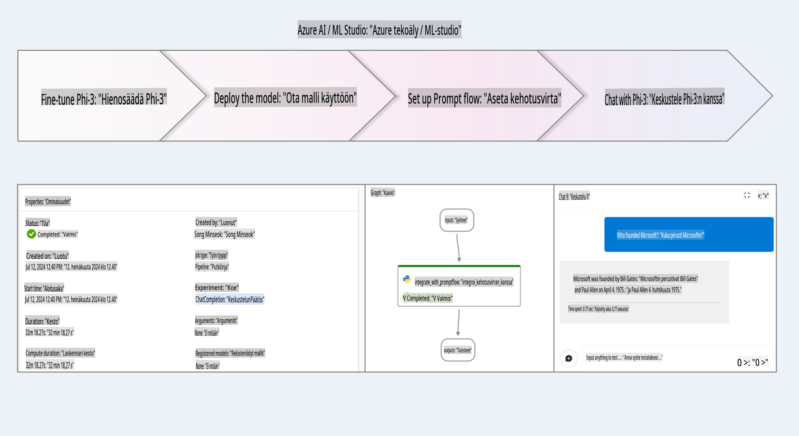

### Sisällysluettelo

1. **[Skenaario 1: Azure-resurssien määrittäminen ja hienosäätöön valmistautuminen](../../../../../../md/02.Application/01.TextAndChat/Phi3)**
    - [Azure Machine Learning -työtilan luominen](../../../../../../md/02.Application/01.TextAndChat/Phi3)
    - [GPU-kvottien pyytäminen Azure-tilauksessa](../../../../../../md/02.Application/01.TextAndChat/Phi3)
    - [Roolin määrityksen lisääminen](../../../../../../md/02.Application/01.TextAndChat/Phi3)
    - [Projektin määrittäminen](../../../../../../md/02.Application/01.TextAndChat/Phi3)
    - [Aineiston valmistelu hienosäätöä varten](../../../../../../md/02.Application/01.TextAndChat/Phi3)

1. **[Skenaario 2: Phi-3-mallin hienosäätö ja käyttöönotto Azure Machine Learning Studiossa](../../../../../../md/02.Application/01.TextAndChat/Phi3)**
    - [Phi-3-mallin hienosäätö](../../../../../../md/02.Application/01.TextAndChat/Phi3)
    - [Hienosäädetyn Phi-3-mallin käyttöönotto](../../../../../../md/02.Application/01.TextAndChat/Phi3)

1. **[Skenaario 3: Integrointi Prompt Flow'n kanssa ja keskustelu mukautetun mallin kanssa Azure AI Foundryssa](../../../../../../md/02.Application/01.TextAndChat/Phi3)**
    - [Mukautetun Phi-3-mallin integrointi Prompt Flow'n kanssa](../../../../../../md/02.Application/01.TextAndChat/Phi3)
    - [Keskustelu mukautetun Phi-3-mallin kanssa](../../../../../../md/02.Application/01.TextAndChat/Phi3)

## Skenaario 1: Azure-resurssien määrittäminen ja hienosäätöön valmistautuminen

### Azure Machine Learning -työtilan luominen

1. Kirjoita **azure machine learning** portaalin yläreunan **hakupalkkiin** ja valitse **Azure Machine Learning** näkyviin tulevista vaihtoehdoista.

    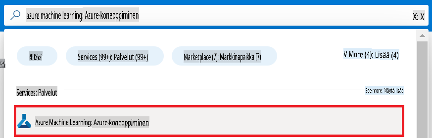

2. Valitse navigointivalikosta **+ Luo**.

3. Valitse navigointivalikosta **Uusi työtila**.

    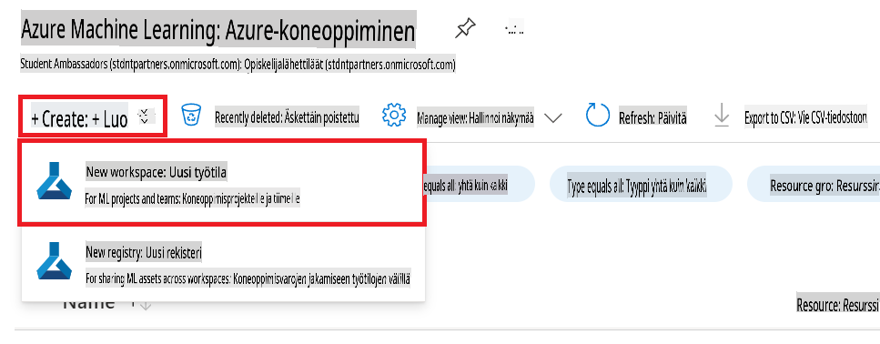

4. Suorita seuraavat tehtävät:

    - Valitse Azure-tilauksesi **Subscription**.
    - Valitse käytettävä **Resource group** (luo uusi tarvittaessa).
    - Syötä **Workspace Name**. Sen on oltava yksilöllinen arvo.
    - Valitse käytettävä **Region**.
    - Valitse käytettävä **Storage account** (luo uusi tarvittaessa).
    - Valitse käytettävä **Key vault** (luo uusi tarvittaessa).
    - Valitse käytettävä **Application insights** (luo uusi tarvittaessa).
    - Valitse käytettävä **Container registry** (luo uusi tarvittaessa).

    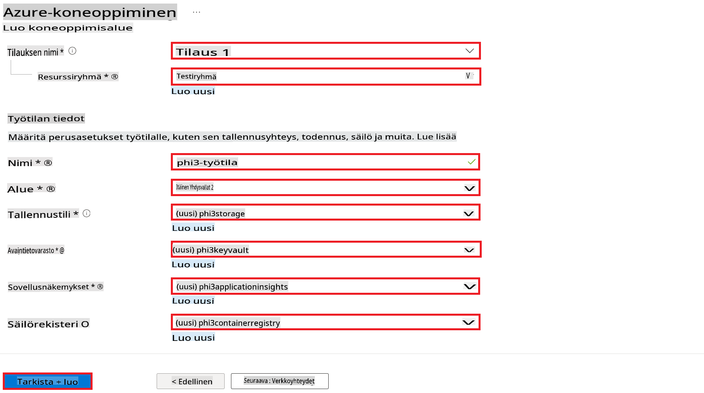

5. Valitse **Review + Create**.

6. Valitse **Create**.

### GPU-kvottien pyytäminen Azure-tilauksessa

Tässä opetusohjelmassa opit hienosäätämään ja ottamaan käyttöön Phi-3-mallin käyttämällä GPU:ta. Hienosäätöä varten käytät *Standard_NC24ads_A100_v4* GPU:ta, joka vaatii kvottipyynnön. Käyttöönottoa varten käytät *Standard_NC6s_v3* GPU:ta, joka myös vaatii kvottipyynnön.

> [!NOTE]
>
> Vain Pay-As-You-Go-tilaukset (standardi tilausmuoto) ovat oikeutettuja GPU-allokaatioon; etuusperusteiset tilaukset eivät tällä hetkellä ole tuettuja.
>

1. Siirry [Azure ML Studioon](https://ml.azure.com/home?wt.mc_id=studentamb_279723).

1. Suorita seuraavat tehtävät pyytääksesi *Standard NCADSA100v4 Family* -kvottaa:

    - Valitse vasemmanpuoleisesta välilehdestä **Quota**.
    - Valitse käytettävä **Virtual machine family**. Esimerkiksi valitse **Standard NCADSA100v4 Family Cluster Dedicated vCPUs**, joka sisältää *Standard_NC24ads_A100_v4* GPU:n.
    - Valitse navigointivalikosta **Request quota**.

        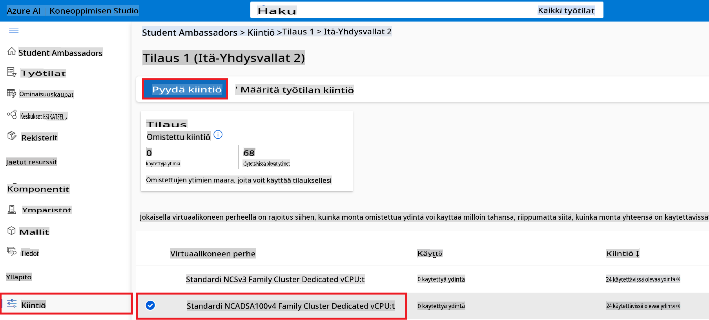

    - Syötä Request quota -sivulle **New cores limit**, jota haluat käyttää. Esimerkiksi 24.
    - Valitse Request quota -sivulta **Submit** pyytääksesi GPU-kvottaa.

1. Suorita seuraavat tehtävät pyytääksesi *Standard NCSv3 Family* -kvottaa:

    - Valitse vasemmanpuoleisesta välilehdestä **Quota**.
    - Valitse käytettävä **Virtual machine family**. Esimerkiksi valitse **Standard NCSv3 Family Cluster Dedicated vCPUs**, joka sisältää *Standard_NC6s_v3* GPU:n.
    - Valitse navigointivalikosta **Request quota**.
    - Syötä Request quota -sivulle **New cores limit**, jota haluat käyttää. Esimerkiksi 24.
    - Valitse Request quota -sivulta **Submit** pyytääksesi GPU-kvottaa.

### Roolin määrityksen lisääminen

Jotta voit hienosäätää ja ottaa käyttöön mallejasi, sinun on ensin luotava User Assigned Managed Identity (UAI) ja annettava sille tarvittavat oikeudet. Tätä UAI:ta käytetään todennuksessa käyttöönoton aikana.

#### Luo User Assigned Managed Identity (UAI)

1. Kirjoita **managed identities** portaalin yläreunan **hakupalkkiin** ja valitse **Managed Identities** näkyviin tulevista vaihtoehdoista.

    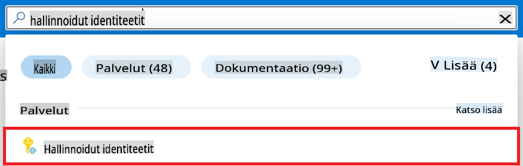

1. Valitse **+ Luo**.

    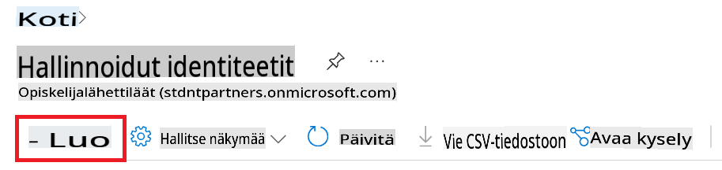

1. Suorita seuraavat tehtävät:

    - Valitse Azure-tilauksesi **Subscription**.
    - Valitse käytettävä **Resource group** (luo uusi tarvittaessa).
    - Valitse käytettävä **Region**.
    - Syötä **Name**. Sen on oltava yksilöllinen arvo.

    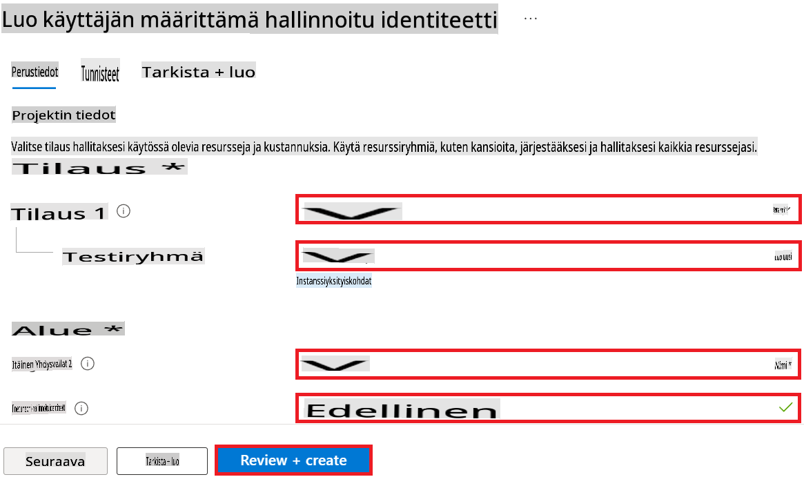

1. Valitse **Review + create**.

1. Valitse **+ Luo**.

#### Lisää Contributor-rooli Managed Identitylle

1. Siirry luomaasi Managed Identity -resurssiin.

1. Valitse vasemmanpuoleisesta välilehdestä **Azure role assignments**.

1. Valitse navigointivalikosta **+Add role assignment**.

1. Suorita Add role assignment -sivulla seuraavat tehtävät:
    - Valitse **Scope** kohdaksi **Resource group**.
    - Valitse Azure-tilauksesi **Subscription**.
    - Valitse käytettävä **Resource group**.
    - Valitse **Role** kohdaksi **Contributor**.

    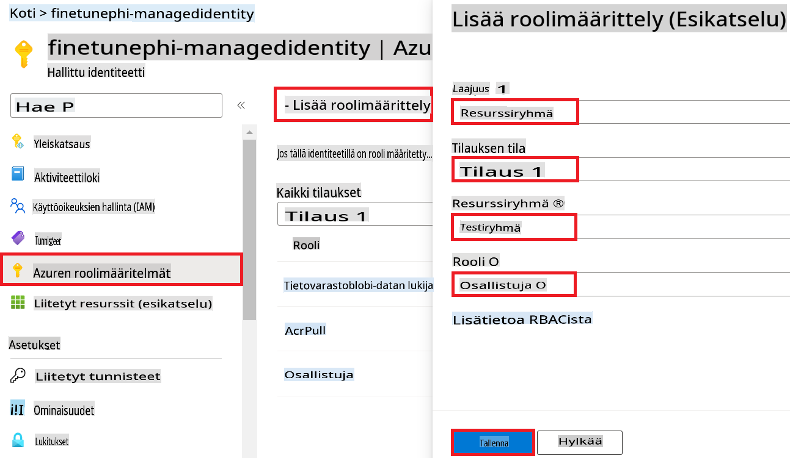

2. Valitse **Save**.

#### Lisää Storage Blob Data Reader -rooli Managed Identitylle

1. Kirjoita **storage accounts** portaalin yläreunan **hakupalkkiin** ja valitse **Storage accounts** näkyviin tulevista vaihtoehdoista.

    

1. Valitse Azure Machine Learning -työtilaan liitetty tallennustili. Esimerkiksi *finetunephistorage*.

1. Suorita seuraavat tehtävät navigoidaksesi Add role assignment -sivulle:

    - Siirry luomaasi Azure Storage -tiliin.
    - Valitse vasemmanpuoleisesta välilehdestä **Access Control (IAM)**.
    - Valitse navigointivalikosta **+ Add**.
    - Valitse navigointivalikosta **Add role assignment**.

    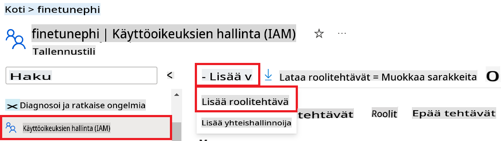

1. Suorita Add role assignment -sivulla seuraavat tehtävät:

    - Kirjoita Role-sivulla **Storage Blob Data Reader** hakupalkkiin ja valitse näkyviin tulevista vaihtoehdoista **Storage Blob Data Reader**.
    - Valitse Role-sivulla **Next**.
    - Valitse Members-sivulla **Assign access to** -kohdaksi **Managed identity**.
    - Valitse Members-sivulla **+ Select members**.
    - Valitse Select managed identities -sivulla Azure-tilauksesi **Subscription**.
    - Valitse Select managed identities -sivulla **Managed identity** kohdaksi **Manage Identity**.
    - Valitse Select managed identities -sivulla luomasi Managed Identity. Esimerkiksi *finetunephi-managedidentity*.
    - Valitse Select managed identities -sivulla **Select**.

    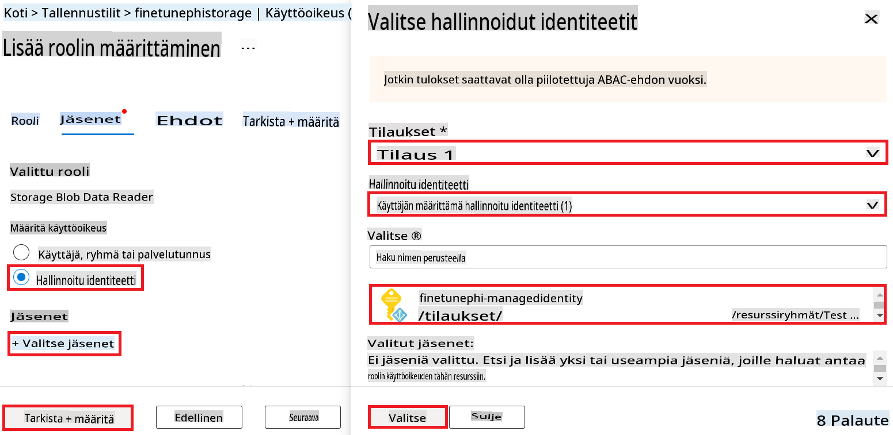

1. Valitse **Review + assign**.

#### Lisää AcrPull-rooli Managed Identitylle

1. Kirjoita **container registries** portaalin yläreunan **hakupalkkiin** ja valitse **Container registries** näkyviin tulevista vaihtoehdoista.

    

1. Valitse Azure Machine Learning -työtilaan liitetty konttirekisteri. Esimerkiksi *finetunephicontainerregistry*.

1. Suorita seuraavat tehtävät navigoidaksesi Add role assignment -sivulle:

    - Valitse vasemmanpuoleisesta välilehdestä **Access Control (IAM)**.
    - Valitse navigointivalikosta **+ Add**.
    - Valitse navigointivalikosta **Add role assignment**.

1. Suorita Add role assignment -sivulla seuraavat tehtävät:

    - Kirjoita Role-sivulla **AcrPull** hakupalkkiin ja valitse näkyviin tulevista vaihtoehdoista **AcrPull**.
    - Valitse Role-sivulla **Next**.
    - Valitse Members-sivulla **Assign access to** -kohdaksi **Managed identity**.
    - Valitse Members-sivulla **+ Select members**.
    - Valitse Select managed identities -sivulla Azure-tilauksesi **Subscription**.
    - Valitse Select managed identities -sivulla **Managed identity** kohdaksi **Manage Identity**.
    - Valitse Select managed identities -sivulla luomasi Managed Identity. Esimerkiksi *finetunephi-managedidentity*.
    - Valitse Select managed identities -sivulla **Select**.
    - Valitse **Review + assign**.

### Projektin määrittäminen

Lataa hienosäätöön tarvittavat aineistot määrittämällä paikallinen ympäristö.

Tässä harjoituksessa:

- Luo kansio työskentelyä varten.
- Luo virtuaaliympäristö.
- Asenna tarvittavat paketit.
- Luo *download_dataset.py*-tiedosto aineiston lataamista varten.

#### Luo kansio työskentelyä varten

1. Avaa terminaali-ikkuna ja kirjoita seuraava komento luodaksesi kansion nimeltä *finetune-phi* oletuspolkuun.

    ```console
    mkdir finetune-phi
    ```

2. Kirjoita seuraava komento terminaaliisi siirtyäksesi luomaasi *finetune-phi*-kansioon.

    ```console
    cd finetune-phi
    ```

#### Luo virtuaaliympäristö

1. Kirjoita seuraava komento terminaaliisi luodaksesi virtuaaliympäristön nimeltä *.venv*.

    ```console
    python -m venv .venv
    ```

2. Kirjoita seuraava komento terminaaliisi aktivoidaksesi virtuaaliympäristön.

    ```console
    .venv\Scripts\activate.bat
    ```

> [!NOTE]
> Jos kaikki toimii, näet *(.venv)* ennen komentokehotetta.

#### Asenna tarvittavat paketit

1. Kirjoita seuraavat komennot terminaaliisi asentaaksesi tarvittavat paketit.

    ```console
    pip install datasets==2.19.1
    ```

#### Luo `download_dataset.py`

> [!NOTE]
> Kansion täydellinen rakenne:
>
> ```text
> └── YourUserName
> .    └── finetune-phi
> .        └── download_dataset.py
> ```

1. Avaa **Visual Studio Code**.

1. Valitse **File** valikkoriviltä.

1. Valitse **Open Folder**.

1. Valitse luomasi *finetune-phi*-kansio, joka sijaitsee polussa *C:\Users\yourUserName\finetune-phi*.

    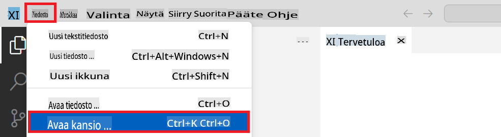

1. Visual Studio Coden vasemmassa paneelissa napsauta hiiren kakkospainikkeella ja valitse **New File** luodaksesi uuden tiedoston nimeltä *download_dataset.py*.

    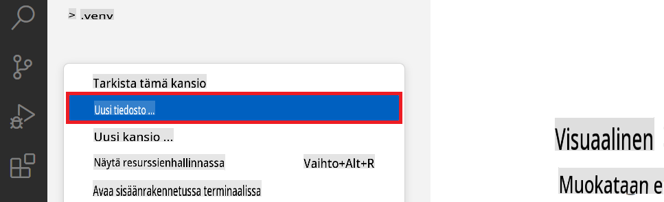

### Valmistele aineisto hienosäätöä varten

Tässä harjoituksessa suoritat *download_dataset.py*-tiedoston ladataksesi *ultrachat_200k*-aineistot paikalliseen ympäristöösi. Käytät näitä aineistoja Phi-3-mallin hienosäätöön Azure Machine Learningissa.

Tässä harjoituksessa:

- Lisää koodi *download_dataset.py*-tiedostoon aineistojen lataamista varten.
- Suorita *download_dataset.py*-tiedosto ladataksesi aineistot paikalliseen ympäristöösi.

#### Lataa aineisto käyttämällä *download_dataset.py*-tiedostoa

1. Avaa *download_dataset.py*-tiedosto Visual Studio Codessa.

1. Lisää seuraava koodi *download_dataset.py*-tiedostoon.

    ```python
    import json
    import os
    from datasets import load_dataset

    def load_and_split_dataset(dataset_name, config_name, split_ratio):
        """
        Load and split a dataset.
        """
        # Load the dataset with the specified name, configuration, and split ratio
        dataset = load_dataset(dataset_name, config_name, split=split_ratio)
        print(f"Original dataset size: {len(dataset)}")
        
        # Split the dataset into train and test sets (80% train, 20% test)
        split_dataset = dataset.train_test_split(test_size=0.2)
        print(f"Train dataset size: {len(split_dataset['train'])}")
        print(f"Test dataset size: {len(split_dataset['test'])}")
        
        return split_dataset

    def save_dataset_to_jsonl(dataset, filepath):
        """
        Save a dataset to a JSONL file.
        """
        # Create the directory if it does not exist
        os.makedirs(os.path.dirname(filepath), exist_ok=True)
        
        # Open the file in write mode
        with open(filepath, 'w', encoding='utf-8') as f:
            # Iterate over each record in the dataset
            for record in dataset:
                # Dump the record as a JSON object and write it to the file
                json.dump(record, f)
                # Write a newline character to separate records
                f.write('\n')
        
        print(f"Dataset saved to {filepath}")

    def main():
        """
        Main function to load, split, and save the dataset.
        """
        # Load and split the ULTRACHAT_200k dataset with a specific configuration and split ratio
        dataset = load_and_split_dataset("HuggingFaceH4/ultrachat_200k", 'default', 'train_sft[:1%]')
        
        # Extract the train and test datasets from the split
        train_dataset = dataset['train']
        test_dataset = dataset['test']

        # Save the train dataset to a JSONL file
        save_dataset_to_jsonl(train_dataset, "data/train_data.jsonl")
        
        # Save the test dataset to a separate JSONL file
        save_dataset_to_jsonl(test_dataset, "data/test_data.jsonl")

    if __name__ == "__main__":
        main()

    ```

1. Kirjoita seuraava komento terminaaliisi suorittaaksesi skriptin ja ladataksesi aineiston paikalliseen ympäristöösi.

    ```console
    python download_dataset.py
    ```

1. Varmista, että aineistot tallentuivat onnistuneesti paikalliseen *finetune-phi/data*-hakemistoon.

> [!NOTE]
>
> #### Huomio aineiston koosta ja hienosäädön kestosta
>
> Tässä opetusohjelmassa käytät vain 1 % aineistosta (`split='train[:1%]'`). Tämä pienentää merkittävästi aineiston määrää, mikä nopeuttaa sekä lataus- että hienosäätöprosesseja. Voit säätää prosent
1. Vieraile [Azure ML Studio](https://ml.azure.com/home?wt.mc_id=studentamb_279723).

1. Valitse vasemman puolen välilehdeltä **Compute**.

1. Valitse navigointivalikosta **Compute clusters**.

1. Valitse **+ New**.

    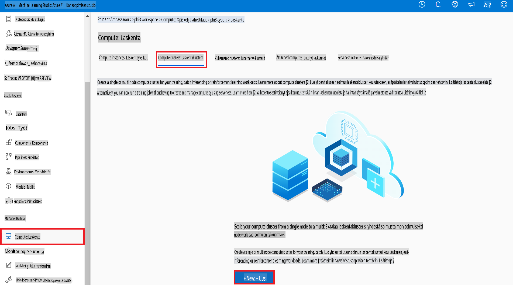

1. Suorita seuraavat tehtävät:

    - Valitse **Region**, jota haluat käyttää.
    - Valitse **Virtual machine tier** kohtaan **Dedicated**.
    - Valitse **Virtual machine type** kohtaan **GPU**.
    - Valitse **Virtual machine size** -suodatin kohtaan **Select from all options**.
    - Valitse **Virtual machine size** kohtaan **Standard_NC24ads_A100_v4**.

    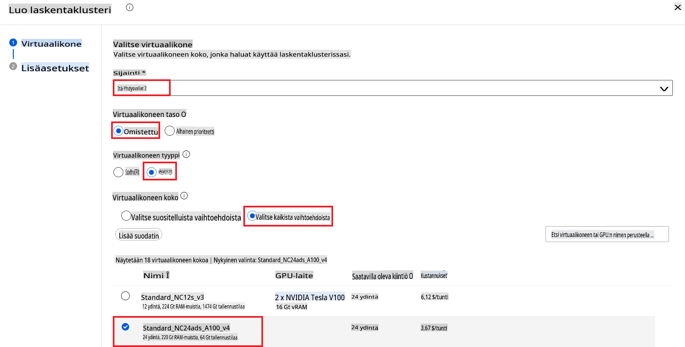

1. Valitse **Next**.

1. Suorita seuraavat tehtävät:

    - Syötä **Compute name**. Sen täytyy olla uniikki arvo.
    - Valitse **Minimum number of nodes** kohtaan **0**.
    - Valitse **Maximum number of nodes** kohtaan **1**.
    - Valitse **Idle seconds before scale down** kohtaan **120**.

    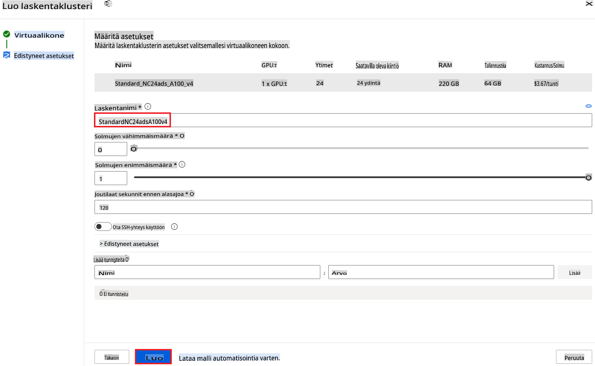

1. Valitse **Create**.

#### Phi-3-mallin hienosäätö

1. Vieraile [Azure ML Studio](https://ml.azure.com/home?wt.mc_id=studentamb_279723).

1. Valitse Azure Machine Learning -työtila, jonka loit.

    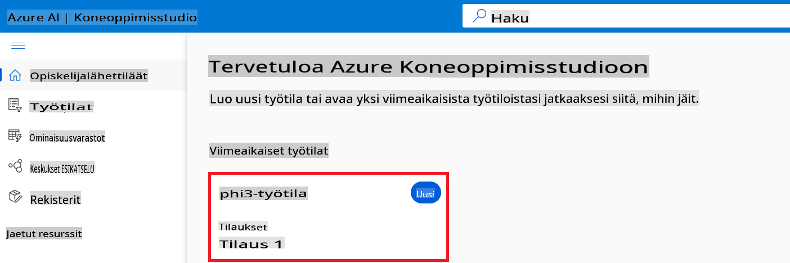

1. Suorita seuraavat tehtävät:

    - Valitse vasemman puolen välilehdeltä **Model catalog**.
    - Kirjoita **phi-3-mini-4k** **hakupalkkiin** ja valitse **Phi-3-mini-4k-instruct** esiin tulevista vaihtoehdoista.

    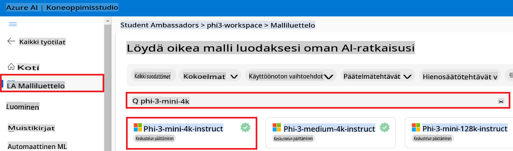

1. Valitse navigointivalikosta **Fine-tune**.

    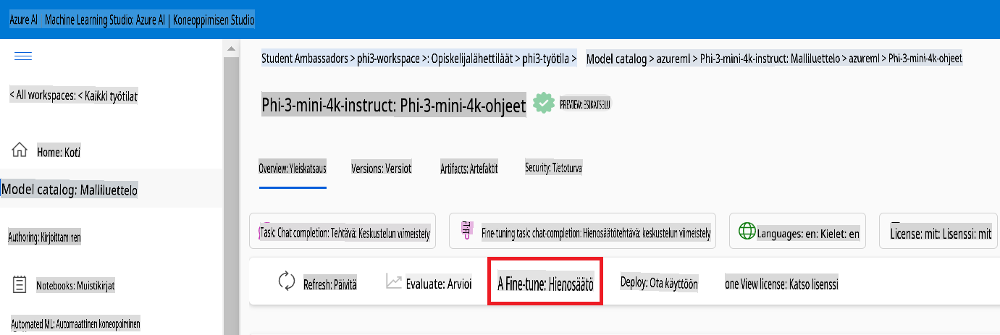

1. Suorita seuraavat tehtävät:

    - Valitse **Select task type** kohtaan **Chat completion**.
    - Valitse **+ Select data** ladataksesi **Traning data**.
    - Valitse Validation data -lataustyyppi kohtaan **Provide different validation data**.
    - Valitse **+ Select data** ladataksesi **Validation data**.

    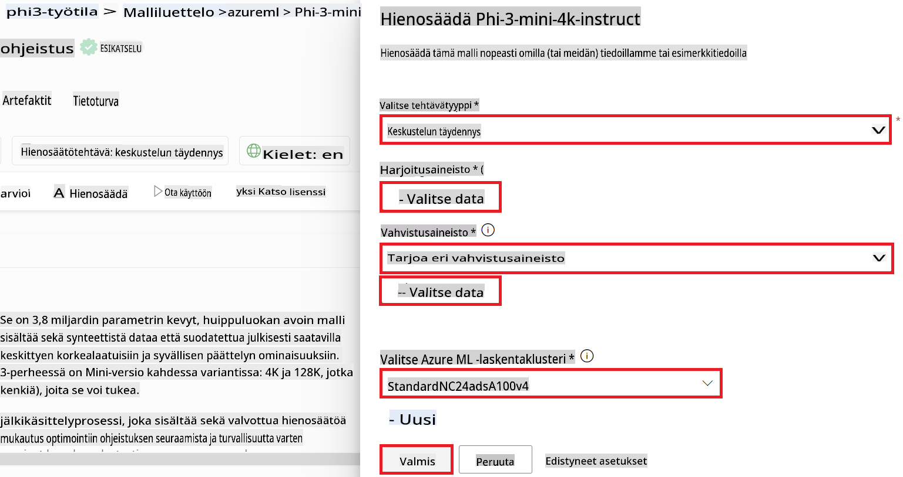

    > [!TIP]
    >
    > Voit valita **Advanced settings** mukauttaaksesi asetuksia, kuten **learning_rate** ja **lr_scheduler_type**, optimoidaksesi hienosäätöprosessin tarpeidesi mukaan.

1. Valitse **Finish**.

1. Tässä harjoituksessa hienosäädit onnistuneesti Phi-3-mallin Azure Machine Learningin avulla. Huomaa, että hienosäätöprosessi voi kestää huomattavan kauan. Kun hienosäätötyö on käynnissä, sinun täytyy odottaa sen valmistumista. Voit seurata hienosäätötyön tilaa siirtymällä Jobs-välilehdelle Azure Machine Learning -työtilassasi. Seuraavassa osassa mallisi otetaan käyttöön ja integroidaan Prompt flow -työkaluun.

    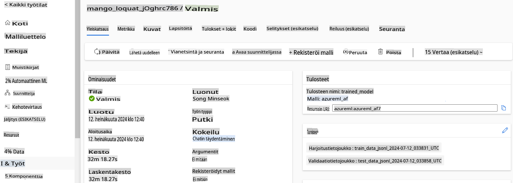

### Hienosäädetyn Phi-3-mallin käyttöönotto

Jotta hienosäädetty Phi-3-malli voidaan integroida Prompt flow -työkaluun, sinun täytyy ottaa malli käyttöön reaaliaikaista ennustamista varten. Tämä prosessi sisältää mallin rekisteröinnin, online-päätepisteen luomisen ja mallin käyttöönoton.

Tässä harjoituksessa:

- Rekisteröit hienosäädetyn mallin Azure Machine Learning -työtilassa.
- Luot online-päätepisteen.
- Otat rekisteröidyn hienosäädetyn Phi-3-mallin käyttöön.

#### Rekisteröi hienosäädetty malli

1. Vieraile [Azure ML Studio](https://ml.azure.com/home?wt.mc_id=studentamb_279723).

1. Valitse Azure Machine Learning -työtila, jonka loit.

    

1. Valitse vasemman puolen välilehdeltä **Models**.
1. Valitse **+ Register**.
1. Valitse **From a job output**.

    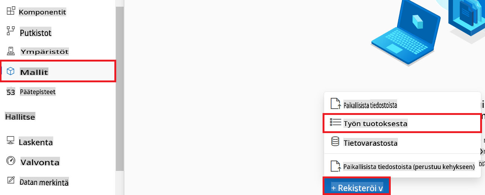

1. Valitse luomasi työ.

    

1. Valitse **Next**.

1. Valitse **Model type** kohtaan **MLflow**.

1. Varmista, että **Job output** on valittuna; sen pitäisi olla automaattisesti valittuna.

    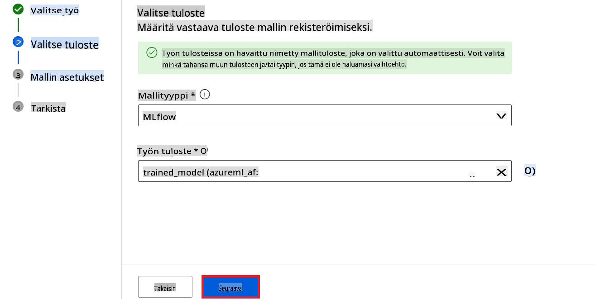

2. Valitse **Next**.

3. Valitse **Register**.

    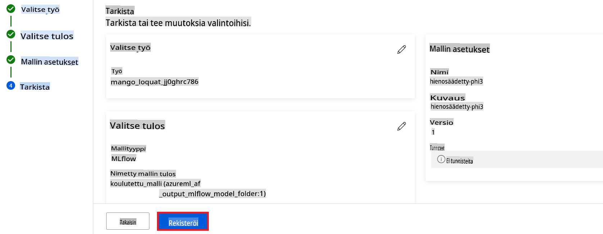

4. Voit tarkastella rekisteröityä malliasi siirtymällä **Models**-valikkoon vasemman puolen välilehdeltä.

    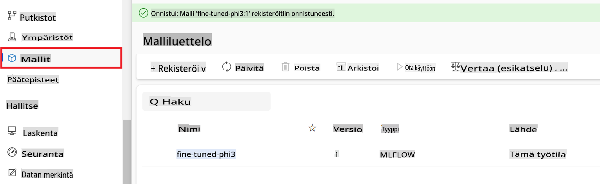

#### Ota hienosäädetty malli käyttöön

1. Siirry Azure Machine Learning -työtilaan, jonka loit.

1. Valitse vasemman puolen välilehdeltä **Endpoints**.

1. Valitse navigointivalikosta **Real-time endpoints**.

    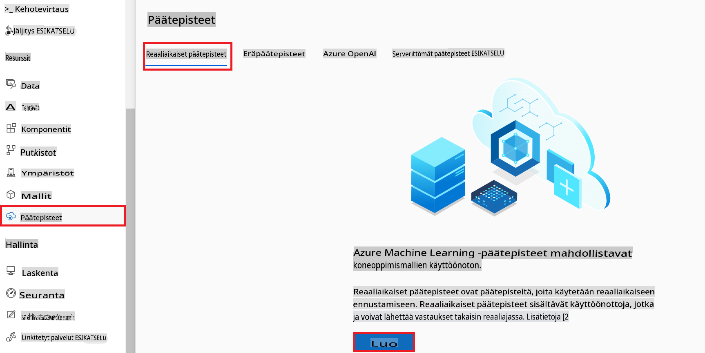

1. Valitse **Create**.

1. Valitse rekisteröity malli, jonka loit.

    

1. Valitse **Select**.

1. Suorita seuraavat tehtävät:

    - Valitse **Virtual machine** kohtaan *Standard_NC6s_v3*.
    - Valitse **Instance count**, esimerkiksi *1*.
    - Valitse **Endpoint** kohtaan **New**, jotta luot uuden päätepisteen.
    - Syötä **Endpoint name**. Sen täytyy olla uniikki arvo.
    - Syötä **Deployment name**. Sen täytyy olla uniikki arvo.

    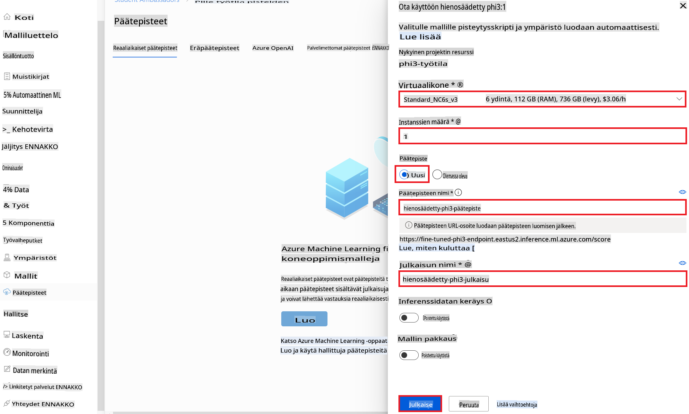

1. Valitse **Deploy**.

> [!WARNING]
> Välttääksesi lisäkustannuksia tililläsi, varmista, että poistat luodun päätepisteen Azure Machine Learning -työtilasta.
>

#### Tarkista käyttöönoton tila Azure Machine Learning -työtilassa

1. Siirry Azure Machine Learning -työtilaan, jonka loit.

1. Valitse vasemman puolen välilehdeltä **Endpoints**.

1. Valitse luomasi päätepiste.

    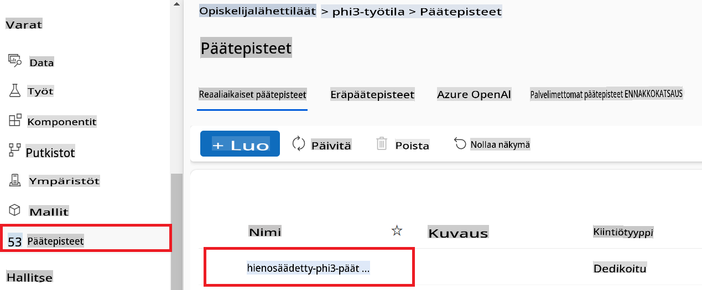

1. Tällä sivulla voit hallita päätepisteitä käyttöönoton aikana.

> [!NOTE]
> Kun käyttöönotto on valmis, varmista, että **Live traffic** on asetettu **100%**. Jos ei, valitse **Update traffic** säätääksesi liikenteen asetuksia. Huomaa, että et voi testata mallia, jos liikenne on asetettu 0%.
>
> 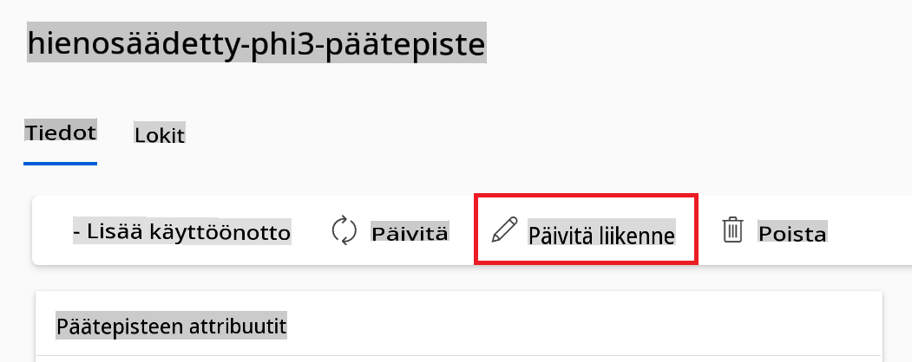
>

## Tilanne 3: Integroi Prompt flow'n kanssa ja keskustele mukautetulla mallillasi Azure AI Foundryssä

### Integroi mukautettu Phi-3-malli Prompt flow'n kanssa

Kun olet onnistuneesti ottanut hienosäädetyn mallin käyttöön, voit nyt integroida sen Prompt flow -työkaluun käyttääksesi malliasi reaaliaikaisissa sovelluksissa. Tämä mahdollistaa erilaisia vuorovaikutteisia tehtäviä mukautetulla Phi-3-mallillasi.

Tässä harjoituksessa:

- Luo Azure AI Foundry Hub.
- Luo Azure AI Foundry Project.
- Luo Prompt flow.
- Lisää mukautettu yhteys hienosäädetylle Phi-3-mallille.
- Määritä Prompt flow keskustelemaan mukautetun Phi-3-mallisi kanssa.

> [!NOTE]
> Voit myös integroida Promptflow'n avulla Azure ML Studioon. Sama integrointiprosessi voidaan soveltaa Azure ML Studioon.

#### Luo Azure AI Foundry Hub

Sinun täytyy luoda Hub ennen kuin voit luoda Projectin. Hub toimii resurssiryhmänä, jonka avulla voit organisoida ja hallita useita projekteja Azure AI Foundryssä.

1. Vieraile [Azure AI Foundry](https://ai.azure.com/?WT.mc_id=aiml-137032-kinfeylo).

1. Valitse vasemman puolen välilehdeltä **All hubs**.

1. Valitse navigointivalikosta **+ New hub**.

    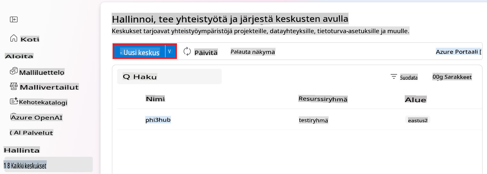

1. Suorita seuraavat tehtävät:

    - Syötä **Hub name**. Sen täytyy olla uniikki arvo.
    - Valitse Azure **Subscription**.
    - Valitse **Resource group**, jota haluat käyttää (luo uusi, jos tarpeen).
    - Valitse **Location**, jota haluat käyttää.
    - Valitse **Connect Azure AI Services**, jota haluat käyttää (luo uusi, jos tarpeen).
    - Valitse **Connect Azure AI Search** kohtaan **Skip connecting**.

    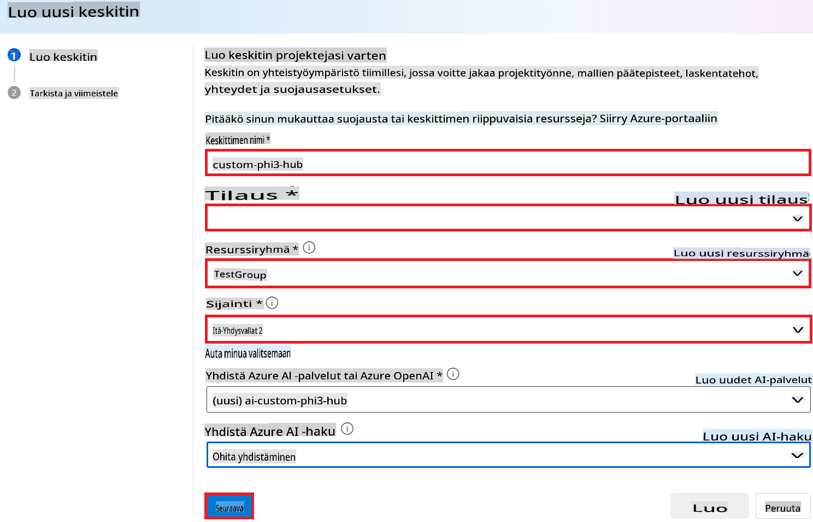

1. Valitse **Next**.

#### Luo Azure AI Foundry Project

1. Valitsemassasi Hubissa, valitse vasemman puolen välilehdeltä **All projects**.

1. Valitse navigointivalikosta **+ New project**.

    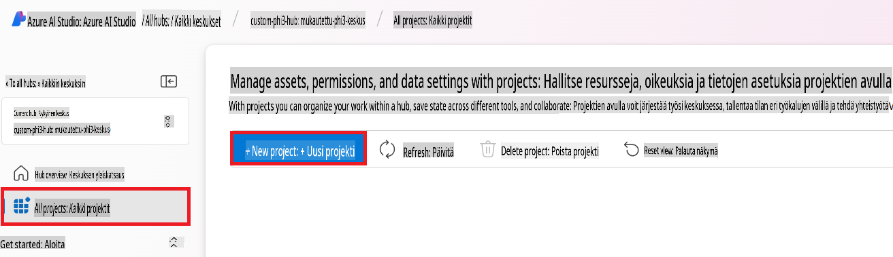

1. Syötä **Project name**. Sen täytyy olla uniikki arvo.

    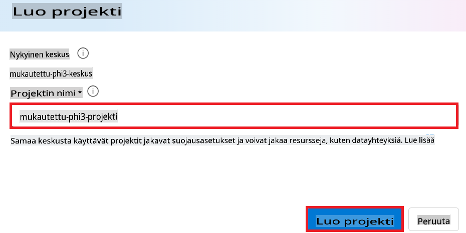

1. Valitse **Create a project**.

#### Lisää mukautettu yhteys hienosäädetylle Phi-3-mallille

Jotta mukautettu Phi-3-mallisi voidaan integroida Prompt flow -työkaluun, sinun täytyy tallentaa mallin päätepiste ja avain mukautettuun yhteyteen. Tämä asetus varmistaa pääsyn mukautettuun Phi-3-malliisi Prompt flow'ssa.

#### Aseta hienosäädetyn Phi-3-mallin API-avain ja päätepisteen URI

1. Vieraile [Azure ML Studio](https://ml.azure.com/home?WT.mc_id=aiml-137032-kinfeylo).

1. Siirry Azure Machine Learning -työtilaan, jonka loit.

1. Valitse vasemman puolen välilehdeltä **Endpoints**.

    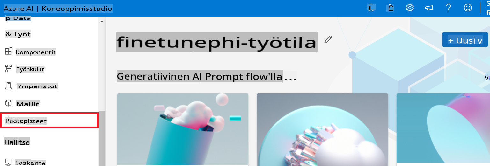

1. Valitse luomasi päätepiste.

    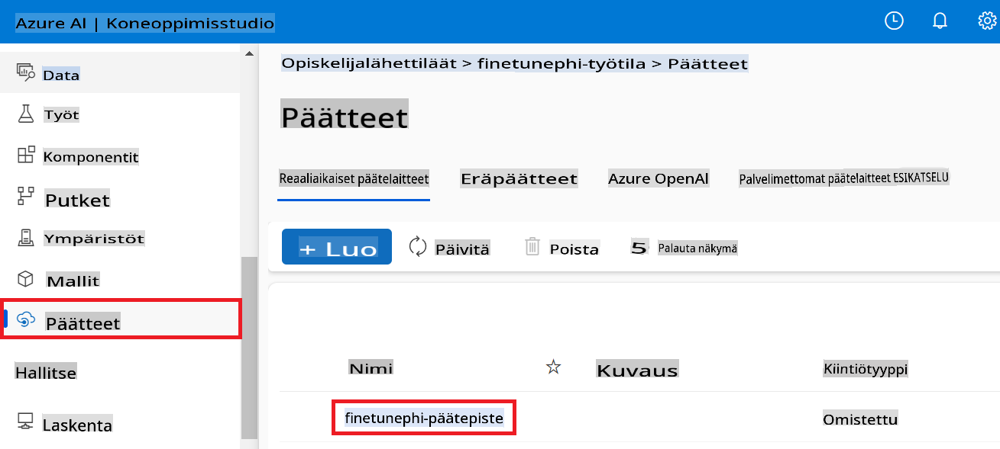

1. Valitse navigointivalikosta **Consume**.

1. Kopioi **REST endpoint** ja **Primary key**.
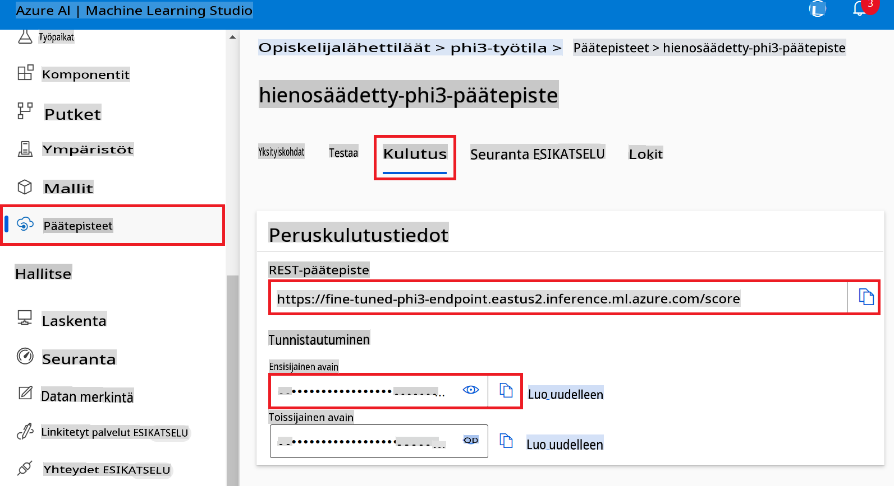

#### Lisää mukautettu yhteys

1. Siirry osoitteeseen [Azure AI Foundry](https://ai.azure.com/?WT.mc_id=aiml-137032-kinfeylo).

1. Avaa luomasi Azure AI Foundry -projekti.

1. Valitse luomastasi projektista vasemman sivupalkin **Asetukset**.

1. Valitse **+ Uusi yhteys**.

    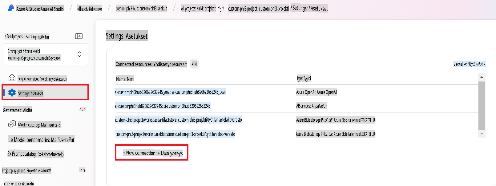

1. Valitse navigointivalikosta **Mukautetut avaimet**.

    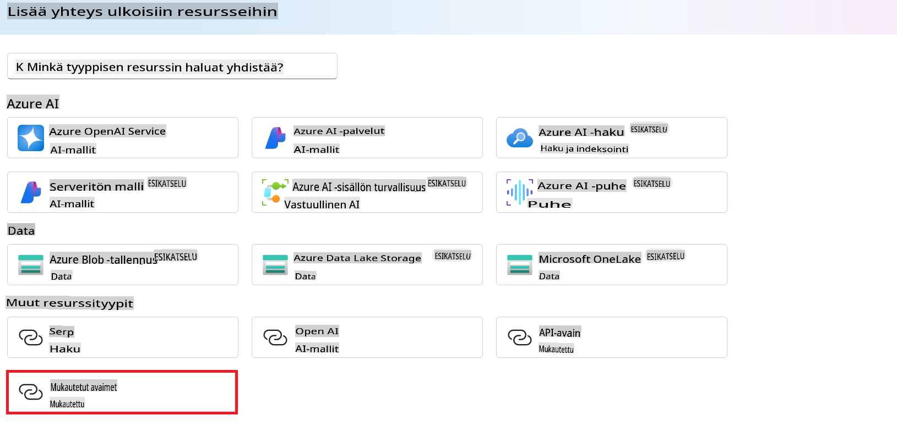

1. Suorita seuraavat tehtävät:

    - Valitse **+ Lisää avain-arvopareja**.
    - Anna avaimen nimeksi **endpoint** ja liitä Azure ML Studiosta kopioitu päätepiste arvokenttään.
    - Valitse **+ Lisää avain-arvopareja** uudelleen.
    - Anna avaimen nimeksi **key** ja liitä Azure ML Studiosta kopioitu avain arvokenttään.
    - Valitse **on salainen**, jotta avain ei ole näkyvissä lisäyksen jälkeen.

    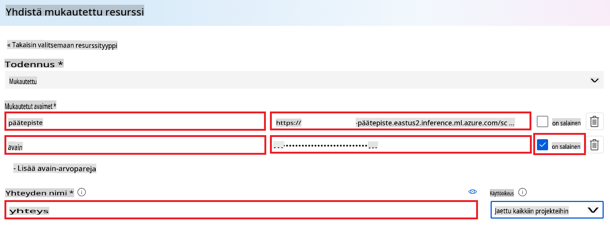

1. Valitse **Lisää yhteys**.

#### Luo Prompt flow

Olet lisännyt mukautetun yhteyden Azure AI Foundryyn. Nyt luodaan Prompt flow seuraavien vaiheiden avulla. Lopuksi yhdistät tämän Prompt flown mukautettuun yhteyteen, jotta voit käyttää hienosäädettyä mallia Prompt flow'ssa.

1. Avaa luomasi Azure AI Foundry -projekti.

1. Valitse vasemman sivupalkin **Prompt flow**.

1. Valitse navigointivalikosta **+ Luo**.

    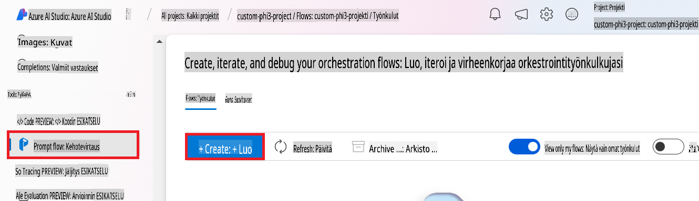

1. Valitse navigointivalikosta **Chat flow**.

    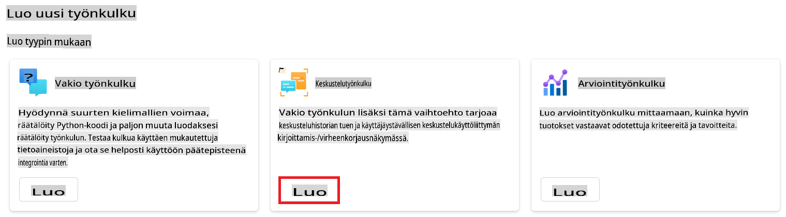

1. Anna **Kansio nimi**, jota haluat käyttää.

    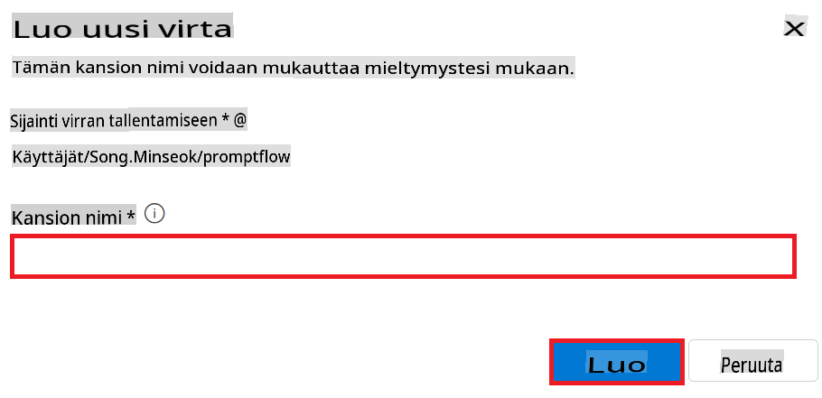

2. Valitse **Luo**.

#### Määritä Prompt flow keskustelemaan mukautetun Phi-3-mallisi kanssa

Sinun täytyy integroida hienosäädetty Phi-3-malli Prompt flow'hun. Nykyinen Prompt flow ei kuitenkaan ole suunniteltu tätä tarkoitusta varten, joten sinun täytyy muokata Prompt flow'ta, jotta mukautettu malli voidaan integroida.

1. Prompt flow'ssa suorita seuraavat tehtävät muokataksesi olemassa olevaa flow'ta:

    - Valitse **Raakatiedosto-tila**.
    - Poista kaikki olemassa oleva koodi *flow.dag.yml*-tiedostosta.
    - Lisää seuraava koodi *flow.dag.yml*-tiedostoon.

        ```yml
        inputs:
          input_data:
            type: string
            default: "Who founded Microsoft?"

        outputs:
          answer:
            type: string
            reference: ${integrate_with_promptflow.output}

        nodes:
        - name: integrate_with_promptflow
          type: python
          source:
            type: code
            path: integrate_with_promptflow.py
          inputs:
            input_data: ${inputs.input_data}
        ```

    - Valitse **Tallenna**.

    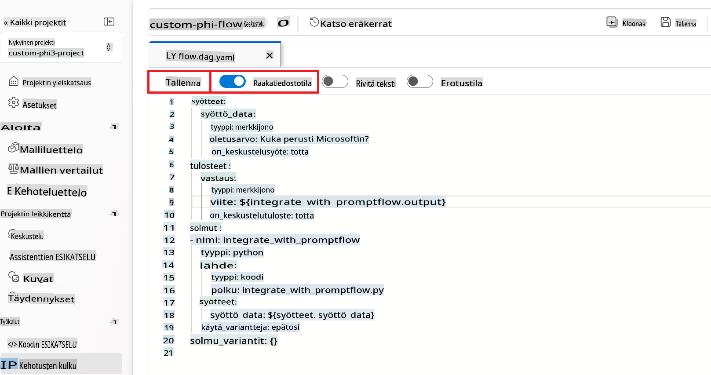

1. Lisää seuraava koodi *integrate_with_promptflow.py*-tiedostoon, jotta voit käyttää mukautettua Phi-3-mallia Prompt flow'ssa.

    ```python
    import logging
    import requests
    from promptflow import tool
    from promptflow.connections import CustomConnection

    # Logging setup
    logging.basicConfig(
        format="%(asctime)s - %(levelname)s - %(name)s - %(message)s",
        datefmt="%Y-%m-%d %H:%M:%S",
        level=logging.DEBUG
    )
    logger = logging.getLogger(__name__)

    def query_phi3_model(input_data: str, connection: CustomConnection) -> str:
        """
        Send a request to the Phi-3 model endpoint with the given input data using Custom Connection.
        """

        # "connection" is the name of the Custom Connection, "endpoint", "key" are the keys in the Custom Connection
        endpoint_url = connection.endpoint
        api_key = connection.key

        headers = {
            "Content-Type": "application/json",
            "Authorization": f"Bearer {api_key}"
        }
        data = {
            "input_data": {
                "input_string": [
                    {"role": "user", "content": input_data}
                ],
                "parameters": {
                    "temperature": 0.7,
                    "max_new_tokens": 128
                }
            }
        }
        try:
            response = requests.post(endpoint_url, json=data, headers=headers)
            response.raise_for_status()
            
            # Log the full JSON response
            logger.debug(f"Full JSON response: {response.json()}")

            result = response.json()["output"]
            logger.info("Successfully received response from Azure ML Endpoint.")
            return result
        except requests.exceptions.RequestException as e:
            logger.error(f"Error querying Azure ML Endpoint: {e}")
            raise

    @tool
    def my_python_tool(input_data: str, connection: CustomConnection) -> str:
        """
        Tool function to process input data and query the Phi-3 model.
        """
        return query_phi3_model(input_data, connection)

    ```

    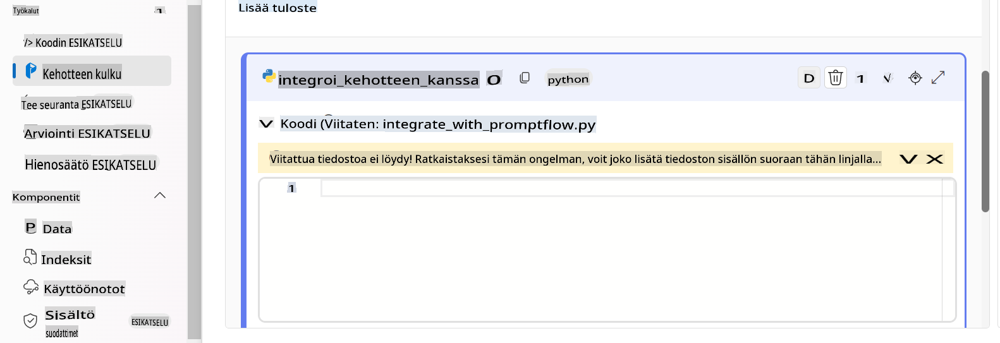

> [!NOTE]
> Lisätietoja Prompt flow'n käytöstä Azure AI Foundryssa löydät täältä: [Prompt flow in Azure AI Foundry](https://learn.microsoft.com/azure/ai-studio/how-to/prompt-flow).

1. Valitse **Chat input**, **Chat output**, jotta voit keskustella mallisi kanssa.

    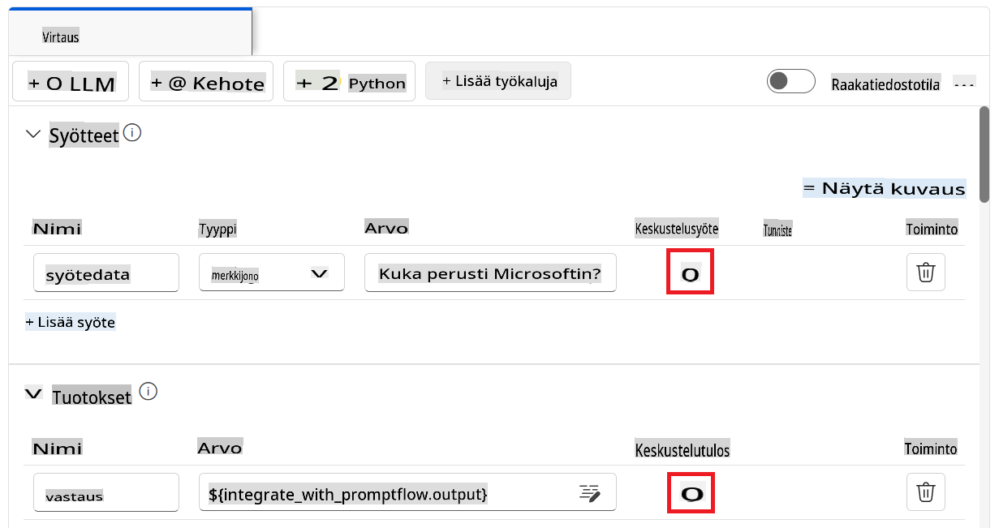

1. Nyt olet valmis keskustelemaan mukautetun Phi-3-mallisi kanssa. Seuraavassa harjoituksessa opit, kuinka käynnistät Prompt flow'n ja käytät sitä keskustellaksesi hienosäädetyn Phi-3-mallisi kanssa.

> [!NOTE]
>
> Muokattu flow näyttää tältä:
>
> 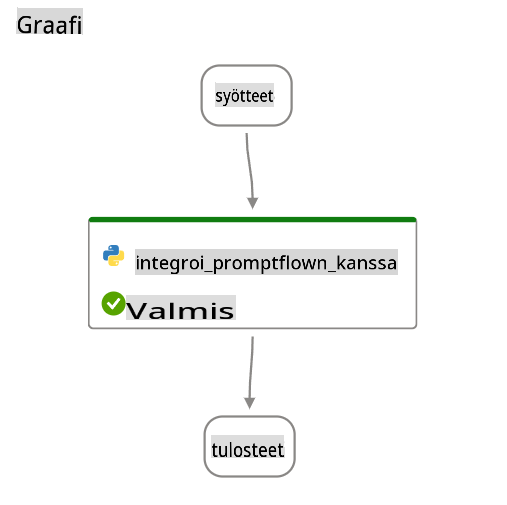
>

### Keskustele mukautetun Phi-3-mallisi kanssa

Nyt kun olet hienosäätänyt ja integroinut mukautetun Phi-3-mallisi Prompt flow'hun, voit aloittaa sen käytön. Tämä harjoitus opastaa sinua, kuinka asennat ja aloitat keskustelun mallisi kanssa Prompt flow'n avulla. Näiden vaiheiden avulla voit hyödyntää hienosäädettyä Phi-3-malliasi monenlaisiin tehtäviin ja keskusteluihin.

- Keskustele mukautetun Phi-3-mallisi kanssa Prompt flow'n avulla.

#### Käynnistä Prompt flow

1. Valitse **Käynnistä laskentasessio** käynnistääksesi Prompt flow'n.

    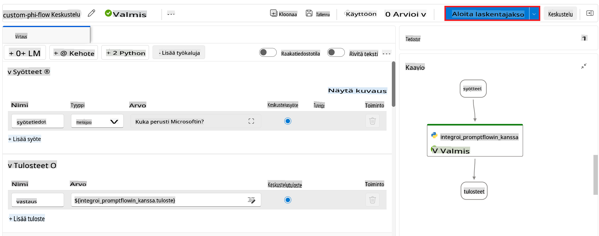

1. Valitse **Vahvista ja jäsennä syöte** päivittääksesi parametrit.

    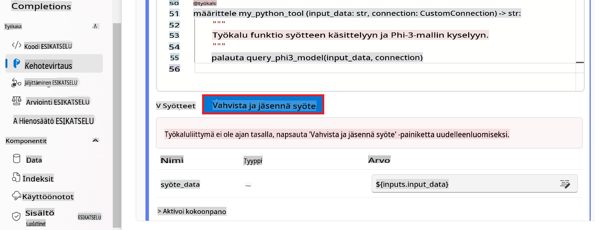

1. Valitse **Yhteyden** arvo, joka vastaa luomaasi mukautettua yhteyttä. Esimerkiksi *connection*.

    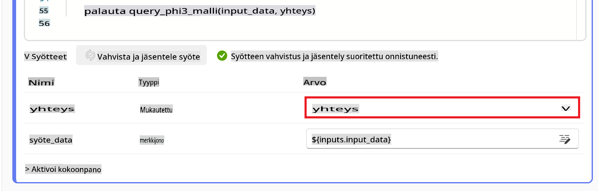

#### Keskustele mukautetun mallisi kanssa

1. Valitse **Chat**.

    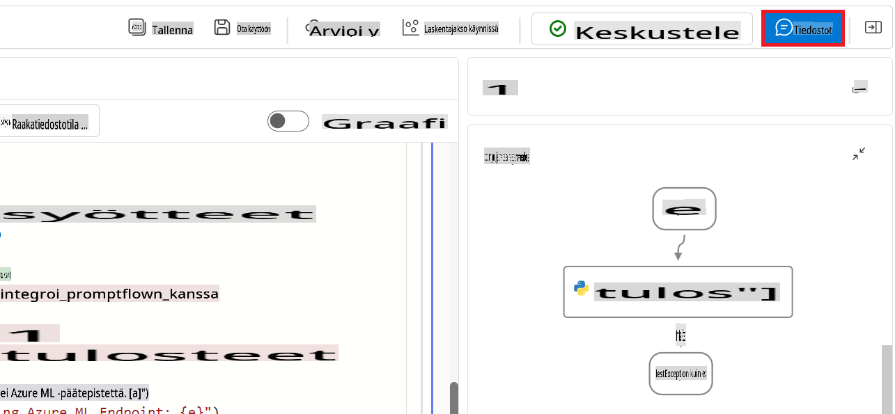

1. Tässä esimerkki tuloksista: Nyt voit keskustella mukautetun Phi-3-mallisi kanssa. On suositeltavaa esittää kysymyksiä mallin hienosäätämiseen käytetyn datan pohjalta.

    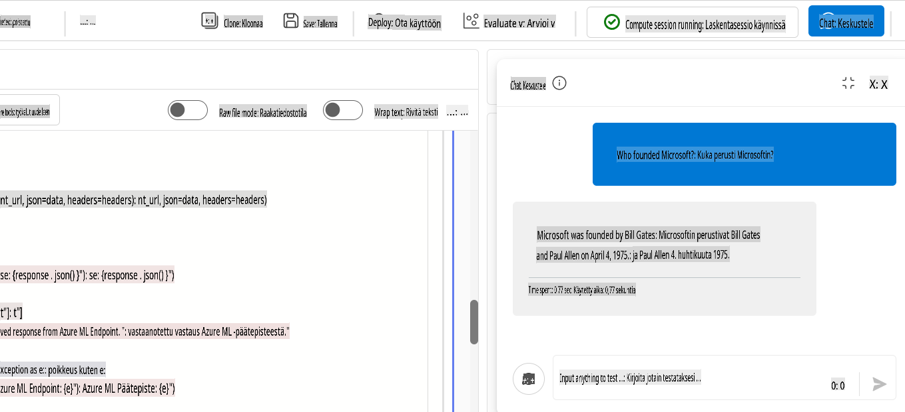

**Vastuuvapauslauseke**:  
Tämä asiakirja on käännetty konepohjaisilla tekoälyyn perustuvilla käännöspalveluilla. Vaikka pyrimme tarkkuuteen, huomioithan, että automaattiset käännökset voivat sisältää virheitä tai epätarkkuuksia. Alkuperäistä asiakirjaa sen alkuperäisellä kielellä tulisi pitää ensisijaisena lähteenä. Kriittistä tietoa varten suositellaan ammattimaista ihmisen tekemää käännöstä. Emme ole vastuussa tämän käännöksen käytöstä johtuvista väärinkäsityksistä tai virhetulkinnoista.