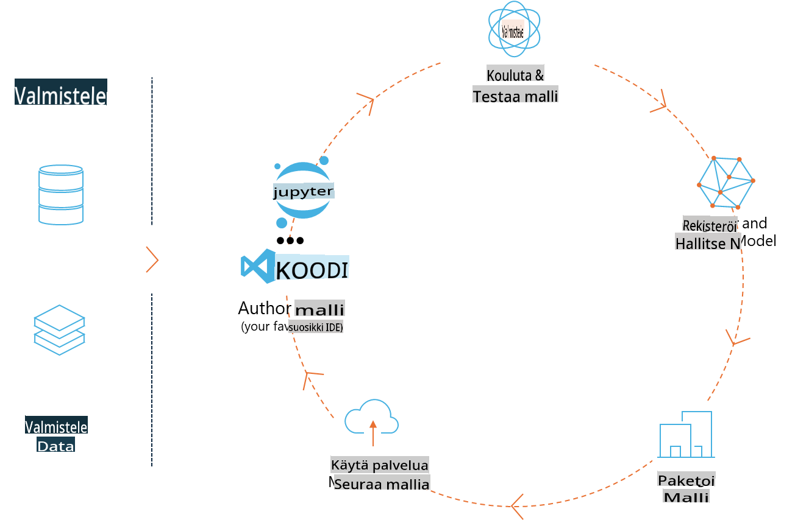
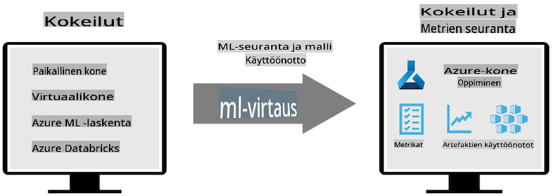
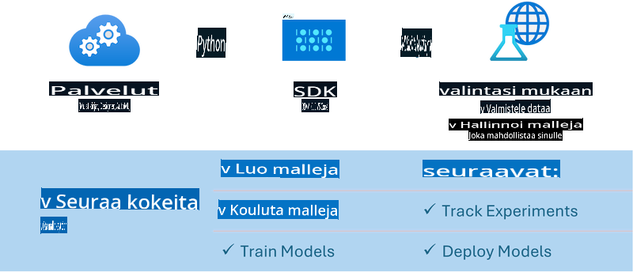

# MLflow

[MLflow](https://mlflow.org/) on avoimen lähdekoodin alusta, joka on suunniteltu hallitsemaan koneoppimisen elinkaaren kaikkia vaiheita.



MLFlow:ta käytetään hallitsemaan ML:n elinkaarta, mukaan lukien kokeiluja, toistettavuutta, käyttöönottoa ja keskitettyä mallirekisteriä. MLFlow tarjoaa tällä hetkellä neljä komponenttia:

- **MLflow Tracking:** Kokeiden, koodin, datakonfiguraatioiden ja tulosten tallennus ja kysely.
- **MLflow Projects:** Data science -koodin paketointi formaattiin, joka mahdollistaa suorituksen toistettavuuden missä tahansa ympäristössä.
- **MLflow Models:** Koneoppimismallien käyttöönotto erilaisissa palveluympäristöissä.
- **Model Registry:** Mallien tallennus, merkinnät ja hallinta keskitetysti.

Se sisältää ominaisuuksia kokeiden seurantaan, koodin paketointiin toistettaviksi suorituksiksi sekä mallien jakamiseen ja käyttöönottoon. MLFlow on integroitu Databricks-alustaan ja tukee monia ML-kirjastoja, mikä tekee siitä riippumattoman tietystä kirjastosta. Sitä voi käyttää minkä tahansa koneoppimiskirjaston ja ohjelmointikielen kanssa, sillä se tarjoaa REST-rajapinnan ja CLI:n helppokäyttöisyyden takaamiseksi.



MLFlow:n keskeisiä ominaisuuksia ovat:

- **Kokeiden seuranta:** Parametrien ja tulosten tallennus ja vertailu.
- **Mallien hallinta:** Mallien käyttöönotto eri palvelu- ja ennustusalustoille.
- **Mallirekisteri:** Mallien elinkaaren hallinta yhteistyössä, mukaan lukien versiointi ja merkinnät.
- **Projektit:** ML-koodin paketointi jakamista tai tuotantokäyttöä varten.

MLFlow tukee myös MLOps-silmukkaa, joka sisältää datan valmistelun, mallien rekisteröinnin ja hallinnan, mallien paketoinnin suorittamista varten, palveluiden käyttöönoton ja mallien seurannan. Sen tavoitteena on yksinkertaistaa siirtymistä prototyypistä tuotantoprosessiin, erityisesti pilvi- ja reunaympäristöissä.

## E2E-skenaario – Wrapperin rakentaminen ja Phi-3:n käyttö MLFlow-mallina

Tässä E2E-esimerkissä näytämme kaksi eri lähestymistapaa rakentaa wrapper Phi-3:n pienen kielimallin (SLM) ympärille ja suorittaa se MLFlow-mallina joko paikallisesti tai pilvessä, esimerkiksi Azure Machine Learning -työtilassa.



| Projekti | Kuvaus | Sijainti |
| ------------ | ----------- | -------- |
| Transformer Pipeline | Transformer Pipeline on helpoin vaihtoehto rakentaa wrapper, jos haluat käyttää HuggingFace-mallia MLFlow:n kokeellisella transformers-flavourilla. | [**TransformerPipeline.ipynb**](../../../../../../code/06.E2E/E2E_Phi-3-MLflow_TransformerPipeline.ipynb) |
| Custom Python Wrapper | Tällä hetkellä transformer pipeline ei tue MLFlow-wrapperin luontia HuggingFace-malleille ONNX-muodossa, edes kokeellisella optimum Python -paketilla. Tällaisissa tapauksissa voit rakentaa mukautetun Python-wrapperin MLFlow-moodille. | [**CustomPythonWrapper.ipynb**](../../../../../../code/06.E2E/E2E_Phi-3-MLflow_CustomPythonWrapper.ipynb) |

## Projekti: Transformer Pipeline

1. Tarvitset MLFlow- ja HuggingFace-paketit Pythonissa:

    ``` Python
    import mlflow
    import transformers
    ```

2. Seuraavaksi sinun tulee aloittaa transformer pipeline viittaamalla kohdemalliin Phi-3 HuggingFace-rekisterissä. _Phi-3-mini-4k-instruct_-mallikortin mukaan sen tehtävä on “Text Generation” -tyyppiä:

    ``` Python
    pipeline = transformers.pipeline(
        task = "text-generation",
        model = "microsoft/Phi-3-mini-4k-instruct"
    )
    ```

3. Voit nyt tallentaa Phi-3-mallisi transformer pipeline:n MLFlow-formaattiin ja lisätä lisätietoja, kuten kohdeartifaktien polun, erityiset mallin konfigurointiasetukset ja inferenssi-API-tyypin:

    ``` Python
    model_info = mlflow.transformers.log_model(
        transformers_model = pipeline,
        artifact_path = "phi3-mlflow-model",
        model_config = model_config,
        task = "llm/v1/chat"
    )
    ```

## Projekti: Custom Python Wrapper

1. Voimme hyödyntää tässä Microsoftin [ONNX Runtime generate() API:a](https://github.com/microsoft/onnxruntime-genai) ONNX-mallin inferenssiin ja tokenien koodaukseen / dekoodaukseen. Valitse _onnxruntime_genai_-paketti kohdelaskennallesi, alla olevassa esimerkissä kohteena on CPU:

    ``` Python
    import mlflow
    from mlflow.models import infer_signature
    import onnxruntime_genai as og
    ```

2. Mukautettu luokkamme toteuttaa kaksi metodia: _load_context()_, joka alustaa Phi-3 Mini 4K Instruct -mallin **ONNX-muodossa**, **generaattoriparametrit** ja **tokenizerin**; ja _predict()_, joka tuottaa tulostokenit annetulle syötteelle:

    ``` Python
    class Phi3Model(mlflow.pyfunc.PythonModel):
        def load_context(self, context):
            # Retrieving model from the artifacts
            model_path = context.artifacts["phi3-mini-onnx"]
            model_options = {
                 "max_length": 300,
                 "temperature": 0.2,         
            }
        
            # Defining the model
            self.phi3_model = og.Model(model_path)
            self.params = og.GeneratorParams(self.phi3_model)
            self.params.set_search_options(**model_options)
            
            # Defining the tokenizer
            self.tokenizer = og.Tokenizer(self.phi3_model)
    
        def predict(self, context, model_input):
            # Retrieving prompt from the input
            prompt = model_input["prompt"][0]
            self.params.input_ids = self.tokenizer.encode(prompt)
    
            # Generating the model's response
            response = self.phi3_model.generate(self.params)
    
            return self.tokenizer.decode(response[0][len(self.params.input_ids):])
    ```

3. Voit nyt käyttää _mlflow.pyfunc.log_model()_-funktiota luodaksesi mukautetun Python-wrapperin (pickle-muodossa) Phi-3-mallille yhdessä alkuperäisen ONNX-mallin ja tarvittavien riippuvuuksien kanssa:

    ``` Python
    model_info = mlflow.pyfunc.log_model(
        artifact_path = artifact_path,
        python_model = Phi3Model(),
        artifacts = {
            "phi3-mini-onnx": "cpu_and_mobile/cpu-int4-rtn-block-32-acc-level-4",
        },
        input_example = input_example,
        signature = infer_signature(input_example, ["Run"]),
        extra_pip_requirements = ["torch", "onnxruntime_genai", "numpy"],
    )
    ```

## Generoitujen MLFlow-mallien allekirjoitukset

1. Transformer Pipeline -projektin vaiheessa 3 asetimme MLFlow-mallin tehtäväksi “_llm/v1/chat_”. Tällainen asetus luo mallin API-wrapperin, joka on yhteensopiva OpenAI:n Chat API:n kanssa seuraavasti:

    ``` Python
    {inputs: 
      ['messages': Array({content: string (required), name: string (optional), role: string (required)}) (required), 'temperature': double (optional), 'max_tokens': long (optional), 'stop': Array(string) (optional), 'n': long (optional), 'stream': boolean (optional)],
    outputs: 
      ['id': string (required), 'object': string (required), 'created': long (required), 'model': string (required), 'choices': Array({finish_reason: string (required), index: long (required), message: {content: string (required), name: string (optional), role: string (required)} (required)}) (required), 'usage': {completion_tokens: long (required), prompt_tokens: long (required), total_tokens: long (required)} (required)],
    params: 
      None}
    ```

2. Tämän tuloksena voit lähettää syötteen seuraavassa muodossa:

    ``` Python
    messages = [{"role": "user", "content": "What is the capital of Spain?"}]
    ```

3. Sitten voit käyttää OpenAI API:n kanssa yhteensopivaa jälkikäsittelyä, esimerkiksi _response[0][‘choices’][0][‘message’][‘content’]_, jotta tulos näyttää tältä:

    ``` JSON
    Question: What is the capital of Spain?
    
    Answer: The capital of Spain is Madrid. It is the largest city in Spain and serves as the political, economic, and cultural center of the country. Madrid is located in the center of the Iberian Peninsula and is known for its rich history, art, and architecture, including the Royal Palace, the Prado Museum, and the Plaza Mayor.
    
    Usage: {'prompt_tokens': 11, 'completion_tokens': 73, 'total_tokens': 84}
    ```

4. Custom Python Wrapper -projektin vaiheessa 3 annamme MLFlow-paketin generoida mallin allekirjoituksen annetusta syöte-esimerkistä. MLFlow-wrapperimme allekirjoitus näyttää tältä:

    ``` Python
    {inputs: 
      ['prompt': string (required)],
    outputs: 
      [string (required)],
    params: 
      None}
    ```

5. Näin ollen syötteen täytyy sisältää "prompt"-avain, kuten tässä:

    ``` Python
    {"prompt": "<|system|>You are a stand-up comedian.<|end|><|user|>Tell me a joke about atom<|end|><|assistant|>",}
    ```

6. Mallin tulos annetaan sitten merkkijonona:

    ``` JSON
    Alright, here's a little atom-related joke for you!
    
    Why don't electrons ever play hide and seek with protons?
    
    Because good luck finding them when they're always "sharing" their electrons!
    
    Remember, this is all in good fun, and we're just having a little atomic-level humor!
    ```

**Vastuuvapauslauseke**:  
Tämä asiakirja on käännetty konepohjaisia tekoälykäännöspalveluja käyttäen. Pyrimme tarkkuuteen, mutta huomioithan, että automaattiset käännökset voivat sisältää virheitä tai epätarkkuuksia. Alkuperäistä asiakirjaa sen alkuperäisellä kielellä tulisi pitää ensisijaisena lähteenä. Tärkeissä tiedoissa suositellaan ammattimaista ihmiskääntäjää. Emme ole vastuussa tämän käännöksen käytöstä johtuvista väärinkäsityksistä tai virhetulkinnoista.