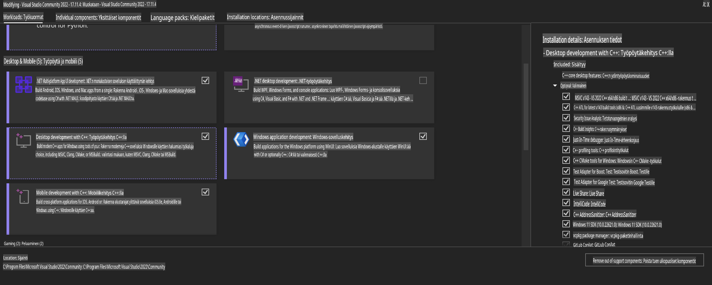
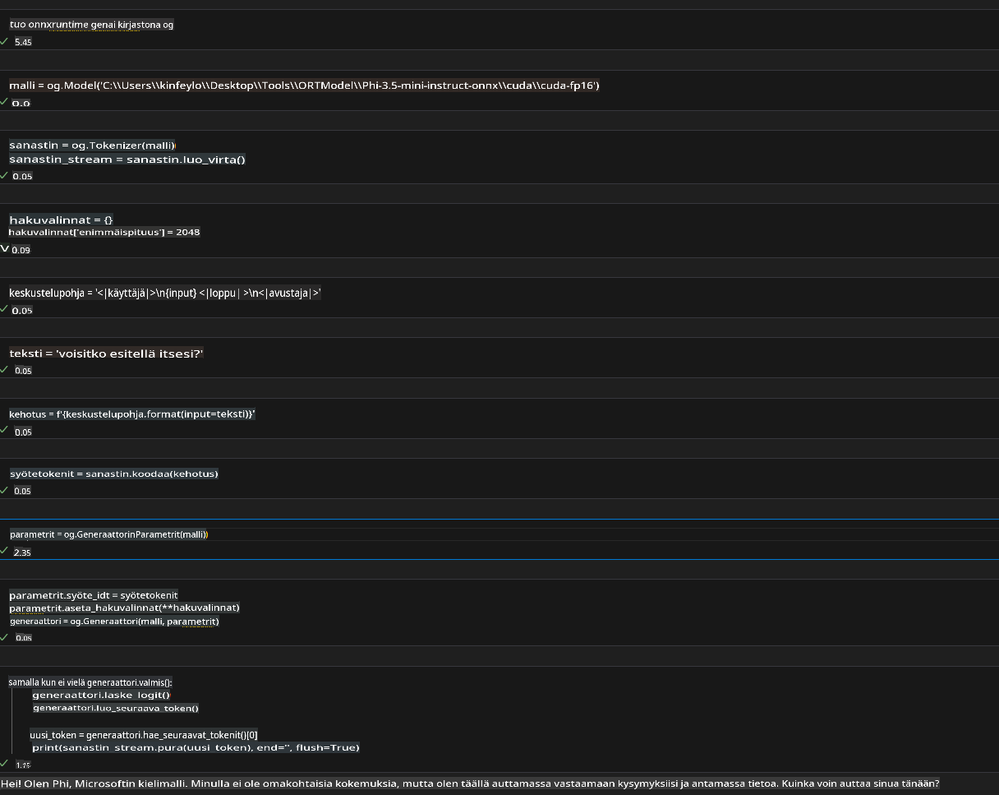
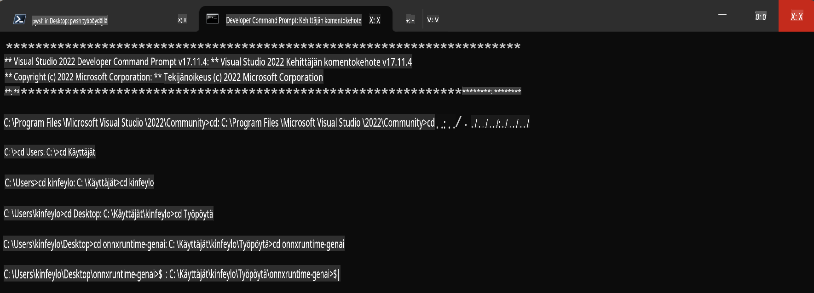

# **Ohjeet OnnxRuntime GenAI Windows GPU:lle**

Tässä ohjeessa kerrotaan, miten voit ottaa käyttöön ja käyttää ONNX Runtimea (ORT) GPU:iden kanssa Windowsissa. Sen tarkoituksena on auttaa hyödyntämään GPU-kiihdytystä malleissasi, parantaen suorituskykyä ja tehokkuutta.

Dokumentti kattaa seuraavat aiheet:

- Ympäristön asennus: Ohjeet tarvittavien riippuvuuksien, kuten CUDA:n, cuDNN:n ja ONNX Runtimen, asentamiseen.
- Konfigurointi: Kuinka konfiguroida ympäristö ja ONNX Runtime hyödyntämään GPU-resursseja tehokkaasti.
- Optimointivinkit: Neuvoja GPU-asetusten hienosäätämiseen parhaan suorituskyvyn saavuttamiseksi.

### **1. Python 3.10.x / 3.11.8**

   ***Huom*** Suositellaan käyttämään [miniforgea](https://github.com/conda-forge/miniforge/releases/latest/download/Miniforge3-Windows-x86_64.exe) Python-ympäristönä.

   ```bash

   conda create -n pydev python==3.11.8

   conda activate pydev

   ```

   ***Muistutus*** Jos olet asentanut jonkin Python ONNX -kirjaston, poista se ennen jatkamista.

### **2. Asenna CMake wingetillä**

   ```bash

   winget install -e --id Kitware.CMake

   ```

### **3. Asenna Visual Studio 2022 - C++-työpöytäkehitys**

   ***Huom*** Jos et halua kääntää koodia, voit ohittaa tämän vaiheen.



### **4. Asenna NVIDIA-ajurit**

1. **NVIDIA GPU -ajuri** [https://www.nvidia.com/en-us/drivers/](https://www.nvidia.com/en-us/drivers/)

2. **NVIDIA CUDA 12.4** [https://developer.nvidia.com/cuda-12-4-0-download-archive](https://developer.nvidia.com/cuda-12-4-0-download-archive)

3. **NVIDIA CUDNN 9.4** [https://developer.nvidia.com/cudnn-downloads](https://developer.nvidia.com/cudnn-downloads)

***Muistutus*** Käytä oletusasetuksia asennusprosessin aikana.

### **5. Määritä NVIDIA-ympäristö**

Kopioi NVIDIA CUDNN 9.4:n lib-, bin- ja include-kansiot NVIDIA CUDA 12.4:n vastaaviin kansioihin.

- kopioi *'C:\Program Files\NVIDIA\CUDNN\v9.4\bin\12.6'* tiedostot *'C:\Program Files\NVIDIA GPU Computing Toolkit\CUDA\v12.4\bin'*

- kopioi *'C:\Program Files\NVIDIA\CUDNN\v9.4\include\12.6'* tiedostot *'C:\Program Files\NVIDIA GPU Computing Toolkit\CUDA\v12.4\include'*

- kopioi *'C:\Program Files\NVIDIA\CUDNN\v9.4\lib\12.6'* tiedostot *'C:\Program Files\NVIDIA GPU Computing Toolkit\CUDA\v12.4\lib\x64'*

### **6. Lataa Phi-3.5-mini-instruct-onnx**

   ```bash

   winget install -e --id Git.Git

   winget install -e --id GitHub.GitLFS

   git lfs install

   git clone https://huggingface.co/microsoft/Phi-3.5-mini-instruct-onnx

   ```

### **7. Suorita InferencePhi35Instruct.ipynb**

   Avaa [Notebook](../../../../../../code/09.UpdateSamples/Aug/ortgpu-phi35-instruct.ipynb) ja suorita.



### **8. Käännä ORT GenAI GPU**

   ***Huom*** 

   1. Poista ensin kaikki onnx-, onnxruntime- ja onnxruntime-genai-kirjastot.

   ```bash

   pip list 
   
   ```

   Poista sitten kaikki onnxruntime-kirjastot, esim.:

   ```bash

   pip uninstall onnxruntime

   pip uninstall onnxruntime-genai

   pip uninstall onnxruntume-genai-cuda
   
   ```

   2. Tarkista Visual Studio -laajennuksen tuki.

   Tarkista kansiosta C:\Program Files\NVIDIA GPU Computing Toolkit\CUDA\v12.4\extras, että kansio C:\Program Files\NVIDIA GPU Computing Toolkit\CUDA\v12.4\extras\visual_studio_integration löytyy. 

   Jos kansiota ei löydy, tarkista muut Cuda Toolkit -ajurikansiot ja kopioi visual_studio_integration-kansio ja sen sisältö kansioon C:\Program Files\NVIDIA GPU Computing Toolkit\CUDA\v12.4\extras\visual_studio_integration.

   - Jos et halua kääntää koodia, voit ohittaa tämän vaiheen.

   ```bash

   git clone https://github.com/microsoft/onnxruntime-genai

   ```

   - Lataa [https://github.com/microsoft/onnxruntime/releases/download/v1.19.2/onnxruntime-win-x64-gpu-1.19.2.zip](https://github.com/microsoft/onnxruntime/releases/download/v1.19.2/onnxruntime-win-x64-gpu-1.19.2.zip)

   - Pura onnxruntime-win-x64-gpu-1.19.2.zip ja nimeä se uudelleen **ort**-kansioksi. Kopioi ort-kansio onnxruntime-genai-hakemistoon.

   - Avaa Windows Terminal, siirry VS 2022:n Developer Command Promptiin ja mene onnxruntime-genai-hakemistoon.



   - Käännä se Python-ympäristössäsi.

   ```bash

   cd onnxruntime-genai

   python build.py --use_cuda  --cuda_home "C:\Program Files\NVIDIA GPU Computing Toolkit\CUDA\v12.4" --config Release
 

   cd build/Windows/Release/Wheel

   pip install .whl

   ```

**Vastuuvapauslauseke**:  
Tämä asiakirja on käännetty konepohjaisilla tekoälykäännöspalveluilla. Pyrimme tarkkuuteen, mutta huomioithan, että automaattiset käännökset voivat sisältää virheitä tai epätarkkuuksia. Alkuperäistä asiakirjaa sen alkuperäisellä kielellä tulisi pitää ensisijaisena lähteenä. Kriittisen tiedon osalta suositellaan ammattimaista ihmiskääntämistä. Emme ole vastuussa tämän käännöksen käytöstä aiheutuvista väärinkäsityksistä tai virhetulkinnoista.