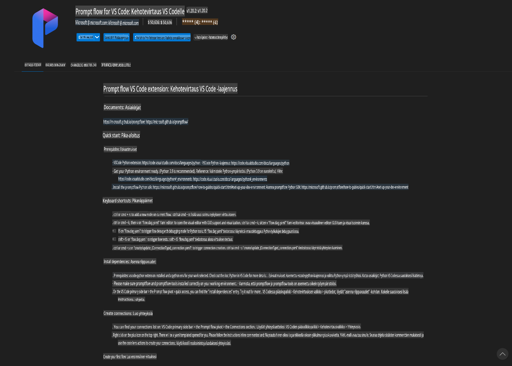
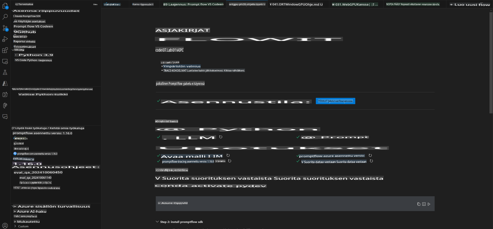
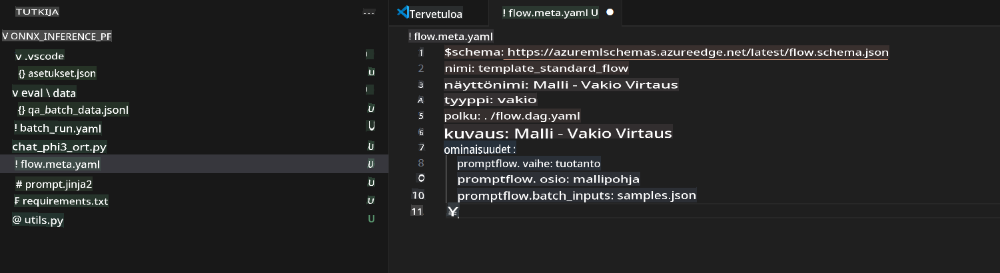
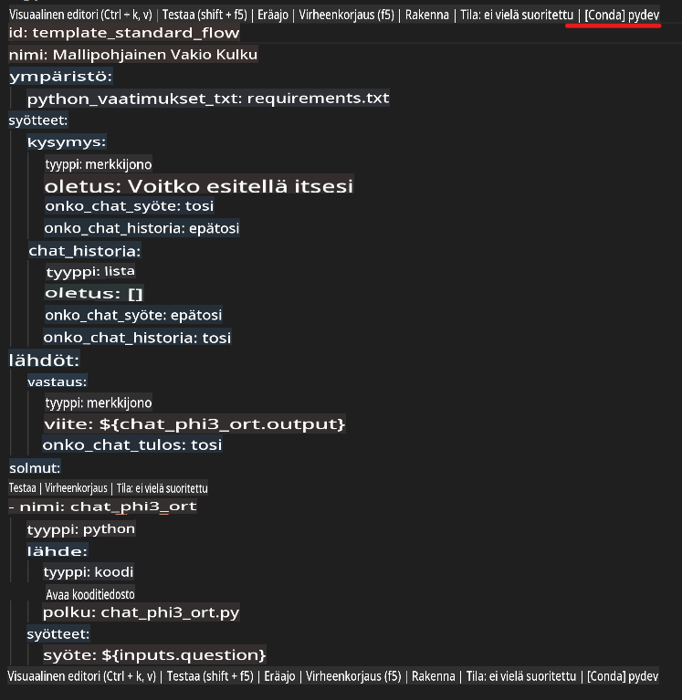
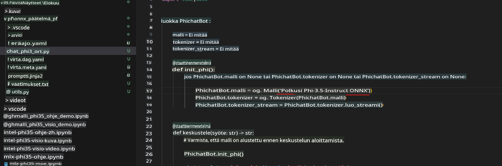
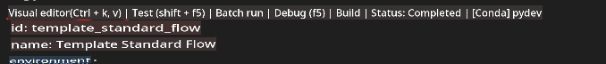
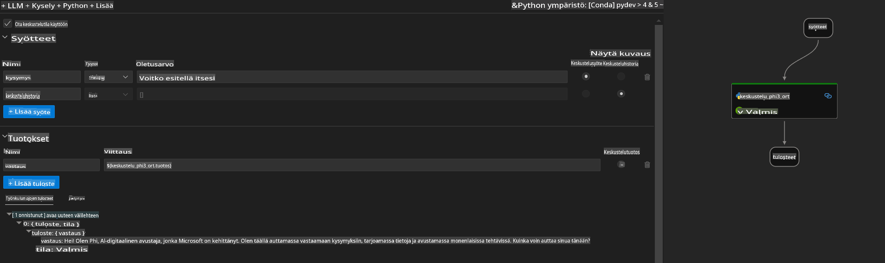
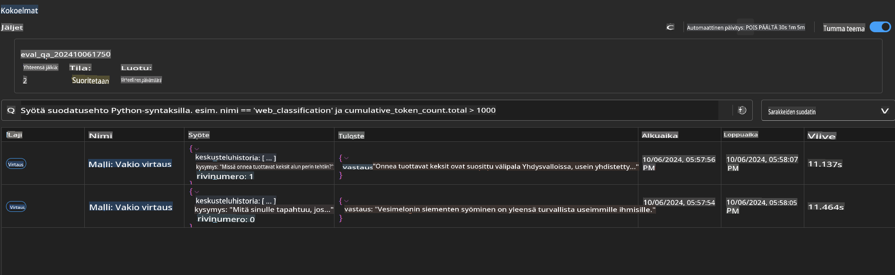

# Windows GPU:n käyttäminen Prompt flow -ratkaisun luomiseen Phi-3.5-Instruct ONNX:lla

Tämä dokumentti on esimerkki siitä, kuinka käyttää PromptFlow'ta yhdessä ONNX:n (Open Neural Network Exchange) kanssa Phi-3-malleihin perustuvien tekoälysovellusten kehittämisessä.

PromptFlow on kehitystyökalujen kokonaisuus, joka on suunniteltu helpottamaan LLM-pohjaisten (Large Language Model) tekoälysovellusten kehityksen koko elinkaarta ideoinnista ja prototypoinnista aina testaukseen ja arviointiin asti.

Integroimalla PromptFlow ONNX:n kanssa kehittäjät voivat:

- **Optimoida mallin suorituskykyä**: Hyödyntää ONNX:ää tehokkaaseen mallin inferenssiin ja käyttöönottoon.
- **Yksinkertaistaa kehitystyötä**: Käyttää PromptFlow'ta työnkulun hallintaan ja toistuvien tehtävien automatisointiin.
- **Parantaa yhteistyötä**: Helpottaa tiimin välistä yhteistyötä tarjoamalla yhtenäisen kehitysympäristön.

**Prompt flow** on kehitystyökalujen kokonaisuus, joka on suunniteltu virtaviivaistamaan LLM-pohjaisten tekoälysovellusten kehityksen koko elinkaarta ideoinnista, prototypoinnista, testauksesta ja arvioinnista aina tuotantoon ja valvontaan asti. Se tekee prompt-suunnittelusta huomattavasti helpompaa ja mahdollistaa tuotantovalmiiden LLM-sovellusten rakentamisen.

Prompt flow voi yhdistyä OpenAI:hin, Azure OpenAI Serviceen ja mukautettuihin malleihin (Huggingface, paikalliset LLM/SLM). Tavoitteenamme on ottaa käyttöön Phi-3.5:n kvantisoitu ONNX-malli paikallisissa sovelluksissa. Prompt flow auttaa meitä suunnittelemaan liiketoimintaamme paremmin ja toteuttamaan paikallisia ratkaisuja Phi-3.5:n pohjalta. Tässä esimerkissä yhdistämme ONNX Runtime GenAI -kirjaston Prompt flow -ratkaisun toteuttamiseen Windows GPU:lla.

## **Asennus**

### **ONNX Runtime GenAI Windows GPU:lle**

Lue tämä ohje asentaaksesi ONNX Runtime GenAI Windows GPU:lle [klikkaa tästä](./ORTWindowGPUGuideline.md)

### **Prompt flow'n asennus VSCodeen**

1. Asenna Prompt flow VS Code -laajennus



2. Kun olet asentanut Prompt flow VS Code -laajennuksen, klikkaa laajennusta ja valitse **Installation dependencies**. Seuraa tätä ohjetta asentaaksesi Prompt flow SDK ympäristöösi.



3. Lataa [Esimerkkikoodi](../../../../../../code/09.UpdateSamples/Aug/pf/onnx_inference_pf) ja avaa tämä esimerkki VS Codessa.



4. Avaa **flow.dag.yaml** ja valitse Python-ympäristösi.



   Avaa **chat_phi3_ort.py** ja vaihda Phi-3.5-instruct ONNX -mallisi sijainti.



5. Suorita Prompt flow -ratkaisusi testataksesi sitä.

Avaa **flow.dag.yaml** ja klikkaa visuaalista editoria.



Klikkaa tätä ja suorita testataksesi.



1. Voit suorittaa eräkäsittelyn terminaalissa nähdäksesi lisää tuloksia.

```bash

pf run create --file batch_run.yaml --stream --name 'Your eval qa name'    

```

Voit tarkistaa tulokset oletusselaimessasi.



**Vastuuvapauslauseke**:  
Tämä asiakirja on käännetty konepohjaisia tekoälykäännöspalveluita käyttäen. Pyrimme tarkkuuteen, mutta huomioithan, että automaattiset käännökset voivat sisältää virheitä tai epätarkkuuksia. Alkuperäistä asiakirjaa sen alkuperäisellä kielellä tulee pitää auktoritatiivisena lähteenä. Kriittisen tiedon osalta suositellaan ammattimaista ihmiskäännöstä. Emme ole vastuussa tämän käännöksen käytöstä johtuvista väärinkäsityksistä tai virhetulkinnoista.