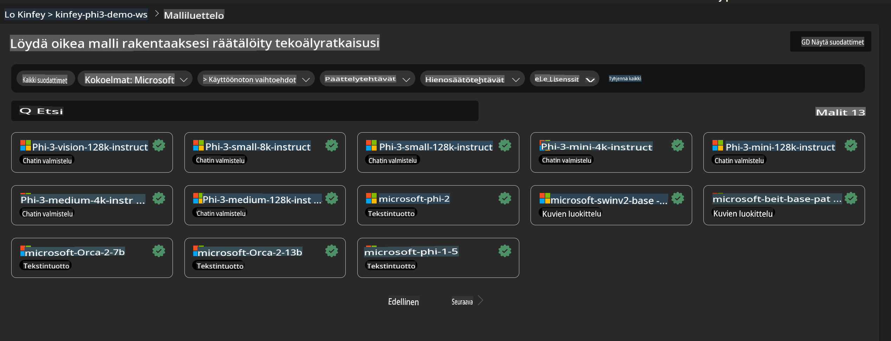
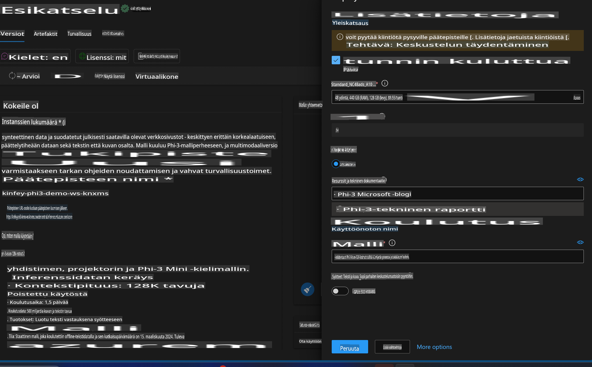
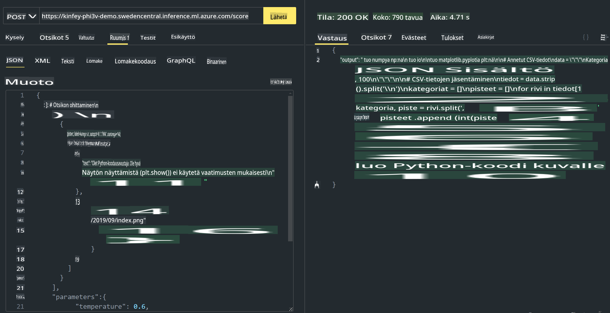

# **Lab 3 - Ota Phi-3-Vision käyttöön Azure Machine Learning Servicessä**

Käytämme NPU:ta viimeistelemään paikallisen koodin tuotantokäyttöönoton, ja sen jälkeen haluamme ottaa käyttöön PHI-3-VISION-ominaisuuden, joka mahdollistaa kuvista koodin generoinnin.

Tässä ohjeessa rakennamme nopeasti Model As Service -tyyppisen Phi-3 Vision -palvelun Azure Machine Learning Servicessä.

***Huom***: Phi-3 Vision tarvitsee laskentatehoa sisällön nopeampaan generointiin. Pilvilaskentateho auttaa meitä saavuttamaan tämän.


### **1. Luo Azure Machine Learning Service**

Meidän täytyy luoda Azure Machine Learning Service Azure-portaalissa. Jos haluat oppia, miten tämä tehdään, vieraile tässä linkissä [https://learn.microsoft.com/azure/machine-learning/quickstart-create-resources?view=azureml-api-2](https://learn.microsoft.com/azure/machine-learning/quickstart-create-resources?view=azureml-api-2)


### **2. Valitse Phi-3 Vision Azure Machine Learning Servicessä**




### **3. Ota Phi-3-Vision käyttöön Azuren kautta**




### **4. Testaa päätepistettä Postmanilla**




***Huom***

1. Lähetettävien parametrien tulee sisältää Authorization, azureml-model-deployment ja Content-Type. Sinun täytyy tarkistaa käyttöönoton tiedot saadaksesi nämä.

2. Parametrien lähettämiseksi Phi-3-Vision tarvitsee kuvalinkin. Katso GPT-4-Vision-menetelmästä esimerkki parametrien lähettämiseen, kuten

```json

{
  "input_data":{
    "input_string":[
      {
        "role":"user",
        "content":[ 
          {
            "type": "text",
            "text": "You are a Python coding assistant.Please create Python code for image "
          },
          {
              "type": "image_url",
              "image_url": {
                "url": "https://ajaytech.co/wp-content/uploads/2019/09/index.png"
              }
          }
        ]
      }
    ],
    "parameters":{
          "temperature": 0.6,
          "top_p": 0.9,
          "do_sample": false,
          "max_new_tokens": 2048
    }
  }
}

```

3. Käytä **/score**-päätepistettä Post-metodilla.

**Onnittelut**! Olet suorittanut PHI-3-VISIONin nopean käyttöönoton ja kokeillut, kuinka kuvia käytetään koodin generointiin. Seuraavaksi voimme rakentaa sovelluksia yhdistämällä NPU:t ja pilvipalvelut.

**Vastuuvapauslauseke**:  
Tämä asiakirja on käännetty konepohjaisilla tekoälykäännöspalveluilla. Pyrimme tarkkuuteen, mutta huomioithan, että automaattiset käännökset voivat sisältää virheitä tai epätarkkuuksia. Alkuperäistä asiakirjaa sen alkuperäisellä kielellä tulee pitää auktoritatiivisena lähteenä. Kriittisen tiedon osalta suositellaan ammattimaista ihmiskääntämistä. Emme ole vastuussa tämän käännöksen käytöstä johtuvista väärinkäsityksistä tai virhetulkinnoista.