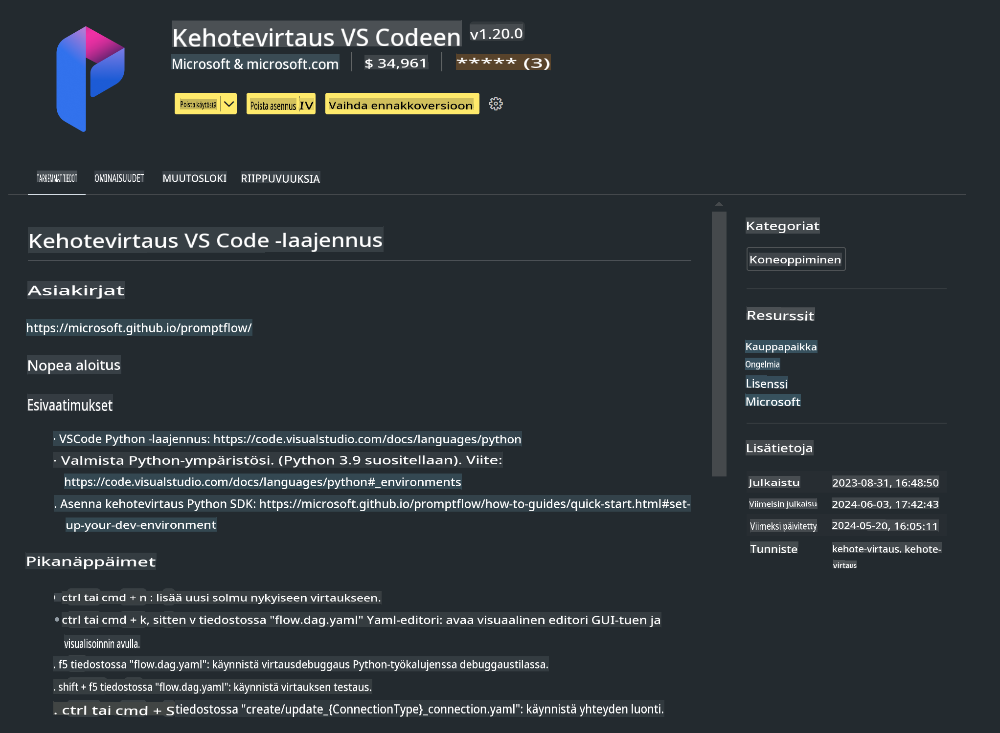

# **Lab 0 - Asennus**

Kun aloitamme laboratorion, meidän täytyy määrittää tarvittava ympäristö:

### **1. Python 3.11+**

Suositellaan käyttämään miniforgea Python-ympäristön määrittämiseen.

Miniforgen määrittämiseksi katso [https://github.com/conda-forge/miniforge](https://github.com/conda-forge/miniforge)

Kun olet määrittänyt miniforgen, suorita seuraava komento Power Shellissä:

```bash

conda create -n pyenv python==3.11.8 -y

conda activate pyenv

```

### **2. Asenna Prompt flow SDK**

Lab 1:ssa käytämme Prompt flow'ta, joten sinun täytyy asentaa Prompt flow SDK.

```bash

pip install promptflow --upgrade

```

Voit tarkistaa promptflow SDK:n tällä komennolla:

```bash

pf --version

```

### **3. Asenna Visual Studio Code Prompt flow -laajennus**



### **4. Applen MLX-kehys**

MLX on Applen kehittämä matriisikehys koneoppimisen tutkimukseen Apple Siliconilla. **Apple MLX -kehystä** voi käyttää LLM/SLM:n nopeuttamiseen Apple Siliconilla. Jos haluat tietää lisää, voit lukea [https://github.com/microsoft/PhiCookBook/blob/main/md/01.Introduction/03/MLX_Inference.md](https://github.com/microsoft/PhiCookBook/blob/main/md/01.Introduction/03/MLX_Inference.md).

Asenna MLX-kehyskirjasto bashissa:

```bash

pip install mlx-lm

```

### **5. Muut Python-kirjastot**

Luo requirements.txt-tiedosto ja lisää siihen tämä sisältö:

```txt

notebook
numpy 
scipy 
scikit-learn 
matplotlib 
pandas 
pillow 
graphviz

```

### **6. Asenna NVM**

Asenna nvm PowerShellissä:

```bash

brew install nvm

```

Asenna nodejs 18.20:

```bash

nvm install 18.20.0

nvm use 18.20.0

```

### **7. Asenna Visual Studio Code -kehitystuki**

```bash

npm install --global yo generator-code

```

Onnittelut! Olet onnistuneesti määrittänyt SDK:n. Seuraavaksi siirry käytännön tehtäviin.

**Vastuuvapauslauseke**:  
Tämä asiakirja on käännetty konepohjaisilla tekoälykäännöspalveluilla. Pyrimme tarkkuuteen, mutta huomioithan, että automaattiset käännökset voivat sisältää virheitä tai epätarkkuuksia. Alkuperäistä asiakirjaa sen alkuperäisellä kielellä tulisi pitää ensisijaisena lähteenä. Kriittisen tiedon osalta suositellaan ammattimaista ihmiskäännöstä. Emme ole vastuussa tämän käännöksen käytöstä aiheutuvista väärinkäsityksistä tai virhetulkinnoista.