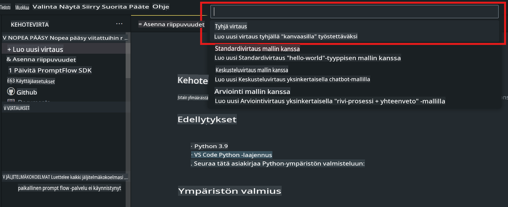
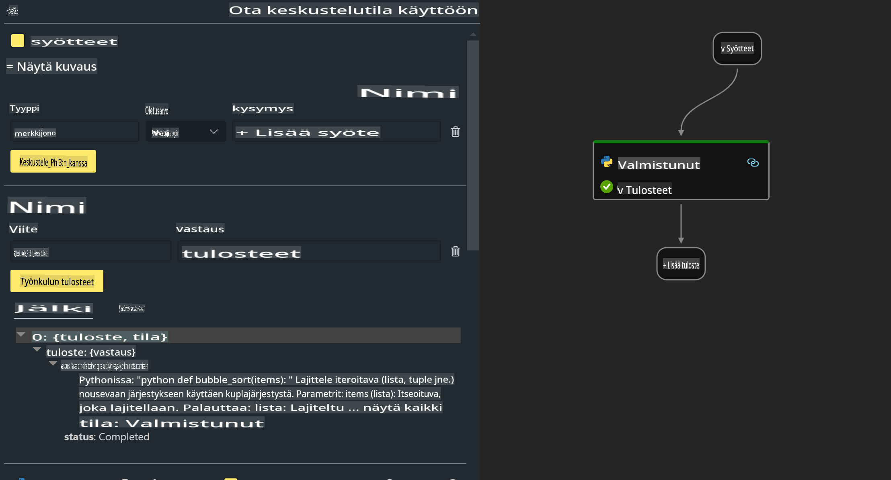

# **Lab 2 - Suorita Prompt flow Phi-3-mini:n kanssa AIPC:ssä**

## **Mikä on Prompt flow**

Prompt flow on kehitystyökalujen kokonaisuus, joka on suunniteltu helpottamaan LLM-pohjaisten tekoälysovellusten koko kehityssykliä, ideoinnista, prototypoinnista, testauksesta ja arvioinnista tuotantoon ja valvontaan. Se tekee promptien suunnittelusta huomattavasti helpompaa ja mahdollistaa tuotantotasoisten LLM-sovellusten rakentamisen.

Prompt flow'n avulla voit:

- Luoda työnkulkuja, jotka yhdistävät LLM:t, promptit, Python-koodin ja muut työkalut toimivaksi kokonaisuudeksi.

- Debugata ja iteroida työnkulkujasi, erityisesti LLM:ien kanssa tapahtuvaa vuorovaikutusta, helposti.

- Arvioida työnkulkujasi ja laskea laadun ja suorituskyvyn mittareita suuremmilla tietoaineistoilla.

- Integroida testauksen ja arvioinnin CI/CD-järjestelmääsi varmistaaksesi työnkulkujasi laadun.

- Ottaa työnkulkujasi käyttöön valitsemallasi palvelualustalla tai integroida ne helposti sovelluksesi koodipohjaan.

- (Valinnainen mutta erittäin suositeltava) Tehdä yhteistyötä tiimisi kanssa hyödyntämällä Azure AI:n pilvipohjaista Prompt flow -versiota.

## **Generointikoodin työnkulkujen rakentaminen Apple Siliconilla**

***Note***: Jos et ole vielä suorittanut ympäristön asennusta, käy sivulla [Lab 0 -Installations](./01.Installations.md)

1. Avaa Prompt flow -laajennus Visual Studio Codessa ja luo tyhjä flow-projekti.



2. Lisää Input- ja Output-parametrit sekä Python-koodi uutena työnkulkuna.



Voit käyttää tätä rakennetta (flow.dag.yaml) työnkulun rakentamiseen:

```yaml

inputs:
  prompt:
    type: string
    default: Write python code for Fibonacci serie. Please use markdown as output
outputs:
  result:
    type: string
    reference: ${gen_code_by_phi3.output}
nodes:
- name: gen_code_by_phi3
  type: python
  source:
    type: code
    path: gen_code_by_phi3.py
  inputs:
    prompt: ${inputs.prompt}


```

3. Kvantisoi phi-3-mini

Haluamme suorittaa SLM:n paremmin paikallisilla laitteilla. Yleensä kvantisoimme mallin (INT4, FP16, FP32).

```bash

python -m mlx_lm.convert --hf-path microsoft/Phi-3-mini-4k-instruct

```

**Huom:** Oletuskansio on mlx_model.

4. Lisää koodi tiedostoon ***Chat_With_Phi3.py***.

```python


from promptflow import tool

from mlx_lm import load, generate


# The inputs section will change based on the arguments of the tool function, after you save the code
# Adding type to arguments and return value will help the system show the types properly
# Please update the function name/signature per need
@tool
def my_python_tool(prompt: str) -> str:

    model_id = './mlx_model_phi3_mini'

    model, tokenizer = load(model_id)

    # <|user|>\nWrite python code for Fibonacci serie. Please use markdown as output<|end|>\n<|assistant|>

    response = generate(model, tokenizer, prompt="<|user|>\n" + prompt  + "<|end|>\n<|assistant|>", max_tokens=2048, verbose=True)

    return response


```

4. Voit testata työnkulkua Debug- tai Run-toiminnolla varmistaaksesi, että generointikoodi toimii oikein.


5. Suorita työnkulku kehitys-API:na terminaalissa.

```

pf flow serve --source ./ --port 8080 --host localhost   

```

Voit testata sitä Postmanissa tai Thunder Clientissä.

### **Huomioitavaa**

1. Ensimmäinen suoritus kestää pitkään. Suosittelemme lataamaan phi-3-mallin Hugging Face CLI:n kautta.

2. Ottaen huomioon Intel NPU:n rajallisen laskentatehon, suosittelemme käyttämään Phi-3-mini-4k-instruct-mallia.

3. Käytämme Intel NPU -kiihdytystä INT4-konversioon, mutta jos suoritat palvelun uudelleen, sinun on poistettava välimuisti ja nc_workshop-kansiot.

## **Resurssit**

1. Opi Prompt flow'sta [https://microsoft.github.io/promptflow/](https://microsoft.github.io/promptflow/)

2. Opi Intel NPU -kiihdytyksestä [https://github.com/intel/intel-npu-acceleration-library](https://github.com/intel/intel-npu-acceleration-library)

3. Esimerkkikoodi, lataa [Local NPU Agent Sample Code](../../../../../../../../../code/07.Lab/01/AIPC/local-npu-agent)

**Vastuuvapauslauseke**:  
Tämä asiakirja on käännetty konepohjaisia tekoälykäännöspalveluja käyttäen. Pyrimme tarkkuuteen, mutta huomioithan, että automaattiset käännökset voivat sisältää virheitä tai epätarkkuuksia. Alkuperäistä asiakirjaa sen alkuperäisellä kielellä tulee pitää ensisijaisena lähteenä. Kriittisen tiedon osalta suositellaan ammattimaista ihmiskääntämistä. Emme ole vastuussa tämän käännöksen käytöstä aiheutuvista väärinkäsityksistä tai virhetulkinnoista.