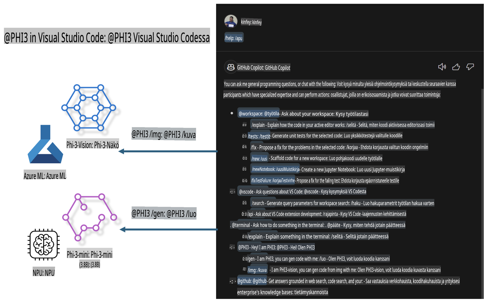

# **Rakenna oma Visual Studio Code GitHub Copilot Chat Microsoft Phi-3 -perheen avulla**

Oletko käyttänyt GitHub Copilot Chatin workspace-agenttia? Haluatko rakentaa oman tiimisi koodiavustajan? Tämä käytännön harjoitus pyrkii yhdistämään avoimen lähdekoodin mallin yritystason koodiavustajan luomiseksi.

## **Perusta**

### **Miksi valita Microsoft Phi-3**

Phi-3 on perhesarja, joka sisältää phi-3-mini-, phi-3-small- ja phi-3-medium-mallit, jotka perustuvat erilaisiin harjoitusparametreihin tekstin luomiseen, dialogin täydentämiseen ja koodin generointiin. Lisäksi on phi-3-vision, joka perustuu Visioniin. Se sopii yrityksille tai tiimeille, jotka haluavat luoda offline-generatiivisia tekoälyratkaisuja.

Suositeltu linkki: [https://github.com/microsoft/PhiCookBook/blob/main/md/01.Introduction/01/01.PhiFamily.md](https://github.com/microsoft/PhiCookBook/blob/main/md/01.Introduction/01/01.PhiFamily.md)

### **Microsoft GitHub Copilot Chat**

GitHub Copilot Chat -laajennus tarjoaa keskusteluliittymän, jonka avulla voit olla vuorovaikutuksessa GitHub Copilotin kanssa ja saada vastauksia koodaamiseen liittyviin kysymyksiin suoraan VS Codessa ilman, että sinun tarvitsee selata dokumentaatiota tai etsiä vastauksia verkosta.

Copilot Chat voi käyttää syntaksikorostusta, sisennystä ja muita muotoiluominaisuuksia selkeyttämään luotua vastausta. Käyttäjän kysymyksestä riippuen tulos voi sisältää linkkejä kontekstiin, jota Copilot käytti vastauksen luomiseen, kuten lähdekooditiedostoihin tai dokumentaatioon, tai painikkeita VS Coden toiminnallisuuksien käyttämiseen.

- Copilot Chat integroituu kehittäjän työnkulkuun ja tarjoaa apua siellä, missä sitä tarvitaan:

- Aloita keskustelu suoraan editorista tai terminaalista saadaksesi apua koodauksen aikana

- Käytä Chat-näkymää saadaksesi tekoälyavustajan auttamaan milloin tahansa

- Käynnistä Quick Chat esittääksesi nopean kysymyksen ja palataksesi takaisin työsi pariin

Voit käyttää GitHub Copilot Chatia eri tilanteissa, kuten:

- Koodaamiseen liittyvien ongelmien ratkaisun ehdottaminen

- Toisen kirjoittaman koodin selittäminen ja parannusehdotusten antaminen

- Koodikorjausten ehdottaminen

- Yksikkötestitapausten generointi

- Koodidokumentaation generointi

Suositeltu linkki: [https://code.visualstudio.com/docs/copilot/copilot-chat](https://code.visualstudio.com/docs/copilot/copilot-chat?WT.mc_id=aiml-137032-kinfeylo)

### **Microsoft GitHub Copilot Chat @workspace**

Viittaamalla **@workspace**-ominaisuuteen Copilot Chatissa voit esittää kysymyksiä koko koodikannastasi. Kysymyksen perusteella Copilot hakee älykkäästi asiaankuuluvat tiedostot ja symbolit, joita se käyttää vastauksessaan linkkeinä ja koodiesimerkkeinä.

Vastatakseen kysymykseesi **@workspace** käy läpi samat lähteet, joita kehittäjä käyttäisi navigoidessaan koodikannassa VS Codessa:

- Kaikki työtilan tiedostot, paitsi .gitignore-tiedoston ohittamat tiedostot

- Hakemistorakenne, jossa on sisäkkäiset kansiot ja tiedostonimet

- GitHubin koodihakemiston indeksi, jos työtila on GitHub-repositorio ja indeksoitu koodihakua varten

- Työtilan symbolit ja määritelmät

- Parhaillaan valittu tai näkyvä teksti aktiivisessa editorissa

Huomio: .gitignore ohitetaan, jos sinulla on tiedosto avoinna tai olet valinnut tekstiä ohitetusta tiedostosta.

Suositeltu linkki: [[https://code.visualstudio.com/docs/copilot/copilot-chat](https://code.visualstudio.com/docs/copilot/workspace-context?WT.mc_id=aiml-137032-kinfeylo)]

## **Lisätietoja tästä harjoituksesta**

GitHub Copilot on merkittävästi parantanut yritysten ohjelmointitehokkuutta, ja jokainen yritys toivoo voivansa räätälöidä GitHub Copilotin toimintoja omiin tarpeisiinsa. Monet yritykset ovat räätälöineet GitHub Copilotin kaltaisia laajennuksia omien liiketoimintaskenaarioidensa ja avoimen lähdekoodin mallien pohjalta. Yrityksille räätälöidyt laajennukset ovat helpommin hallittavissa, mutta tämä voi vaikuttaa käyttäjäkokemukseen. GitHub Copilot on kuitenkin tehokkaampi yleisten skenaarioiden ja ammattimaisuuden osalta. Jos käyttäjäkokemus pysyy yhdenmukaisena, on parempi räätälöidä yrityksen oma laajennus. GitHub Copilot Chat tarjoaa asiaankuuluvia API-rajapintoja, joiden avulla yritykset voivat laajentaa Chat-kokemusta. Yhdenmukaisen kokemuksen ylläpitäminen ja räätälöityjen toimintojen tarjoaminen parantaa käyttäjäkokemusta.

Tämä harjoitus käyttää pääasiassa Phi-3-mallia yhdessä paikallisen NPU:n ja Azuren hybridimallin kanssa luomaan mukautetun Agentin GitHub Copilot Chatissa ***@PHI3***, joka auttaa yrityksen kehittäjiä suorittamaan koodigenerointia ***(@PHI3 /gen)*** ja luomaan koodia kuvien perusteella ***(@PHI3 /img)***.

### ***Huomautus:*** 

Tämä harjoitus on tällä hetkellä toteutettu Intel CPU:n ja Apple Siliconin AIPC:llä. Päivitämme jatkossa Qualcomm-version NPU:sta.

## **Harjoitukset**

| Nimi | Kuvaus | AIPC | Apple |
| ------------ | ----------- | -------- |-------- |
| Lab0 - Asennukset (✅) | Ympäristöjen ja työkalujen asennus ja konfigurointi | [Siirry](./HOL/AIPC/01.Installations.md) |[Siirry](./HOL/Apple/01.Installations.md) |
| Lab1 - Aja Prompt flow Phi-3-mini-mallilla (✅) | Käytä AIPC:tä / Apple Siliconia yhdistettynä paikalliseen NPU:hun koodin generointiin Phi-3-mini-mallin avulla | [Siirry](./HOL/AIPC/02.PromptflowWithNPU.md) |  [Siirry](./HOL/Apple/02.PromptflowWithMLX.md) |
| Lab2 - Ota Phi-3-vision käyttöön Azure Machine Learning Servicessä (✅) | Luo koodia käyttämällä Azure Machine Learning Servicen Model Catalog - Phi-3-vision -kuvaa | [Siirry](./HOL/AIPC/03.DeployPhi3VisionOnAzure.md) |[Siirry](./HOL/Apple/03.DeployPhi3VisionOnAzure.md) |
| Lab3 - Luo @phi-3-agentti GitHub Copilot Chatissa (✅)  | Luo mukautettu Phi-3-agentti GitHub Copilot Chatissa suorittamaan koodigenerointia, kuvien perusteella koodin luomista, RAG:ia jne. | [Siirry](./HOL/AIPC/04.CreatePhi3AgentInVSCode.md) | [Siirry](./HOL/Apple/04.CreatePhi3AgentInVSCode.md) |
| Esimerkkikoodi (✅)  | Lataa esimerkkikoodi | [Siirry](../../../../../../../code/07.Lab/01/AIPC) | [Siirry](../../../../../../../code/07.Lab/01/Apple) |

## **Resurssit**

1. Phi-3 Cookbook [https://github.com/microsoft/Phi-3CookBook](https://github.com/microsoft/Phi-3CookBook)

2. Lisätietoja GitHub Copilotista [https://learn.microsoft.com/training/paths/copilot/](https://learn.microsoft.com/training/paths/copilot/?WT.mc_id=aiml-137032-kinfeylo)

3. Lisätietoja GitHub Copilot Chatista [https://learn.microsoft.com/training/paths/accelerate-app-development-using-github-copilot/](https://learn.microsoft.com/training/paths/accelerate-app-development-using-github-copilot/?WT.mc_id=aiml-137032-kinfeylo)

4. Lisätietoja GitHub Copilot Chat API:sta [https://code.visualstudio.com/api/extension-guides/chat](https://code.visualstudio.com/api/extension-guides/chat?WT.mc_id=aiml-137032-kinfeylo)

5. Lisätietoja Azure AI Foundrysta [https://learn.microsoft.com/training/paths/create-custom-copilots-ai-studio/](https://learn.microsoft.com/training/paths/create-custom-copilots-ai-studio/?WT.mc_id=aiml-137032-kinfeylo)

6. Lisätietoja Azure AI Foundryn Model Catalogista [https://learn.microsoft.com/azure/ai-studio/how-to/model-catalog-overview](https://learn.microsoft.com/azure/ai-studio/how-to/model-catalog-overview)

**Vastuuvapauslauseke**:  
Tämä asiakirja on käännetty konepohjaisten tekoälykäännöspalveluiden avulla. Vaikka pyrimme tarkkuuteen, huomioithan, että automaattiset käännökset voivat sisältää virheitä tai epätarkkuuksia. Alkuperäistä asiakirjaa sen alkuperäisellä kielellä tulee pitää ensisijaisena lähteenä. Kriittisen tiedon osalta suositellaan ammattimaista ihmiskääntämistä. Emme ole vastuussa väärinkäsityksistä tai virhetulkinnoista, jotka johtuvat tämän käännöksen käytöstä.