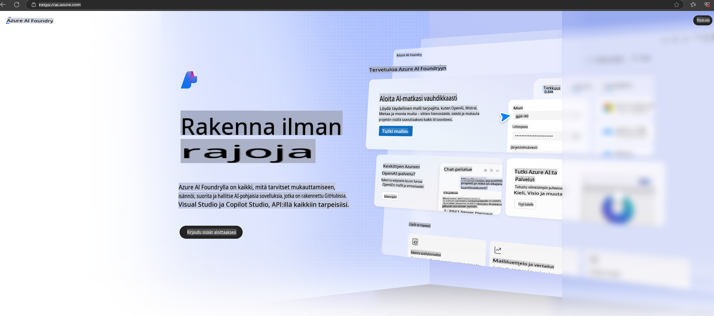

# **Phi-3:n käyttäminen Azure AI Foundryssa**

Generatiivisen tekoälyn kehityksen myötä toivomme voivamme käyttää yhtenäistä alustaa hallitsemaan eri LLM- ja SLM-malleja, yritysdatan integrointia, hienosäätö-/RAG-toimintoja sekä arvioimaan yritystoimintoja LLM- ja SLM-integraation jälkeen. Tällä tavalla generatiivinen tekoäly voidaan toteuttaa tehokkaammin. [Azure AI Foundry](https://ai.azure.com) on yritystason generatiivisen tekoälyn sovellusalusta.

Azure AI Foundryn avulla voit arvioida suurten kielimallien (LLM) vastauksia ja orkestroida kehotepohjaisia sovelluskomponentteja paremman suorituskyvyn saavuttamiseksi. Alusta mahdollistaa konseptitodistusten laajentamisen täysimittaisiksi tuotantoratkaisuiksi helposti. Jatkuva seuranta ja hienosäätö tukevat pitkäaikaista menestystä.

Voimme nopeasti ottaa Phi-3-mallin käyttöön Azure AI Foundryssa yksinkertaisin askelin ja sen jälkeen käyttää Azure AI Foundrya suorittamaan Phi-3:een liittyviä toimintoja, kuten Playground/Chat, hienosäätöä ja arviointia.

## **1. Valmistelut**

Jos sinulla on jo [Azure Developer CLI](https://learn.microsoft.com/azure/developer/azure-developer-cli/overview?WT.mc_id=aiml-138114-kinfeylo) asennettuna koneellesi, tämän mallin käyttö on yhtä helppoa kuin tämän komennon suorittaminen uudessa hakemistossa.

## Manuaalinen luominen

Microsoft Azure AI Foundry -projektin ja hubin luominen on erinomainen tapa organisoida ja hallita tekoälyprojekteja. Tässä on vaiheittainen opas alkuun pääsemiseksi:

### Projektin luominen Azure AI Foundryssa

1. **Siirry Azure AI Foundryyn**: Kirjaudu sisään Azure AI Foundryn portaaliin.
2. **Luo projekti**:
   - Jos olet jo projektissa, valitse "Azure AI Foundry" sivun vasemmasta yläkulmasta päästäksesi kotisivulle.
   - Valitse "+ Luo projekti".
   - Anna projektille nimi.
   - Jos sinulla on hubi, se valitaan oletuksena. Jos sinulla on pääsy useampaan hubiin, voit valita toisen pudotusvalikosta. Jos haluat luoda uuden hubin, valitse "Luo uusi hubi" ja anna nimi.
   - Valitse "Luo".

### Hubin luominen Azure AI Foundryssa

1. **Siirry Azure AI Foundryyn**: Kirjaudu sisään Azure-tililläsi.
2. **Luo hubi**:
   - Valitse vasemman valikon "Hallintakeskus".
   - Valitse "Kaikki resurssit", klikkaa "+ Uusi projekti" -nuolta ja valitse "+ Uusi hubi".
   - "Luo uusi hubi" -valintaikkunassa anna hubille nimi (esim. contoso-hub) ja muuta muita kenttiä halutessasi.
   - Valitse "Seuraava", tarkista tiedot ja valitse "Luo".

Yksityiskohtaisempia ohjeita löydät virallisesta [Microsoft-dokumentaatiosta](https://learn.microsoft.com/azure/ai-studio/how-to/create-projects).

Onnistuneen luomisen jälkeen voit käyttää luomaasi studioa osoitteessa [ai.azure.com](https://ai.azure.com/).

Yhdessä AI Foundryssa voi olla useita projekteja. Luo projekti AI Foundryssa valmistautuaksesi.

Luo Azure AI Foundry [QuickStarts](https://learn.microsoft.com/azure/ai-studio/quickstarts/get-started-code)

## **2. Phi-mallin käyttöönotto Azure AI Foundryssa**

Klikkaa projektin "Explore"-vaihtoehtoa päästäksesi Mallikatalogiin ja valitse Phi-3.

Valitse Phi-3-mini-4k-instruct.

Klikkaa "Deploy" ottaaksesi Phi-3-mini-4k-instruct-mallin käyttöön.

> [!NOTE]
>
> Voit valita laskentatehon käyttöönoton yhteydessä.

## **3. Playground Chat Phi Azure AI Foundryssa**

Siirry käyttöönoton sivulle, valitse Playground ja keskustele Azure AI Foundryn Phi-3:n kanssa.

## **4. Mallin käyttöönotto Azure AI Foundrysta**

Voit ottaa mallin käyttöön Azure Model Catalogista seuraamalla näitä ohjeita:

- Kirjaudu sisään Azure AI Foundryyn.
- Valitse malli, jonka haluat ottaa käyttöön Azure AI Foundryn mallikatalogista.
- Mallin "Details"-sivulla valitse "Deploy" ja sitten "Serverless API with Azure AI Content Safety".
- Valitse projekti, johon haluat ottaa mallin käyttöön. Serverless API -tarjouksen käyttö edellyttää, että työtilasi sijaitsee East US 2- tai Sweden Central -alueella. Voit mukauttaa käyttöönoton nimeä.
- Käyttöönottoikkunassa valitse "Pricing and terms" saadaksesi tietoa hinnoittelusta ja käyttöehdoista.
- Valitse "Deploy". Odota, kunnes käyttöönotto on valmis ja sinut ohjataan "Deployments"-sivulle.
- Valitse "Open in playground" aloittaaksesi mallin kanssa vuorovaikutuksen.
- Voit palata "Deployments"-sivulle, valita käyttöönoton ja kirjata muistiin päätepisteen Target URL ja Secret Key, joita voit käyttää käyttöönoton kutsumiseen ja vastauksien generoimiseen.
- Löydät aina päätepisteen tiedot, URL-osoitteen ja pääsyavaimet siirtymällä "Build"-välilehteen ja valitsemalla "Deployments" kohdasta "Components".

> [!NOTE]
> Huomaa, että tililläsi on oltava Azure AI Developer -roolin käyttöoikeudet resurssiryhmään näiden vaiheiden suorittamiseksi.

## **5. Phi API:n käyttö Azure AI Foundryssa**

Voit käyttää osoitetta https://{Your project name}.region.inference.ml.azure.com/swagger.json Postmanin GET-pyynnön avulla ja yhdistää sen avaimen kanssa oppiaksesi tarjotuista rajapinnoista.

Voit helposti saada pyyntöparametrit sekä vastausparametrit.

**Vastuuvapauslauseke**:  
Tämä asiakirja on käännetty konepohjaisia tekoälykäännöspalveluja käyttäen. Pyrimme tarkkuuteen, mutta huomioithan, että automaattiset käännökset voivat sisältää virheitä tai epätarkkuuksia. Alkuperäistä asiakirjaa sen alkuperäisellä kielellä tulisi pitää ensisijaisena lähteenä. Kriittisten tietojen osalta suositellaan ammattimaista ihmisen tekemää käännöstä. Emme ole vastuussa mahdollisista väärinkäsityksistä tai virhetulkinnoista, jotka johtuvat tämän käännöksen käytöstä.