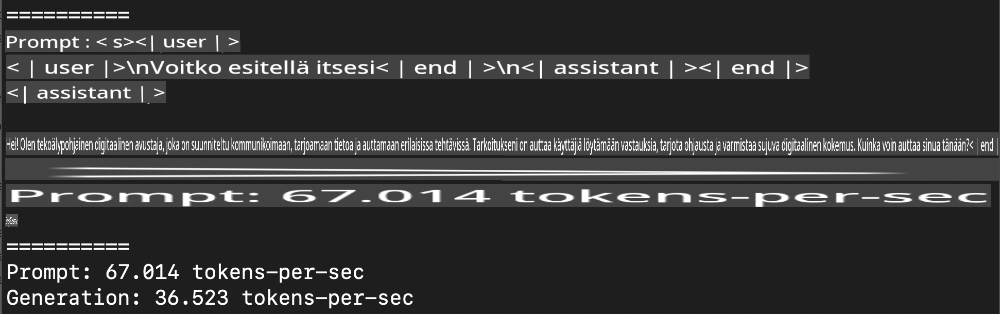
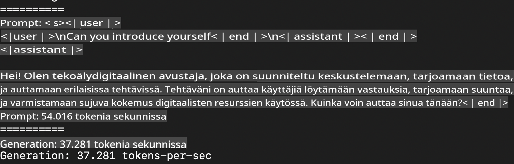
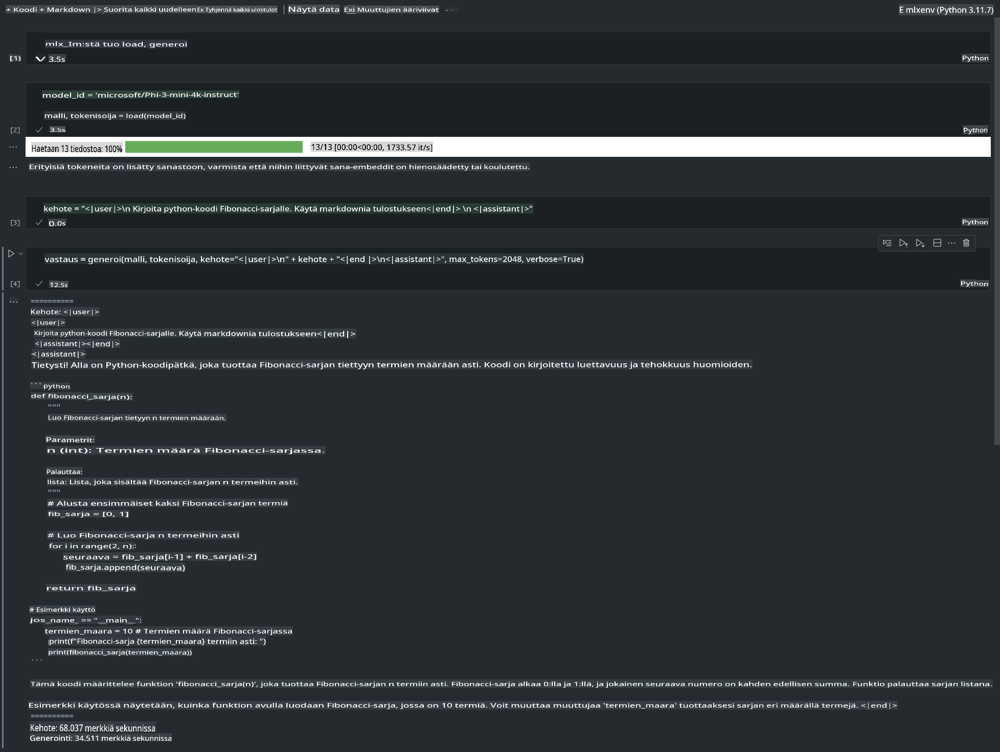

# **Inference Phi-3 Apple MLX -kehykseen avulla**

## **Mikä on MLX-kehys**

MLX on Applen koneoppimisen tutkimusryhmän kehittämä matriisikehys koneoppimisen tutkimukseen Apple Silicon -laitteilla.

MLX on suunniteltu koneoppimisen tutkijoille heidän tarpeitaan silmällä pitäen. Kehys on käyttäjäystävällinen, mutta samalla tehokas mallien kouluttamiseen ja käyttöönottoon. Kehyksen rakenne on yksinkertainen ja helposti laajennettavissa, jotta tutkijat voivat nopeasti testata ja kehittää uusia ideoita.

LLM-malleja voidaan kiihdyttää Apple Silicon -laitteilla MLX:n avulla, ja malleja voidaan ajaa paikallisesti erittäin kätevästi.

## **Phi-3-mini-mallin inferenssi MLX:llä**

### **1. MLX-ympäristön asennus**

1. Python 3.11.x
2. Asenna MLX-kirjasto

```bash

pip install mlx-lm

```

### **2. Phi-3-mini-mallin ajaminen terminaalissa MLX:llä**

```bash

python -m mlx_lm.generate --model microsoft/Phi-3-mini-4k-instruct --max-token 2048 --prompt  "<|user|>\nCan you introduce yourself<|end|>\n<|assistant|>"

```

Tulos (oma ympäristöni on Apple M1 Max, 64GB) on seuraava:



### **3. Phi-3-mini-mallin kvantisointi MLX:llä terminaalissa**

```bash

python -m mlx_lm.convert --hf-path microsoft/Phi-3-mini-4k-instruct

```

***Huom:*** Malli voidaan kvantisoida mlx_lm.convert-komennolla, ja oletuskvantisointi on INT4. Tässä esimerkissä kvantisoidaan Phi-3-mini INT4-muotoon.

Malli kvantisoidaan mlx_lm.convert-komennolla, ja oletusmuoto on INT4. Tässä esimerkissä Phi-3-mini kvantisoidaan INT4-muotoon. Kvantisoinnin jälkeen malli tallennetaan oletuskansioon ./mlx_model.

Voimme testata MLX:llä kvantisoitua mallia terminaalista:

```bash

python -m mlx_lm.generate --model ./mlx_model/ --max-token 2048 --prompt  "<|user|>\nCan you introduce yourself<|end|>\n<|assistant|>"

```

Tulos on seuraava:



### **4. Phi-3-mini-mallin ajaminen Jupyter Notebookissa MLX:llä**



***Huom:*** Katso tämä esimerkki [klikkaa tätä linkkiä](../../../../../code/03.Inference/MLX/MLX_DEMO.ipynb)

## **Resurssit**

1. Lisätietoa Apple MLX -kehyksestä [https://ml-explore.github.io](https://ml-explore.github.io/mlx/build/html/index.html)

2. Apple MLX GitHub Repo [https://github.com/ml-explore](https://github.com/ml-explore)

**Vastuuvapauslauseke**:  
Tämä asiakirja on käännetty konepohjaisten tekoälykäännöspalveluiden avulla. Vaikka pyrimme tarkkuuteen, huomioithan, että automaattiset käännökset voivat sisältää virheitä tai epätarkkuuksia. Alkuperäistä asiakirjaa sen alkuperäisellä kielellä tulee pitää ensisijaisena lähteenä. Tärkeissä tiedoissa suositellaan ammattimaisen ihmiskääntäjän käyttöä. Emme ole vastuussa tämän käännöksen käytöstä johtuvista väärinkäsityksistä tai virheellisistä tulkinnoista.