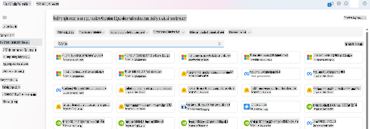
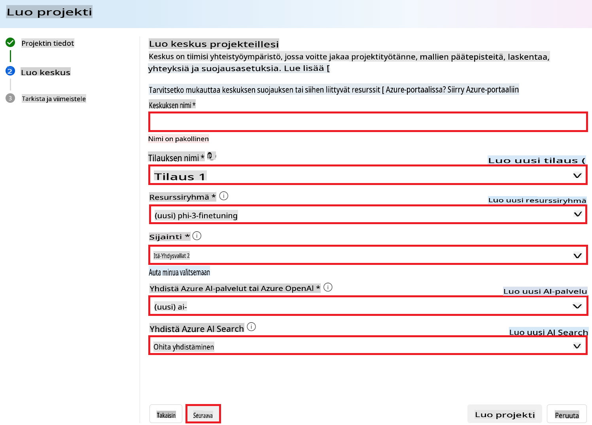
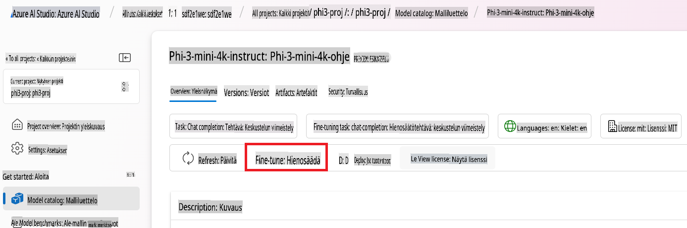
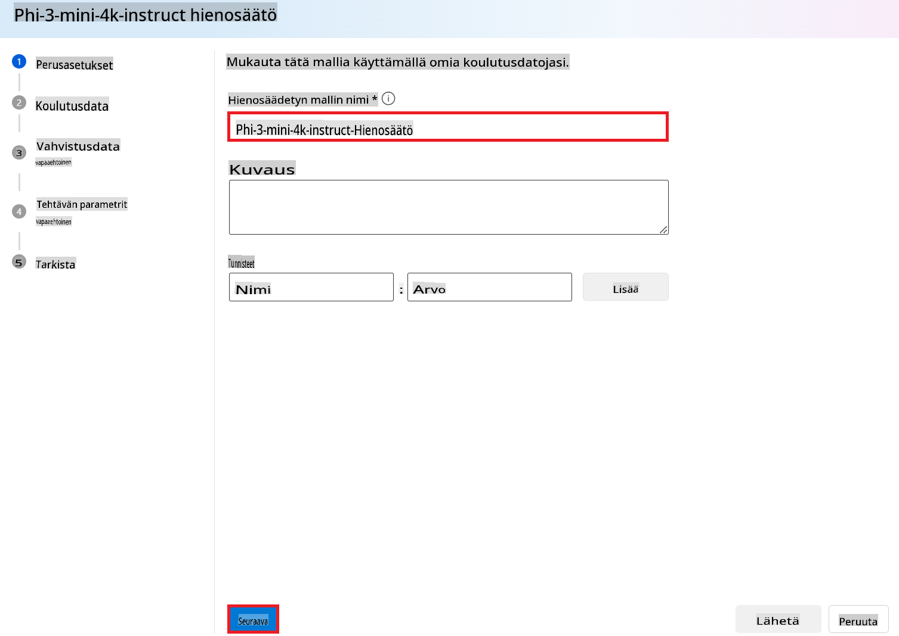
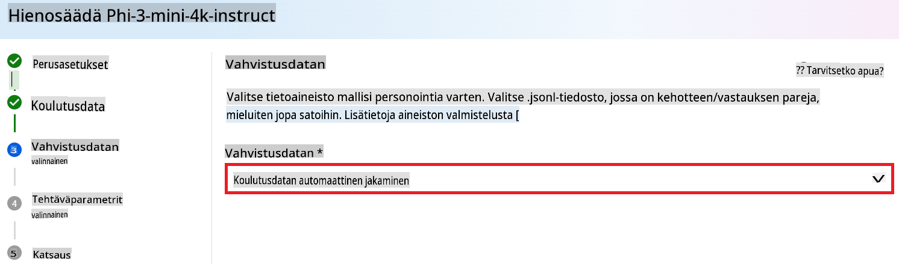
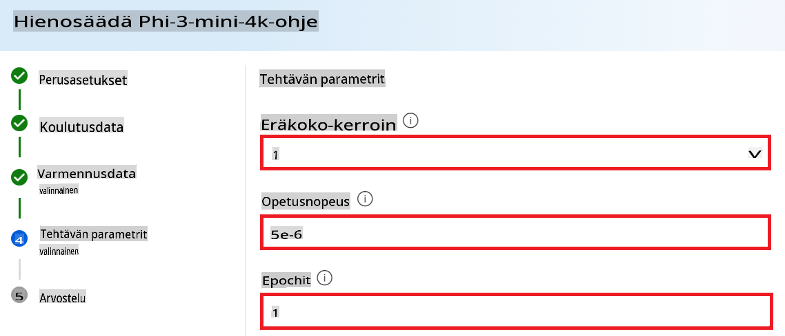
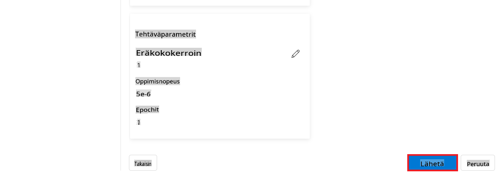
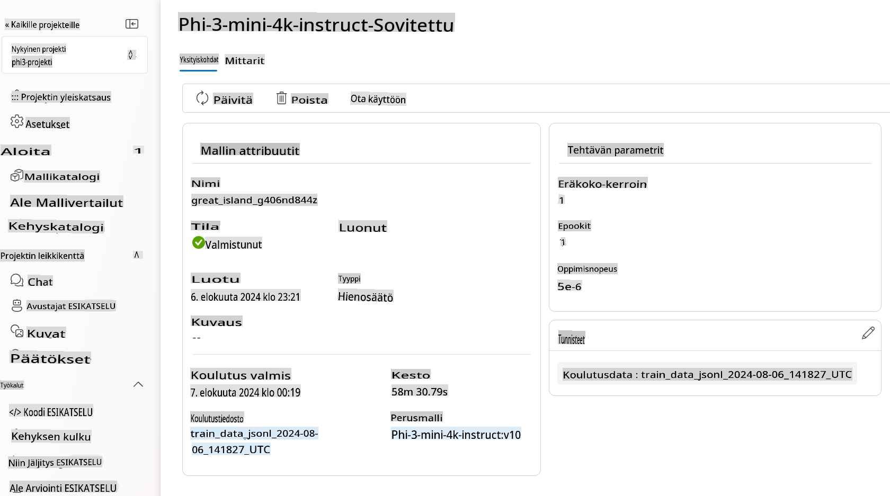

# Phi-3 Mini -mallin hienosäätö Azure AI Foundryssa

Tutustutaan Microsoftin Phi-3 Mini -kielimallin hienosäätöön Azure AI Foundryn avulla. Hienosäätö mahdollistaa Phi-3 Minin mukauttamisen tiettyihin tehtäviin, jolloin siitä tulee entistä tehokkaampi ja kontekstia ymmärtävämpi.

## Huomioitavat seikat

- **Ominaisuudet:** Mitkä mallit ovat hienosäädettäviä? Mihin perusmalli voidaan hienosäätää?
- **Kustannukset:** Mikä on hinnoittelumalli hienosäädölle?
- **Mukautettavuus:** Kuinka paljon voin muokata perusmallia – ja millä tavoilla?
- **Käytännöllisyys:** Miten hienosäätö käytännössä tapahtuu – pitääkö minun kirjoittaa omaa koodia? Tarvitsenko oman laskentaympäristön?
- **Turvallisuus:** Hienosäädetyillä malleilla voi olla turvallisuusriskejä – onko käytössä suojatoimia tahattomien haittojen ehkäisemiseksi?



## Valmistautuminen hienosäätöön

### Esivaatimukset

> [!NOTE]
> Phi-3 -malliperheessä hienosäätö on saatavilla vain **East US 2** -alueilla luoduissa hubeissa.

- Azure-tilaus. Jos sinulla ei ole Azure-tilausta, luo [maksullinen Azure-tili](https://azure.microsoft.com/pricing/purchase-options/pay-as-you-go) aloittaaksesi.

- [AI Foundry -projekti](https://ai.azure.com?WT.mc_id=aiml-138114-kinfeylo).
- Azure-roolipohjaiset käyttöoikeudet (Azure RBAC) myöntävät pääsyn Azure AI Foundryn toimintoihin. Suorittaaksesi tämän artikkelin vaiheet käyttäjätililläsi täytyy olla __Azure AI Developer -rooli__ resurssiryhmässä.

### Tilauspalveluntarjoajan rekisteröinti

Varmista, että tilaus on rekisteröity `Microsoft.Network`-resurssipalveluntarjoajalle.

1. Kirjaudu sisään [Azure-portaaliin](https://portal.azure.com).
1. Valitse vasemmalta **Subscriptions**.
1. Valitse haluamasi tilaus.
1. Valitse vasemmalta **AI project settings** > **Resource providers**.
1. Varmista, että **Microsoft.Network** on resurssipalveluntarjoajien luettelossa. Muussa tapauksessa lisää se.

### Datan valmistelu

Valmistele koulutus- ja validointidatasi hienosäätöä varten. Koulutus- ja validointidatasetit sisältävät syöte- ja tulosesimerkkejä siitä, miten haluat mallin toimivan.

Varmista, että kaikki koulutusesimerkit noudattavat odotettua ennustusmuotoa. Hienosäätö onnistuu parhaiten tasapainoisella ja monipuolisella datasetillä.

Tämä tarkoittaa datan tasapainon ylläpitämistä, eri skenaarioiden sisällyttämistä ja koulutusdatan säännöllistä tarkentamista, jotta se vastaa todellisia odotuksia, mikä lopulta johtaa tarkempiin ja tasapainoisempiin mallivastauksiin.

Eri mallityypit vaativat erimuotoista koulutusdataa.

### Keskusteluvastausten hienosäätö

Koulutus- ja validointidatan **täytyy** olla JSON Lines (JSONL) -dokumenttina. `Phi-3-mini-128k-instruct`-mallin hienosäätödatasetin tulee olla keskustelumuodossa, jota Chat completions API käyttää.

### Esimerkkitiedoston muoto

```json
    {"messages": [{"role": "system", "content": "You are an Xbox customer support agent whose primary goal is to help users with issues they are experiencing with their Xbox devices. You are friendly and concise. You only provide factual answers to queries, and do not provide answers that are not related to Xbox."}, {"role": "user", "content": "Is Xbox better than PlayStation?"}, {"role": "assistant", "content": "I apologize, but I cannot provide personal opinions. My primary job is to assist you with any issues related to your Xbox device. Do you have any Xbox-related issues that need addressing?"}]}
    {"messages": [{"role": "system", "content": "You are an Xbox customer support agent whose primary goal is to help users with issues they are experiencing with their Xbox devices. You are friendly and concise. You only provide factual answers to queries, and do not provide answers that are not related to Xbox."}, {"role": "user", "content": "Can I play PC games on my Xbox?"}, {"role": "assistant", "content": "While Xbox consoles don't natively support PC games, they can play an array of Xbox games, many of which are also available on PC. Can I assist you with finding games compatible with your Xbox device?"}]}
    {"messages": [{"role": "system", "content": "You are an Xbox customer support agent whose primary goal is to help users with issues they are experiencing with their Xbox devices. You are friendly and concise. You only provide factual answers to queries, and do not provide answers that are not related to Xbox."}, {"role": "user", "content": "I'm having trouble connecting my Xbox to the Wi-Fi."}, {"role": "assistant", "content": "No worries, let's go through the network settings on your Xbox. Can you please tell me what happens when you try to connect it to the Wi-Fi?"}]}
```

Tuettu tiedostotyyppi on JSON Lines. Tiedostot ladataan oletustietovarastoon ja ne ovat käytettävissä projektissasi.

## Phi-3:n hienosäätö Azure AI Foundryssa

Azure AI Foundryn avulla voit räätälöidä suuria kielimalleja omiin datasettiisi hienosäätöprosessin avulla. Hienosäätö tarjoaa merkittävää arvoa mahdollistamalla räätälöinnin ja optimoinnin tiettyihin tehtäviin ja sovelluksiin. Se parantaa suorituskykyä, kustannustehokkuutta, viiveitä ja tuotettujen vastausten laatua.


### Uuden projektin luominen

1. Kirjaudu sisään [Azure AI Foundryyn](https://ai.azure.com).

1. Valitse **+New project** luodaksesi uuden projektin Azure AI Foundryssa.

    

1. Suorita seuraavat tehtävät:

    - Projektin **Hub name**. Sen täytyy olla uniikki.
    - Valitse käytettävä **Hub** (luo uusi tarvittaessa).

    

1. Suorita seuraavat tehtävät uuden hubin luomiseksi:

    - Syötä **Hub name**. Sen täytyy olla uniikki.
    - Valitse Azure-**Subscription**.
    - Valitse käytettävä **Resource group** (luo uusi tarvittaessa).
    - Valitse **Location**, jota haluat käyttää.
    - Valitse käytettävä **Connect Azure AI Services** (luo uusi tarvittaessa).
    - Valitse **Connect Azure AI Search** ja **Skip connecting**.

    

1. Valitse **Next**.
1. Valitse **Create a project**.

### Datan valmistelu

Ennen hienosäätöä kerää tai luo tehtävääsi liittyvä datasetti, kuten keskusteluohjeet, kysymys-vastausparit tai muu asiaankuuluva tekstidata. Puhdista ja esikäsittele data poistamalla häiriötekijät, käsittelemällä puuttuvat arvot ja pilkkomalla teksti.

### Phi-3-mallien hienosäätö Azure AI Foundryssa

> [!NOTE]
> Phi-3-mallien hienosäätöä tuetaan tällä hetkellä projekteissa, jotka sijaitsevat East US 2 -alueella.

1. Valitse vasemmanpuoleisesta valikosta **Model catalog**.

1. Kirjoita **phi-3** **hakupalkkiin** ja valitse haluamasi phi-3-malli.

    

1. Valitse **Fine-tune**.

    

1. Syötä **Fine-tuned model name**.

    

1. Valitse **Next**.

1. Suorita seuraavat tehtävät:

    - Valitse **task type**:ksi **Chat completion**.
    - Valitse käytettävä **Training data**. Voit ladata sen Azure AI Foundryn datan kautta tai paikallisesta ympäristöstäsi.

    

1. Valitse **Next**.

1. Lataa käytettävä **Validation data** tai valitse **Automatic split of training data**.

    

1. Valitse **Next**.

1. Suorita seuraavat tehtävät:

    - Valitse käytettävä **Batch size multiplier**.
    - Valitse käytettävä **Learning rate**.
    - Valitse käytettävä **Epochs**.

    

1. Valitse **Submit** aloittaaksesi hienosäätöprosessin.

    

1. Kun mallisi on hienosäädetty, sen tila näkyy **Completed**-merkinnällä, kuten alla olevassa kuvassa. Nyt voit ottaa mallin käyttöön ja käyttää sitä omassa sovelluksessasi, testialustalla tai Prompt Flow'ssa. Lisätietoja saat [Phi-3-mallien käyttöönotto-oppaasta](https://learn.microsoft.com/azure/ai-studio/how-to/deploy-models-phi-3?tabs=phi-3-5&pivots=programming-language-python).

    

> [!NOTE]
> Lisätietoja Phi-3:n hienosäädöstä löydät [täältä](https://learn.microsoft.com/azure/ai-studio/how-to/fine-tune-phi-3?tabs=phi-3-mini).

## Hienosäädettyjen mallien poistaminen

Voit poistaa hienosäädetyn mallin [Azure AI Foundryssa](https://ai.azure.com) hienosäätömallilistasta tai mallin yksityiskohtaiselta sivulta. Valitse poistettava malli hienosäätösivulta ja napsauta Poista-painiketta.

> [!NOTE]
> Et voi poistaa mukautettua mallia, jos sillä on olemassa oleva käyttöönotto. Sinun täytyy ensin poistaa mallin käyttöönotto ennen kuin voit poistaa mukautetun mallin.

## Kustannukset ja kiintiöt

### Phi-3-mallien hienosäädön kustannukset ja kiintiöt

Phi-mallit hienosäädettyinä palveluna tarjotaan Microsoftin toimesta ja ne on integroitu Azure AI Foundryyn käyttöä varten. Löydät hinnoittelutiedot [käyttöönotto-](https://learn.microsoft.com/azure/ai-studio/how-to/deploy-models-phi-3?tabs=phi-3-5&pivots=programming-language-python) tai hienosäätöprosessin yhteydessä käyttöönotto-ohjelmassa Hinnoittelu ja ehdot -välilehdeltä.

## Sisällön suodatus

Mallit, jotka otetaan käyttöön palveluna maksun perusteella, suojataan Azure AI Content Safety -ratkaisulla. Kun mallit otetaan käyttöön reaaliaikaisissa päätepisteissä, voit halutessasi poistaa tämän ominaisuuden käytöstä. Kun Azure AI Content Safety on käytössä, sekä syöte että tuloste kulkevat luokittelumallien läpi, jotka on suunniteltu havaitsemaan ja estämään haitallisen sisällön tuottaminen. Suodatusjärjestelmä tunnistaa ja ryhtyy toimiin tiettyjen haitallisten sisältöluokkien suhteen sekä syötteissä että tulosteissa. Lisätietoja löydät [Azure AI Content Safety -sivulta](https://learn.microsoft.com/azure/ai-studio/concepts/content-filtering).

**Hienosäätöasetukset**

Hyperparametrit: Määritä hyperparametrit, kuten oppimisnopeus, eräkoko ja koulutusepochien määrä.

**Häviöfunktio**

Valitse tehtävään sopiva häviöfunktio (esim. cross-entropy).

**Optimointialgoritmi**

Valitse optimointialgoritmi (esim. Adam) gradienttien päivittämiseen koulutuksen aikana.

**Hienosäätöprosessi**

- Lataa esikoulutettu malli: Lataa Phi-3 Mini -tarkistuspiste.
- Lisää mukautetut kerrokset: Lisää tehtäväkohtaisia kerroksia (esim. luokituskerros keskusteluohjeille).

**Mallin koulutus**
Hienosäädä malli valmistellulla datasetilläsi. Seuraa koulutuksen edistymistä ja säädä hyperparametreja tarvittaessa.

**Arviointi ja validointi**

Validointijoukko: Jaa datasi koulutus- ja validointijoukkoihin.

**Suorituskyvyn arviointi**

Käytä mittareita, kuten tarkkuus, F1-pisteet tai perplexity, mallin suorituskyvyn arviointiin.

## Tallenna hienosäädetty malli

**Tarkistuspiste**
Tallenna hienosäädetyn mallin tarkistuspiste myöhempää käyttöä varten.

## Käyttöönotto

- Ota käyttöön verkkopalveluna: Ota hienosäädetty malli käyttöön verkkopalveluna Azure AI Foundryssa.
- Testaa päätepiste: Lähetä testikyselyitä käyttöön otettuun päätepisteeseen varmistaaksesi sen toimivuuden.

## Iterointi ja parantaminen

Iteroi: Jos suorituskyky ei ole tyydyttävä, tee iterointia säätämällä hyperparametreja, lisäämällä dataa tai hienosäätämällä useampia epocheja.

## Seuranta ja hienosäätö

Seuraa jatkuvasti mallin käyttäytymistä ja tee tarvittaessa parannuksia.

## Mukauttaminen ja laajentaminen

Mukautetut tehtävät: Phi-3 Mini voidaan hienosäätää moniin muihin tehtäviin keskusteluohjeiden lisäksi. Tutki muita käyttötapauksia!
Kokeile: Testaa erilaisia arkkitehtuureja, kerrosyhdistelmiä ja tekniikoita suorituskyvyn parantamiseksi.

> [!NOTE]
> Hienosäätö on iteratiivinen prosessi. Kokeile, opi ja mukauta malliasi saavuttaaksesi parhaat tulokset juuri sinun tehtävääsi varten!

**Vastuuvapauslauseke**:  
Tämä asiakirja on käännetty konepohjaisten tekoälykäännöspalvelujen avulla. Pyrimme tarkkuuteen, mutta huomioithan, että automaattiset käännökset voivat sisältää virheitä tai epätarkkuuksia. Alkuperäistä asiakirjaa sen alkuperäisellä kielellä tulisi pitää ensisijaisena lähteenä. Kriittistä tietoa varten suositellaan ammattimaista ihmiskääntämistä. Emme ole vastuussa tämän käännöksen käytöstä aiheutuvista väärinkäsityksistä tai tulkintavirheistä.