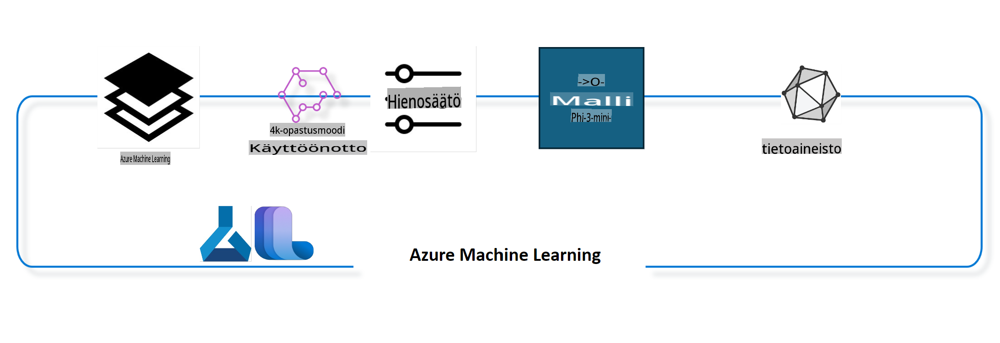

## Kuinka käyttää Azure ML -järjestelmärekisterin chat-completion-komponentteja mallin hienosäätöön

Tässä esimerkissä suoritamme Phi-3-mini-4k-instruct-mallin hienosäädön, jotta se voi täydentää kahden henkilön välistä keskustelua käyttäen ultrachat_200k-datasettiä.



Esimerkki näyttää, kuinka hienosäätö suoritetaan Azure ML SDK:lla ja Pythonilla, ja kuinka hienosäädetty malli otetaan käyttöön online-päätepisteessä reaaliaikaista ennustamista varten.

### Koulutusdata

Käytämme ultrachat_200k-datasettiä. Tämä on vahvasti suodatettu versio UltraChat-datasetistä, ja sitä käytettiin Zephyr-7B-β-mallin, huipputason 7b chat-mallin, kouluttamiseen.

### Malli

Käytämme Phi-3-mini-4k-instruct-mallia näyttääksemme, kuinka käyttäjä voi hienosäätää mallia chat-completion-tehtävää varten. Jos avasit tämän notebookin tietystä mallikortista, muista korvata kyseinen mallin nimi.

### Tehtävät

- Valitse malli hienosäätöä varten.
- Valitse ja tutki koulutusdata.
- Määritä hienosäätötyö.
- Suorita hienosäätötyö.
- Tarkista koulutus- ja arviointimittarit.
- Rekisteröi hienosäädetty malli.
- Ota hienosäädetty malli käyttöön reaaliaikaista ennustamista varten.
- Puhdista resurssit.

## 1. Esivalmistelut

- Asenna riippuvuudet
- Yhdistä AzureML-työtilaan. Lue lisää SDK-autentikoinnin määrittämisestä. Korvaa <WORKSPACE_NAME>, <RESOURCE_GROUP> ja <SUBSCRIPTION_ID> alla.
- Yhdistä AzureML-järjestelmärekisteriin
- Aseta valinnainen kokeilun nimi
- Tarkista tai luo laskentaympäristö.

> [!NOTE]
> Vaatimukset: yksi GPU-solmu voi sisältää useita GPU-kortteja. Esimerkiksi Standard_NC24rs_v3-solmussa on 4 NVIDIA V100 GPU:ta, kun taas Standard_NC12s_v3-solmussa on 2 NVIDIA V100 GPU:ta. Katso lisätietoja dokumentaatiosta. GPU-korttien määrä per solmu asetetaan alla olevaan parametriin gpus_per_node. Tämän arvon oikea asettaminen varmistaa kaikkien solmun GPU:iden hyödyntämisen. Suositellut GPU-laskentatyypit löytyvät täältä ja täältä.

### Python-kirjastot

Asenna riippuvuudet suorittamalla alla oleva solu. Tämä vaihe ei ole valinnainen, jos käytät uutta ympäristöä.

```bash
pip install azure-ai-ml
pip install azure-identity
pip install datasets==2.9.0
pip install mlflow
pip install azureml-mlflow
```

### Vuorovaikutus Azure ML:n kanssa

1. Tämä Python-skripti on tarkoitettu vuorovaikutukseen Azure Machine Learning (Azure ML) -palvelun kanssa. Tässä yhteenveto sen toiminnasta:

    - Se tuo tarvittavat moduulit azure.ai.ml-, azure.identity- ja azure.ai.ml.entities-paketeista. Se tuo myös time-moduulin.

    - Se yrittää autentikoitua käyttämällä DefaultAzureCredential()-menetelmää, joka tarjoaa yksinkertaistetun tavan autentikoitua sovelluksissa, jotka toimivat Azure-pilvessä. Jos tämä epäonnistuu, se siirtyy käyttämään InteractiveBrowserCredential()-menetelmää, joka tarjoaa interaktiivisen kirjautumisikkunan.

    - Se yrittää luoda MLClient-instanssin käyttämällä from_config-metodia, joka lukee konfiguraation oletustiedostosta (config.json). Jos tämä epäonnistuu, se luo MLClient-instanssin manuaalisesti antamalla subscription_id-, resource_group_name- ja workspace_name-parametrit.

    - Se luo toisen MLClient-instanssin Azure ML -rekisterille nimeltä "azureml". Tässä rekisterissä säilytetään malleja, hienosäätöputkia ja ympäristöjä.

    - Se asettaa kokeilun nimen "chat_completion_Phi-3-mini-4k-instruct".

    - Se generoi uniikin aikaleiman muuntamalla nykyisen ajan (sekunteina epookista, liukulukuna) kokonaisluvuksi ja sitten merkkijonoksi. Tätä aikaleimaa voidaan käyttää luomaan uniikkeja nimiä ja versioita.

    ```python
    # Import necessary modules from Azure ML and Azure Identity
    from azure.ai.ml import MLClient
    from azure.identity import (
        DefaultAzureCredential,
        InteractiveBrowserCredential,
    )
    from azure.ai.ml.entities import AmlCompute
    import time  # Import time module
    
    # Try to authenticate using DefaultAzureCredential
    try:
        credential = DefaultAzureCredential()
        credential.get_token("https://management.azure.com/.default")
    except Exception as ex:  # If DefaultAzureCredential fails, use InteractiveBrowserCredential
        credential = InteractiveBrowserCredential()
    
    # Try to create an MLClient instance using the default config file
    try:
        workspace_ml_client = MLClient.from_config(credential=credential)
    except:  # If that fails, create an MLClient instance by manually providing the details
        workspace_ml_client = MLClient(
            credential,
            subscription_id="<SUBSCRIPTION_ID>",
            resource_group_name="<RESOURCE_GROUP>",
            workspace_name="<WORKSPACE_NAME>",
        )
    
    # Create another MLClient instance for the Azure ML registry named "azureml"
    # This registry is where models, fine-tuning pipelines, and environments are stored
    registry_ml_client = MLClient(credential, registry_name="azureml")
    
    # Set the experiment name
    experiment_name = "chat_completion_Phi-3-mini-4k-instruct"
    
    # Generate a unique timestamp that can be used for names and versions that need to be unique
    timestamp = str(int(time.time()))
    ```

## 2. Valitse hienosäädettävä perusmalli

1. Phi-3-mini-4k-instruct on kevyt, huipputason avoin malli, jossa on 3,8 miljardia parametria ja joka perustuu Phi-2-mallin datasettiin. Malli kuuluu Phi-3-malliperheeseen, ja Mini-versiosta on kaksi varianttia: 4K ja 128K, jotka kuvaavat kontekstin pituutta (tokeneina). Malli täytyy hienosäätää tiettyä tarkoitusta varten. Voit selata näitä malleja AzureML Studion Model Catalogissa suodattamalla chat-completion-tehtävän mukaan. Tässä esimerkissä käytämme Phi-3-mini-4k-instruct-mallia. Jos avasit tämän notebookin eri mallia varten, korvaa mallin nimi ja versio vastaavasti.

    > [!NOTE]
    > Mallin id-ominaisuus. Tämä välitetään hienosäätötyölle syötteenä. Tämä löytyy myös Asset ID -kentästä mallin yksityiskohtien sivulta AzureML Studion Model Catalogissa.

2. Tämä Python-skripti toimii Azure Machine Learning (Azure ML) -palvelun kanssa. Tässä sen toiminta tiivistettynä:

    - Se asettaa model_name-muuttujan arvoksi "Phi-3-mini-4k-instruct".

    - Se käyttää registry_ml_client-objektin models-ominaisuuden get-metodia hakeakseen mallin uusimman version Azure ML -rekisteristä. get-metodia kutsutaan kahdella argumentilla: mallin nimi ja etiketti, joka määrittää, että haetaan mallin uusin versio.

    - Se tulostaa konsoliin viestin, joka sisältää mallin nimen, version ja id:n, joita käytetään hienosäätöön. Tulostuksessa käytetään format-metodia, jolla lisätään mallin tiedot viestiin. Mallin nimi, versio ja id haetaan foundation_model-objektin ominaisuuksista.

    ```python
    # Set the model name
    model_name = "Phi-3-mini-4k-instruct"
    
    # Get the latest version of the model from the Azure ML registry
    foundation_model = registry_ml_client.models.get(model_name, label="latest")
    
    # Print the model name, version, and id
    # This information is useful for tracking and debugging
    print(
        "\n\nUsing model name: {0}, version: {1}, id: {2} for fine tuning".format(
            foundation_model.name, foundation_model.version, foundation_model.id
        )
    )
    ```

## 3. Luo laskentaympäristö työtä varten

Hienosäätötyö toimii VAIN GPU-laskennalla. Laskentaympäristön koko riippuu mallin koosta, ja usein sopivan laskentaympäristön valinta voi olla haastavaa. Tässä solussa opastamme käyttäjää valitsemaan oikean laskentaympäristön työtä varten.

> [!NOTE]
> Alla listatut laskentaympäristöt toimivat optimoiduilla asetuksilla. Asetusten muuttaminen voi johtaa Cuda Out Of Memory -virheeseen. Tällöin kannattaa päivittää laskentaympäristö suuremmaksi.

> [!NOTE]
> Kun valitset compute_cluster_size-parametria alla, varmista, että kyseinen laskentaympäristö on käytettävissä resurssiryhmässäsi. Jos tiettyä laskentaympäristöä ei ole saatavilla, voit tehdä pyynnön sen käyttöoikeuden saamiseksi.

### Tarkista mallin hienosäätötuki

1. Tämä Python-skripti tarkistaa, tukeeko malli hienosäätöä. Tässä sen toiminta tiivistettynä:

    - Se tuo ast-moduulin, joka tarjoaa funktioita Pythonin abstraktin syntaksipuun käsittelyyn.

    - Se tarkistaa, onko foundation_model-objektilla tag nimeltä finetune_compute_allow_list. Tagit Azure ML:ssä ovat avain-arvo-pareja, joita voi käyttää mallien suodattamiseen ja lajitteluun.

    - Jos finetune_compute_allow_list-tag löytyy, se käyttää ast.literal_eval-funktiota tagin arvon (merkkijono) muuntamiseen Python-listaksi. Tämä lista tallennetaan muuttujaan computes_allow_list. Se tulostaa viestin, jossa kehotetaan luomaan laskentaympäristö listan perusteella.

    - Jos finetune_compute_allow_list-tagia ei löydy, se asettaa computes_allow_list-muuttujan arvoksi None ja tulostaa viestin, jossa kerrotaan, että kyseistä tagia ei ole mallin tageissa.

    - Yhteenvetona: tämä skripti tarkistaa mallin metadatasta tietyn tagin, muuntaa tagin arvon listaksi, jos se löytyy, ja antaa käyttäjälle palautetta sen mukaan.

    ```python
    # Import the ast module, which provides functions to process trees of the Python abstract syntax grammar
    import ast
    
    # Check if the 'finetune_compute_allow_list' tag is present in the model's tags
    if "finetune_compute_allow_list" in foundation_model.tags:
        # If the tag is present, use ast.literal_eval to safely parse the tag's value (a string) into a Python list
        computes_allow_list = ast.literal_eval(
            foundation_model.tags["finetune_compute_allow_list"]
        )  # convert string to python list
        # Print a message indicating that a compute should be created from the list
        print(f"Please create a compute from the above list - {computes_allow_list}")
    else:
        # If the tag is not present, set computes_allow_list to None
        computes_allow_list = None
        # Print a message indicating that the 'finetune_compute_allow_list' tag is not part of the model's tags
        print("`finetune_compute_allow_list` is not part of model tags")
    ```

### Tarkista laskentaympäristö

1. Tämä Python-skripti tarkistaa Azure Machine Learning (Azure ML) -palvelun laskentaympäristön. Tässä sen toiminta tiivistettynä:

    - Se yrittää hakea laskentaympäristön, jonka nimi on tallennettu compute_cluster-muuttujaan, Azure ML -työtilasta. Jos laskentaympäristön provisioning state on "failed", se heittää ValueErrorin.

    - Se tarkistaa, onko computes_allow_list-muuttujan arvo None. Jos ei ole, se muuntaa kaikki listan laskentaympäristöjen nimet pienaakkosiksi ja tarkistaa, onko nykyisen laskentaympäristön koko listassa. Jos ei ole, se heittää ValueErrorin.

    - Jos computes_allow_list-muuttujan arvo on None, se tarkistaa, onko nykyisen laskentaympäristön koko listassa, joka sisältää ei-tuetut GPU-VM-koot. Jos on, se heittää ValueErrorin.

    - Se hakee listan kaikista käytettävissä olevista laskentaympäristöjen ko'oista työtilassa. Se käy läpi tämän listan ja tarkistaa, vastaako jokin koko nykyisen laskentaympäristön kokoa. Jos vastaa, se hakee GPU:iden määrän kyseiselle koolle ja asettaa gpu_count_found-muuttujan arvoksi True.

    - Jos gpu_count_found on True, se tulostaa laskentaympäristön GPU:iden määrän. Jos gpu_count_found on False, se heittää ValueErrorin.

    - Yhteenvetona: tämä skripti tarkistaa Azure ML -työtilan laskentaympäristön tilan, koon ja GPU:iden määrän.

    ```python
    # Print the exception message
    print(e)
    # Raise a ValueError if the compute size is not available in the workspace
    raise ValueError(
        f"WARNING! Compute size {compute_cluster_size} not available in workspace"
    )
    
    # Retrieve the compute instance from the Azure ML workspace
    compute = workspace_ml_client.compute.get(compute_cluster)
    # Check if the provisioning state of the compute instance is "failed"
    if compute.provisioning_state.lower() == "failed":
        # Raise a ValueError if the provisioning state is "failed"
        raise ValueError(
            f"Provisioning failed, Compute '{compute_cluster}' is in failed state. "
            f"please try creating a different compute"
        )
    
    # Check if computes_allow_list is not None
    if computes_allow_list is not None:
        # Convert all compute sizes in computes_allow_list to lowercase
        computes_allow_list_lower_case = [x.lower() for x in computes_allow_list]
        # Check if the size of the compute instance is in computes_allow_list_lower_case
        if compute.size.lower() not in computes_allow_list_lower_case:
            # Raise a ValueError if the size of the compute instance is not in computes_allow_list_lower_case
            raise ValueError(
                f"VM size {compute.size} is not in the allow-listed computes for finetuning"
            )
    else:
        # Define a list of unsupported GPU VM sizes
        unsupported_gpu_vm_list = [
            "standard_nc6",
            "standard_nc12",
            "standard_nc24",
            "standard_nc24r",
        ]
        # Check if the size of the compute instance is in unsupported_gpu_vm_list
        if compute.size.lower() in unsupported_gpu_vm_list:
            # Raise a ValueError if the size of the compute instance is in unsupported_gpu_vm_list
            raise ValueError(
                f"VM size {compute.size} is currently not supported for finetuning"
            )
    
    # Initialize a flag to check if the number of GPUs in the compute instance has been found
    gpu_count_found = False
    # Retrieve a list of all available compute sizes in the workspace
    workspace_compute_sku_list = workspace_ml_client.compute.list_sizes()
    available_sku_sizes = []
    # Iterate over the list of available compute sizes
    for compute_sku in workspace_compute_sku_list:
        available_sku_sizes.append(compute_sku.name)
        # Check if the name of the compute size matches the size of the compute instance
        if compute_sku.name.lower() == compute.size.lower():
            # If it does, retrieve the number of GPUs for that compute size and set gpu_count_found to True
            gpus_per_node = compute_sku.gpus
            gpu_count_found = True
    # If gpu_count_found is True, print the number of GPUs in the compute instance
    if gpu_count_found:
        print(f"Number of GPU's in compute {compute.size}: {gpus_per_node}")
    else:
        # If gpu_count_found is False, raise a ValueError
        raise ValueError(
            f"Number of GPU's in compute {compute.size} not found. Available skus are: {available_sku_sizes}."
            f"This should not happen. Please check the selected compute cluster: {compute_cluster} and try again."
        )
    ```

## 4. Valitse datasetti mallin hienosäätöä varten

1. Käytämme ultrachat_200k-datasettiä. Datasetissä on neljä osajoukkoa, jotka sopivat ohjattuun hienosäätöön (sft).
### Koulutusputken määrittäminen

Tämä Python-skripti määrittää ja konfiguroi koneoppimisen putken Azure Machine Learning SDK:ta käyttäen. Tässä on, mitä se tekee:

1. Se tuo tarvittavat moduulit Azure AI ML SDK:sta.
2. Se hakee "chat_completion_pipeline"-nimisen putkikomponentin rekisteristä.
3. Se määrittelee putkityön käyttämällä `@pipeline` decorator and the function `create_pipeline`. The name of the pipeline is set to `pipeline_display_name`.

1. Inside the `create_pipeline` function, it initializes the fetched pipeline component with various parameters, including the model path, compute clusters for different stages, dataset splits for training and testing, the number of GPUs to use for fine-tuning, and other fine-tuning parameters.

1. It maps the output of the fine-tuning job to the output of the pipeline job. This is done so that the fine-tuned model can be easily registered, which is required to deploy the model to an online or batch endpoint.

1. It creates an instance of the pipeline by calling the `create_pipeline` function.

1. It sets the `force_rerun` setting of the pipeline to `True`, meaning that cached results from previous jobs will not be used.

1. It sets the `continue_on_step_failure` setting of the pipeline to `False`, mikä tarkoittaa, että putki pysähtyy, jos jokin vaihe epäonnistuu.
4. Yhteenvetona tämä skripti määrittää ja konfiguroi koneoppimisen putken chat-komplettitehtävää varten Azure Machine Learning SDK:ta käyttäen.

```python
    # Import necessary modules from the Azure AI ML SDK
    from azure.ai.ml.dsl import pipeline
    from azure.ai.ml import Input
    
    # Fetch the pipeline component named "chat_completion_pipeline" from the registry
    pipeline_component_func = registry_ml_client.components.get(
        name="chat_completion_pipeline", label="latest"
    )
    
    # Define the pipeline job using the @pipeline decorator and the function create_pipeline
    # The name of the pipeline is set to pipeline_display_name
    @pipeline(name=pipeline_display_name)
    def create_pipeline():
        # Initialize the fetched pipeline component with various parameters
        # These include the model path, compute clusters for different stages, dataset splits for training and testing, the number of GPUs to use for fine-tuning, and other fine-tuning parameters
        chat_completion_pipeline = pipeline_component_func(
            mlflow_model_path=foundation_model.id,
            compute_model_import=compute_cluster,
            compute_preprocess=compute_cluster,
            compute_finetune=compute_cluster,
            compute_model_evaluation=compute_cluster,
            # Map the dataset splits to parameters
            train_file_path=Input(
                type="uri_file", path="./ultrachat_200k_dataset/train_sft.jsonl"
            ),
            test_file_path=Input(
                type="uri_file", path="./ultrachat_200k_dataset/test_sft.jsonl"
            ),
            # Training settings
            number_of_gpu_to_use_finetuning=gpus_per_node,  # Set to the number of GPUs available in the compute
            **finetune_parameters
        )
        return {
            # Map the output of the fine tuning job to the output of pipeline job
            # This is done so that we can easily register the fine tuned model
            # Registering the model is required to deploy the model to an online or batch endpoint
            "trained_model": chat_completion_pipeline.outputs.mlflow_model_folder
        }
    
    # Create an instance of the pipeline by calling the create_pipeline function
    pipeline_object = create_pipeline()
    
    # Don't use cached results from previous jobs
    pipeline_object.settings.force_rerun = True
    
    # Set continue on step failure to False
    # This means that the pipeline will stop if any step fails
    pipeline_object.settings.continue_on_step_failure = False
    ```

### Työn lähettäminen

1. Tämä Python-skripti lähettää koneoppimisen putkityön Azure Machine Learning -työtilaan ja odottaa työn valmistumista. Tässä on, mitä se tekee:

   - Se kutsuu `create_or_update`-metodia työtilan `jobs`-objektista lähettääkseen putkityön. Suoritettava putki määritetään muuttujalla `pipeline_object`, ja kokeilu, jonka alla työ suoritetaan, määritetään muuttujalla `experiment_name`.
   - Se kutsuu `stream`-metodia työtilan `jobs`-objektista odottaakseen putkityön valmistumista. Odotettava työ määritetään muuttujan `pipeline_job` `name`-attribuutilla.
   - Yhteenvetona tämä skripti lähettää koneoppimisen putkityön Azure Machine Learning -työtilaan ja odottaa työn valmistumista.

```python
    # Submit the pipeline job to the Azure Machine Learning workspace
    # The pipeline to be run is specified by pipeline_object
    # The experiment under which the job is run is specified by experiment_name
    pipeline_job = workspace_ml_client.jobs.create_or_update(
        pipeline_object, experiment_name=experiment_name
    )
    
    # Wait for the pipeline job to complete
    # The job to wait for is specified by the name attribute of the pipeline_job object
    workspace_ml_client.jobs.stream(pipeline_job.name)
    ```

## 6. Hienosäädetyn mallin rekisteröinti työtilassa

Rekisteröimme mallin hienosäätötyön tuloksista. Tämä seuraa mallin ja hienosäätötyön välistä sukulinjaa. Hienosäätötyö puolestaan seuraa sukulinjaa perustamalliin, dataan ja koulutuskoodiin.

### ML-mallin rekisteröinti

1. Tämä Python-skripti rekisteröi koneoppimisen mallin, joka on koulutettu Azure Machine Learning -putkessa. Tässä on, mitä se tekee:

   - Se tuo tarvittavat moduulit Azure AI ML SDK:sta.
   - Se tarkistaa, onko `trained_model`-ulostulo saatavilla putkityöstä kutsumalla työtilan `jobs`-objektin `get`-metodia ja käyttämällä sen `outputs`-attribuuttia.
   - Se muodostaa polun koulutettuun malliin formatoimalla merkkijonon putkityön nimen ja ulostulon nimen ("trained_model") kanssa.
   - Se määrittää hienosäädetylle mallille nimen lisäämällä "-ultrachat-200k" alkuperäisen mallin nimeen ja korvaamalla mahdolliset kauttaviivat tavuviivoilla.
   - Se valmistautuu rekisteröimään mallin luomalla `Model`-objektin, jossa on erilaisia parametreja, kuten mallin polku, mallin tyyppi (MLflow-malli), mallin nimi ja versio sekä mallin kuvaus.
   - Se rekisteröi mallin kutsumalla `create_or_update`-metodia työtilan `models`-objektista käyttäen `Model`-objektia argumenttina.
   - Se tulostaa rekisteröidyn mallin.

   - Yhteenvetona tämä skripti rekisteröi koneoppimisen mallin, joka on koulutettu Azure Machine Learning -putkessa.

```python
    # Import necessary modules from the Azure AI ML SDK
    from azure.ai.ml.entities import Model
    from azure.ai.ml.constants import AssetTypes
    
    # Check if the `trained_model` output is available from the pipeline job
    print("pipeline job outputs: ", workspace_ml_client.jobs.get(pipeline_job.name).outputs)
    
    # Construct a path to the trained model by formatting a string with the name of the pipeline job and the name of the output ("trained_model")
    model_path_from_job = "azureml://jobs/{0}/outputs/{1}".format(
        pipeline_job.name, "trained_model"
    )
    
    # Define a name for the fine-tuned model by appending "-ultrachat-200k" to the original model name and replacing any slashes with hyphens
    finetuned_model_name = model_name + "-ultrachat-200k"
    finetuned_model_name = finetuned_model_name.replace("/", "-")
    
    print("path to register model: ", model_path_from_job)
    
    # Prepare to register the model by creating a Model object with various parameters
    # These include the path to the model, the type of the model (MLflow model), the name and version of the model, and a description of the model
    prepare_to_register_model = Model(
        path=model_path_from_job,
        type=AssetTypes.MLFLOW_MODEL,
        name=finetuned_model_name,
        version=timestamp,  # Use timestamp as version to avoid version conflict
        description=model_name + " fine tuned model for ultrachat 200k chat-completion",
    )
    
    print("prepare to register model: \n", prepare_to_register_model)
    
    # Register the model by calling the create_or_update method of the models object in the workspace_ml_client with the Model object as the argument
    registered_model = workspace_ml_client.models.create_or_update(
        prepare_to_register_model
    )
    
    # Print the registered model
    print("registered model: \n", registered_model)
    ```

## 7. Hienosäädetyn mallin käyttöönotto online-päätepisteeseen

Online-päätepisteet tarjoavat pysyvän REST API:n, jota voidaan käyttää sovellusten integroimiseen mallin kanssa.

### Päätepisteen hallinta

1. Tämä Python-skripti luo hallitun online-päätepisteen Azure Machine Learningissa rekisteröidylle mallille. Tässä on, mitä se tekee:

   - Se tuo tarvittavat moduulit Azure AI ML SDK:sta.
   - Se määrittää yksilöllisen nimen online-päätepisteelle lisäämällä aikaleiman merkkijonoon "ultrachat-completion-".
   - Se valmistautuu luomaan online-päätepisteen luomalla `ManagedOnlineEndpoint`-objektin, jossa on erilaisia parametreja, kuten päätepisteen nimi, kuvaus ja autentikointitila ("key").
   - Se luo online-päätepisteen kutsumalla työtilan `workspace_ml_client`-objektin `begin_create_or_update`-metodia käyttäen `ManagedOnlineEndpoint`-objektia argumenttina. Se odottaa luomisoperaation valmistumista kutsumalla `wait`-metodia.

   - Yhteenvetona tämä skripti luo hallitun online-päätepisteen Azure Machine Learningissa rekisteröidylle mallille.

```python
    # Import necessary modules from the Azure AI ML SDK
    from azure.ai.ml.entities import (
        ManagedOnlineEndpoint,
        ManagedOnlineDeployment,
        ProbeSettings,
        OnlineRequestSettings,
    )
    
    # Define a unique name for the online endpoint by appending a timestamp to the string "ultrachat-completion-"
    online_endpoint_name = "ultrachat-completion-" + timestamp
    
    # Prepare to create the online endpoint by creating a ManagedOnlineEndpoint object with various parameters
    # These include the name of the endpoint, a description of the endpoint, and the authentication mode ("key")
    endpoint = ManagedOnlineEndpoint(
        name=online_endpoint_name,
        description="Online endpoint for "
        + registered_model.name
        + ", fine tuned model for ultrachat-200k-chat-completion",
        auth_mode="key",
    )
    
    # Create the online endpoint by calling the begin_create_or_update method of the workspace_ml_client with the ManagedOnlineEndpoint object as the argument
    # Then wait for the creation operation to complete by calling the wait method
    workspace_ml_client.begin_create_or_update(endpoint).wait()
    ```

> [!NOTE]
> Täältä löydät listan SKU-vaihtoehdoista, joita tuetaan käyttöönotossa - [Managed online endpoints SKU list](https://learn.microsoft.com/azure/machine-learning/reference-managed-online-endpoints-vm-sku-list)

### ML-mallin käyttöönotto

1. Tämä Python-skripti ottaa käyttöön rekisteröidyn koneoppimisen mallin hallittuun online-päätepisteeseen Azure Machine Learningissa. Tässä on, mitä se tekee:

   - Se tuo `ast`-moduulin, joka tarjoaa funktioita Pythonin abstraktin syntaksipuun käsittelyyn.
   - Se määrittää käyttöönoton instanssityypiksi "Standard_NC6s_v3".
   - Se tarkistaa, onko `inference_compute_allow_list`-tunniste olemassa perustamallissa. Jos se on, se muuntaa tunnisteen arvon merkkijonosta Python-listaksi ja määrittää sen muuttujaan `inference_computes_allow_list`. Jos ei, se asettaa arvoksi `None`.
   - Se tarkistaa, onko määritetty instanssityyppi sallittujen listalla. Jos ei, se tulostaa viestin, jossa käyttäjää pyydetään valitsemaan sallittu instanssityyppi.
   - Se valmistautuu luomaan käyttöönoton luomalla `ManagedOnlineDeployment`-objektin, jossa on erilaisia parametreja, kuten käyttöönoton nimi, päätepisteen nimi, mallin ID, instanssityyppi ja -määrä, elinvoimamittaukset ja pyyntöasetukset.
   - Se luo käyttöönoton kutsumalla työtilan `workspace_ml_client`-objektin `begin_create_or_update`-metodia käyttäen `ManagedOnlineDeployment`-objektia argumenttina. Se odottaa luomisoperaation valmistumista kutsumalla `wait`-metodia.
   - Se ohjaa päätepisteen liikenteen 100-prosenttisesti "demo"-käyttöönottoon.
   - Se päivittää päätepisteen kutsumalla `begin_create_or_update`-metodia työtilan `workspace_ml_client`-objektista käyttäen päätepisteobjektia argumenttina. Se odottaa päivitysoperaation valmistumista kutsumalla `result`-metodia.

   - Yhteenvetona tämä skripti ottaa käyttöön rekisteröidyn koneoppimisen mallin hallittuun online-päätepisteeseen Azure Machine Learningissa.

```python
    # Import the ast module, which provides functions to process trees of the Python abstract syntax grammar
    import ast
    
    # Set the instance type for the deployment
    instance_type = "Standard_NC6s_v3"
    
    # Check if the `inference_compute_allow_list` tag is present in the foundation model
    if "inference_compute_allow_list" in foundation_model.tags:
        # If it is, convert the tag value from a string to a Python list and assign it to `inference_computes_allow_list`
        inference_computes_allow_list = ast.literal_eval(
            foundation_model.tags["inference_compute_allow_list"]
        )
        print(f"Please create a compute from the above list - {computes_allow_list}")
    else:
        # If it's not, set `inference_computes_allow_list` to `None`
        inference_computes_allow_list = None
        print("`inference_compute_allow_list` is not part of model tags")
    
    # Check if the specified instance type is in the allow list
    if (
        inference_computes_allow_list is not None
        and instance_type not in inference_computes_allow_list
    ):
        print(
            f"`instance_type` is not in the allow listed compute. Please select a value from {inference_computes_allow_list}"
        )
    
    # Prepare to create the deployment by creating a `ManagedOnlineDeployment` object with various parameters
    demo_deployment = ManagedOnlineDeployment(
        name="demo",
        endpoint_name=online_endpoint_name,
        model=registered_model.id,
        instance_type=instance_type,
        instance_count=1,
        liveness_probe=ProbeSettings(initial_delay=600),
        request_settings=OnlineRequestSettings(request_timeout_ms=90000),
    )
    
    # Create the deployment by calling the `begin_create_or_update` method of the `workspace_ml_client` with the `ManagedOnlineDeployment` object as the argument
    # Then wait for the creation operation to complete by calling the `wait` method
    workspace_ml_client.online_deployments.begin_create_or_update(demo_deployment).wait()
    
    # Set the traffic of the endpoint to direct 100% of the traffic to the "demo" deployment
    endpoint.traffic = {"demo": 100}
    
    # Update the endpoint by calling the `begin_create_or_update` method of the `workspace_ml_client` with the `endpoint` object as the argument
    # Then wait for the update operation to complete by calling the `result` method
    workspace_ml_client.begin_create_or_update(endpoint).result()
    ```

## 8. Päätepisteen testaaminen esimerkkidatalla

Haemme esimerkkidataa testiaineistosta ja lähetämme sen online-päätepisteeseen ennustamista varten. Näytämme sen jälkeen ennustetut arvot ja vertailuarvot rinnakkain.

### Tulosten lukeminen

1. Tämä Python-skripti lukee JSON Lines -tiedoston pandas DataFrameen, ottaa satunnaisotoksen ja nollaa indeksin. Tässä on, mitä se tekee:

   - Se lukee tiedoston `./ultrachat_200k_dataset/test_gen.jsonl` pandas DataFrameen. `read_json`-funktiota käytetään argumentilla `lines=True`, koska tiedosto on JSON Lines -muodossa, jossa jokainen rivi on erillinen JSON-objekti.
   - Se ottaa satunnaisotoksen yhdestä rivistä DataFramesta. `sample`-funktiota käytetään argumentilla `n=1` määrittämään valittavien satunnaisten rivien määrä.
   - Se nollaa DataFramen indeksin. `reset_index`-funktiota käytetään argumentilla `drop=True`, jotta alkuperäinen indeksi poistetaan ja korvataan uudella oletusarvoisella kokonaislukujen indeksillä.
   - Se näyttää DataFramen ensimmäiset kaksi riviä käyttäen `head`-funktiota argumentilla `2`. Koska DataFrame sisältää vain yhden rivin otoksen jälkeen, tämä näyttää vain kyseisen rivin.

   - Yhteenvetona tämä skripti lukee JSON Lines -tiedoston pandas DataFrameen, ottaa satunnaisotoksen yhdestä rivistä, nollaa indeksin ja näyttää ensimmäisen rivin.

```python
    # Import pandas library
    import pandas as pd
    
    # Read the JSON Lines file './ultrachat_200k_dataset/test_gen.jsonl' into a pandas DataFrame
    # The 'lines=True' argument indicates that the file is in JSON Lines format, where each line is a separate JSON object
    test_df = pd.read_json("./ultrachat_200k_dataset/test_gen.jsonl", lines=True)
    
    # Take a random sample of 1 row from the DataFrame
    # The 'n=1' argument specifies the number of random rows to select
    test_df = test_df.sample(n=1)
    
    # Reset the index of the DataFrame
    # The 'drop=True' argument indicates that the original index should be dropped and replaced with a new index of default integer values
    # The 'inplace=True' argument indicates that the DataFrame should be modified in place (without creating a new object)
    test_df.reset_index(drop=True, inplace=True)
    
    # Display the first 2 rows of the DataFrame
    # However, since the DataFrame only contains one row after the sampling, this will only display that one row
    test_df.head(2)
    ```

### JSON-objektin luominen

1. Tämä Python-skripti luo JSON-objektin tietyillä parametreilla ja tallentaa sen tiedostoon. Tässä on, mitä se tekee:

   - Se tuo `json`-moduulin, joka tarjoaa funktioita JSON-datan käsittelyyn.
   - Se luo sanakirjan `parameters`, jossa on avain-arvopareja, jotka edustavat koneoppimismallin parametreja. Avaimet ovat "temperature", "top_p", "do_sample" ja "max_new_tokens", ja niiden vastaavat arvot ovat 0.6, 0.9, True ja 200.
   - Se luo toisen sanakirjan `test_json`, jossa on kaksi avainta: "input_data" ja "params". "input_data"-avaimen arvo on toinen sanakirja, jossa on avaimet "input_string" ja "parameters". "input_string"-avaimen arvo on lista, joka sisältää ensimmäisen viestin `test_df`-DataFramesta. "parameters"-avaimen arvo on aiemmin luotu `parameters`-sanakirja. "params"-avaimen arvo on tyhjä sanakirja.
   - Se avaa tiedoston nimeltä `sample_score.json`.

```python
    # Import the json module, which provides functions to work with JSON data
    import json
    
    # Create a dictionary `parameters` with keys and values that represent parameters for a machine learning model
    # The keys are "temperature", "top_p", "do_sample", and "max_new_tokens", and their corresponding values are 0.6, 0.9, True, and 200 respectively
    parameters = {
        "temperature": 0.6,
        "top_p": 0.9,
        "do_sample": True,
        "max_new_tokens": 200,
    }
    
    # Create another dictionary `test_json` with two keys: "input_data" and "params"
    # The value of "input_data" is another dictionary with keys "input_string" and "parameters"
    # The value of "input_string" is a list containing the first message from the `test_df` DataFrame
    # The value of "parameters" is the `parameters` dictionary created earlier
    # The value of "params" is an empty dictionary
    test_json = {
        "input_data": {
            "input_string": [test_df["messages"][0]],
            "parameters": parameters,
        },
        "params": {},
    }
    
    # Open a file named `sample_score.json` in the `./ultrachat_200k_dataset` directory in write mode
    with open("./ultrachat_200k_dataset/sample_score.json", "w") as f:
        # Write the `test_json` dictionary to the file in JSON format using the `json.dump` function
        json.dump(test_json, f)
    ```

### Päätepisteen kutsuminen

1. Tämä Python-skripti kutsuu Azure Machine Learningin online-päätepistettä pisteyttämään JSON-tiedoston. Tässä on, mitä se tekee:

   - Se kutsuu `invoke`-metodia työtilan `workspace_ml_client`-objektin `online_endpoints`-ominaisuudesta. Tätä metodia käytetään lähettämään pyyntö online-päätepisteeseen ja saamaan vastaus.
   - Se määrittää päätepisteen ja käyttöönoton nimet argumenteilla `endpoint_name` ja `deployment_name`. Tässä tapauksessa päätepisteen nimi on tallennettu muuttujaan `online_endpoint_name`, ja käyttöönoton nimi on "demo".
   - Se määrittää pisteytettävän JSON-tiedoston polun argumentilla `request_file`. Tässä tapauksessa tiedosto on `./ultrachat_200k_dataset/sample_score.json`.
   - Se tallentaa päätepisteen vastauksen muuttujaan `response`.
   - Se tulostaa raakavastauksen.

   - Yhteenvetona tämä skripti kutsuu Azure Machine Learningin online-päätepistettä pisteyttämään JSON-tiedoston ja tulostaa vastauksen.

```python
    # Invoke the online endpoint in Azure Machine Learning to score the `sample_score.json` file
    # The `invoke` method of the `online_endpoints` property of the `workspace_ml_client` object is used to send a request to an online endpoint and get a response
    # The `endpoint_name` argument specifies the name of the endpoint, which is stored in the `online_endpoint_name` variable
    # The `deployment_name` argument specifies the name of the deployment, which is "demo"
    # The `request_file` argument specifies the path to the JSON file to be scored, which is `./ultrachat_200k_dataset/sample_score.json`
    response = workspace_ml_client.online_endpoints.invoke(
        endpoint_name=online_endpoint_name,
        deployment_name="demo",
        request_file="./ultrachat_200k_dataset/sample_score.json",
    )
    
    # Print the raw response from the endpoint
    print("raw response: \n", response, "\n")
    ```

## 9. Online-päätepisteen poistaminen

1. Älä unohda poistaa online-päätepistettä, muuten jätät laskutusmittarin päälle päätepisteen käyttämälle laskentateholle. Tämä Python-koodirivi poistaa online-päätepisteen Azure Machine Learningissa. Tässä on, mitä se tekee:

   - Se kutsuu `begin_delete`-metodia työtilan `workspace_ml_client`-objektin `online_endpoints`-ominaisuudesta. Tätä metodia käytetään aloittamaan online-päätepisteen poistaminen.
   - Se määrittää poistettavan päätepisteen nimen argumentilla `name`. Tässä tapauksessa päätepisteen nimi on tallennettu muuttujaan `online_endpoint_name`.
   - Se kutsuu `wait`-metodia odottaakseen poistamisoperaation valmistumista. Tämä on estävä operaatio, mikä tarkoittaa, että skripti ei jatku ennen kuin poisto on valmis.

   - Yhteenvetona tämä koodirivi aloittaa online-päätepisteen poistamisen Azure Machine Learningissa ja odottaa operaation valmistumista.

```python
    # Delete the online endpoint in Azure Machine Learning
    # The `begin_delete` method of the `online_endpoints` property of the `workspace_ml_client` object is used to start the deletion of an online endpoint
    # The `name` argument specifies the name of the endpoint to be deleted, which is stored in the `online_endpoint_name` variable
    # The `wait` method is called to wait for the deletion operation to complete. This is a blocking operation, meaning that it will prevent the script from continuing until the deletion is finished
    workspace_ml_client.online_endpoints.begin_delete(name=online_endpoint_name).wait()
    ```

**Vastuuvapauslauseke**:  
Tämä asiakirja on käännetty konepohjaisia tekoälyyn perustuvia käännöspalveluita käyttäen. Pyrimme tarkkuuteen, mutta huomioithan, että automaattiset käännökset voivat sisältää virheitä tai epätarkkuuksia. Alkuperäistä asiakirjaa sen alkuperäisellä kielellä tulisi pitää ensisijaisena lähteenä. Tärkeissä tiedoissa suositellaan ammattimaista ihmiskääntämistä. Emme ole vastuussa mahdollisista väärinkäsityksistä tai virheellisistä tulkinnoista, jotka johtuvat tämän käännöksen käytöstä.