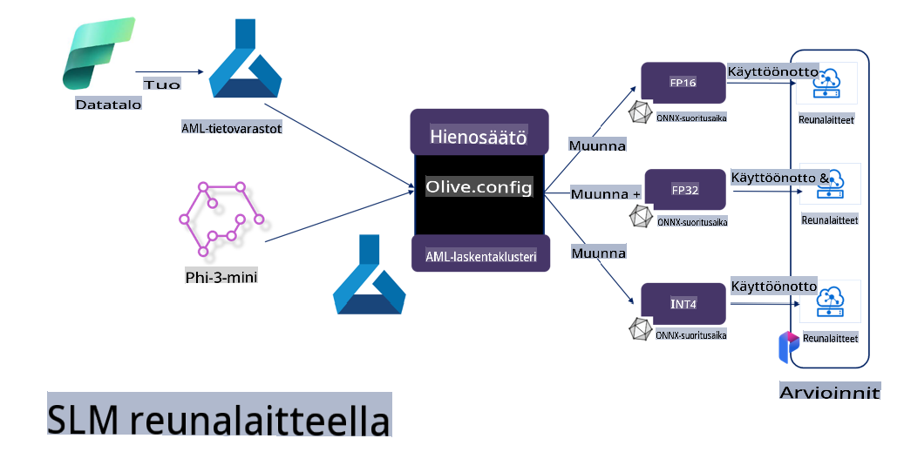

# **Phi-3:n hienosäätö Microsoft Olivella**

[Olive](https://github.com/microsoft/OLive?WT.mc_id=aiml-138114-kinfeylo) on helppokäyttöinen laitteistotietoinen mallien optimointityökalu, joka yhdistää alan johtavat tekniikat mallien pakkaamiseen, optimointiin ja kääntämiseen.

Se on suunniteltu virtaviivaistamaan koneoppimismallien optimointiprosessia, varmistaen, että ne hyödyntävät tehokkaasti tiettyjä laitteistoarkkitehtuureja.

Riippumatta siitä, työskenteletkö pilvipohjaisten sovellusten vai reunalaitteiden parissa, Olive mahdollistaa mallien optimoinnin vaivattomasti ja tehokkaasti.

## Keskeiset ominaisuudet:
- Olive yhdistää ja automatisoi optimointitekniikat valituille laitteistokohteille.
- Koska yksikään optimointitekniikka ei sovi kaikkiin tilanteisiin, Olive mahdollistaa laajennettavuuden, jolloin alan asiantuntijat voivat lisätä omia innovaatioitaan.

## Vähennä kehitystyön vaivaa:
- Kehittäjien täytyy usein oppia ja käyttää useiden laitteistovalmistajien työkaluja valmistaakseen ja optimoidakseen koulutetut mallit käyttöön.
- Olive yksinkertaistaa tätä prosessia automatisoimalla optimointitekniikat valitulle laitteistolle.

## Valmiiksi integroitu E2E-optimointiratkaisu:

Yhdistämällä ja säätämällä integroituja tekniikoita Olive tarjoaa yhtenäisen ratkaisun päästä päähän -optimointiin.
Se ottaa huomioon rajoitukset, kuten tarkkuuden ja viiveen, mallien optimoinnissa.

## Microsoft Olive mallien hienosäätöön

Microsoft Olive on erittäin helppokäyttöinen avoimen lähdekoodin mallien optimointityökalu, joka soveltuu sekä hienosäätöön että viitekäyttöön generatiivisen tekoälyn alalla. Vain yksinkertaisella konfiguroinnilla, yhdistettynä avoimen lähdekoodin pieniin kielimalleihin ja vastaaviin käyttöympäristöihin (AzureML / paikallinen GPU, CPU, DirectML), voit suorittaa mallin hienosäädön tai viitekäytön automaattisen optimoinnin avulla ja löytää parhaan mallin pilveen tai reunalaitteisiin käyttöönotettavaksi. Tämä mahdollistaa yritysten rakentaa omia toimialakohtaisia mallejaan paikallisesti ja pilvessä.


## Phi-3:n hienosäätö Microsoft Olivella 



## Phi-3 Olive -esimerkkikoodi ja -malli
Tässä esimerkissä käytetään Olivea seuraaviin tehtäviin:

- Hienosäädetään LoRA-sovitin luokittelemaan lauseita tunneisiin: suru, ilo, pelko, yllätys.
- Yhdistetään sovittimen painot perusmalliin.
- Optimoidaan ja kvantisoidaan malli int4-muotoon.

[Esimerkkikoodi](../../code/03.Finetuning/olive-ort-example/README.md)

### Microsoft Oliven asennus

Microsoft Oliven asennus on hyvin yksinkertaista, ja sen voi asentaa CPU-, GPU-, DirectML- ja Azure ML -ympäristöihin.

```bash
pip install olive-ai
```

Jos haluat ajaa ONNX-mallia CPU:lla, voit käyttää

```bash
pip install olive-ai[cpu]
```

Jos haluat ajaa ONNX-mallia GPU:lla, voit käyttää

```python
pip install olive-ai[gpu]
```

Jos haluat käyttää Azure ML:ää, käytä

```python
pip install git+https://github.com/microsoft/Olive#egg=olive-ai[azureml]
```

**Huomio**
Käyttöjärjestelmävaatimukset: Ubuntu 20.04 / 22.04 

### **Microsoft Oliven Config.json**

Asennuksen jälkeen voit määrittää mallikohtaisia asetuksia Config-tiedoston avulla, mukaan lukien tiedot, laskenta, koulutus, käyttöönotto ja mallin luonti.

**1. Data**

Microsoft Olivessa voidaan tukea paikallista ja pilvipohjaista koulutusta, ja nämä voidaan määrittää asetuksissa.

*Paikalliset data-asetukset*

Voit helposti määrittää hienosäätöön tarvittavan datan, yleensä json-muodossa, ja mukauttaa sen datamalliin. Tämä on säädettävä mallin vaatimusten mukaan (esimerkiksi mukautettuna Microsoft Phi-3-mini -mallin vaatimaan muotoon. Jos sinulla on muita malleja, katso niiden vaatimukset hienosäätöä varten).

```json

    "data_configs": [
        {
            "name": "dataset_default_train",
            "type": "HuggingfaceContainer",
            "load_dataset_config": {
                "params": {
                    "data_name": "json", 
                    "data_files":"dataset/dataset-classification.json",
                    "split": "train"
                }
            },
            "pre_process_data_config": {
                "params": {
                    "dataset_type": "corpus",
                    "text_cols": [
                            "phrase",
                            "tone"
                    ],
                    "text_template": "### Text: {phrase}\n### The tone is:\n{tone}",
                    "corpus_strategy": "join",
                    "source_max_len": 2048,
                    "pad_to_max_len": false,
                    "use_attention_mask": false
                }
            }
        }
    ],
```

**Pilvipohjaiset data-asetukset**

Yhdistämällä Azure AI Studion/Azure Machine Learning Servicen datavarastoon voit linkittää pilvessä olevan datan ja tuoda eri tietolähteitä Azure AI Studion/Azure Machine Learning Servicen kautta tukemaan hienosäätöä.

```json

    "data_configs": [
        {
            "name": "dataset_default_train",
            "type": "HuggingfaceContainer",
            "load_dataset_config": {
                "params": {
                    "data_name": "json", 
                    "data_files": {
                        "type": "azureml_datastore",
                        "config": {
                            "azureml_client": {
                                "subscription_id": "Your Azure Subscrition ID",
                                "resource_group": "Your Azure Resource Group",
                                "workspace_name": "Your Azure ML Workspaces name"
                            },
                            "datastore_name": "workspaceblobstore",
                            "relative_path": "Your train_data.json Azure ML Location"
                        }
                    },
                    "split": "train"
                }
            },
            "pre_process_data_config": {
                "params": {
                    "dataset_type": "corpus",
                    "text_cols": [
                            "Question",
                            "Best Answer"
                    ],
                    "text_template": "<|user|>\n{Question}<|end|>\n<|assistant|>\n{Best Answer}\n<|end|>",
                    "corpus_strategy": "join",
                    "source_max_len": 2048,
                    "pad_to_max_len": false,
                    "use_attention_mask": false
                }
            }
        }
    ],
    
```

**2. Laskentaympäristön asetukset**

Jos tarvitset paikallisen ympäristön, voit käyttää paikallisia dataresursseja. Jos tarvitset Azure AI Studion/Azure Machine Learning Servicen resursseja, sinun on määritettävä tarvittavat Azure-parametrit, laskentatehon nimi jne.

```json

    "systems": {
        "aml": {
            "type": "AzureML",
            "config": {
                "accelerators": ["gpu"],
                "hf_token": true,
                "aml_compute": "Your Azure AI Studio / Azure Machine Learning Service Compute Name",
                "aml_docker_config": {
                    "base_image": "Your Azure AI Studio / Azure Machine Learning Service docker",
                    "conda_file_path": "conda.yaml"
                }
            }
        },
        "azure_arc": {
            "type": "AzureML",
            "config": {
                "accelerators": ["gpu"],
                "aml_compute": "Your Azure AI Studio / Azure Machine Learning Service Compute Name",
                "aml_docker_config": {
                    "base_image": "Your Azure AI Studio / Azure Machine Learning Service docker",
                    "conda_file_path": "conda.yaml"
                }
            }
        }
    },
```

***Huomio***

Koska suoritus tapahtuu Azure AI Studion/Azure Machine Learning Servicen kontissa, tarvittava ympäristö on määritettävä. Tämä tehdään conda.yaml-ympäristössä.

```yaml

name: project_environment
channels:
  - defaults
dependencies:
  - python=3.8.13
  - pip=22.3.1
  - pip:
      - einops
      - accelerate
      - azure-keyvault-secrets
      - azure-identity
      - bitsandbytes
      - datasets
      - huggingface_hub
      - peft
      - scipy
      - sentencepiece
      - torch>=2.2.0
      - transformers
      - git+https://github.com/microsoft/Olive@jiapli/mlflow_loading_fix#egg=olive-ai[gpu]
      - --extra-index-url https://aiinfra.pkgs.visualstudio.com/PublicPackages/_packaging/ORT-Nightly/pypi/simple/ 
      - ort-nightly-gpu==1.18.0.dev20240307004
      - --extra-index-url https://aiinfra.pkgs.visualstudio.com/PublicPackages/_packaging/onnxruntime-genai/pypi/simple/
      - onnxruntime-genai-cuda

    

```

**3. Valitse SLM**

Voit käyttää Hugging Facen malleja suoraan tai yhdistää ne Azure AI Studion/Azure Machine Learningin Model Catalogiin valitaksesi käytettävän mallin. Alla olevassa esimerkissä käytetään Microsoft Phi-3-miniä.

Jos sinulla on malli paikallisesti, voit käyttää tätä menetelmää

```json

    "input_model":{
        "type": "PyTorchModel",
        "config": {
            "hf_config": {
                "model_name": "model-cache/microsoft/phi-3-mini",
                "task": "text-generation",
                "model_loading_args": {
                    "trust_remote_code": true
                }
            }
        }
    },
```

Jos haluat käyttää mallia Azure AI Studion/Azure Machine Learning Servicen kautta, voit käyttää tätä menetelmää

```json

    "input_model":{
        "type": "PyTorchModel",
        "config": {
            "model_path": {
                "type": "azureml_registry_model",
                "config": {
                    "name": "microsoft/Phi-3-mini-4k-instruct",
                    "registry_name": "azureml-msr",
                    "version": "11"
                }
            },
             "model_file_format": "PyTorch.MLflow",
             "hf_config": {
                "model_name": "microsoft/Phi-3-mini-4k-instruct",
                "task": "text-generation",
                "from_pretrained_args": {
                    "trust_remote_code": true
                }
            }
        }
    },
```

**Huomio:**
Integraatio Azure AI Studion/Azure Machine Learning Servicen kanssa on tarpeen, joten mallia määrittäessäsi viittaa versionumeroon ja nimikkeistöön.

Kaikki Azuren mallit on asetettava PyTorch.MLflow-muotoon.

Sinulla on oltava Hugging Face -tili ja sidottava avain Azure AI Studion avainarvoon.

**4. Algoritmi**

Microsoft Olive sisältää hyvin kapseloidut Lora- ja QLora-hienosäätöalgoritmit. Sinun tarvitsee vain määrittää asiaankuuluvat parametrit. Tässä esimerkissä käytetään QLoraa.

```json
        "lora": {
            "type": "LoRA",
            "config": {
                "target_modules": [
                    "o_proj",
                    "qkv_proj"
                ],
                "double_quant": true,
                "lora_r": 64,
                "lora_alpha": 64,
                "lora_dropout": 0.1,
                "train_data_config": "dataset_default_train",
                "eval_dataset_size": 0.3,
                "training_args": {
                    "seed": 0,
                    "data_seed": 42,
                    "per_device_train_batch_size": 1,
                    "per_device_eval_batch_size": 1,
                    "gradient_accumulation_steps": 4,
                    "gradient_checkpointing": false,
                    "learning_rate": 0.0001,
                    "num_train_epochs": 3,
                    "max_steps": 10,
                    "logging_steps": 10,
                    "evaluation_strategy": "steps",
                    "eval_steps": 187,
                    "group_by_length": true,
                    "adam_beta2": 0.999,
                    "max_grad_norm": 0.3
                }
            }
        },
```

Jos haluat kvantisointimuunnoksen, Microsoft Oliven päähaara tukee jo onnxruntime-genai-menetelmää. Voit määrittää sen tarpeidesi mukaan:

1. Yhdistä sovittimen painot perusmalliin.
2. Muunna malli haluttuun tarkkuuteen onnx-malliksi ModelBuilderilla.

Esimerkiksi kvantisointi INT4-muotoon:

```json

        "merge_adapter_weights": {
            "type": "MergeAdapterWeights"
        },
        "builder": {
            "type": "ModelBuilder",
            "config": {
                "precision": "int4"
            }
        }
```

**Huomio** 
- Jos käytät QLoRAa, ONNXRuntime-genain kvantisointimuunnos ei ole vielä tuettu.

- On tärkeää huomata, että voit säätää yllä olevia vaiheita tarpeidesi mukaan. Ei ole välttämätöntä konfiguroida kaikkia näitä vaiheita. Voit käyttää algoritmin vaiheita suoraan ilman hienosäätöä. Lopuksi sinun on määritettävä asiaankuuluvat moottorit.

```json

    "engine": {
        "log_severity_level": 0,
        "host": "aml",
        "target": "aml",
        "search_strategy": false,
        "execution_providers": ["CUDAExecutionProvider"],
        "cache_dir": "../model-cache/models/phi3-finetuned/cache",
        "output_dir" : "../model-cache/models/phi3-finetuned"
    }
```

**5. Hienosäätö valmis**

Komentorivillä suorita olive-config.json-tiedoston hakemistossa:

```bash
olive run --config olive-config.json  
```

**Vastuuvapauslauseke**:  
Tämä asiakirja on käännetty konepohjaisilla tekoälykäännöspalveluilla. Pyrimme tarkkuuteen, mutta huomioithan, että automaattiset käännökset voivat sisältää virheitä tai epätarkkuuksia. Alkuperäistä asiakirjaa sen alkuperäisellä kielellä tulisi pitää ensisijaisena lähteenä. Tärkeissä tiedoissa suositellaan ammattimaista ihmiskäännöstä. Emme ole vastuussa tämän käännöksen käytöstä aiheutuvista väärinkäsityksistä tai virheellisistä tulkinnoista.