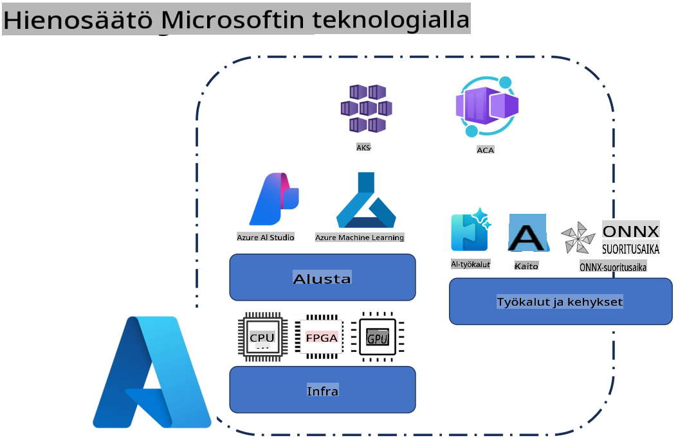
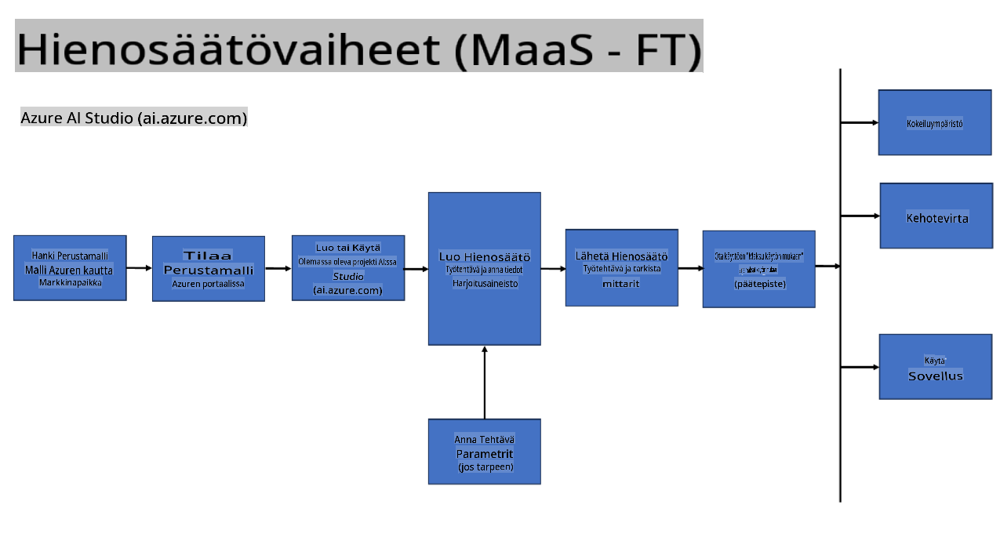
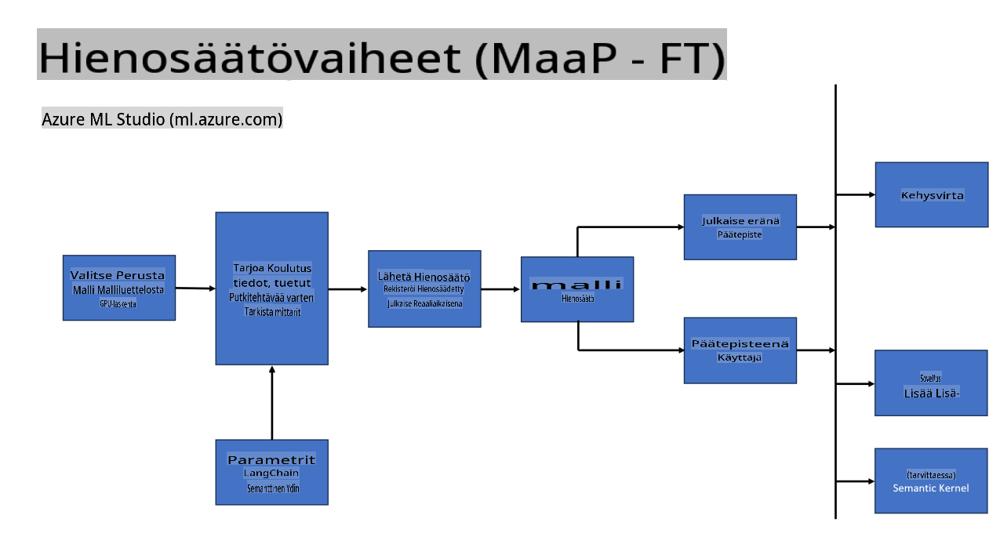
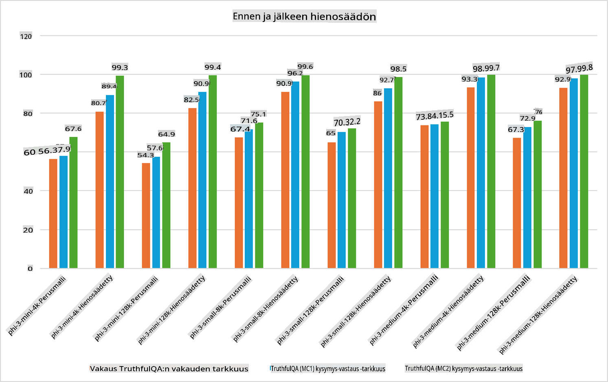

## Hienosäätöskenaariot

**Alusta** Tämä sisältää erilaisia teknologioita, kuten Azure AI Foundry, Azure Machine Learning, AI Tools, Kaito ja ONNX Runtime.

**Infrastruktuuri** Tämä sisältää CPU:n ja FPGA:n, jotka ovat olennaisia hienosäätöprosessissa. Näytän sinulle ikonit näille teknologioille.

**Työkalut ja Kehykset** Tämä sisältää ONNX Runtime -työkalut. Näytän sinulle ikonit näille teknologioille.  
[Lisää ikonit ONNX Runtime -työkaluista]

Hienosäätö Microsoftin teknologioilla sisältää useita komponentteja ja työkaluja. Ymmärtämällä ja hyödyntämällä näitä teknologioita voimme tehokkaasti hienosäätää sovelluksiamme ja luoda parempia ratkaisuja.

## Malli palveluna

Hienosäädä malli isännöidyn hienosäädön avulla ilman, että sinun tarvitsee luoda ja hallita laskentaympäristöä.

Palveluton hienosäätö on saatavilla Phi-3-mini- ja Phi-3-medium-malleille, mikä mahdollistaa kehittäjille nopean ja helpon mallien räätälöinnin pilvi- ja reunaskenaarioihin ilman laskentaympäristön järjestämistä. Olemme myös ilmoittaneet, että Phi-3-small on nyt saatavilla Models-as-a-Service-tarjonnassamme, joten kehittäjät voivat nopeasti ja helposti aloittaa tekoälykehityksen ilman, että heidän tarvitsee hallita taustalla olevaa infrastruktuuria.

## Malli alustana

Käyttäjät hallitsevat omaa laskentaympäristöään hienosäätääkseen mallejaan.

[Fine Tuning Sample](https://github.com/Azure/azureml-examples/blob/main/sdk/python/foundation-models/system/finetune/chat-completion/chat-completion.ipynb)

## Hienosäätöskenaariot

| | | | | | | |
|-|-|-|-|-|-|-|
|Skenaario|LoRA|QLoRA|PEFT|DeepSpeed|ZeRO|DORA|
|Esikoulutettujen LLM-mallien mukauttaminen tiettyihin tehtäviin tai toimialoihin|Kyllä|Kyllä|Kyllä|Kyllä|Kyllä|Kyllä|
|Hienosäätö NLP-tehtäviin, kuten tekstiluokittelu, nimettyjen entiteettien tunnistus ja konekääntäminen|Kyllä|Kyllä|Kyllä|Kyllä|Kyllä|Kyllä|
|Hienosäätö kysymys-vastaus -tehtäviin|Kyllä|Kyllä|Kyllä|Kyllä|Kyllä|Kyllä|
|Hienosäätö chatbotteihin, jotka tuottavat ihmismäisiä vastauksia|Kyllä|Kyllä|Kyllä|Kyllä|Kyllä|Kyllä|
|Hienosäätö musiikin, taiteen tai muun luovan sisällön tuottamiseen|Kyllä|Kyllä|Kyllä|Kyllä|Kyllä|Kyllä|
|Laskennallisten ja taloudellisten kustannusten vähentäminen|Kyllä|Kyllä|Ei|Kyllä|Kyllä|Ei|
|Muistin käytön vähentäminen|Ei|Kyllä|Ei|Kyllä|Kyllä|Kyllä|
|Vähemmän parametreja tehokkaaseen hienosäätöön|Ei|Kyllä|Kyllä|Ei|Ei|Kyllä|
|Muistitehokas datan rinnakkaisuus, joka hyödyntää kaikkien käytettävissä olevien GPU-laitteiden yhteenlaskettua GPU-muistia|Ei|Ei|Ei|Kyllä|Kyllä|Kyllä|

## Hienosäätösuorituskyvyn esimerkkejä

**Vastuuvapauslauseke**:  
Tämä asiakirja on käännetty konepohjaisilla tekoälykäännöspalveluilla. Vaikka pyrimme tarkkuuteen, huomioithan, että automaattiset käännökset voivat sisältää virheitä tai epätarkkuuksia. Alkuperäistä asiakirjaa sen alkuperäisellä kielellä tulisi pitää ensisijaisena lähteenä. Kriittistä tietoa varten suositellaan ammattimaista, ihmisen tekemää käännöstä. Emme ole vastuussa tämän käännöksen käytöstä aiheutuvista väärinkäsityksistä tai virhetulkinnoista.