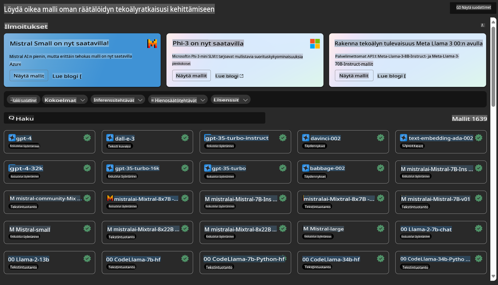

# **Esittelyssä Azure Machine Learning -palvelu**

[Azure Machine Learning](https://ml.azure.com?WT.mc_id=aiml-138114-kinfeylo) on pilvipalvelu, joka nopeuttaa ja hallitsee koneoppimisprojektien (ML) elinkaarta.

ML-ammattilaiset, datatieteilijät ja insinöörit voivat käyttää sitä päivittäisissä työprosesseissaan seuraavasti:

- Mallien kouluttaminen ja käyttöönotto.
Hallinnoi koneoppimisen operaatioita (MLOps).
- Voit luoda mallin Azure Machine Learningissä tai käyttää avointen lähteiden alustoilla, kuten PyTorch, TensorFlow tai scikit-learn, rakennettua mallia.
- MLOps-työkalut auttavat seuraamaan, uudelleenkouluttamaan ja ottamaan malleja uudelleen käyttöön.

## Kenelle Azure Machine Learning on tarkoitettu?

**Datatieteilijät ja ML-insinöörit**

He voivat käyttää työkaluja nopeuttaakseen ja automatisoidakseen päivittäisiä työprosessejaan.  
Azure ML tarjoaa ominaisuuksia, kuten reiluus, selitettävyys, seuranta ja auditointimahdollisuudet.

**Sovelluskehittäjät**

He voivat saumattomasti integroida malleja sovelluksiin tai palveluihin.

**Alustakehittäjät**

Heillä on käytössään kattava työkalusarja, jota tukevat kestävät Azure Resource Manager -rajapinnat.  
Näillä työkaluilla voidaan rakentaa edistyneitä ML-työkaluja.

**Yritykset**

Microsoft Azuren pilviympäristössä toimivat yritykset hyötyvät tutusta tietoturvasta ja roolipohjaisesta käyttöoikeuksien hallinnasta.  
Hankkeiden asetukset mahdollistavat suojatun datan ja tiettyjen toimintojen käyttöoikeuksien hallinnan.

## Tuottavuutta kaikille tiimissä
ML-projektit vaativat usein tiimin, jolla on monipuolinen osaamistausta, jotta niitä voidaan rakentaa ja ylläpitää.

Azure ML tarjoaa työkaluja, joiden avulla voit:
- Tehdä yhteistyötä tiimisi kanssa jaetun muistikirjan, laskentaresurssien, palvelimettoman laskennan, datan ja ympäristöjen avulla.
- Kehittää malleja, joissa on reiluus, selitettävyys, seuranta ja auditointimahdollisuudet, jotta voidaan täyttää jäljitettävyys- ja auditointivaatimukset.
- Ottaa ML-malleja käyttöön nopeasti ja helposti laajassa mittakaavassa sekä hallita ja valvoa niitä tehokkaasti MLOpsin avulla.
- Suorittaa koneoppimisen työkuormia missä tahansa sisäänrakennetun hallinnan, tietoturvan ja sääntöjenmukaisuuden avulla.

## Yhteensopivat alustatyökalut

Kuka tahansa ML-tiimin jäsen voi käyttää haluamiaan työkaluja työn suorittamiseen.  
Olipa kyse nopeista kokeiluista, hyperparametrien virittämisestä, putkistojen rakentamisesta tai ennusteiden hallinnasta, voit käyttää tuttuja käyttöliittymiä, kuten:
- Azure Machine Learning Studio
- Python SDK (v2)
- Azure CLI (v2)
- Azure Resource Manager REST API:t

Kun hiot malleja ja teet yhteistyötä kehityssyklin aikana, voit jakaa ja löytää resursseja, varoja ja mittareita Azure Machine Learning Studion käyttöliittymässä.

## **LLM/SLM Azure ML:ssä**

Azure ML on lisännyt monia LLM/SLM-toimintoja yhdistäen LLMOpsin ja SLMOpsin, luoden yritystason generatiivisen tekoälyn teknologiaympäristön.

### **Malliluettelo**

Yrityskäyttäjät voivat ottaa käyttöön erilaisia malleja eri liiketoimintaskenaarioiden mukaan Malliluettelon kautta ja tarjota palveluita Model as Service -mallina, jolloin yrityskehittäjät tai käyttäjät voivat käyttää niitä.

Azure Machine Learning Studion Malliluettelo on keskus, josta löydät ja käytät laajan valikoiman malleja Generatiivisen tekoälyn sovellusten rakentamiseen. Malliluettelo sisältää satoja malleja eri palveluntarjoajilta, kuten Azure OpenAI Service, Mistral, Meta, Cohere, Nvidia, Hugging Face, sekä Microsoftin kouluttamia malleja. Muut kuin Microsoftin tarjoamat mallit ovat Microsoftin tuote-ehtojen mukaisesti "Non-Microsoft Products" ja niiden käyttöön sovelletaan mallin mukana toimitettuja ehtoja.

### **Työputki**

Koneoppimisen putkiston ydin on jakaa koneoppimistehtävä monivaiheiseksi työnkuluksi. Jokainen vaihe on hallittavissa oleva komponentti, jota voidaan kehittää, optimoida, konfiguroida ja automatisoida erikseen. Vaiheet yhdistetään selkeästi määritellyillä rajapinnoilla. Azure Machine Learning -putkipalvelu orkestroi automaattisesti kaikki riippuvuudet putken vaiheiden välillä.

SLM/LLM:n hienosäädössä voimme hallita dataamme, koulutus- ja generointiprosessejamme putken kautta.

### **Prompt flow**

Azure Machine Learning Prompt Flow -toiminnon hyödyt  
Azure Machine Learning Prompt Flow tarjoaa monia etuja, jotka auttavat käyttäjiä siirtymään ideoinnista kokeiluun ja lopulta tuotantovalmiisiin LLM-pohjaisiin sovelluksiin:

**Prompt-suunnittelun ketteryys**

Interaktiivinen kirjoituskokemus: Azure Machine Learning Prompt Flow tarjoaa visuaalisen esityksen työnkulun rakenteesta, jolloin käyttäjät voivat helposti ymmärtää ja navigoida projekteissaan. Se tarjoaa myös muistikirjamaisen koodauskokemuksen tehokkaaseen työnkulun kehittämiseen ja virheiden korjaamiseen.  
Vaihtoehdot prompt-virittämiseen: Käyttäjät voivat luoda ja verrata useita prompt-vaihtoehtoja, mikä helpottaa iteratiivista parannusprosessia.

Arviointi: Sisäänrakennetut arviointiprosessit mahdollistavat promptien ja työnkulkujen laadun ja tehokkuuden arvioinnin.

Kattavat resurssit: Azure Machine Learning Prompt Flow sisältää kirjaston sisäänrakennettuja työkaluja, esimerkkejä ja malleja, jotka toimivat lähtökohtana kehitykselle, inspiroivat luovuutta ja nopeuttavat prosessia.

**Yritysvalmius LLM-pohjaisille sovelluksille**

Yhteistyö: Azure Machine Learning Prompt Flow tukee tiimityötä, jolloin useat käyttäjät voivat työskennellä yhdessä prompt-projektien parissa, jakaa tietoa ja ylläpitää versiohallintaa.

Kaikki yhdessä -alusta: Azure Machine Learning Prompt Flow virtaviivaistaa koko prompt-suunnitteluprosessin kehityksestä ja arvioinnista käyttöönottoon ja seurantaan. Käyttäjät voivat helposti ottaa työnkulkunsa käyttöön Azure Machine Learning -päätepisteinä ja seurata niiden suorituskykyä reaaliajassa, mikä varmistaa optimaalisen toiminnan ja jatkuvan parantamisen.

Azure Machine Learningin yritysvalmiit ratkaisut: Prompt Flow hyödyntää Azure Machine Learningin vankkoja yritysvalmiita ratkaisuja, tarjoten turvallisen, skaalautuvan ja luotettavan perustan työnkulkujen kehittämiseen, kokeiluun ja käyttöönottoon.

Azure Machine Learning Prompt Flow'n avulla käyttäjät voivat hyödyntää prompt-suunnittelun ketteryyttä, tehdä tehokasta yhteistyötä ja hyödyntää yritystason ratkaisuja onnistuneeseen LLM-pohjaisten sovellusten kehittämiseen ja käyttöönottoon.

Yhdistämällä Azure ML:n laskentatehon, datan ja eri komponentit, yrityskehittäjät voivat helposti rakentaa omia tekoälysovelluksiaan.

**Vastuuvapauslauseke**:  
Tämä asiakirja on käännetty konepohjaisilla tekoälyyn perustuvilla käännöspalveluilla. Vaikka pyrimme tarkkuuteen, huomioithan, että automaattiset käännökset voivat sisältää virheitä tai epätarkkuuksia. Alkuperäistä asiakirjaa sen alkuperäisellä kielellä tulisi pitää ensisijaisena lähteenä. Kriittisen tiedon osalta suositellaan ammattimaista, ihmisen tekemää käännöstä. Emme ole vastuussa tämän käännöksen käytöstä johtuvista väärinkäsityksistä tai virhetulkinnoista.