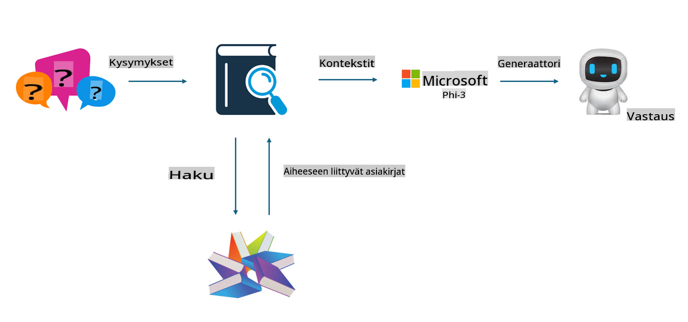
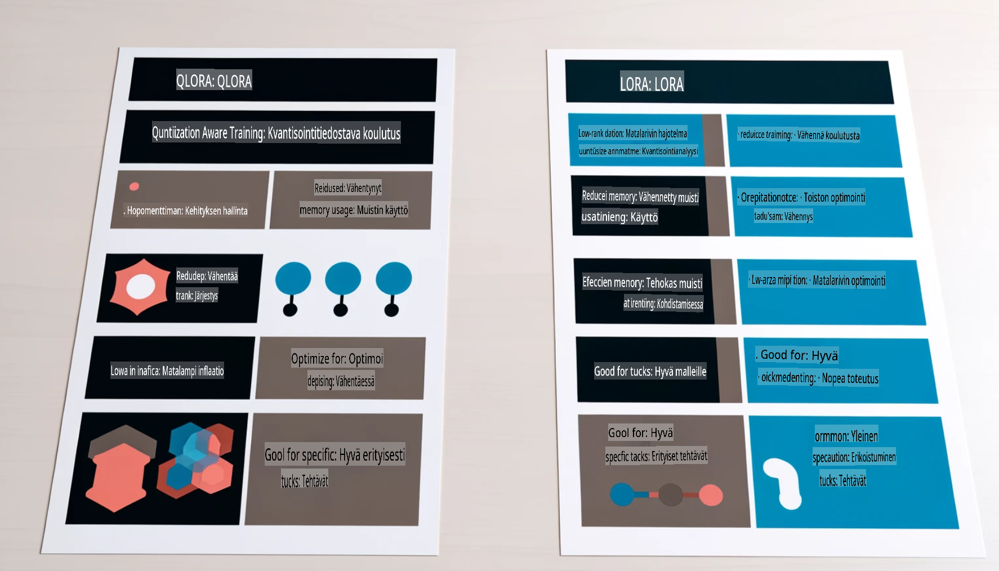

# **Anna Phi-3 teollisuuden asiantuntijaksi**

Jotta Phi-3-mallia voidaan hyödyntää teollisuudessa, siihen täytyy lisätä alan liiketoimintadataa. Meillä on kaksi eri vaihtoehtoa: RAG (Retrieval Augmented Generation) ja Fine Tuning.

## **RAG vs Fine-Tuning**

### **Retrieval Augmented Generation**

RAG yhdistää tiedonhakua ja tekstin generointia. Yrityksen jäsennelty ja jäsentämätön data tallennetaan vektoripohjaiseen tietokantaan. Kun haetaan tiettyä sisältöä, löydetään asiaankuuluvat tiivistelmät ja sisällöt, jotka muodostavat kontekstin. Tämän jälkeen LLM/SLM:n tekstinluontikykyä hyödynnetään sisällön tuottamiseen.

### **Fine-tuning**

Fine-tuning tarkoittaa olemassa olevan mallin parantamista. Mallin algoritmia ei tarvitse rakentaa alusta asti, mutta dataa on kerättävä jatkuvasti. Jos haluat tarkempaa terminologiaa ja kieli-ilmaisua teollisuuden sovelluksiin, fine-tuning on parempi valinta. Jos datasi kuitenkin muuttuu usein, fine-tuning voi olla monimutkaista.

### **Kuinka valita**

1. Jos vastauksemme vaatii ulkoisen datan käyttöönottoa, RAG on paras valinta.

2. Jos tarvitset vakaata ja tarkkaa alan tietoa, fine-tuning on hyvä valinta. RAG keskittyy olennaisen sisällön hakemiseen, mutta ei välttämättä hallitse erikoisalan vivahteita.

3. Fine-tuning vaatii korkealaatuisen datasarjan, mutta jos dataa on vain vähän, vaikutus jää pieneksi. RAG on joustavampi.

4. Fine-tuning on kuin musta laatikko, vaikeasti ymmärrettävä mekanismi. RAG taas tekee datan lähteen löytämisestä helpompaa, mikä auttaa vähentämään virheellistä sisältöä ja parantaa läpinäkyvyyttä.

### **Käyttötilanteet**

1. Vertikaaliset alat, joissa tarvitaan erityistä ammattisanastoa ja ilmaisutapoja, ***Fine-tuning*** on paras valinta.

2. Kysymys-vastausjärjestelmät, joissa yhdistetään eri tietolähteitä, ***RAG*** on paras valinta.

3. Automatisoitujen liiketoimintaprosessien yhdistelmät, ***RAG + Fine-tuning*** on paras valinta.

## **Kuinka käyttää RAG:ia**

Vektoripohjainen tietokanta on kokoelma matemaattiseen muotoon tallennettua dataa. Vektoripohjaiset tietokannat helpottavat koneoppimismallien aiempien syötteiden muistamista, mahdollistaen niiden käytön esimerkiksi haku-, suositus- ja tekstingenerointitapauksissa. Data voidaan tunnistaa samankaltaisuusmittareiden avulla tarkkojen osumien sijaan, mikä auttaa malleja ymmärtämään datan kontekstia.

Vektoripohjainen tietokanta on avain RAG:n toteutukseen. Voimme muuntaa dataa vektorimuotoon vektorimallien, kuten text-embedding-3:n tai jina-ai-embeddingin, avulla.

Lisätietoja RAG-sovelluksen luomisesta [https://github.com/microsoft/Phi-3CookBook](https://github.com/microsoft/Phi-3CookBook?WT.mc_id=aiml-138114-kinfeylo)

## **Kuinka käyttää Fine-tuningia**

Fine-tuningissa yleisesti käytetyt algoritmit ovat Lora ja QLora. Kuinka valita?
- [Lisätietoja tästä esimerkkitiedostosta](../../../../code/04.Finetuning/Phi_3_Inference_Finetuning.ipynb)
- [Python FineTuning -esimerkki](../../../../code/04.Finetuning/FineTrainingScript.py)

### **Lora ja QLora**

LoRA (Low-Rank Adaptation) ja QLoRA (Quantized Low-Rank Adaptation) ovat molemmat tekniikoita, joita käytetään suurten kielimallien (LLM) hienosäätöön hyödyntäen Parameter Efficient Fine Tuning (PEFT) -menetelmiä. PEFT-tekniikat on suunniteltu tekemään mallien kouluttamisesta tehokkaampaa kuin perinteiset menetelmät.

LoRA on itsenäinen hienosäätötekniikka, joka pienentää muistinkulutusta käyttämällä matalankertoimen approksimaatiota painotuspäivitysmatriisissa. Se mahdollistaa nopean koulutuksen ja säilyttää suorituskyvyn lähellä perinteisiä hienosäätömenetelmiä.

QLoRA on LoRA:n laajennus, joka käyttää kvantisointitekniikoita vähentääkseen muistinkulutusta entisestään. QLoRA kvantisoi esikoulutetun LLM:n painoparametrit 4-bittiseen tarkkuuteen, mikä on muistitehokkaampaa kuin LoRA. Kuitenkin QLoRA:n koulutus on noin 30 % hitaampaa kuin LoRA:n, koska se sisältää lisävaiheita kvantisoinnissa ja sen purkamisessa.

QLoRA käyttää LoRA:aa apuna korjaamaan kvantisoinnin aiheuttamia virheitä. QLoRA mahdollistaa massiivisten, miljardien parametrien mallien hienosäädön suhteellisen pienillä ja helposti saatavilla olevilla GPU:illa. Esimerkiksi QLoRA voi hienosäätää 70 miljardin parametrin mallin, joka normaalisti vaatisi 36 GPU:ta, vain 2 GPU:lla.

**Vastuuvapauslauseke**:  
Tämä asiakirja on käännetty konepohjaisilla tekoälykäännöspalveluilla. Vaikka pyrimme tarkkuuteen, huomioithan, että automaattiset käännökset voivat sisältää virheitä tai epätarkkuuksia. Alkuperäistä asiakirjaa sen alkuperäisellä kielellä tulisi pitää ensisijaisena lähteenä. Kriittistä tietoa varten suositellaan ammattimaista ihmiskääntämistä. Emme ole vastuussa tämän käännöksen käytöstä johtuvista väärinkäsityksistä tai virheellisistä tulkinnoista.