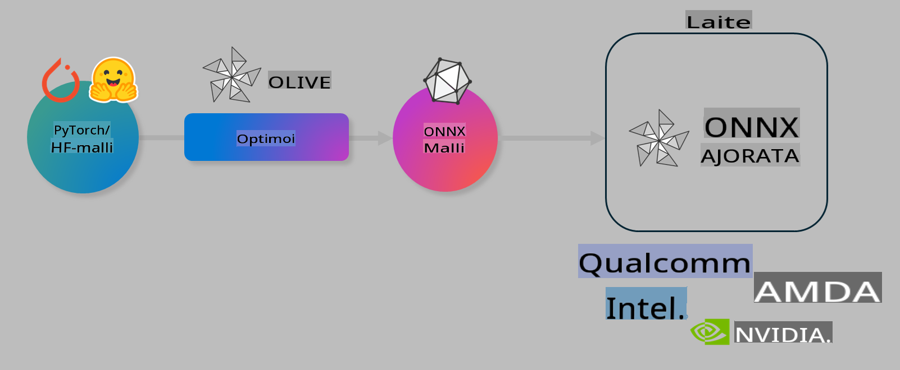

# Lab. Optimoi tekoälymalleja laiteläheistä ennustamista varten

## Johdanto

> [!IMPORTANT]
> Tämä laboratorio edellyttää **Nvidia A10- tai A100-GPU:ta**, jossa on asennettuna siihen liittyvät ajurit ja CUDA-työkalupakki (versio 12+).

> [!NOTE]
> Tämä on **35 minuutin** laboratorio, jossa saat käytännön johdatuksen OLIVE-työkalun avulla mallien optimointiin laiteläheistä ennustamista varten.

## Oppimistavoitteet

Tämän laboratorion lopussa osaat käyttää OLIVE-työkalua:

- Kvantisoida tekoälymallin käyttäen AWQ-kvantisointimenetelmää.
- Hienosäätää tekoälymallia tiettyä tehtävää varten.
- Luoda LoRA-adaptereita (hienosäädetty malli) tehokkaaseen laiteläheiseen ennustamiseen ONNX Runtime -ympäristössä.

### Mikä on Olive

Olive (*O*NNX *live*) on mallien optimointityökalu, jossa on mukana komentoriviliittymä (CLI), jonka avulla voit toimittaa malleja ONNX Runtime -ympäristöön +++https://onnxruntime.ai+++ laadukkaasti ja suorituskykyisesti.



Oliveen syötetään tyypillisesti PyTorch- tai Hugging Face -malli, ja ulostulona on optimoitu ONNX-malli, joka suoritetaan laitteella (käyttökohde), jossa toimii ONNX Runtime. Olive optimoi mallin käyttöympäristön tekoälykiihdyttimelle (NPU, GPU, CPU), jonka on toimittanut laitevalmistaja, kuten Qualcomm, AMD, Nvidia tai Intel.

Olive suorittaa *työnkulun*, joka on järjestetty sarja yksittäisiä mallin optimointitehtäviä, joita kutsutaan *läpäisyiksi*. Esimerkkejä läpäisyistä ovat: mallin pakkaus, graafien kaappaus, kvantisointi, graafien optimointi. Jokaisella läpäisyllä on joukko parametreja, joita voidaan säätää parhaiden mittareiden, kuten tarkkuuden ja viiveen, saavuttamiseksi. Olive käyttää hakualgoritmia optimoidakseen automaattisesti joko yksittäisen läpäisyn tai useamman läpäisyn yhdistelmän.

#### Oliven edut

- **Vähentää turhautumista ja aikaa**, joka kuluu manuaaliseen kokeiluun eri graafien optimointi-, pakkaus- ja kvantisointitekniikoilla. Määrittele laatu- ja suorituskykyvaatimuksesi, ja Olive löytää sinulle automaattisesti parhaan mallin.
- **Yli 40 valmista mallin optimointikomponenttia**, jotka kattavat huipputekniikat kvantisoinnissa, pakkauksessa, graafien optimoinnissa ja hienosäädössä.
- **Helppokäyttöinen CLI** yleisiin mallin optimointitehtäviin. Esimerkiksi olive quantize, olive auto-opt, olive finetune.
- Mallien paketointi ja käyttöönotto sisäänrakennettuna.
- Tukee **Multi LoRA -palvelun** mallien luontia.
- Työnkulkujen rakentaminen YAML/JSON-muodossa mallin optimointi- ja käyttöönotto-tehtävien orkestroimiseksi.
- **Hugging Face**- ja **Azure AI** -integraatio.
- Sisäänrakennettu **välimuistimekanismi**, joka **säästää kustannuksia**.

## Laboratorion ohjeet
> [!NOTE]
> Varmista, että olet varannut Azure AI Hubin ja projektin sekä määrittänyt A100-laskentaympäristön laboratorion 1 mukaisesti.

### Vaihe 0: Yhdistä Azure AI Compute -ympäristöön

Yhdistä Azure AI Compute -ympäristöön käyttämällä **VS Code** -ohjelman etäominaisuutta.

1. Avaa **VS Code** -työpöytäsovellus:
1. Avaa **komentopaletti** painamalla **Shift+Ctrl+P**.
1. Etsi komentopaletista **AzureML - remote: Connect to compute instance in New Window**.
1. Seuraa näytön ohjeita yhdistääksesi laskentaympäristöön. Tämä sisältää Azure-tilauksen, resurssiryhmän, projektin ja laboratorion 1 mukaisesti määritetyn laskentaympäristön valitsemisen.
1. Kun olet yhdistänyt Azure ML Compute -solmuun, tämä näkyy **VS Coden vasemmassa alakulmassa** `><Azure ML: Compute Name`.

### Vaihe 1: Kloonaa tämä repositorio

VS Codessa voit avata uuden pääteikkunan painamalla **Ctrl+J** ja kloonata tämän repositorion:

Päätteessä pitäisi näkyä kehotteena

```
azureuser@computername:~/cloudfiles/code$ 
```
Kloonaa ratkaisu

```bash
cd ~/localfiles
git clone https://github.com/microsoft/phi-3cookbook.git
```

### Vaihe 2: Avaa kansio VS Codessa

Avaa VS Code oikeassa kansiossa suorittamalla seuraava komento päätteessä, joka avaa uuden ikkunan:

```bash
code phi-3cookbook/code/04.Finetuning/Olive-lab
```

Vaihtoehtoisesti voit avata kansion valitsemalla **File** > **Open Folder**.

### Vaihe 3: Asenna riippuvuudet

Avaa pääteikkuna VS Codessa Azure AI Compute -ympäristössä (vinkki: **Ctrl+J**) ja suorita seuraavat komennot riippuvuuksien asentamiseksi:

```bash
conda create -n olive-ai python=3.11 -y
conda activate olive-ai
pip install -r requirements.txt
az extension remove -n azure-cli-ml
az extension add -n ml
```

> [!NOTE]
> Kaikkien riippuvuuksien asentaminen kestää noin 5 minuuttia.

Tässä laboratoriossa ladataan ja lähetetään malleja Azure AI -malliluetteloon. Jotta pääset käsiksi malliluetteloon, sinun täytyy kirjautua Azureen käyttämällä:

```bash
az login
```

> [!NOTE]
> Kirjautumisvaiheessa sinua pyydetään valitsemaan tilaus. Varmista, että valitset laboratorion käyttöön annetun tilauksen.

### Vaihe 4: Suorita Olive-komennot

Avaa pääteikkuna VS Codessa Azure AI Compute -ympäristössä (vinkki: **Ctrl+J**) ja varmista, että `olive-ai`-conda-ympäristö on aktivoitu:

```bash
conda activate olive-ai
```

Seuraavaksi suorita seuraavat Olive-komennot komentorivillä.

1. **Tarkastele dataa:** Tässä esimerkissä hienosäädetään Phi-3.5-Mini-malli, jotta se erikoistuu vastaamaan matkailuun liittyviin kysymyksiin. Alla oleva koodi näyttää ensimmäiset tietueet datasetistä, joka on JSON-lines-muodossa:

    ```bash
    head data/data_sample_travel.jsonl
    ```
1. **Kvantisoi malli:** Ennen mallin kouluttamista kvantisoidaan se seuraavalla komennolla, joka käyttää tekniikkaa nimeltä Active Aware Quantization (AWQ) +++https://arxiv.org/abs/2306.00978+++. AWQ kvantisoi mallin painot huomioiden aktivoinnit, jotka syntyvät ennustamisen aikana. Tämä tarkoittaa, että kvantisointiprosessi ottaa huomioon aktivointien todellisen datan jakautuman, mikä säilyttää paremmin mallin tarkkuuden perinteisiin painojen kvantisointimenetelmiin verrattuna.

    ```bash
    olive quantize \
       --model_name_or_path microsoft/Phi-3.5-mini-instruct \
       --trust_remote_code \
       --algorithm awq \
       --output_path models/phi/awq \
       --log_level 1
    ```
    
    Kvantisointi kestää **noin 8 minuuttia**, ja se **vähentää mallin kokoa ~7.5GB:sta ~2.5GB:iin**.
   
   Tässä laboratoriossa näytetään, kuinka malleja tuodaan Hugging Face -ympäristöstä (esimerkiksi: `microsoft/Phi-3.5-mini-instruct`). However, Olive also allows you to input models from the Azure AI catalog by updating the `model_name_or_path` argument to an Azure AI asset ID (for example:  `azureml://registries/azureml/models/Phi-3.5-mini-instruct/versions/4`). 

1. **Train the model:** Next, the `olive finetune` -komento hienosäätää kvantisoidun mallin. Kvantisointi *ennen* hienosäätöä parantaa tarkkuutta, koska hienosäätöprosessi palauttaa osan kvantisoinnista aiheutuvasta häviöstä.

    ```bash
    olive finetune \
        --method lora \
        --model_name_or_path models/phi/awq \
        --data_files "data/data_sample_travel.jsonl" \
        --data_name "json" \
        --text_template "<|user|>\n{prompt}<|end|>\n<|assistant|>\n{response}<|end|>" \
        --max_steps 100 \
        --output_path ./models/phi/ft \
        --log_level 1
    ```
    
    Hienosäätö (100 askeleella) kestää **noin 6 minuuttia**.

1. **Optimoi:** Kun malli on koulutettu, optimoidaan se Oliven `auto-opt` command, which will capture the ONNX graph and automatically perform a number of optimizations to improve the model performance for CPU by compressing the model and doing fusions. It should be noted, that you can also optimize for other devices such as NPU or GPU by just updating the `--device` and `--provider` -argumenteilla. Tässä laboratoriossa käytämme kuitenkin CPU:ta.

    ```bash
    olive auto-opt \
       --model_name_or_path models/phi/ft/model \
       --adapter_path models/phi/ft/adapter \
       --device cpu \
       --provider CPUExecutionProvider \
       --use_ort_genai \
       --output_path models/phi/onnx-ao \
       --log_level 1
    ```
    
    Optimointi kestää **noin 5 minuuttia**.

### Vaihe 5: Mallin ennustamisen pika-testit

Testaa mallin ennustamista luomalla Python-tiedosto kansioon nimeltä **app.py** ja kopioimalla ja liittämällä seuraava koodi:

```python
import onnxruntime_genai as og
import numpy as np

print("loading model and adapters...", end="", flush=True)
model = og.Model("models/phi/onnx-ao/model")
adapters = og.Adapters(model)
adapters.load("models/phi/onnx-ao/model/adapter_weights.onnx_adapter", "travel")
print("DONE!")

tokenizer = og.Tokenizer(model)
tokenizer_stream = tokenizer.create_stream()

params = og.GeneratorParams(model)
params.set_search_options(max_length=100, past_present_share_buffer=False)
user_input = "what is the best thing to see in chicago"
params.input_ids = tokenizer.encode(f"<|user|>\n{user_input}<|end|>\n<|assistant|>\n")

generator = og.Generator(model, params)

generator.set_active_adapter(adapters, "travel")

print(f"{user_input}")

while not generator.is_done():
    generator.compute_logits()
    generator.generate_next_token()

    new_token = generator.get_next_tokens()[0]
    print(tokenizer_stream.decode(new_token), end='', flush=True)

print("\n")
```

Suorita koodi komennolla:

```bash
python app.py
```

### Vaihe 6: Lataa malli Azure AI:hin

Mallin lataaminen Azure AI -mallirekisteriin mahdollistaa sen jakamisen muiden kehitystiimin jäsenten kanssa ja hallitsee myös mallin versionhallinnan. Lataa malli suorittamalla seuraava komento:

> [!NOTE]
> Päivitä `{}` placeholders with the name of your resource group and Azure AI Project Name. 

To find your resource group `"resourceGroup"ja Azure AI -projektin nimi ja suorita seuraava komento 

```
az ml workspace show
```

Tai siirtymällä +++ai.azure.com+++ ja valitsemalla **management center** **project** **overview**.

Päivitä `{}` paikat resurssiryhmän ja Azure AI -projektin nimellä.

```bash
az ml model create \
    --name ft-for-travel \
    --version 1 \
    --path ./models/phi/onnx-ao \
    --resource-group {RESOURCE_GROUP_NAME} \
    --workspace-name {PROJECT_NAME}
```
Tämän jälkeen voit nähdä lataamasi mallin ja ottaa sen käyttöön osoitteessa https://ml.azure.com/model/list

**Vastuuvapauslauseke**:  
Tämä asiakirja on käännetty konepohjaisilla tekoälyyn perustuvilla käännöspalveluilla. Vaikka pyrimme tarkkuuteen, huomioithan, että automaattiset käännökset voivat sisältää virheitä tai epätarkkuuksia. Alkuperäistä asiakirjaa sen alkuperäisellä kielellä tulisi pitää ensisijaisena lähteenä. Tärkeissä tiedoissa suositellaan ammattimaista ihmiskääntämistä. Emme ole vastuussa tämän käännöksen käytöstä johtuvista väärinkäsityksistä tai virhetulkinnoista.