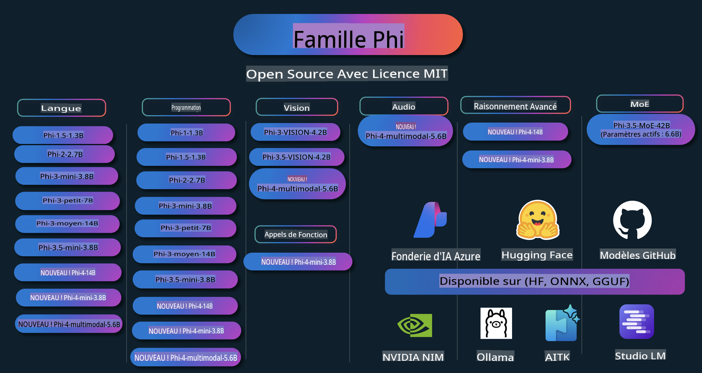

# Phi Cookbook : Exemples pratiques avec les modèles Phi de Microsoft

  

  
  
  

  
  

Phi est une série de modèles d'IA open source développée par Microsoft.

Phi est actuellement le modèle de langage compact (SLM) le plus puissant et le plus économique, avec d'excellents résultats dans des domaines tels que les langues multiples, le raisonnement, la génération de texte/chat, le codage, les images, l'audio et bien d'autres scénarios.

Vous pouvez déployer Phi dans le cloud ou sur des appareils périphériques, et créer facilement des applications d'IA générative avec des ressources informatiques limitées.

Suivez ces étapes pour commencer à utiliser ces ressources :
1. **Forkez le dépôt** : Cliquez   
2. **Clonez le dépôt** :   `git clone https://github.com/microsoft/PhiCookBook.git`  
3. [**Rejoignez la communauté Discord Microsoft AI et échangez avec des experts et d'autres développeurs**](https://discord.com/invite/ByRwuEEgH4?WT.mc_id=aiml-137032-kinfeylo)

## Table des matières

- Introduction  
  - [Bienvenue dans la famille Phi](./md/01.Introduction/01/01.PhiFamily.md)  
  - [Configuration de votre environnement](./md/01.Introduction/01/01.EnvironmentSetup.md)  
  - [Comprendre les technologies clés](./md/01.Introduction/01/01.Understandingtech.md)  
  - [Sécurité de l'IA pour les modèles Phi](./md/01.Introduction/01/01.AISafety.md)  
  - [Support matériel pour Phi](./md/01.Introduction/01/01.Hardwaresupport.md)  
  - [Modèles Phi et disponibilité sur différentes plateformes](./md/01.Introduction/01/01.Edgeandcloud.md)  
  - [Utilisation de Guidance-ai et Phi](./md/01.Introduction/01/01.Guidance.md)  
  - [Modèles sur GitHub Marketplace](https://github.com/marketplace/models)  
  - [Catalogue de modèles Azure AI](https://ai.azure.com)  

- Inférence de Phi dans différents environnements  
    - [Hugging Face](./md/01.Introduction/02/01.HF.md)  
    - [Modèles GitHub](./md/01.Introduction/02/02.GitHubModel.md)  
    - [Catalogue de modèles Azure AI Foundry](./md/01.Introduction/02/03.AzureAIFoundry.md)  
    - [Ollama](./md/01.Introduction/02/04.Ollama.md)  
    - [AI Toolkit VSCode (AITK)](./md/01.Introduction/02/05.AITK.md)  
    - [NVIDIA NIM](./md/01.Introduction/02/06.NVIDIA.md)  

- Inférence de la famille Phi  
    - [Inférence Phi sur iOS](./md/01.Introduction/03/iOS_Inference.md)  
    - [Inférence Phi sur Android](./md/01.Introduction/03/Android_Inference.md)  
- [Inférence Phi sur Jetson](./md/01.Introduction/03/Jetson_Inference.md)
    - [Inférence Phi sur un PC AI](./md/01.Introduction/03/AIPC_Inference.md)
    - [Inférence Phi avec le framework Apple MLX](./md/01.Introduction/03/MLX_Inference.md)
    - [Inférence Phi sur un serveur local](./md/01.Introduction/03/Local_Server_Inference.md)
    - [Inférence Phi sur un serveur distant avec l'outil AI Toolkit](./md/01.Introduction/03/Remote_Interence.md)
    - [Inférence Phi avec Rust](./md/01.Introduction/03/Rust_Inference.md)
    - [Inférence Phi--Vision en local](./md/01.Introduction/03/Vision_Inference.md)
    - [Inférence Phi avec Kaito AKS, conteneurs Azure (support officiel)](./md/01.Introduction/03/Kaito_Inference.md)
- [Quantification de la famille Phi](./md/01.Introduction/04/QuantifyingPhi.md)
    - [Quantification de Phi-3.5 / 4 avec llama.cpp](./md/01.Introduction/04/UsingLlamacppQuantifyingPhi.md)
    - [Quantification de Phi-3.5 / 4 avec des extensions d'IA générative pour onnxruntime](./md/01.Introduction/04/UsingORTGenAIQuantifyingPhi.md)
    - [Quantification de Phi-3.5 / 4 avec Intel OpenVINO](./md/01.Introduction/04/UsingIntelOpenVINOQuantifyingPhi.md)
    - [Quantification de Phi-3.5 / 4 avec le framework Apple MLX](./md/01.Introduction/04/UsingAppleMLXQuantifyingPhi.md)

- Évaluation de Phi
    - [IA Responsable](./md/01.Introduction/05/ResponsibleAI.md)
    - [Azure AI Foundry pour l'évaluation](./md/01.Introduction/05/AIFoundry.md)
    - [Utilisation de Promptflow pour l'évaluation](./md/01.Introduction/05/Promptflow.md)

- RAG avec Azure AI Search
    - [Comment utiliser Phi-4-mini et Phi-4-multimodal (RAG) avec Azure AI Search](https://github.com/microsoft/PhiCookBook/blob/main/code/06.E2E/E2E_Phi-4-RAG-Azure-AI-Search.ipynb)

- Exemples de développement d'applications Phi
  - Applications Textuelles et de Chat
    - Exemples Phi-4 🆕
      - [📓] [Chat avec le modèle ONNX Phi-4-mini](./md/02.Application/01.TextAndChat/Phi4/ChatWithPhi4ONNX/README.md)
      - [Chat avec le modèle ONNX Phi-4 local en .NET](../../md/04.HOL/dotnet/src/LabsPhi4-Chat-01OnnxRuntime)
      - [Application console .NET de chat avec Phi-4 ONNX en utilisant Semantic Kernel](../../md/04.HOL/dotnet/src/LabsPhi4-Chat-02SK)
    - Exemples Phi-3 / 3.5
      - [Chatbot local dans le navigateur avec Phi3, ONNX Runtime Web et WebGPU](https://github.com/microsoft/onnxruntime-inference-examples/tree/main/js/chat)
      - [Chat OpenVINO](./md/02.Application/01.TextAndChat/Phi3/E2E_OpenVino_Chat.md)
      - [Modèle multi-usage - Interaction entre Phi-3-mini et OpenAI Whisper](./md/02.Application/01.TextAndChat/Phi3/E2E_Phi-3-mini_with_whisper.md)
      - [MLFlow - Création d'un wrapper et utilisation de Phi-3 avec MLFlow](./md//02.Application/01.TextAndChat/Phi3/E2E_Phi-3-MLflow.md)
      - [Optimisation du modèle - Comment optimiser le modèle Phi-3-min pour ONNX Runtime Web avec Olive](https://github.com/microsoft/Olive/tree/main/examples/phi3)
      - [Application WinUI3 avec Phi-3 mini-4k-instruct-onnx](https://github.com/microsoft/Phi3-Chat-WinUI3-Sample/)
      - [Exemple d'application de notes alimentée par l'IA avec WinUI3 et plusieurs modèles](https://github.com/microsoft/ai-powered-notes-winui3-sample)
      - [Ajuster et intégrer des modèles personnalisés Phi-3 avec Prompt flow](./md/02.Application/01.TextAndChat/Phi3/E2E_Phi-3-FineTuning_PromptFlow_Integration.md)
      - [Ajuster et intégrer des modèles personnalisés Phi-3 avec Prompt flow dans Azure AI Foundry](./md/02.Application/01.TextAndChat/Phi3/E2E_Phi-3-FineTuning_PromptFlow_Integration_AIFoundry.md)
      - [Évaluer le modèle Phi-3 / Phi-3.5 ajusté dans Azure AI Foundry en mettant l'accent sur les principes d'IA Responsable de Microsoft](./md/02.Application/01.TextAndChat/Phi3/E2E_Phi-3-Evaluation_AIFoundry.md)
- [📓] [Exemple de prédiction linguistique Phi-3.5-mini-instruct (Chinois/Anglais)](../../md/02.Application/01.TextAndChat/Phi3/phi3-instruct-demo.ipynb)  
      - [Chatbot RAG WebGPU avec Phi-3.5-Instruct](./md/02.Application/01.TextAndChat/Phi3/WebGPUWithPhi35Readme.md)  
      - [Utilisation du GPU Windows pour créer une solution Prompt Flow avec Phi-3.5-Instruct ONNX](./md/02.Application/01.TextAndChat/Phi3/UsingPromptFlowWithONNX.md)  
      - [Utilisation de Microsoft Phi-3.5 tflite pour créer une application Android](./md/02.Application/01.TextAndChat/Phi3/UsingPhi35TFLiteCreateAndroidApp.md)  
      - [Exemple de Q&R .NET utilisant le modèle local ONNX Phi-3 avec Microsoft.ML.OnnxRuntime](../../md/04.HOL/dotnet/src/LabsPhi301)  
      - [Application console .NET pour le chat avec Semantic Kernel et Phi-3](../../md/04.HOL/dotnet/src/LabsPhi302)  

  - Exemples de code SDK Azure AI Inference  
    - Exemples Phi-4 🆕  
      - [📓] [Générer du code de projet avec Phi-4-multimodal](./md/02.Application/02.Code/Phi4/GenProjectCode/README.md)  
    - Exemples Phi-3 / 3.5  
      - [Créer votre propre Copilot Chat Visual Studio Code avec Microsoft Phi-3 Family](./md/02.Application/02.Code/Phi3/VSCodeExt/README.md)  
      - [Créer votre propre agent Copilot Chat Visual Studio Code avec Phi-3.5 via les modèles GitHub](/md/02.Application/02.Code/Phi3/CreateVSCodeChatAgentWithGitHubModels.md)  

  - Exemples de raisonnement avancé  
    - Exemples Phi-4 🆕  
      - [📓] [Exemples de raisonnement Phi-4-mini](./md/02.Application/03.AdvancedReasoning/Phi4/AdvancedResoningPhi4mini/README.md)  

  - Démos  
      - [Démos Phi-4-mini hébergées sur Hugging Face Spaces](https://huggingface.co/spaces/microsoft/phi-4-mini?WT.mc_id=aiml-137032-kinfeylo)  
      - [Démos Phi-4-multimodal hébergées sur Hugging Face Spaces](https://huggingface.co/spaces/microsoft/phi-4-multimodal?WT.mc_id=aiml-137032-kinfeylo)  

  - Exemples de vision  
    - Exemples Phi-4 🆕  
      - [📓] [Utiliser Phi-4-multimodal pour lire des images et générer du code](./md/02.Application/04.Vision/Phi4/CreateFrontend/README.md)  
    - Exemples Phi-3 / 3.5  
      - [📓][Phi-3-vision - Texte d'image à texte](../../md/02.Application/04.Vision/Phi3/E2E_Phi-3-vision-image-text-to-text-online-endpoint.ipynb)  
      - [Phi-3-vision-ONNX](https://onnxruntime.ai/docs/genai/tutorials/phi3-v.html)  
      - [📓][Phi-3-vision - Intégration CLIP](../../md/02.Application/04.Vision/Phi3/E2E_Phi-3-vision-image-text-to-text-online-endpoint.ipynb)  
      - [DEMO : Phi-3 Recycling](https://github.com/jennifermarsman/PhiRecycling/)  
      - [Phi-3-vision - Assistant visuel linguistique - avec Phi3-Vision et OpenVINO](https://docs.openvino.ai/nightly/notebooks/phi-3-vision-with-output.html)  
      - [Phi-3 Vision Nvidia NIM](./md/02.Application/04.Vision/Phi3/E2E_Nvidia_NIM_Vision.md)  
      - [Phi-3 Vision OpenVino](./md/02.Application/04.Vision/Phi3/E2E_OpenVino_Phi3Vision.md)  
      - [📓][Exemple multi-image ou multi-cadre Phi-3.5 Vision](../../md/02.Application/04.Vision/Phi3/phi3-vision-demo.ipynb)  
      - [Modèle local ONNX Phi-3 Vision utilisant Microsoft.ML.OnnxRuntime .NET](../../md/04.HOL/dotnet/src/LabsPhi303)  
      - [Modèle local ONNX Phi-3 Vision basé sur un menu utilisant Microsoft.ML.OnnxRuntime .NET](../../md/04.HOL/dotnet/src/LabsPhi304)  

  - Exemples audio  
    - Exemples Phi-4 🆕  
      - [📓] [Extraction de transcriptions audio avec Phi-4-multimodal](./md/02.Application/05.Audio/Phi4/Transciption/README.md)  
      - [📓] [Exemple audio Phi-4-multimodal](../../md/02.Application/05.Audio/Phi4/Siri/demo.ipynb)  
      - [📓] [Exemple de traduction vocale Phi-4-multimodal](../../md/02.Application/05.Audio/Phi4/Translate/demo.ipynb)  
      - [Application console .NET utilisant Phi-4-multimodal Audio pour analyser un fichier audio et générer une transcription](../../md/04.HOL/dotnet/src/LabsPhi4-MultiModal-02Audio)  

  - Exemples MOE  
    - Exemples Phi-3 / 3.5  
      - [📓] [Exemple de modèles Mixture of Experts (MoEs) Phi-3.5 pour les réseaux sociaux](../../md/02.Application/06.MoE/Phi3/phi3_moe_demo.ipynb)  
      - [📓] [Construire un pipeline de génération augmentée par récupération (RAG) avec NVIDIA NIM Phi-3 MOE, Azure AI Search et LlamaIndex](../../md/02.Application/06.MoE/Phi3/azure-ai-search-nvidia-rag.ipynb)  

  - Exemples d'appel de fonctions  
    - Exemples Phi-4 🆕  
      - [📓] [Utilisation des appels de fonctions avec Phi-4-mini](./md/02.Application/07.FunctionCalling/Phi4/FunctionCallingBasic/README.md)  

  - Exemples de mélange multimodal  
    - Exemples Phi-4 🆕  
-  [📓] [Utiliser Phi-4-multimodal en tant que journaliste technologique](../../md/02.Application/08.Multimodel/Phi4/TechJournalist/phi_4_mm_audio_text_publish_news.ipynb)
      - [Application console .NET utilisant Phi-4-multimodal pour analyser des images](../../md/04.HOL/dotnet/src/LabsPhi4-MultiModal-01Images)

- Affiner les échantillons Phi
  - [Scénarios d'affinage](./md/03.FineTuning/FineTuning_Scenarios.md)
  - [Affinage vs RAG](./md/03.FineTuning/FineTuning_vs_RAG.md)
  - [Affinage : Faire de Phi-3 un expert industriel](./md/03.FineTuning/LetPhi3gotoIndustriy.md)
  - [Affiner Phi-3 avec AI Toolkit pour VS Code](./md/03.FineTuning/Finetuning_VSCodeaitoolkit.md)
  - [Affiner Phi-3 avec Azure Machine Learning Service](./md/03.FineTuning/Introduce_AzureML.md)
  - [Affiner Phi-3 avec Lora](./md/03.FineTuning/FineTuning_Lora.md)
  - [Affiner Phi-3 avec QLora](./md/03.FineTuning/FineTuning_Qlora.md)
  - [Affiner Phi-3 avec Azure AI Foundry](./md/03.FineTuning/FineTuning_AIFoundry.md)
  - [Affiner Phi-3 avec Azure ML CLI/SDK](./md/03.FineTuning/FineTuning_MLSDK.md)
  - [Affiner avec Microsoft Olive](./md/03.FineTuning/FineTuning_MicrosoftOlive.md)
  - [Affiner avec le laboratoire pratique de Microsoft Olive](./md/03.FineTuning/olive-lab/readme.md)
  - [Affiner Phi-3-vision avec Weights and Bias](./md/03.FineTuning/FineTuning_Phi-3-visionWandB.md)
  - [Affiner Phi-3 avec le framework Apple MLX](./md/03.FineTuning/FineTuning_MLX.md)
  - [Affiner Phi-3-vision (support officiel)](./md/03.FineTuning/FineTuning_Vision.md)
  - [Affiner Phi-3 avec Kaito AKS, Azure Containers (support officiel)](./md/03.FineTuning/FineTuning_Kaito.md)
  - [Affiner Phi-3 et 3.5 Vision](https://github.com/2U1/Phi3-Vision-Finetune)

- Laboratoire pratique
  - [Explorer les modèles de pointe : LLMs, SLMs, développement local et plus](https://github.com/microsoft/aitour-exploring-cutting-edge-models)
  - [Libérer le potentiel NLP : Affinage avec Microsoft Olive](https://github.com/azure/Ignite_FineTuning_workshop)

- Articles de recherche académique et publications
  - [Les manuels sont tout ce dont vous avez besoin II : rapport technique phi-1.5](https://arxiv.org/abs/2309.05463)
  - [Rapport technique Phi-3 : Un modèle de langage très performant localement sur votre téléphone](https://arxiv.org/abs/2404.14219)
  - [Rapport technique Phi-4](https://arxiv.org/abs/2412.08905)
  - [Optimisation des petits modèles de langage pour l'appel de fonctions embarquées](https://arxiv.org/abs/2501.02342)
  - [(WhyPHI) Affiner PHI-3 pour répondre à des questions à choix multiples : méthodologie, résultats et défis](https://arxiv.org/abs/2501.01588)

## Utiliser les modèles Phi

### Phi sur Azure AI Foundry

Vous pouvez apprendre à utiliser Microsoft Phi et à construire des solutions de bout en bout sur différents dispositifs matériels. Pour découvrir Phi par vous-même, commencez par tester les modèles et personnaliser Phi pour vos scénarios à l'aide du [Catalogue de modèles Azure AI Foundry](https://aka.ms/phi3-azure-ai). Vous pouvez en apprendre davantage dans la section Démarrage rapide avec [Azure AI Foundry](/md/02.QuickStart/AzureAIFoundry_QuickStart.md).

**Playground**  
Chaque modèle dispose d'un espace dédié pour tester le modèle [Azure AI Playground](https://aka.ms/try-phi3).

### Phi sur les modèles GitHub

Vous pouvez apprendre à utiliser Microsoft Phi et à construire des solutions de bout en bout sur différents dispositifs matériels. Pour découvrir Phi par vous-même, commencez par tester le modèle et personnaliser Phi pour vos scénarios à l'aide du [Catalogue de modèles GitHub](https://github.com/marketplace/models?WT.mc_id=aiml-137032-kinfeylo). Vous pouvez en apprendre davantage dans la section Démarrage rapide avec [Catalogue de modèles GitHub](/md/02.QuickStart/GitHubModel_QuickStart.md).

**Playground**
Chaque modèle dispose d’un [espace de test dédié pour expérimenter le modèle](/md/02.QuickStart/GitHubModel_QuickStart.md).

### Phi sur Hugging Face

Vous pouvez également trouver le modèle sur [Hugging Face](https://huggingface.co/microsoft)

**Espace de test**  
 [Espace de test Hugging Chat](https://huggingface.co/chat/models/microsoft/Phi-3-mini-4k-instruct)

## IA Responsable 

Microsoft s’engage à aider ses clients à utiliser ses produits d’IA de manière responsable, à partager ses apprentissages et à construire des partenariats basés sur la confiance grâce à des outils tels que les Notes de Transparence et les Évaluations d’Impact. Bon nombre de ces ressources sont disponibles à l’adresse [https://aka.ms/RAI](https://aka.ms/RAI).  
L’approche de Microsoft en matière d’IA responsable repose sur nos principes d’équité, de fiabilité et de sécurité, de confidentialité et de protection, d’inclusivité, de transparence et de responsabilité.

Les modèles à grande échelle de langage naturel, d’image et de voix - comme ceux utilisés dans cet exemple - peuvent potentiellement se comporter de manière injuste, peu fiable ou offensante, ce qui peut entraîner des préjudices. Veuillez consulter la [Note de Transparence du service Azure OpenAI](https://learn.microsoft.com/legal/cognitive-services/openai/transparency-note?tabs=text) pour être informé des risques et limitations.

L’approche recommandée pour atténuer ces risques consiste à inclure un système de sécurité dans votre architecture, capable de détecter et prévenir les comportements nuisibles. [Azure AI Content Safety](https://learn.microsoft.com/azure/ai-services/content-safety/overview) offre une couche de protection indépendante, capable de détecter du contenu nuisible généré par les utilisateurs ou par l’IA dans les applications et services. Azure AI Content Safety inclut des API pour le texte et les images qui permettent de détecter du contenu préjudiciable. Dans Azure AI Foundry, le service Content Safety vous permet de visualiser, explorer et tester des exemples de code pour détecter du contenu nuisible dans différents formats. La [documentation de démarrage rapide](https://learn.microsoft.com/azure/ai-services/content-safety/quickstart-text?tabs=visual-studio%2Clinux&pivots=programming-language-rest) vous guide dans l’envoi de requêtes à ce service.

Un autre aspect à considérer est la performance globale de l’application. Pour les applications multi-modales et multi-modèles, la performance signifie que le système fonctionne comme vous et vos utilisateurs l’attendez, y compris en évitant de générer des résultats nuisibles. Il est important d’évaluer la performance globale de votre application en utilisant les [évaluateurs de Performance et Qualité et de Risques et Sécurité](https://learn.microsoft.com/azure/ai-studio/concepts/evaluation-metrics-built-in). Vous avez également la possibilité de créer et d’évaluer avec des [évaluateurs personnalisés](https://learn.microsoft.com/azure/ai-studio/how-to/develop/evaluate-sdk#custom-evaluators).

Vous pouvez évaluer votre application d’IA dans votre environnement de développement en utilisant le [SDK d’Évaluation Azure AI](https://microsoft.github.io/promptflow/index.html). À partir d’un jeu de données de test ou d’un objectif, les résultats générés par votre application d’IA générative sont mesurés quantitativement avec des évaluateurs intégrés ou personnalisés selon votre choix. Pour commencer avec le SDK d’évaluation Azure AI et évaluer votre système, vous pouvez suivre le [guide de démarrage rapide](https://learn.microsoft.com/azure/ai-studio/how-to/develop/flow-evaluate-sdk). Une fois une évaluation effectuée, vous pouvez [visualiser les résultats dans Azure AI Foundry](https://learn.microsoft.com/azure/ai-studio/how-to/evaluate-flow-results). 

## Marques

Ce projet peut contenir des marques ou des logos pour des projets, produits ou services. L’utilisation autorisée des marques ou logos de Microsoft est soumise et doit respecter les [Directives de Marque et d’Usage de Microsoft](https://www.microsoft.com/legal/intellectualproperty/trademarks/usage/general).  
L’utilisation des marques ou logos de Microsoft dans des versions modifiées de ce projet ne doit pas prêter à confusion ou laisser entendre un parrainage de la part de Microsoft. Toute utilisation de marques ou logos tiers est soumise aux politiques de ces tiers.

**Avertissement** :  
Ce document a été traduit à l'aide de services de traduction automatisée basés sur l'intelligence artificielle. Bien que nous nous efforcions d'assurer l'exactitude, veuillez noter que les traductions automatiques peuvent contenir des erreurs ou des inexactitudes. Le document original dans sa langue d'origine doit être considéré comme la source faisant autorité. Pour des informations critiques, il est recommandé de recourir à une traduction humaine professionnelle. Nous déclinons toute responsabilité en cas de malentendus ou d'interprétations erronées résultant de l'utilisation de cette traduction.