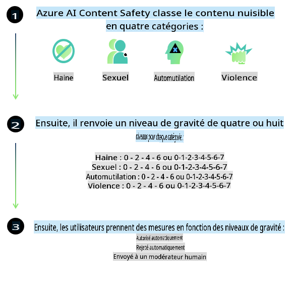
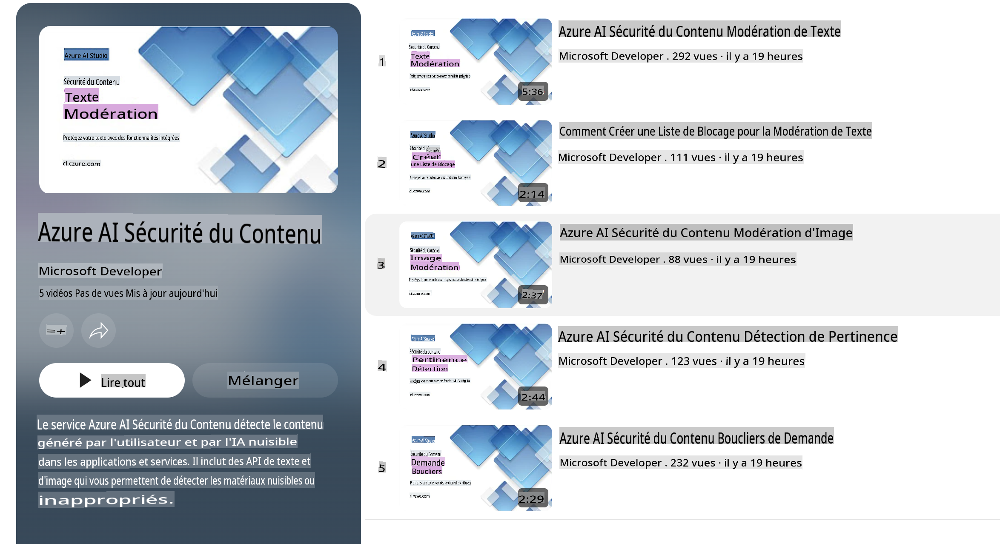

# Sécurité de l'IA pour les modèles Phi-3

La famille de modèles Phi-3 a été développée conformément à la [norme d'IA responsable de Microsoft](https://query.prod.cms.rt.microsoft.com/cms/api/am/binary/RE5cmFl), qui est un ensemble d'exigences à l'échelle de l'entreprise basé sur les six principes suivants : responsabilité, transparence, équité, fiabilité et sécurité, confidentialité et sécurité, et inclusion qui forment les [principes d'IA responsable de Microsoft](https://www.microsoft.com/ai/responsible-ai).

Comme pour les précédents modèles Phi-3, une évaluation de la sécurité multifacette et une approche de post-formation de la sécurité ont été adoptées, avec des mesures supplémentaires pour tenir compte des capacités multilingues de cette version. Notre approche de la formation et des évaluations de sécurité, y compris les tests dans plusieurs langues et catégories de risques, est décrite dans le [document de post-formation sur la sécurité Phi-3](https://arxiv.org/abs/2407.13833). Bien que les modèles Phi-3 bénéficient de cette approche, les développeurs doivent appliquer les meilleures pratiques de l'IA responsable, y compris la cartographie, la mesure et l'atténuation des risques associés à leur cas d'utilisation spécifique et au contexte culturel et linguistique.

## Meilleures pratiques

Comme d'autres modèles, la famille de modèles Phi peut potentiellement se comporter de manière injuste, peu fiable ou offensante.

Certains des comportements limitants des SLM et LLM à connaître incluent :

- **Qualité de service :** Les modèles Phi sont principalement entraînés sur des textes en anglais. Les langues autres que l'anglais auront des performances moindres. Les variétés de la langue anglaise moins représentées dans les données d'entraînement pourraient avoir des performances inférieures à l'anglais américain standard.
- **Représentation des préjudices et perpétuation des stéréotypes :** Ces modèles peuvent sur- ou sous-représenter des groupes de personnes, effacer la représentation de certains groupes ou renforcer des stéréotypes dégradants ou négatifs. Malgré la post-formation de sécurité, ces limitations peuvent encore être présentes en raison de niveaux de représentation différents de divers groupes ou de la prévalence d'exemples de stéréotypes négatifs dans les données d'entraînement qui reflètent des schémas réels et des biais sociétaux.
- **Contenu inapproprié ou offensant :** Ces modèles peuvent produire d'autres types de contenu inapproprié ou offensant, ce qui peut rendre leur déploiement inapproprié pour des contextes sensibles sans atténuations supplémentaires spécifiques au cas d'utilisation.
- **Fiabilité de l'information :** Les modèles linguistiques peuvent générer du contenu absurde ou inventer du contenu qui peut sembler raisonnable mais qui est inexact ou obsolète.
- **Portée limitée pour le code :** La majorité des données d'entraînement de Phi-3 est basée sur Python et utilise des packages courants tels que "typing, math, random, collections, datetime, itertools". Si le modèle génère des scripts Python qui utilisent d'autres packages ou des scripts dans d'autres langages, nous recommandons fortement aux utilisateurs de vérifier manuellement toutes les utilisations des API.

Les développeurs doivent appliquer les meilleures pratiques de l'IA responsable et sont responsables de s'assurer qu'un cas d'utilisation spécifique est conforme aux lois et réglementations pertinentes (par exemple, confidentialité, commerce, etc.).

## Considérations pour l'IA responsable

Comme d'autres modèles linguistiques, les modèles de la série Phi peuvent potentiellement se comporter de manière injuste, peu fiable ou offensante. Certains des comportements limitants à connaître incluent :

**Qualité de service :** Les modèles Phi sont principalement entraînés sur des textes en anglais. Les langues autres que l'anglais auront des performances moindres. Les variétés de la langue anglaise moins représentées dans les données d'entraînement pourraient avoir des performances inférieures à l'anglais américain standard.

**Représentation des préjudices et perpétuation des stéréotypes :** Ces modèles peuvent sur- ou sous-représenter des groupes de personnes, effacer la représentation de certains groupes ou renforcer des stéréotypes dégradants ou négatifs. Malgré la post-formation de sécurité, ces limitations peuvent encore être présentes en raison de niveaux de représentation différents de divers groupes ou de la prévalence d'exemples de stéréotypes négatifs dans les données d'entraînement qui reflètent des schémas réels et des biais sociétaux.

**Contenu inapproprié ou offensant :** Ces modèles peuvent produire d'autres types de contenu inapproprié ou offensant, ce qui peut rendre leur déploiement inapproprié pour des contextes sensibles sans atténuations supplémentaires spécifiques au cas d'utilisation.
- **Fiabilité de l'information :** Les modèles linguistiques peuvent générer du contenu absurde ou inventer du contenu qui peut sembler raisonnable mais qui est inexact ou obsolète.

**Portée limitée pour le code :** La majorité des données d'entraînement de Phi-3 est basée sur Python et utilise des packages courants tels que "typing, math, random, collections, datetime, itertools". Si le modèle génère des scripts Python qui utilisent d'autres packages ou des scripts dans d'autres langages, nous recommandons fortement aux utilisateurs de vérifier manuellement toutes les utilisations des API.

Les développeurs doivent appliquer les meilleures pratiques de l'IA responsable et sont responsables de s'assurer qu'un cas d'utilisation spécifique est conforme aux lois et réglementations pertinentes (par exemple, confidentialité, commerce, etc.). Les domaines importants à considérer incluent :

**Allocation :** Les modèles peuvent ne pas convenir à des scénarios qui pourraient avoir un impact conséquent sur le statut juridique ou l'allocation de ressources ou d'opportunités de vie (ex : logement, emploi, crédit, etc.) sans évaluations supplémentaires et techniques de réduction des biais.

**Scénarios à haut risque :** Les développeurs doivent évaluer la pertinence de l'utilisation des modèles dans des scénarios à haut risque où des résultats injustes, peu fiables ou offensants pourraient être extrêmement coûteux ou causer des dommages. Cela inclut la fourniture de conseils dans des domaines sensibles ou d'expertise où l'exactitude et la fiabilité sont cruciales (ex : conseils juridiques ou de santé). Des mesures de protection supplémentaires doivent être mises en œuvre au niveau de l'application en fonction du contexte de déploiement.

**Désinformation :** Les modèles peuvent produire des informations inexactes. Les développeurs doivent suivre les meilleures pratiques de transparence et informer les utilisateurs finaux qu'ils interagissent avec un système d'IA. Au niveau de l'application, les développeurs peuvent construire des mécanismes de retour d'information et des pipelines pour ancrer les réponses dans des informations contextuelles spécifiques au cas d'utilisation, une technique connue sous le nom de génération augmentée par récupération (RAG).

**Génération de contenu nuisible :** Les développeurs doivent évaluer les sorties pour leur contexte et utiliser des classificateurs de sécurité disponibles ou des solutions personnalisées appropriées à leur cas d'utilisation.

**Mauvais usage :** D'autres formes de mauvais usage telles que la fraude, le spam ou la production de logiciels malveillants peuvent être possibles, et les développeurs doivent s'assurer que leurs applications ne violent pas les lois et réglementations applicables.

### Ajustement fin et sécurité du contenu de l'IA

Après avoir ajusté finement un modèle, nous recommandons fortement d'utiliser les mesures de [sécurité du contenu Azure AI](https://learn.microsoft.com/azure/ai-services/content-safety/overview) pour surveiller le contenu généré par les modèles, identifier et bloquer les risques potentiels, les menaces et les problèmes de qualité.

[Azure AI Content Safety](https://learn.microsoft.com/azure/ai-services/content-safety/overview) prend en charge à la fois le contenu textuel et visuel. Il peut être déployé dans le cloud, des conteneurs déconnectés et sur des dispositifs edge/embarqués.

## Aperçu de la sécurité du contenu Azure AI

La sécurité du contenu Azure AI n'est pas une solution universelle ; elle peut être personnalisée pour s'aligner sur les politiques spécifiques des entreprises. De plus, ses modèles multilingues lui permettent de comprendre plusieurs langues simultanément.

- **Sécurité du contenu Azure AI**
- **Microsoft Developer**
- **5 vidéos**

Le service de sécurité du contenu Azure AI détecte le contenu nuisible généré par les utilisateurs et par l'IA dans les applications et services. Il inclut des API textuelles et visuelles qui permettent de détecter le matériel nuisible ou inapproprié.

[Playlist sur la sécurité du contenu AI](https://www.youtube.com/playlist?list=PLlrxD0HtieHjaQ9bJjyp1T7FeCbmVcPkQ)

Avertissement : La traduction a été réalisée à partir de l'original par un modèle d'IA et peut ne pas être parfaite. 
Veuillez examiner le résultat et apporter les corrections nécessaires.