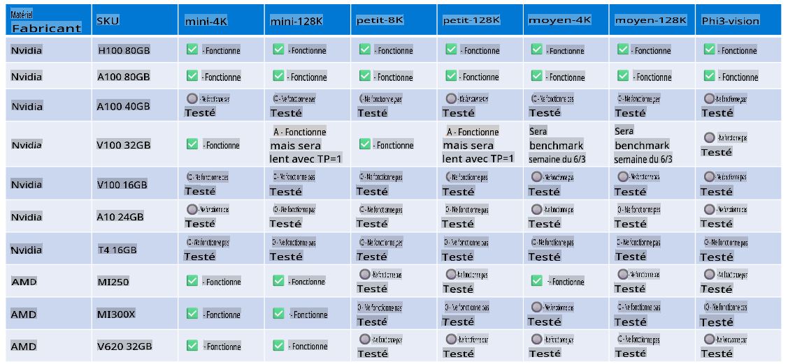

# Support matériel pour Phi-3

Microsoft Phi-3 a été optimisé pour ONNX Runtime et prend en charge Windows DirectML. Il fonctionne bien sur divers types de matériel, y compris les GPU, les CPU, et même les appareils mobiles.

## Matériel de l'appareil
Plus précisément, le matériel pris en charge comprend :

- GPU SKU : RTX 4090 (DirectML)
- GPU SKU : 1 A100 80GB (CUDA)
- CPU SKU : Standard F64s v2 (64 vCPUs, 128 GiB de mémoire)

## SKU Mobile

- Android - Samsung Galaxy S21
- Apple iPhone 14 ou supérieur Processeur A16/A17

## Spécification matérielle de Phi-3

- Configuration minimale requise.
- Windows : GPU compatible DirectX 12 et un minimum de 4 Go de RAM combinée

CUDA : GPU NVIDIA avec une capacité de calcul >= 7.02



## Exécution d'onnxruntime sur plusieurs GPU

Les modèles ONNX Phi-3 actuellement disponibles ne sont que pour 1 GPU. Il est possible de prendre en charge plusieurs GPU pour le modèle Phi-3, mais ORT avec 2 GPU ne garantit pas qu'il offrira plus de débit par rapport à 2 instances d'ORT.

Lors de [Build 2024, l'équipe GenAI ONNX](https://youtu.be/WLW4SE8M9i8?si=EtG04UwDvcjunyfC) a annoncé qu'ils avaient activé le multi-instance au lieu du multi-gpu pour les modèles Phi.

À présent, cela vous permet d'exécuter une instance onnxruntime ou onnxruntime-genai avec la variable d'environnement CUDA_VISIBLE_DEVICES comme ceci.

```Python
CUDA_VISIBLE_DEVICES=0 python infer.py
CUDA_VISIBLE_DEVICES=1 python infer.py
```

N'hésitez pas à explorer davantage Phi-3 dans [Azure AI Studio](https://ai.azure.com)

        **Avertissement**: 
        Ce document a été traduit en utilisant des services de traduction automatique par IA. Bien que nous nous efforcions d'assurer l'exactitude, veuillez noter que les traductions automatisées peuvent contenir des erreurs ou des inexactitudes. Le document original dans sa langue d'origine doit être considéré comme la source faisant autorité. Pour des informations critiques, une traduction humaine professionnelle est recommandée. Nous ne sommes pas responsables des malentendus ou des interprétations erronées résultant de l'utilisation de cette traduction.