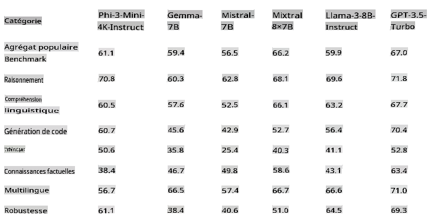
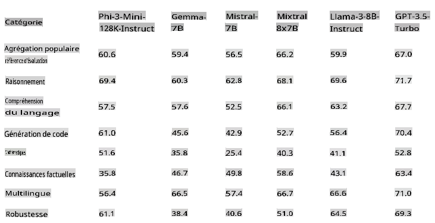
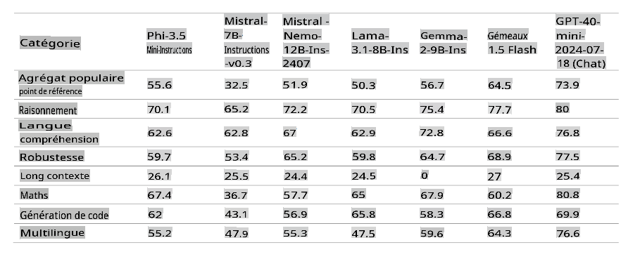
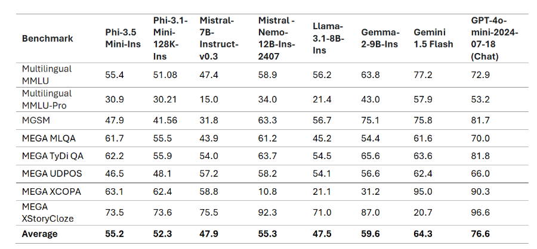
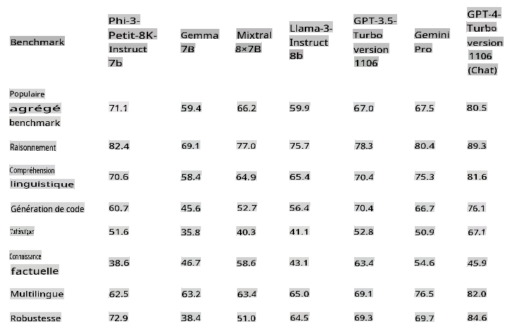
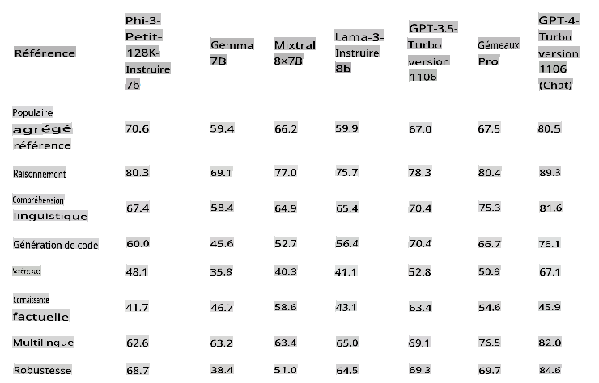
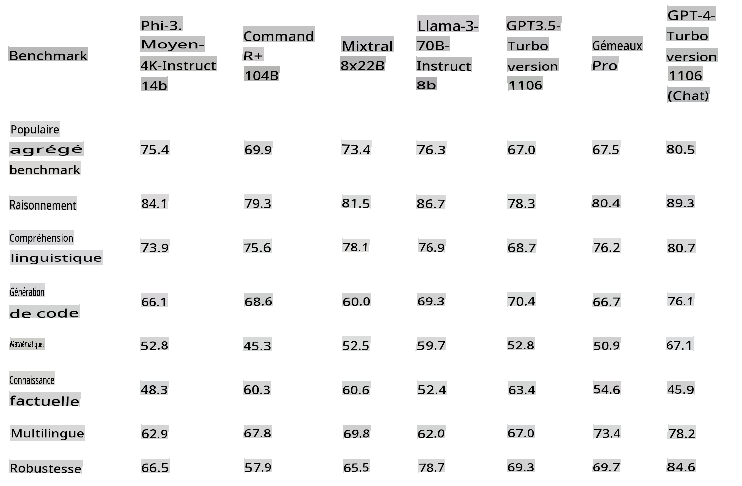
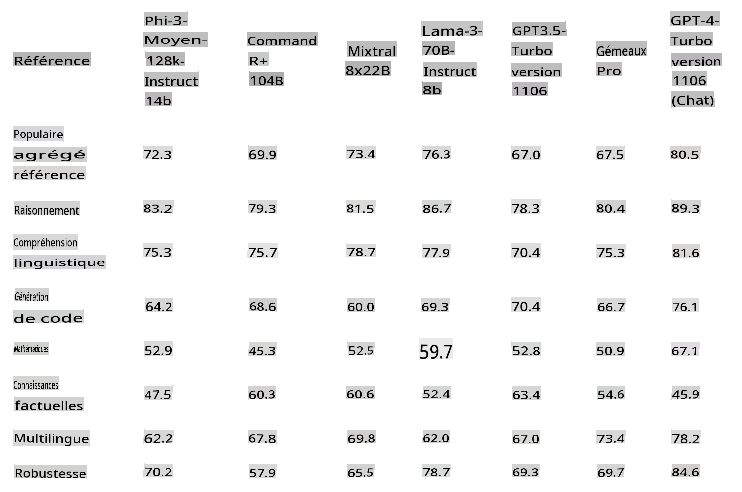
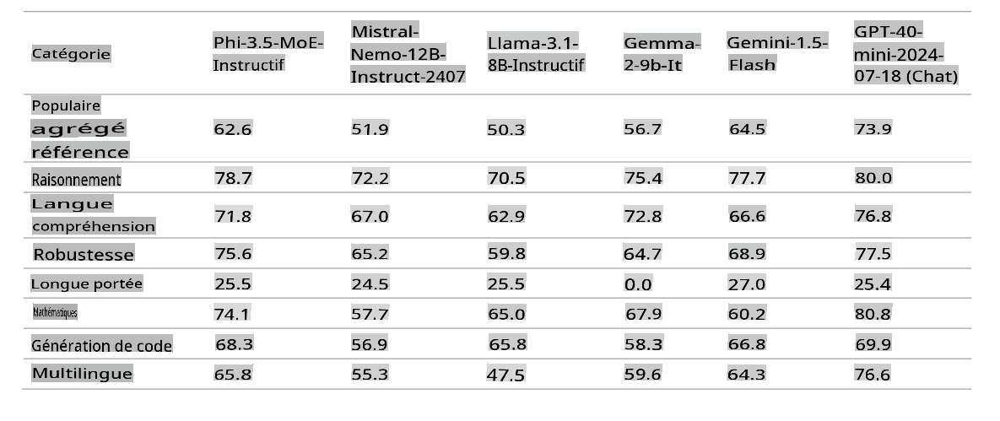

# La famille Phi-3 de Microsoft

Les modèles Phi-3 sont les Small Language Models (SLMs) les plus performants et rentables disponibles, surpassant les modèles de même taille et de la taille supérieure dans divers benchmarks de langage, de raisonnement, de codage et de mathématiques. Cette version élargit la sélection de modèles de haute qualité pour les clients, offrant plus de choix pratiques pour composer et créer des applications d'IA générative.

La famille Phi-3 comprend des versions mini, petite, moyenne et vision, entraînées avec différentes quantités de paramètres pour répondre à divers scénarios d'application. Chaque modèle est ajusté aux instructions et développé conformément aux normes de sécurité et de responsabilité de l'IA de Microsoft pour garantir qu'il est prêt à l'emploi. Phi-3-mini surpasse les modèles deux fois plus grands, et Phi-3-petit et Phi-3-moyen surpassent des modèles beaucoup plus grands, y compris GPT-3.5T.

## Exemple de tâches Phi-3

| | |
|-|-|
|Tâches|Phi-3|
|Tâches linguistiques|Oui|
|Mathématiques & Raisonnement|Oui|
|Codage|Oui|
|Appel de fonction|Non|
|Auto-orchestration (Assistant)|Non|
|Modèles d'embedding dédiés|Non|

## Phi-3-mini

Phi-3-mini, un modèle de langage avec 3,8 milliards de paramètres, est disponible sur [Microsoft Azure AI Studio](https://ai.azure.com/explore/models?selectedCollection=phi), [Hugging Face](https://huggingface.co/collections/microsoft/phi-3-6626e15e9585a200d2d761e3), et [Ollama](https://ollama.com/library/phi3). Il offre deux longueurs de contexte : [128K](https://ai.azure.com/explore/models/Phi-3-mini-128k-instruct/version/9/registry/azureml) et [4K](https://ai.azure.com/explore/models/Phi-3-mini-4k-instruct/version/9/registry/azureml).

Phi-3-mini est un modèle de langage basé sur un Transformer avec 3,8 milliards de paramètres. Il a été entraîné en utilisant des données de haute qualité contenant des informations utiles à des fins éducatives, augmentées avec de nouvelles sources de données comprenant divers textes synthétiques NLP et des ensembles de données de chat internes et externes, ce qui améliore considérablement les capacités de chat. De plus, Phi-3-mini a été ajusté pour le chat après l'entraînement initial par ajustement supervisé (SFT) et optimisation des préférences directes (DPO). Après cette post-formation, Phi-3-mini a démontré des améliorations significatives dans plusieurs capacités, notamment en termes d'alignement, de robustesse et de sécurité. Le modèle fait partie de la famille Phi-3 et est disponible en version mini avec deux variantes, 4K et 128K, qui représentent la longueur du contexte (en tokens) qu'il peut supporter.

## Phi-3.5-mini-instruct

[Phi-3.5 mini](https://ai.azure.com/explore/models/Phi-3.5-mini-instruct/version/1/registry/azureml) est un modèle léger et à la pointe de la technologie construit sur les ensembles de données utilisés pour Phi-3 - données synthétiques et sites web publics filtrés - avec un accent sur des données de très haute qualité et riches en raisonnement. Le modèle appartient à la famille des modèles Phi-3 et prend en charge une longueur de contexte de 128K tokens. Le modèle a subi un processus d'amélioration rigoureux, intégrant à la fois un ajustement supervisé, une optimisation des politiques proximales et une optimisation des préférences directes pour garantir une adhérence précise aux instructions et des mesures de sécurité robustes.

Phi-3.5 Mini a 3,8 milliards de paramètres et est un modèle Transformer dense uniquement décodeur utilisant le même tokenizer que Phi-3 Mini.

Dans l'ensemble, le modèle avec seulement 3,8 milliards de paramètres atteint un niveau similaire de compréhension linguistique multilingue et de capacité de raisonnement que des modèles beaucoup plus grands. Cependant, il est encore fondamentalement limité par sa taille pour certaines tâches. Le modèle n'a tout simplement pas la capacité de stocker trop de connaissances factuelles, donc les utilisateurs peuvent rencontrer des inexactitudes factuelles. Cependant, nous pensons que cette faiblesse peut être résolue en augmentant Phi-3.5 avec un moteur de recherche, en particulier lors de l'utilisation du modèle dans des paramètres RAG.

### Support linguistique

Le tableau ci-dessous met en évidence la capacité multilingue du Phi-3 sur les ensembles de données multilingues MMLU, MEGA, et MMLU-pro multilingue. Dans l'ensemble, nous avons observé que même avec seulement 3,8 milliards de paramètres actifs, le modèle est très compétitif sur les tâches multilingues par rapport à d'autres modèles avec beaucoup plus de paramètres actifs.

## Phi-3-petit

Phi-3-petit, un modèle de langage avec 7 milliards de paramètres, disponible en deux longueurs de contexte [128K](https://ai.azure.com/explore/models/Phi-3-small-128k-instruct/version/2/registry/azureml) et [8K](https://ai.azure.com/explore/models/Phi-3-small-8k-instruct/version/2/registry/azureml), surpasse GPT-3.5T dans divers benchmarks de langage, de raisonnement, de codage et de mathématiques.

Phi-3-petit est un modèle de langage basé sur un Transformer avec 7 milliards de paramètres. Il a été entraîné en utilisant des données de haute qualité contenant des informations utiles à des fins éducatives, augmentées avec de nouvelles sources de données comprenant divers textes synthétiques NLP et des ensembles de données de chat internes et externes, ce qui améliore considérablement les capacités de chat. De plus, Phi-3-petit a été ajusté pour le chat après l'entraînement initial par ajustement supervisé (SFT) et optimisation des préférences directes (DPO). Après cette post-formation, Phi-3-petit a montré des améliorations significatives dans plusieurs capacités, notamment en termes d'alignement, de robustesse et de sécurité. Phi-3-petit est également plus intensivement entraîné sur des ensembles de données multilingues par rapport à Phi-3-Mini. La famille de modèles offre deux variantes, 8K et 128K, qui représentent la longueur du contexte (en tokens) qu'il peut supporter.

## Phi-3-moyen

Phi-3-moyen, un modèle de langage avec 14 milliards de paramètres, disponible en deux longueurs de contexte [128K](https://ai.azure.com/explore/models/Phi-3-medium-128k-instruct/version/2/registry/azureml) et [4K](https://ai.azure.com/explore/models/Phi-3-medium-4k-instruct/version/2/registry/azureml), continue la tendance en surpassant Gemini 1.0 Pro.

Phi-3-moyen est un modèle de langage basé sur un Transformer avec 14 milliards de paramètres. Il a été entraîné en utilisant des données de haute qualité contenant des informations utiles à des fins éducatives, augmentées avec de nouvelles sources de données comprenant divers textes synthétiques NLP et des ensembles de données de chat internes et externes, ce qui améliore considérablement les capacités de chat. De plus, Phi-3-moyen a été ajusté pour le chat après l'entraînement initial par ajustement supervisé (SFT) et optimisation des préférences directes (DPO). Après cette post-formation, Phi-3-moyen a montré des améliorations significatives dans plusieurs capacités, notamment en termes d'alignement, de robustesse et de sécurité. La famille de modèles offre deux variantes, 4K et 128K, qui représentent la longueur du contexte (en tokens) qu'il peut supporter.

[!NOTE]
Nous recommandons de passer à Phi-3.5-MoE comme une mise à niveau de Phi-3-moyen car le modèle MoE est bien meilleur et plus rentable.

## Phi-3-vision

Le [Phi-3-vision](https://ai.azure.com/explore/models/Phi-3-vision-128k-instruct/version/2/registry/azureml), un modèle multimodal de 4,2 milliards de paramètres avec des capacités de langage et de vision, surpasse des modèles plus grands comme Claude-3 Haiku et Gemini 1.0 Pro V dans les tâches de raisonnement visuel général, OCR, et de compréhension des tableaux et graphiques.

Phi-3-vision est le premier modèle multimodal de la famille Phi-3, combinant texte et images. Phi-3-vision peut être utilisé pour raisonner sur des images du monde réel et extraire et raisonner sur le texte des images. Il a également été optimisé pour la compréhension des graphiques et des diagrammes et peut être utilisé pour générer des insights et répondre à des questions. Phi-3-vision s'appuie sur les capacités linguistiques du Phi-3-mini, continuant à offrir une forte qualité de raisonnement linguistique et visuel dans une petite taille.

## Phi-3.5-vision

[Phi-3.5 Vision](https://ai.azure.com/explore/models/Phi-3.5-vision-instruct/version/1/registry/azureml) est un modèle multimodal léger et à la pointe de la technologie construit sur des ensembles de données comprenant - des données synthétiques et des sites web publics filtrés - avec un accent sur des données de très haute qualité et riches en raisonnement à la fois sur le texte et la vision. Le modèle appartient à la famille des modèles Phi-3, et la version multimodale prend en charge une longueur de contexte de 128K tokens. Le modèle a subi un processus d'amélioration rigoureux, intégrant à la fois un ajustement supervisé et une optimisation des préférences directes pour garantir une adhérence précise aux instructions et des mesures de sécurité robustes.

Phi-3.5 Vision a 4,2 milliards de paramètres et contient un encodeur d'image, un connecteur, un projecteur et le modèle de langage Phi-3 Mini.

Le modèle est destiné à une utilisation commerciale et de recherche en anglais. Le modèle offre des utilisations pour les systèmes et applications d'IA à usage général avec des capacités d'entrée visuelles et textuelles qui nécessitent :
1) des environnements contraints en mémoire/compute.
2) des scénarios liés à la latence.
3) une compréhension générale des images.
4) OCR.
5) compréhension des tableaux et graphiques.
6) comparaison de plusieurs images.
7) résumé de plusieurs images ou clips vidéo.

Le modèle Phi-3.5-vision est conçu pour accélérer la recherche sur les modèles de langage et multimodaux efficaces, pour être utilisé comme bloc de construction pour des fonctionnalités alimentées par l'IA générative.

## Phi-3.5-MoE

[Phi-3.5 MoE](https://ai.azure.com/explore/models/Phi-3.5-MoE-instruct/version/1/registry/azureml) est un modèle léger et à la pointe de la technologie construit sur les ensembles de données utilisés pour Phi-3 - données synthétiques et documents publics filtrés - avec un accent sur des données de très haute qualité et riches en raisonnement. Le modèle prend en charge le multilingue et dispose d'une longueur de contexte de 128K tokens. Le modèle a subi un processus d'amélioration rigoureux, intégrant un ajustement supervisé, une optimisation des politiques proximales et une optimisation des préférences directes pour garantir une adhérence précise aux instructions et des mesures de sécurité robustes.

Phi-3 MoE a 16x3,8 milliards de paramètres avec 6,6 milliards de paramètres actifs lors de l'utilisation de 2 experts. Le modèle est un modèle Transformer uniquement décodeur basé sur un mélange d'experts utilisant le tokenizer avec une taille de vocabulaire de 32 064.

Le modèle est destiné à une utilisation commerciale et de recherche en anglais. Le modèle offre des utilisations pour les systèmes et applications d'IA à usage général qui nécessitent :
1) des environnements contraints en mémoire/compute.
2) des scénarios liés à la latence.
3) un raisonnement fort (surtout en mathématiques et en logique).

Le modèle MoE est conçu pour accélérer la recherche sur les modèles de langage et multimodaux, pour être utilisé comme bloc de construction pour des fonctionnalités alimentées par l'IA générative et nécessite des ressources de calcul supplémentaires.

> [!NOTE]
>
> Les modèles Phi-3 ne sont pas aussi performants sur les benchmarks de connaissances factuelles (comme TriviaQA) car la taille plus petite du modèle entraîne une moindre capacité à retenir les faits.

## Phi Silica

Nous introduisons Phi Silica qui est construit à partir de la série de modèles Phi et est conçu spécifiquement pour les NPUs dans les PC Copilot+. Windows est la première plateforme à avoir un modèle de langage petit et à la pointe de la technologie (SLM) spécialement conçu pour le NPU et livré en standard. L'API Phi Silica ainsi que les APIs OCR, Studio Effects, Live Captions et Recall User Activity seront disponibles dans la Windows Copilot Library en juin. D'autres APIs comme Vector Embedding, RAG API, et Text Summarization seront disponibles plus tard.

## **Trouvez tous les modèles Phi-3**

- [Azure AI](https://ai.azure.com/explore/models?selectedCollection=phi)
- [Hugging Face](https://huggingface.co/collections/microsoft/phi-3-6626e15e9585a200d2d761e3)

## Modèles ONNX

La principale différence entre les deux modèles ONNX, “cpu-int4-rtn-block-32” et “cpu-int4-rtn-block-32-acc-level-4”, est le niveau de précision. Le modèle avec “acc-level-4” est conçu pour équilibrer la latence et la précision, avec un léger compromis sur la précision pour une meilleure performance, ce qui pourrait être particulièrement adapté aux appareils mobiles.

## Exemple de sélection de modèle

| | | | |
|-|-|-|-|
|Besoins du client|Tâche|Commencer avec|Plus de détails|
|Besoin d'un modèle qui résume simplement un fil de messages|Résumé de conversation|Modèle de texte Phi-3|Le facteur décisif ici est que le client a une tâche linguistique bien définie et simple|
|Une application gratuite de tutorat en mathématiques pour enfants|Mathématiques et Raisonnement|Modèles de texte Phi-3|Parce que l'application est gratuite, les clients veulent une solution qui ne leur coûte pas de manière récurrente|
|Caméra de patrouille autonome|Analyse visuelle|Phi-Vision|Besoin d'une solution qui fonctionne en périphérie sans internet|
|Veut créer un agent de réservation de voyage basé sur l'IA|Besoin de planification complexe, d'appel de fonction et d'orchestration|Modèles GPT|Besoin de capacité de planification, d'appel d'APIs pour recueillir des informations et d'exécution|
|Veut créer un copilote pour ses employés|RAG, multi-domaines, complexe et ouvert|Modèles GPT|Scénario ouvert, besoin de connaissances plus larges du monde, donc un modèle plus grand est plus adapté|

**Avertissement**:
Ce document a été traduit en utilisant des services de traduction automatique basés sur l'intelligence artificielle. Bien que nous nous efforcions d'atteindre une précision maximale, veuillez noter que les traductions automatisées peuvent contenir des erreurs ou des inexactitudes. Le document original dans sa langue d'origine doit être considéré comme la source faisant autorité. Pour des informations critiques, il est recommandé de recourir à une traduction humaine professionnelle. Nous ne sommes pas responsables des malentendus ou des interprétations erronées résultant de l'utilisation de cette traduction.