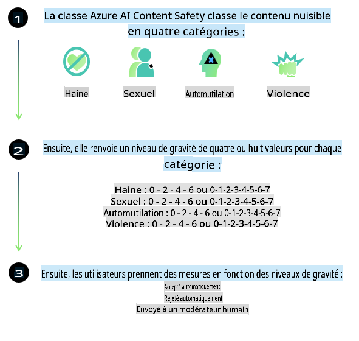

# Sécurité de l'IA pour les modèles Phi

La famille de modèles Phi a été développée conformément à la [Norme d'IA Responsable de Microsoft](https://query.prod.cms.rt.microsoft.com/cms/api/am/binary/RE5cmFl), qui est un ensemble d'exigences à l'échelle de l'entreprise basé sur les six principes suivants : responsabilité, transparence, équité, fiabilité et sécurité, confidentialité et sécurité, et inclusion, qui forment les [principes d'IA Responsable de Microsoft](https://www.microsoft.com/ai/responsible-ai).

Comme pour les modèles Phi précédents, une évaluation de sécurité multifacette et une approche de post-formation en matière de sécurité ont été adoptées, avec des mesures supplémentaires prises pour tenir compte des capacités multilingues de cette version. Notre approche de la formation et des évaluations de sécurité, y compris des tests dans plusieurs langues et catégories de risques, est décrite dans le [document sur la post-formation de sécurité Phi](https://arxiv.org/abs/2407.13833). Bien que les modèles Phi bénéficient de cette approche, les développeurs doivent appliquer les meilleures pratiques d'IA responsable, y compris cartographier, mesurer et atténuer les risques associés à leur cas d'utilisation spécifique et au contexte culturel et linguistique.

## Meilleures pratiques

Comme d'autres modèles, la famille de modèles Phi peut potentiellement se comporter de manière injuste, peu fiable ou offensante.

Voici certains comportements limitants des SLM et LLM à connaître :

- **Qualité de service :** Les modèles Phi sont principalement entraînés sur du texte en anglais. Les langues autres que l'anglais auront des performances inférieures. Les variétés de langue anglaise moins représentées dans les données d'entraînement peuvent également avoir des performances inférieures à celles de l'anglais américain standard.
- **Représentation des préjudices et perpétuation des stéréotypes :** Ces modèles peuvent sur-représenter ou sous-représenter certains groupes de personnes, effacer la représentation de certains groupes ou renforcer des stéréotypes dévalorisants ou négatifs. Malgré la post-formation en matière de sécurité, ces limitations peuvent encore être présentes en raison des niveaux de représentation variables des différents groupes ou de la prévalence d'exemples de stéréotypes négatifs dans les données d'entraînement, reflétant les schémas réels et les biais sociétaux.
- **Contenu inapproprié ou offensant :** Ces modèles peuvent produire d'autres types de contenu inapproprié ou offensant, ce qui pourrait les rendre inappropriés pour des contextes sensibles sans mesures d'atténuation supplémentaires spécifiques au cas d'utilisation.
- **Fiabilité des informations :** Les modèles de langage peuvent générer du contenu absurde ou fabriquer des informations qui semblent raisonnables mais sont inexactes ou obsolètes.
- **Portée limitée pour le code :** La majorité des données d'entraînement de Phi-3 sont basées sur Python et utilisent des bibliothèques courantes telles que "typing, math, random, collections, datetime, itertools". Si le modèle génère des scripts Python utilisant d'autres bibliothèques ou des scripts dans d'autres langages, nous recommandons vivement aux utilisateurs de vérifier manuellement toutes les utilisations d'API.

Les développeurs doivent appliquer les meilleures pratiques d'IA responsable et sont responsables de s'assurer qu'un cas d'utilisation spécifique est conforme aux lois et réglementations applicables (par exemple, confidentialité, commerce, etc.).

## Considérations sur l'IA Responsable

Comme d'autres modèles de langage, les modèles de la série Phi peuvent potentiellement se comporter de manière injuste, peu fiable ou offensante. Voici certains des comportements limitants à connaître :

**Qualité de service :** Les modèles Phi sont principalement entraînés sur du texte en anglais. Les langues autres que l'anglais auront des performances inférieures. Les variétés de langue anglaise moins représentées dans les données d'entraînement peuvent également avoir des performances inférieures à celles de l'anglais américain standard.

**Représentation des préjudices et perpétuation des stéréotypes :** Ces modèles peuvent sur-représenter ou sous-représenter certains groupes de personnes, effacer la représentation de certains groupes ou renforcer des stéréotypes dévalorisants ou négatifs. Malgré la post-formation en matière de sécurité, ces limitations peuvent encore être présentes en raison des niveaux de représentation variables des différents groupes ou de la prévalence d'exemples de stéréotypes négatifs dans les données d'entraînement, reflétant les schémas réels et les biais sociétaux.

**Contenu inapproprié ou offensant :** Ces modèles peuvent produire d'autres types de contenu inapproprié ou offensant, ce qui pourrait les rendre inappropriés pour des contextes sensibles sans mesures d'atténuation supplémentaires spécifiques au cas d'utilisation.  
**Fiabilité des informations :** Les modèles de langage peuvent générer du contenu absurde ou fabriquer des informations qui semblent raisonnables mais sont inexactes ou obsolètes.

**Portée limitée pour le code :** La majorité des données d'entraînement de Phi-3 sont basées sur Python et utilisent des bibliothèques courantes telles que "typing, math, random, collections, datetime, itertools". Si le modèle génère des scripts Python utilisant d'autres bibliothèques ou des scripts dans d'autres langages, nous recommandons vivement aux utilisateurs de vérifier manuellement toutes les utilisations d'API.

Les développeurs doivent appliquer les meilleures pratiques d'IA responsable et sont responsables de s'assurer qu'un cas d'utilisation spécifique est conforme aux lois et réglementations applicables (par exemple, confidentialité, commerce, etc.). Les domaines importants à considérer incluent :

**Allocation :** Les modèles peuvent ne pas convenir à des scénarios ayant un impact conséquent sur le statut juridique ou l'allocation de ressources ou d'opportunités de vie (ex : logement, emploi, crédit, etc.) sans évaluations supplémentaires et techniques de réduction des biais.

**Scénarios à haut risque :** Les développeurs doivent évaluer l'adéquation de l'utilisation des modèles dans des scénarios à haut risque où des résultats injustes, peu fiables ou offensants pourraient être extrêmement coûteux ou causer des préjudices. Cela inclut la fourniture de conseils dans des domaines sensibles ou spécialisés où la précision et la fiabilité sont essentielles (ex : conseils juridiques ou médicaux). Des mesures de protection supplémentaires doivent être mises en œuvre au niveau de l'application en fonction du contexte de déploiement.

**Désinformation :** Les modèles peuvent produire des informations inexactes. Les développeurs doivent suivre les meilleures pratiques de transparence et informer les utilisateurs finaux qu'ils interagissent avec un système d'IA. Au niveau de l'application, les développeurs peuvent construire des mécanismes de retour d'information et des pipelines pour ancrer les réponses dans des informations contextuelles spécifiques au cas d'utilisation, une technique connue sous le nom de génération augmentée par récupération (RAG).

**Génération de contenu nuisible :** Les développeurs doivent évaluer les résultats en fonction de leur contexte et utiliser les classificateurs de sécurité disponibles ou des solutions personnalisées adaptées à leur cas d'utilisation.

**Mauvais usage :** D'autres formes de mauvais usage telles que la fraude, le spam ou la production de logiciels malveillants peuvent être possibles, et les développeurs doivent s'assurer que leurs applications ne violent pas les lois et réglementations applicables.

### Ajustement fin et sécurité du contenu IA

Après avoir affiné un modèle, nous recommandons fortement d'utiliser les mesures de [sécurité du contenu Azure AI](https://learn.microsoft.com/azure/ai-services/content-safety/overview) pour surveiller le contenu généré par les modèles, identifier et bloquer les risques potentiels, les menaces et les problèmes de qualité.

[Azure AI Content Safety](https://learn.microsoft.com/azure/ai-services/content-safety/overview) prend en charge à la fois le contenu textuel et visuel. Il peut être déployé dans le cloud, dans des conteneurs déconnectés et sur des appareils embarqués ou périphériques.

## Aperçu de la sécurité du contenu Azure AI

Azure AI Content Safety n'est pas une solution universelle ; elle peut être personnalisée pour s'aligner sur les politiques spécifiques des entreprises. De plus, ses modèles multilingues lui permettent de comprendre plusieurs langues simultanément.

- **Sécurité du contenu Azure AI**  
- **Microsoft Developer**  
- **5 vidéos**

Le service de sécurité du contenu Azure AI détecte le contenu nuisible généré par les utilisateurs et l'IA dans les applications et services. Il comprend des API pour le texte et les images permettant de détecter les contenus nuisibles ou inappropriés.

[Playlist Sécurité du Contenu IA](https://www.youtube.com/playlist?list=PLlrxD0HtieHjaQ9bJjyp1T7FeCbmVcPkQ)

**Avertissement** :  
Ce document a été traduit à l'aide de services de traduction basés sur l'intelligence artificielle. Bien que nous nous efforcions d'assurer l'exactitude, veuillez noter que les traductions automatiques peuvent contenir des erreurs ou des inexactitudes. Le document original dans sa langue d'origine doit être considéré comme la source faisant autorité. Pour des informations critiques, il est recommandé de faire appel à une traduction humaine professionnelle. Nous déclinons toute responsabilité en cas de malentendus ou d'interprétations erronées découlant de l'utilisation de cette traduction.