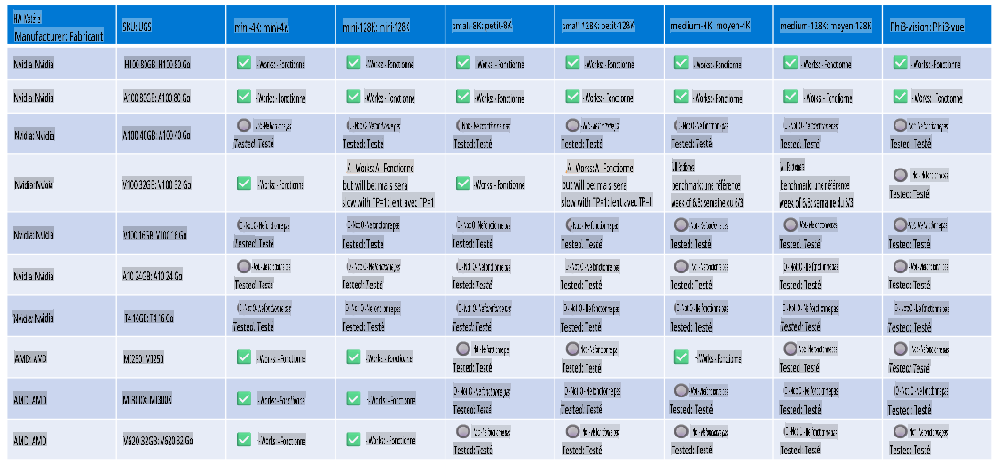

# Prise en charge matérielle de Phi

Microsoft Phi a été optimisé pour ONNX Runtime et prend en charge Windows DirectML. Il fonctionne efficacement sur différents types de matériel, y compris les GPU, les CPU, et même les appareils mobiles.

## Matériel des appareils
Le matériel pris en charge inclut spécifiquement :

- GPU SKU : RTX 4090 (DirectML)
- GPU SKU : 1 A100 80GB (CUDA)
- CPU SKU : Standard F64s v2 (64 vCPUs, 128 Go de mémoire)

## SKU Mobile

- Android - Samsung Galaxy S21
- Apple iPhone 14 ou supérieur, processeur A16/A17

## Spécifications matérielles de Phi

- Configuration minimale requise.
- Windows : GPU compatible DirectX 12 et un minimum de 4 Go de RAM combinée

CUDA : GPU NVIDIA avec une capacité de calcul >= 7.02



## Exécution d'onnxruntime sur plusieurs GPU

Les modèles Phi ONNX actuellement disponibles sont conçus pour 1 GPU. Il est possible de prendre en charge plusieurs GPU pour le modèle Phi, mais ORT avec 2 GPU ne garantit pas nécessairement un débit supérieur comparé à 2 instances d'ORT. Veuillez consulter [ONNX Runtime](https://onnxruntime.ai/) pour les dernières mises à jour.

Lors de [Build 2024, l'équipe GenAI ONNX](https://youtu.be/WLW4SE8M9i8?si=EtG04UwDvcjunyfC) a annoncé qu'ils avaient activé une prise en charge multi-instance au lieu de multi-GPU pour les modèles Phi.

À l'heure actuelle, cela vous permet d'exécuter une instance onnxruntime ou onnxruntime-genai avec la variable d'environnement CUDA_VISIBLE_DEVICES comme suit.

```Python
CUDA_VISIBLE_DEVICES=0 python infer.py
CUDA_VISIBLE_DEVICES=1 python infer.py
```

N'hésitez pas à explorer davantage Phi dans [Azure AI Foundry](https://ai.azure.com)

**Avertissement** :  
Ce document a été traduit à l'aide de services de traduction basés sur l'intelligence artificielle. Bien que nous nous efforcions d'assurer l'exactitude, veuillez noter que les traductions automatiques peuvent contenir des erreurs ou des inexactitudes. Le document original dans sa langue d'origine doit être considéré comme la source faisant autorité. Pour des informations critiques, il est recommandé de recourir à une traduction humaine professionnelle. Nous déclinons toute responsabilité en cas de malentendus ou d'interprétations erronées résultant de l'utilisation de cette traduction.