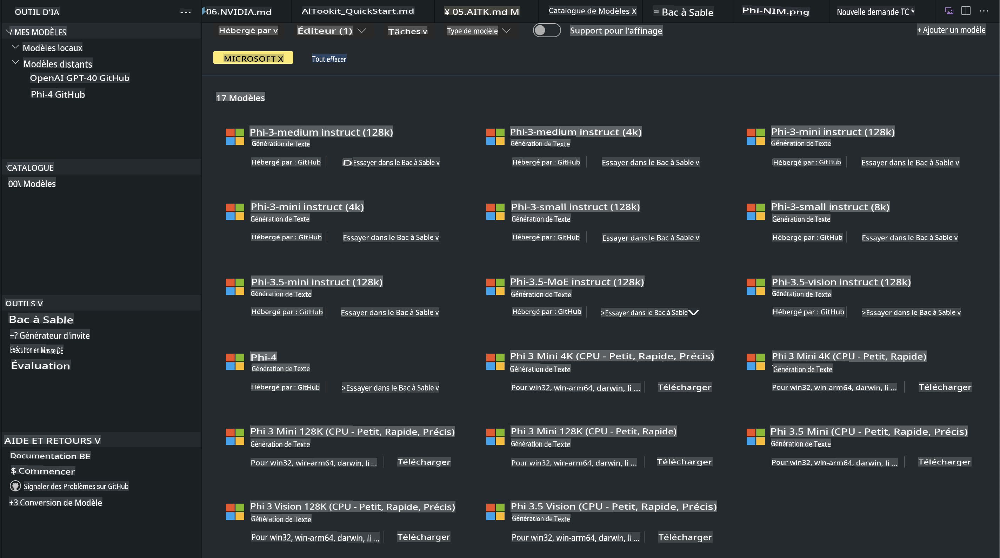
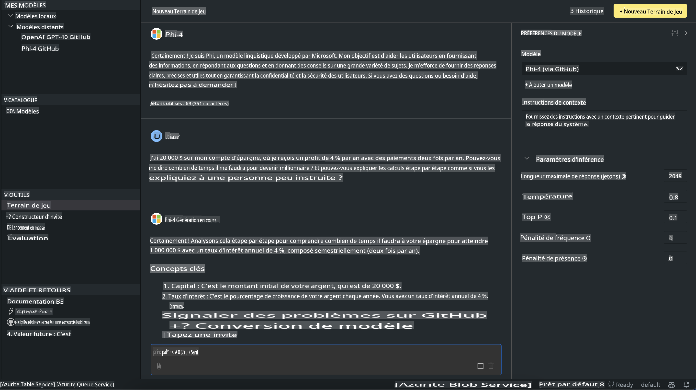

# Famille Phi dans AITK

[AI Toolkit pour VS Code](https://marketplace.visualstudio.com/items?itemName=ms-windows-ai-studio.windows-ai-studio) simplifie le développement d'applications d'IA générative en regroupant des outils de développement d'IA de pointe et des modèles issus du catalogue Azure AI Foundry et d'autres catalogues comme Hugging Face. Vous pourrez parcourir le catalogue de modèles d'IA alimenté par GitHub Models et Azure AI Foundry Model Catalogs, les télécharger localement ou à distance, les ajuster, les tester et les utiliser dans votre application.

La version Preview d'AI Toolkit fonctionnera localement. L'inférence ou l'ajustement local dépendra du modèle que vous aurez sélectionné. Vous pourriez avoir besoin d'un GPU, comme un GPU NVIDIA CUDA. Vous pouvez également exécuter directement les modèles GitHub avec AITK.

## Pour commencer

[En savoir plus sur l'installation du sous-système Windows pour Linux](https://learn.microsoft.com/windows/wsl/install?WT.mc_id=aiml-137032-kinfeylo)

et [changer la distribution par défaut](https://learn.microsoft.com/windows/wsl/install#change-the-default-linux-distribution-installed).

[Répertoire GitHub AI Toolkit](https://github.com/microsoft/vscode-ai-toolkit/)

- Windows, Linux, macOS
  
- Pour l'ajustement des modèles sur Windows et Linux, vous aurez besoin d'un GPU Nvidia. De plus, **Windows** nécessite le sous-système pour Linux avec une distribution Ubuntu 18.4 ou supérieure. [En savoir plus sur l'installation du sous-système Windows pour Linux](https://learn.microsoft.com/windows/wsl/install) et [changer la distribution par défaut](https://learn.microsoft.com/windows/wsl/install#change-the-default-linux-distribution-installed).

### Installer AI Toolkit

AI Toolkit est fourni sous forme d'[extension Visual Studio Code](https://code.visualstudio.com/docs/setup/additional-components#_vs-code-extensions), vous devez donc d'abord installer [VS Code](https://code.visualstudio.com/docs/setup/windows?WT.mc_id=aiml-137032-kinfeylo), puis télécharger AI Toolkit depuis le [VS Marketplace](https://marketplace.visualstudio.com/items?itemName=ms-windows-ai-studio.windows-ai-studio).  
[L'AI Toolkit est disponible sur le Visual Studio Marketplace](https://marketplace.visualstudio.com/items?itemName=ms-windows-ai-studio.windows-ai-studio) et peut être installé comme n'importe quelle autre extension VS Code. 

Si vous n'êtes pas familier avec l'installation des extensions VS Code, suivez ces étapes :

### Connexion

1. Dans la barre d'activité de VS Code, sélectionnez **Extensions**  
2. Dans la barre de recherche des extensions, tapez "AI Toolkit"  
3. Sélectionnez "AI Toolkit for Visual Studio Code"  
4. Sélectionnez **Installer**

Vous êtes maintenant prêt à utiliser l'extension !

Un message vous invitera à vous connecter à GitHub, cliquez sur "Autoriser" pour continuer. Vous serez redirigé vers la page de connexion GitHub.

Veuillez vous connecter et suivre les étapes du processus. Une fois terminé avec succès, vous serez redirigé vers VS Code.

Une fois l'extension installée, l'icône AI Toolkit apparaîtra dans votre barre d'activité.

Explorons les actions disponibles !

### Actions disponibles

La barre latérale principale de l'AI Toolkit est organisée en  

- **Modèles**  
- **Ressources**  
- **Playground**  
- **Ajustement fin**  
- **Évaluation**

Ces sections sont disponibles dans la partie Ressources. Pour commencer, sélectionnez **Catalogue de modèles**.

### Télécharger un modèle depuis le catalogue

En lançant AI Toolkit depuis la barre latérale de VS Code, vous pouvez choisir parmi les options suivantes :



- Trouver un modèle pris en charge dans le **Catalogue de modèles** et le télécharger localement  
- Tester l'inférence du modèle dans le **Playground de modèles**  
- Ajuster finement un modèle localement ou à distance dans **Ajustement fin de modèles**  
- Déployer des modèles ajustés dans le cloud via la palette de commandes pour AI Toolkit  
- Évaluer les modèles  

> [!NOTE]
>
> **GPU Vs CPU**
>
> Vous remarquerez que les fiches des modèles indiquent la taille du modèle, la plateforme et le type d'accélérateur (CPU, GPU). Pour des performances optimisées sur les **appareils Windows équipés d'au moins un GPU**, sélectionnez des versions de modèles qui ciblent uniquement Windows.
>
> Cela garantit que vous disposez d'un modèle optimisé pour l'accélérateur DirectML.
>
> Les noms des modèles suivent le format :
>
> - `{model_name}-{accelerator}-{quantization}-{format}`.
>
>Pour vérifier si votre appareil Windows dispose d'un GPU, ouvrez le **Gestionnaire des tâches**, puis sélectionnez l'onglet **Performance**. Si vous avez un ou plusieurs GPU, ils apparaîtront sous des noms tels que "GPU 0" ou "GPU 1".

### Exécuter le modèle dans le playground

Une fois tous les paramètres définis, cliquez sur **Générer un projet**.

Une fois que votre modèle est téléchargé, sélectionnez **Charger dans le Playground** sur la fiche du modèle dans le catalogue :

- Lancer le téléchargement du modèle  
- Installer toutes les prérequis et dépendances  
- Créer un espace de travail VS Code  



### Utiliser l'API REST dans votre application 

AI Toolkit est livré avec un serveur web API REST local **sur le port 5272** qui utilise le [format de complétion de chat OpenAI](https://platform.openai.com/docs/api-reference/chat/create).  

Cela vous permet de tester votre application localement sans dépendre d'un service de modèle d'IA dans le cloud. Par exemple, le fichier JSON suivant montre comment configurer le corps de la requête :

```json
{
    "model": "Phi-4",
    "messages": [
        {
            "role": "user",
            "content": "what is the golden ratio?"
        }
    ],
    "temperature": 0.7,
    "top_p": 1,
    "top_k": 10,
    "max_tokens": 100,
    "stream": true
}
```

Vous pouvez tester l'API REST en utilisant (par exemple) [Postman](https://www.postman.com/) ou l'utilitaire CURL (Client URL) :

```bash
curl -vX POST http://127.0.0.1:5272/v1/chat/completions -H 'Content-Type: application/json' -d @body.json
```

### Utiliser la bibliothèque cliente OpenAI pour Python

```python
from openai import OpenAI

client = OpenAI(
    base_url="http://127.0.0.1:5272/v1/", 
    api_key="x" # required for the API but not used
)

chat_completion = client.chat.completions.create(
    messages=[
        {
            "role": "user",
            "content": "what is the golden ratio?",
        }
    ],
    model="Phi-4",
)

print(chat_completion.choices[0].message.content)
```

### Utiliser la bibliothèque cliente Azure OpenAI pour .NET

Ajoutez la [bibliothèque cliente Azure OpenAI pour .NET](https://www.nuget.org/packages/Azure.AI.OpenAI/) à votre projet à l'aide de NuGet :

```bash
dotnet add {project_name} package Azure.AI.OpenAI --version 1.0.0-beta.17
```

Ajoutez un fichier C# nommé **OverridePolicy.cs** à votre projet et collez le code suivant :

```csharp
// OverridePolicy.cs
using Azure.Core.Pipeline;
using Azure.Core;

internal partial class OverrideRequestUriPolicy(Uri overrideUri)
    : HttpPipelineSynchronousPolicy
{
    private readonly Uri _overrideUri = overrideUri;

    public override void OnSendingRequest(HttpMessage message)
    {
        message.Request.Uri.Reset(_overrideUri);
    }
}
```

Ensuite, collez le code suivant dans votre fichier **Program.cs** :

```csharp
// Program.cs
using Azure.AI.OpenAI;

Uri localhostUri = new("http://localhost:5272/v1/chat/completions");

OpenAIClientOptions clientOptions = new();
clientOptions.AddPolicy(
    new OverrideRequestUriPolicy(localhostUri),
    Azure.Core.HttpPipelinePosition.BeforeTransport);
OpenAIClient client = new(openAIApiKey: "unused", clientOptions);

ChatCompletionsOptions options = new()
{
    DeploymentName = "Phi-4",
    Messages =
    {
        new ChatRequestSystemMessage("You are a helpful assistant. Be brief and succinct."),
        new ChatRequestUserMessage("What is the golden ratio?"),
    }
};

StreamingResponse<StreamingChatCompletionsUpdate> streamingChatResponse
    = await client.GetChatCompletionsStreamingAsync(options);

await foreach (StreamingChatCompletionsUpdate chatChunk in streamingChatResponse)
{
    Console.Write(chatChunk.ContentUpdate);
}
```


## Ajustement fin avec AI Toolkit

- Commencez par la découverte de modèles et le playground.  
- Ajustement fin et inférence des modèles en utilisant des ressources informatiques locales.  
- Ajustement fin et inférence à distance en utilisant des ressources Azure.  

[Ajustement fin avec AI Toolkit](../../03.FineTuning/Finetuning_VSCodeaitoolkit.md)

## Ressources de Q&A AI Toolkit

Veuillez consulter notre [page Q&A](https://github.com/microsoft/vscode-ai-toolkit/blob/main/archive/QA.md) pour les problèmes les plus courants et leurs solutions.

**Avertissement** :  
Ce document a été traduit à l'aide de services de traduction automatique basés sur l'intelligence artificielle. Bien que nous nous efforcions d'assurer l'exactitude, veuillez noter que les traductions automatiques peuvent contenir des erreurs ou des inexactitudes. Le document original dans sa langue d'origine doit être considéré comme la source faisant autorité. Pour des informations critiques, il est recommandé de faire appel à une traduction humaine professionnelle. Nous déclinons toute responsabilité en cas de malentendus ou d'interprétations erronées résultant de l'utilisation de cette traduction.